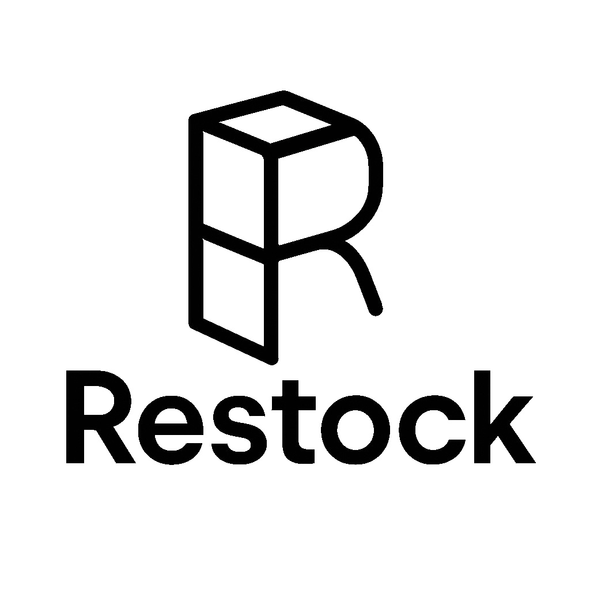
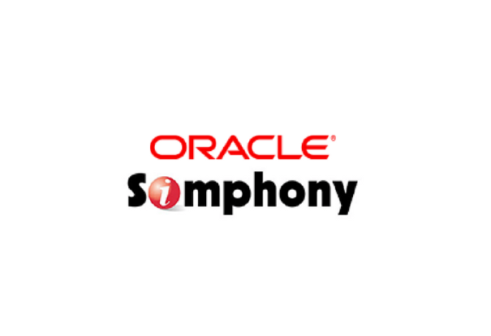
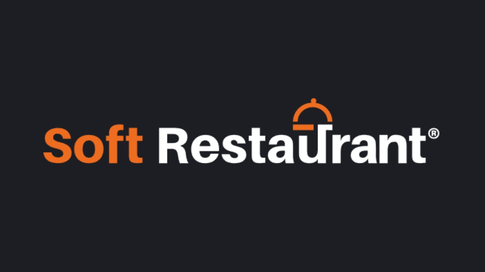
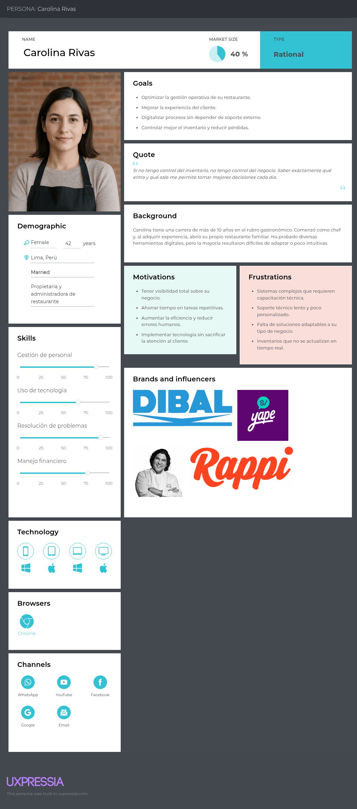
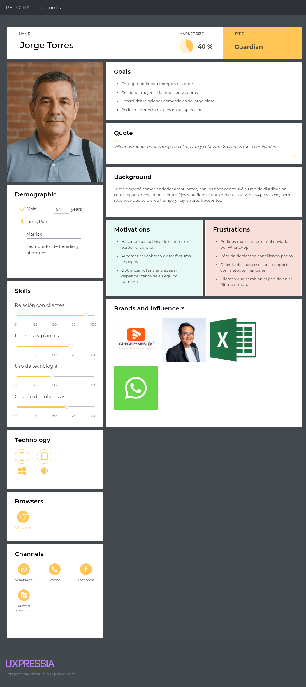
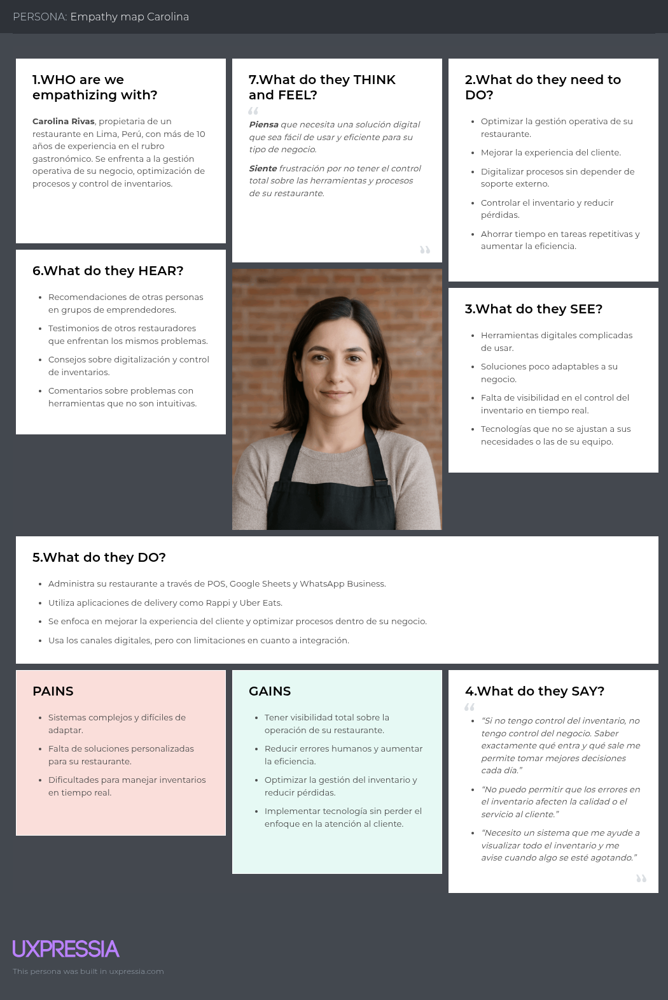
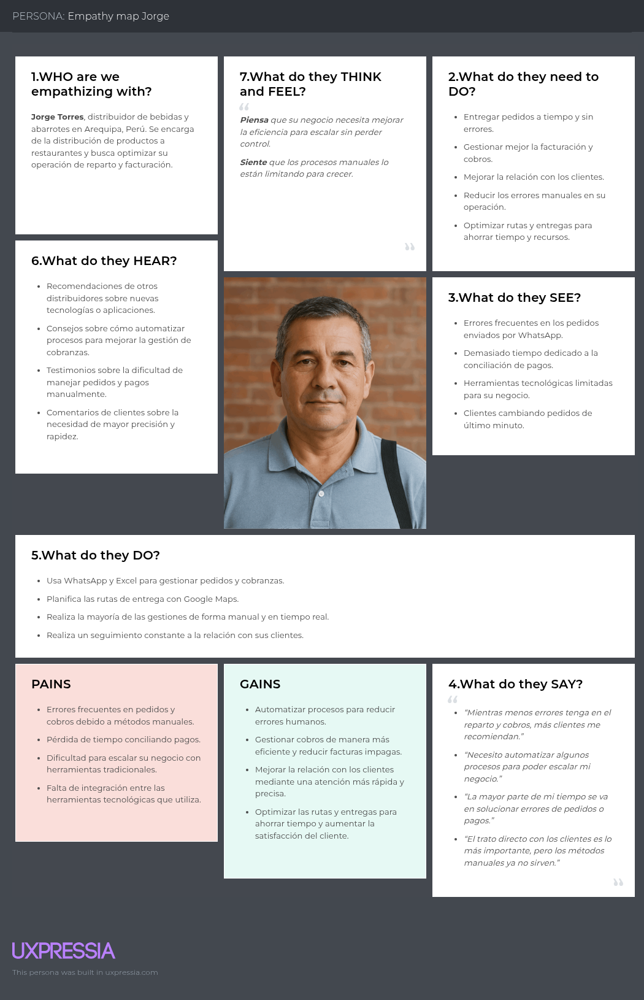
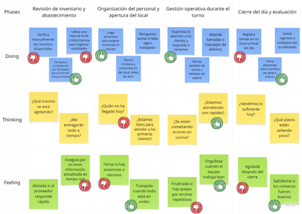
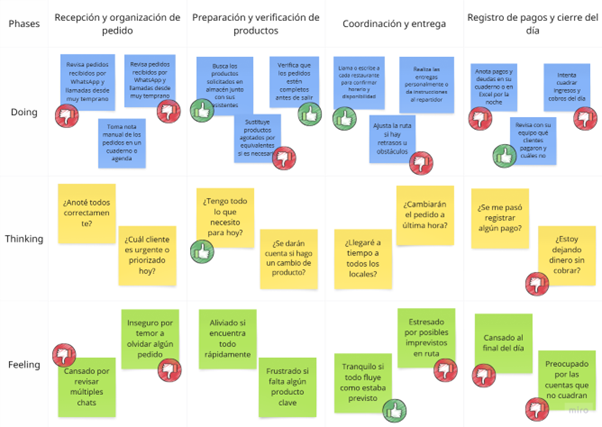

# Capítulo II: Requirements Elicitation & Analysis

## 2.1 Competidores

- **Oracle Simphony**  (competidor directo): Es una plataforma basada en la nube que permite a los propietarios de restaurantes automatizar sus procesos, lo que contribuye a mantener un control óptimo del inventario, minimizar el desperdicio de alimentos y gestionar eficazmente el flujo de caja. Se enfoca en empresas de hospitalidad, cadenas de restaurantes grandes, y resorts. Su uso está presente especialmente en Estados Unidos, Canadá y en países de Europa como Reino Unido.
- **RestroWorks** (competidor directo): Es una solución integral basada en la nube para la gestión de restaurantes. Incluye funciones de control de inventario, manejo de pedidos, informes financieros y gestión de operaciones en tiempo real. Se enfoca en restaurantes de tamaño pequeño a mediano. Se usa principalmente en Latinoamérica, con una fuerte presencia en países como México, Colombia, y Argentina.
- **SoftRestaurant** (competidor directo): Es un software de gestión para restaurantes que permite controlar inventarios, ventas, compras, reportes y más. Enfocado en restaurantes pequeños y medianos. Es utilizado principalmente en Latinoamérica para mejorar la eficiencia operativa y el control de los procesos internos en restaurantes.

### 2.1.1 Análisis Competitivo

**¿Por qué llevar a cabo este análisis?**

> El objetivo de este análisis es evaluar las oportunidades reales de competir en el mercado, identificando los segmentos objetivos, características de producto y estrategias de venta de los principales actores.
> A través de este estudio, buscamos tomar decisiones informadas para diseñar una propuesta de valor diferenciada que nos permita destacar en el mercado objetivo.

<table>
  <thead>
    <tr>
      <th></th>
      <th style="text-align: center;">
        <b>Restock (Nuestro producto)</b> 
        
      </th>
      <th style="text-align: center;">
        <b>Oracle Simphony</b> 
        
      </th>
      <th style="text-align: center;">
        <b>RestroWorks</b> 
        
      </th>
      <th style="text-align: center;">
        <b>SoftRestaurant</b> 
        
      </th>
    </tr>
  </thead>
  <tbody>
    <tr><th><b>Perfil</b></th><td></td><td></td><td></td><td></td></tr>
    <tr><td>Overview</td><td>Plataforma para automatizar la gestión de inventarios y pedidos de restaurantes.</td><td>Solución POS basada en la nube para gestión integral de restaurantes grandes y retail.</td><td>Plataforma en la nube con herramientas de operación para restaurantes y cocinas en la nube.</td><td>Software administrativo integral para restaurantes pequeños, medianos y franquicias emergentes en Latinoamérica.</td></tr>
    <tr><td>Ventaja competitiva</td><td>Enfoque exclusivo en automatizar inventarios y pedidos con costos accesibles y alta usabilidad para LATAM.</td><td>Integración total de operaciones con analítica en tiempo real.</td><td>Plataforma modular y escalable con enfoque en optimización de procesos.</td><td>Solución todo en uno con 20+ años de experiencia en el mercado latinoamericano.</td></tr>
    <tr><td>Mercado objetivo</td><td>Restaurantes medianos y grandes que no cuentan con automatización. Proveedores como segmento indirecto.</td><td>Grandes cadenas de restaurantes, locales de comida rápida y retail con POS integrado.</td><td>Restaurantes de todos los tamaños y cocinas en la nube.</td><td>Restaurantes pequeños, medianos y franquicias emergentes.</td></tr>
    <tr><th><b>Perfil de Marketing</b></th><td></td><td></td><td></td><td></td></tr>
    <tr><td>Estrategias de marketing</td><td>Enfocada en eficiencia operativa, reducción de pérdidas y facilidad de uso.</td><td>Destaca escalabilidad, integración y confiabilidad en la nube.</td><td>Resalta confianza de más de 23,000 clientes y casos de éxito.</td><td>Énfasis en experiencia de 20 años y cobertura regional en 11 países LATAM.</td></tr>
    <tr><th><b>Perfil de Producto</b></th><td></td><td></td><td></td><td></td></tr>
    <tr><td>Productos & Servicios</td><td>Inventario, pedidos internos, conexión con proveedores, reportes, alertas.</td><td>POS, pedidos online, gestión de cocina, análisis en tiempo real.</td><td>Gestión de pedidos, inventario, suite de cocina, pedidos digitales y más.</td><td>Gestión de pedidos, stock, personal, menús, clientes, facturación.</td></tr>
    <tr><td>Precios & Costos</td><td>Modelo freemium o de suscripción escalable según tamaño del restaurante.</td><td>Essentials: 55 USD/mes. Plus: 75 USD/mes.</td><td>Desde 200 USD/año según módulos.</td><td>LITE: 37 USD/mes. PRO: 54 USD/mes.</td></tr>
    <tr><td>Canales de distribución (Web y/o Móvil)</td><td>Web responsive, planes para versión móvil.</td><td>Distribuidores autorizados, venta directa.</td><td>Consultas y demostraciones online.</td><td>Web oficial con opciones de contacto directo.</td></tr>
    <tr><th><b>Análisis SWOT</b></th><td></td><td></td><td></td><td></td></tr>
    <tr><td>Fortalezas</td><td>Facilidad de uso, enfoque LATAM, solución accesible y ágil, integración con proveedores.</td><td>Analítica avanzada, operación completa, escalabilidad global.</td><td>Plataforma completa en la nube adaptable a distintos tamaños.</td><td>Sistema todo-en-uno para mejorar procesos operativos y atención al cliente.</td></tr>
    <tr><td>Debilidades</td><td>Aún sin validación en mercado real, sin presencia internacional.</td><td>Costos de implementación y configuración elevados, curva de aprendizaje.</td><td>Puede ser costoso por su estructura modular para pequeños negocios.</td><td>Enfocado solo en LATAM, limitada presencia fuera de la región.</td></tr>
    <tr><td>Oportunidades</td><td>Baja digitalización en el sector gastronómico en LATAM, alta demanda por automatización eficiente.</td><td>Expansión a mercados emergentes, integración con nuevas tecnologías de IA.</td><td>Penetración en mercados poco desarrollados con cloud kitchens.</td><td>Consolidarse en mercados locales con alta informalidad en gestión.</td></tr>
    <tr><td>Amenazas</td><td>Alta competencia con soluciones consolidadas y resistencia al cambio en negocios tradicionales.</td><td>Emergencia de nuevas plataformas SaaS más ligeras y económicas.</td><td>Nuevos actores con soluciones más económicas o integraciones verticales.</td><td>Competidores con mayor capacidad de innovación o expansión.</td></tr>
  </tbody>
</table>

### 2.1.2 Estrategias y tácticas frente a competidores

#### Enfoque Estratégico de UI-Topic

UI-Topic surge como una solución enfocada y especializada en la **gestión automatizada de inventarios y pedidos**, con una propuesta de valor centrada en la **usabilidad, automatización predictiva** y **conectividad con proveedores locales**, diferenciándose de sus competidores en simplicidad, escalabilidad y precio. A continuación, se detallan las estrategias y tácticas específicas frente a los principales actores del mercado.

#### 1. Frente a Oracle Simphony

- **Estrategia de nicho accesible**: Dirigido a **PYMEs gastronómicas** con presupuesto limitado, ofreciendo una alternativa más asequible y fácil de implementar.
- **Táctica centrada en experiencia de usuario**: Interfaz intuitiva que facilita la adopción sin necesidad de formación técnica avanzada.
- **Soporte localizado**: Asistencia personalizada con enfoque regional, fortaleciendo la cercanía con el cliente.
- **Agilidad en implementación**: Reducción de tiempos y costos para comenzar a operar, en contraste con soluciones complejas.

#### 2. Frente a RestroWorks

- **Estrategia de especialización funcional**: Concentración exclusiva en la automatización de inventarios y pedidos para ofrecer mayor profundidad y eficiencia.
- **Táctica de simplicidad operativa**: Modelo todo-en-uno sin cargos ocultos, ideal para negocios con necesidades específicas y sin recursos para soluciones complejas.
- **Adaptación al modelo de cloud kitchens**: Funcionalidades diseñadas para cocinas virtuales, optimizando abastecimiento y rotación de insumos.
- **Optimización del uso de recursos**: Minimización de dependencia tecnológica avanzada, facilitando el uso en entornos con conectividad limitada.

#### 3. Frente a SoftRestaurant

- **Estrategia cloud-native**: Oferta basada en la nube, moderna y accesible desde cualquier dispositivo, eliminando instalaciones locales.
- **Táctica de actualización generacional**: Captación de negocios que desean migrar desde sistemas antiguos mediante herramientas de **migración y capacitación gratuita**.
- **Enfoque en automatización inteligente**: Énfasis en reducir desperdicios y prever necesidades operativas con inteligencia de datos.
- **Propuesta visual moderna**: Interfaz fresca y ágil como ventaja frente a sistemas visualmente obsoletos.

## 2.2 Entrevistas

### 2.2.1 Diseño de entrevistas

#### **Segmento 1: Dueños o administradores de Restaurantes**

##### **Preguntas principales:**

1. ¿Cuál es su nombre y cuánto tiempo lleva administrando su restaurante?
2. ¿Podría indicarme su edad, estado civil y el distrito en el que reside actualmente?
3. ¿Cómo describiría su trayectoria profesional hasta convertirse en administrador(a) de su restaurante?
4. ¿Cuáles son los principales desafíos que enfrenta en la gestión de su restaurante?
5. ¿Cómo maneja actualmente el inventario y los pedidos de insumos?
6. ¿Utiliza algún software o herramienta digital para gestionar su negocio? Si es así, ¿cuáles son sus principales beneficios y limitaciones?
7. ¿Qué tan importante es para usted mejorar la experiencia del cliente a través de tecnología?
8. ¿Cuáles son las principales dificultades al momento de recibir y gestionar pedidos de proveedores?

##### **Preguntas complementarias:**

9. ¿Cuáles son los criterios clave que considera al elegir un proveedor?
10. ¿Ha intentado digitalizar su negocio en el pasado? ¿Qué obstáculos ha encontrado?
11. ¿Qué tipo de dispositivos tecnológicos utiliza para gestionar su restaurante? ¿Hay marcas,  modelos de negocio o referentes que influyen en su forma de administrar?
12. ¿Cuánto estaría dispuesto a invertir en una solución tecnológica para mejorar la gestión de su restaurante?

---

#### **Segmento 2: Proveedores para Restaurantes**

##### **Preguntas principales:**

1. ¿Cuál es su nombre y qué tipo de productos ofrece a los restaurantes?
2. ¿Podría indicarme su edad, estado civil y el distrito en el que reside actualmente?
3. ¿Cómo describiría su trayectoria profesional hasta convertirse en administrador(a) de su restaurante?
4. ¿Cómo suelen contactar los restaurantes con usted para hacer pedidos?
5. ¿Qué desafíos enfrenta en la entrega de productos a los restaurantes?
6. ¿Cómo gestiona el inventario y la logística de distribución?
7. ¿Qué tan importante es para su negocio la relación a largo plazo con los restaurantes?
8. ¿Utiliza alguna plataforma digital para gestionar pedidos y clientes?
9. ¿Qué aspectos considera clave para ofrecer un servicio confiable y eficiente a los restaurantes?

##### **Preguntas complementarias:**

10. ¿Ha experimentado problemas con pagos o facturación en su relación con los restaurantes?
11. ¿Qué tan abierto estaría a utilizar una plataforma digital para mejorar la gestión de sus pedidos y relaciones comerciales?
12. ¿Qué tipo de dispositivos tecnológicos utiliza para gestionar su restaurante? ¿Hay marcas,  modelos de negocio o referentes que influyen en su forma de administrar?
13. ¿Cómo maneja la comunicación con los dueños o administradores de restaurantes para asegurar la calidad y puntualidad de las entregas?

### 2.2.2 Registro de entrevistas

#### Segmento 1: Dueños o administradores de Restaurantes

##### Entrevista 1:

**Nombre:** Alex Guardia
**Edad:** 38 años
**Distrito:** Chorrillos
**Timing:** (00:05- 05:00 min)

[Ver entrevista (00:05 - 05:00 min)](https://upcedupe-my.sharepoint.com/personal/u202319831_upc_edu_pe/_layouts/15/stream.aspx?id=%2Fpersonal%2Fu202319831%5Fupc%5Fedu%5Fpe%2FDocuments%2Fdocs%2Dassets%2Duitopic%5Fneedfinding%5Finterviews%2Emp4&ga=1&referrer=StreamWebApp%2EWeb&referrerScenario=AddressBarCopied%2Eview%2E4af6ada4%2Df911%2D4a24%2D87bf%2De53e3ec1998e)

**Resumen:**
Alex Guardia, gerente de restaurantes con 5 a 6 años de experiencia, tiene 38 años, es casado y vive en el distrito de Chorrillos, Lima. Es una persona analítica, comprometida y orientada a la mejora continua. Utiliza dispositivos como un celular Android y una laptop con Windows, y su navegador habitual es Google Chrome.

Para comunicarse, recurre frecuentemente a canales como WhatsApp y YouTube. Se inspira en figuras del rubro gastronómico como Gastón Acurio y realiza compras en establecimientos como Makro o Plazavea. Actualmente enfrenta desafíos relacionados con las modalidades de pago y la coordinación de horarios de entrega con proveedores, los cuales no siempre se ajustan a las necesidades operativas del restaurante.

En cuanto a la gestión de inventarios, realiza controles físicos diarios y verificaciones electrónicas semanales o quincenales. Aunque utiliza software de gestión, considera que la mayoría carece de personalización y el soporte postventa suele ser deficiente. Estaría dispuesto a invertir entre 500 y 800 dólares en una solución tecnológica integral que incluya implementación, capacitación y soporte, siempre que se adapte a sus procesos y contribuya a mejorar la eficiencia del negocio.

##### Entrevista 2:

**Nombre:** Lincoln Chauca Rubio
**Edad:** 36 años
**Distrito:** Breña
**Timing:** (05:01 - 09:09 min)

[Ver entrevista (05:01 - 09:09 min)](https://upcedupe-my.sharepoint.com/personal/u202319831_upc_edu_pe/_layouts/15/stream.aspx?id=%2Fpersonal%2Fu202319831%5Fupc%5Fedu%5Fpe%2FDocuments%2Fdocs%2Dassets%2Duitopic%5Fneedfinding%5Finterviews%2Emp4&ga=1&referrer=StreamWebApp%2EWeb&referrerScenario=AddressBarCopied%2Eview%2E4af6ada4%2Df911%2D4a24%2D87bf%2De53e3ec1998e)

**Resumen:**

Lincoln Chauca Rubio, propietario del “Amazonas Restaurant”, tiene 36 años, es casado y vive en el distrito de Breña, Lima. Administra su restaurante desde hace 5 años y se describe como una persona disciplinada, responsable y dedicada. Ocupa el cargo de gerente propietario, con una participación directa en la gestión operativa del negocio.

En términos tecnológicos, utiliza un celular con sistema operativo Android y una laptop con Windows. Su navegador habitual es Google Chrome. Para comunicarse con su equipo y proveedores, emplea canales como WhatsApp y llamadas telefónicas. En cuanto a influencias y marcas, menciona que busca referencias en otros restaurantes reconocidos de cocina regional, y realiza compras en proveedores mayoristas como Makro.

Uno de los principales desafíos que enfrenta es la rotación constante del personal, ya que no cuenta con un equipo estable y se ve obligado a contratar nuevos empleados con frecuencia. Este problema afecta la eficiencia del servicio y genera un esfuerzo adicional en capacitación y adaptación.

Otro reto significativo es el manejo del inventario, que incide directamente en la operatividad diaria del restaurante. Aunque utiliza un software llamado Vidal, el cual facilita la gestión del negocio al permitir que los mozos tomen pedidos desde tablets o celulares y se mantenga una base de datos de clientes, reconoce que aún hay oportunidades de mejora.

Respecto a los proveedores, trabaja con 2 o 3 distintos con el objetivo de conseguir mejores precios, ya que los costos suelen variar con regularidad. Actualmente invierte alrededor de 300 soles mensuales en herramientas tecnológicas, pero está dispuesto a incrementar esa inversión hasta 500 soles si la solución mejora sustancialmente la gestión del restaurante.

##### Entrevista 3:

**Nombre:** Amparo Soledad Robles Vásquez
**Edad:** 56 años
**Distrito:** Bellavista
**Timing:** (09:10 - 14:12 min)

[Ver entrevista (09:10 - 14:12 min)](https://upcedupe-my.sharepoint.com/personal/u202319831_upc_edu_pe/_layouts/15/stream.aspx?id=%2Fpersonal%2Fu202319831%5Fupc%5Fedu%5Fpe%2FDocuments%2Fdocs%2Dassets%2Duitopic%5Fneedfinding%5Finterviews%2Emp4&ga=1&referrer=StreamWebApp%2EWeb&referrerScenario=AddressBarCopied%2Eview%2E4af6ada4%2Df911%2D4a24%2D87bf%2De53e3ec1998e)

**Resumen:**

La señora Amparo Robles Vásquez tiene 56 años, vive en el distrito de Bellavista y es propietaria del restaurante y cevichería "El 1er Puerto", el cual gestiona desde hace 20 años. Se describe como una persona perseverante, responsable y amable. Usa un celular con Android y una laptop con Windows, y suele navegar usando Google Chrome.

Entre los principales desafíos que enfrenta están la dificultad para encontrar personal adecuado y la falta de conocimientos en marketing digital, lo que limita la promoción de su restaurante. Reconoce que adaptarse a la tecnología es un reto, pero también una necesidad en el contexto actual.

Actualmente gestiona el inventario de manera manual, lo que le toma tiempo y esfuerzo. Por ello, tiene la intención de implementar un sistema digital que le permita agilizar los procesos y mejorar la atención al cliente, considerando esto clave para crecer y ofrecer un mejor servicio.

En cuanto a sus proveedores, valora mucho la seriedad, puntualidad y calidad de productos. Está dispuesta a invertir en un software que automatice su negocio si este se adapta a sus necesidades. Se informa por canales como WhatsApp y YouTube, y tiene afinidad con marcas como Makro y figuras del sector gastronómico como Gastón Acurio.

---

#### Segmento 2: Proveedores para Restaurantes

##### Entrevista 1:

**Nombre:** José Santos Tapia Bustamente
**Edad:** 68 años
**Distrito:** Chorrillos
**Timing:** (14:27 - 09:09 min)

[Ver entrevista (14:27 - 09:09 min)](https://upcedupe-my.sharepoint.com/personal/u202319831_upc_edu_pe/_layouts/15/stream.aspx?id=%2Fpersonal%2Fu202319831%5Fupc%5Fedu%5Fpe%2FDocuments%2Fdocs%2Dassets%2Duitopic%5Fneedfinding%5Finterviews%2Emp4&ga=1&referrer=StreamWebApp%2EWeb&referrerScenario=AddressBarCopied%2Eview%2E4af6ada4%2Df911%2D4a24%2D87bf%2De53e3ec1998e)

**Resumen:**
El señor José Santos Tapia Bustamante es un proveedor de abarrotes, productos de limpieza y licores. Tiene 68 años, vive en el distrito de Chorrillos y se caracteriza por ser responsable, comprometido y contar con gran experiencia en el sector. Utiliza un celular con Android y una laptop básica con Windows, navegando ocasionalmente con Google Chrome.

Con 38 años de trayectoria, José establece relaciones comerciales principalmente mediante recomendaciones o visitas presenciales, tratando directamente con los dueños o administradores de restaurantes. Prefiere mantener un trato cercano y personalizado con sus clientes.

Realiza la gestión de pedidos de forma manual, revisando uno por uno los productos antes del envío para asegurar su correcto despacho. Utiliza WhatsApp como su principal canal de comunicación para coordinar pedidos y resolver dudas de los clientes.

Valora la calidad del producto, la atención al cliente y las facilidades de pago como claves en el servicio. Aunque no está familiarizado con sistemas digitales, está abierto a usar una plataforma tecnológica si esta le permite mejorar su facturación y optimizar las entregas. Tiene afinidad con marcas como PlazaVea y confía en recomendaciones de otros proveedores de confianza.

##### Entrevista 2:

**Nombre:** Percy Polo Ferrera
**Edad:** 38 años
**Distrito:** Chorrillos
**Timing:** (19:22 - 23:40 min)

[Ver entrevista (19:22 - 23:40 min)](https://upcedupe-my.sharepoint.com/personal/u202319831_upc_edu_pe/_layouts/15/stream.aspx?id=%2Fpersonal%2Fu202319831%5Fupc%5Fedu%5Fpe%2FDocuments%2Fdocs%2Dassets%2Duitopic%5Fneedfinding%5Finterviews%2Emp4&ga=1&referrer=StreamWebApp%2EWeb&referrerScenario=AddressBarCopied%2Eview%2E4af6ada4%2Df911%2D4a24%2D87bf%2De53e3ec1998e)

**Resumen:**

El señor Percy Polo Ferrera es proveedor especializado en la distribución de bebidas como aguas y gaseosas. Tiene 38 años, vive en Chorrillos y se destaca por ser trabajador, responsable y organizado. Utiliza un celular Android, accede a Internet mediante Google Chrome, y usa una laptop con Windows para gestiones administrativas.

Suele contactar a los restaurantes por medio de redes sociales y WhatsApp, donde recibe pedidos iniciales y mantiene comunicación con sus clientes. Este canal es su principal medio para coordinar entregas y resolver inquietudes rápidamente.

La gestión de inventario la realiza al finalizar el día junto a los supervisores mediante un cuadre, asegurando control y precisión. Además, Percy utiliza una plataforma digital para recibir pedidos de forma inmediata, lo que le permite acelerar su flujo de trabajo y mantener el orden.

Percy considera que la buena atención al cliente es clave para mantener relaciones comerciales sólidas. En cuanto a pagos y facturación, resalta la importancia de una comunicación clara y constante con los clientes para evitar problemas y garantizar confianza. Se siente influenciado por marcas como Makro y sigue canales como YouTube para información logística y de ventas.

##### Entrevista 3:

**Nombre:** Benjamín Pacheco Quesada
**Edad:** 57 años
**Distrito:** Miraflores
**Timing:** (23:41 - 29:13 min)

[Ver entrevista (23:41 - 29:13 min)](https://upcedupe-my.sharepoint.com/personal/u202319831_upc_edu_pe/_layouts/15/stream.aspx?id=%2Fpersonal%2Fu202319831%5Fupc%5Fedu%5Fpe%2FDocuments%2Fdocs%2Dassets%2Duitopic%5Fneedfinding%5Finterviews%2Emp4&ga=1&referrer=StreamWebApp%2EWeb&referrerScenario=AddressBarCopied%2Eview%2E4af6ada4%2Df911%2D4a24%2D87bf%2De53e3ec1998e)

**Resumen:**
El señor Benjamín Pacheco Quesada es proveedor de licores para la bodega Santiago Queirolo, con 57 años de edad y residente en el distrito de Miraflores. Se describe como una persona cordial, organizada y comprometida. Utiliza un celular Android y una laptop con Windows para sus gestiones. Navega principalmente con Google Chrome.

Distribuye marcas como Santiago Queirolo, Intipalka y Don Santiago a restaurantes de Lima. El contacto con los clientes lo realiza a través de WhatsApp, correo electrónico y ocasionalmente de manera presencial, siendo estos sus principales canales de comunicación.

Uno de sus retos más frecuentes es la coordinación de entregas, ya que muchos restaurantes restringen los horarios en los que pueden recibir productos. Aunque su empresa cuenta con una página web para el contacto inicial, el resto del proceso es gestionado directamente por los vendedores.

Benjamín valora las relaciones comerciales duraderas, basadas en la honestidad y el cumplimiento. Está abierto a utilizar una plataforma digital que le permita optimizar la coordinación de entregas y mejorar la eficiencia de sus rutas de distribución. Entre sus influencias o marcas de referencia se encuentran Makro, y se informa o entretiene mediante YouTube.

---

### 2.2.3 Análisis de entrevistas

#### Segmento 1: Dueños o administradores de Restaurantes

Se analizaron **3 entrevistas** a administradores con amplia experiencia en el manejo de restaurantes. La información obtenida permitió identificar características objetivas y subjetivas clave para construir al arquetipo de dueño de restaurantes.

##### Características

| Característica                                   | Mención | %     | Evidencia                                                                                     |
| ------------------------------------------------- | -------- | ----- | --------------------------------------------------------------------------------------------- |
| Más de 5 años de experiencia en gestión        | 3/3      | 100%  | Todos los entrevistados mencionan su trayectoria (“5 a 6 años”, “5 años”, “20 años”) |
| Utilizan software para facturación o pedidos     | 3/3      | 100%  | Uso de software como Dibal, sistemas de caja, o intención de implementarlo pronto            |
| Gestión de inventario parcial o manual           | 2/3      | 66.7% | Uso mixto entre registros físicos y digitales; uno usa solo gestión manual                  |
| Han cambiado de software por deficiencias         | 2/3      | 66.7% | Señalan haber probado varias herramientas antes de una funcional                             |
| Dispuestos a invertir en tecnología              | 3/3      | 100%  | Declaran presupuestos o escalas de disposición al 10                                         |
| Reconocen que la tecnología mejora la eficiencia | 3/3      | 100%  | Vinculan tecnología con mejora de control, marketing y atención                             |
| Dificultades por complejidad o soporte deficiente | 2/3      | 66.7% | Señalan postventa lenta y sistemas poco intuitivos                                           |
| Necesidad de personalización                     | 3/3      | 100%  | Indican que los sistemas son genéricos y complicados de adaptar                              |
| Valor por facilidad de uso y adaptabilidad        | 3/3      | 100%  | Expresan deseo de una solución autogestionable                                               |

##### Insights

**1. Alta disposición hacia la digitalización, pero con obstáculos prácticos**
Existe interés por parte de todos los entrevistados en incorporar tecnología para mejorar su gestión. Sin embargo, su adopción ha sido limitada por barreras como sistemas complejos o falta de capacitación. Sugiere que la plataforma debería ser intuitiva y estar diseñada pensando en la realidad operativa del usuario.

**2. Necesidad crítica de herramientas flexibles y adaptables**
La estandarización de los sistemas actuales no responde a las particularidades de cada restaurante. Mencionan la dificultad de modificar configuraciones o adaptarse a actualizaciones frecuentes. Un sistema que permita editar menús, precios o funcionalidades sin asistencia externa sería lo ideal.

**3. El soporte técnico deficiente afecta la confianza y el uso**
Los usuarios se sienten desatendidos cuando enfrentan incidencias en momentos críticos. El soporte técnico lento o ineficaz reduce la confianza en el sistema. Una solución que ofrezca soporte ágil y confiable podría diferenciarse en el mercado.

**4. Inversión justificable si existe retorno tangible**
Todos los entrevistados señalan estar dispuestos a invertir en tecnología si esta genera beneficios claros como control, personalización, eficiencia o mejora de ingresos. Esto valida la viabilidad comercial de una solución enfocada.

---

#### Segmento 2: Proveedores para Restaurantes

Se analizaron **3 entrevistas** a proveedores de productos para restaurantes (abarrotes, bebidas, licores), todos con una trayectoria considerable en el rubro. A partir de sus respuestas se identificaron aspectos clave para construir el arquetipo del proveedor.

##### Características

| Característica                                            | Mención | %     | Evidencia                                                              |
| ---------------------------------------------------------- | -------- | ----- | ---------------------------------------------------------------------- |
| Más de 10 años de experiencia                            | 3/3      | 100%  | Trayectorias de 38 años, experiencia amplia en distribución y ventas |
| Uso de WhatsApp para pedidos                               | 3/3      | 100%  | Mencionan WhatsApp como canal primario para recibir pedidos            |
| Manejo logístico manual o con supervisores                | 2/3      | 66.7% | No usan plataformas; dependen de listas físicas y personal de reparto |
| No utilizan plataformas digitales especializadas           | 2/3      | 66.7% | Uno menciona tener app, los otros usan WhatsApp y gestión manual      |
| Trato directo con dueños o administradores de restaurante | 3/3      | 100%  | Priorizan relaciones directas como parte de su estrategia comercial    |
| Apertura a digitalizar su operación                       | 3/3      | 100%  | Dispuestos a adoptar apps si estas mejoran su gestión                 |
| Importancia de la confianza con el cliente                 | 3/3      | 100%  | Señalan que la confianza es clave para continuidad y créditos        |
| Valoración de la puntualidad y cumplimiento               | 3/3      | 100%  | Mencionan cumplimiento de horario y entregas completas como vitales    |
| Necesidad de mejorar la facturación con tecnología       | 2/3      | 66.7% | Describen problemas con gestión manual de facturas y cobros           |

##### Insights

**1. Confianza, cumplimiento y atención**
La relación con el restaurante se construye sobre la confianza, y esta se gana a través de entregas puntuales, cumplimiento de pedidos y buena atención. Cualquier solución digital debe reforzar esta relación en lugar de reemplazarla, manteniendo la cercanía con el cliente.

**2. Alta apertura hacia plataformas tecnológicas funcionales**
Los proveedores no solo están abiertos al uso de apps, sino que identifican directamente beneficios como organización de rutas, mejor facturación y eficiencia operativa. Esto representa una oportunidad concreta para implementar soluciones simples pero potentes adaptadas a su entorno.

**3. Procesos de logística e inventario poco tecnificados**
Aún con estructuras operativas consolidadas, la mayoría depende de medios manuales para controlar entregas e inventario. Esto implica un margen de error y retrasos, los cuales podrían disminuirse mediante una herramienta que digitalice el flujo operativo.

**4. La facturación digital resolvería un punto crítico**
El manejo de facturas y pagos al crédito es visto como una parte vulnerable de la operación. Señalan que automatizar este proceso (emisión, seguimiento, entrega) permitiría ahorrar tiempo, reducir errores y fortalecer la relación financiera con el restaurante.

## 2.3. Needfinding

### 2.3.1. User Personas

En esta sección se presentan dos User Personas que representan los segmentos clave del proyecto: los Dueños o Administradores de Restaurantes y los Proveedores para Restaurantes. Estos perfiles permiten comprender en profundidad las necesidades, motivaciones, frustraciones y comportamientos de los usuarios potenciales del sistema, el cual busca mejorar la gestión de inventarios, pedidos y relaciones comerciales en el sector gastronómico.

El User Persona **Carolina Rivas** representa a las administradoras y propietarias de restaurantes con trayectoria, principalmente medianos y grandes negocios ubicados en zonas urbanas de alta competencia. Carolina tiene amplia experiencia en la gestión operativa, y aunque ha intentado digitalizar procesos clave como el inventario o la facturación, se ha encontrado con soluciones poco intuitivas y difíciles de adaptar. Su motivación principal es lograr un control más riguroso de su inventario y aumentar la eficiencia general del negocio sin perder autonomía. Busca una plataforma accesible, personalizable y fácil de usar, que le permita mejorar la toma de decisiones operativas sin requerir soporte técnico constante.

Por otro lado, el User Persona **Jorge Torres** encarna al proveedor tradicional de productos para restaurantes, especialmente aquellos dedicados a la distribución de abarrotes y bebidas. Con más de una década en el rubro, Jorge opera principalmente con métodos manuales apoyados por WhatsApp y Excel. Valora las relaciones comerciales de confianza con sus clientes y la puntualidad en las entregas como pilares de su éxito. Aunque no es nativo digital, muestra alta apertura hacia plataformas tecnológicas que le permitan organizar mejor sus rutas, facturación y seguimiento de pagos. Su mayor necesidad es una solución que simplifique su operación sin romper la cercanía con los restaurantes a los que abastece.

### 2.3.2. User Task Matrix

Se presenta el User Task Matrix, que reúne las tareas que ambos User Persona, administradores de restaurantes y proveedores de restaurantes, realizan para lograr sus objetivos. Estas tareas comprenden funciones específicas, son actividades que los usuarios llevan a cabo en su día a día, independientemente de la existencia de una solución tecnológica.

Los segmentos considerados para este análisis son:

- Dueños o administradores de Restaurantes
- Proveedores para Restaurantes

##### Task Matrix

| Tarea                                                      | Carolina Rivas |             | Jorge Torres |             |
| ---------------------------------------------------------- | -------------- | ----------- | ------------ | ----------- |
|                                                            | Frecuencia     | Importancia | Frecuencia   | Importancia |
| Supervisar y controlar el inventario                       | often          | high        | sometimes    | high        |
| Capacitar al personal o asistente operativo                | sometimes      | medium      | sometimes    | medium      |
| Coordinar pedidos y abastecimiento                         | often          | high        | often        | high        |
| Comunicarse con clientes/proveedores                       | sometimes      | medium      | often        | high        |
| Evaluar precios, rentabilidad y condiciones de venta       | sometimes      | high        | sometimes    | medium      |
| Revisar ingresos, gastos y pagos                           | often          | high        | often        | high        |
| Gestionar incidencias e imprevistos                        | sometimes      | medium      | sometimes    | medium      |
| Preparar, despachar o recibir productos del día           | sometimes      | high        | often        | high        |
| Optimizar rutas o flujos logísticos internos              | rarely         | low         | sometimes    | medium      |
| Buscar herramientas para mejorar la gestión/organización | rarely         | medium      | rarely       | medium      |

**Análisis:**

- Ambos segmentos comparten varias tareas operativas esenciales, como la supervisión de inventario, la coordinación de pedidos, el control de ingresos y pagos, y la gestión de imprevistos. Estas actividades son frecuentes y de alta importancia en ambos casos, aunque con enfoques distintos: el administrador de restaurante busca eficiencia y control interno, mientras que el proveedor se centra en la entrega oportuna.
- Otras tareas como capacitar al personal, evaluar rentabilidad o buscar herramientas de mejora son menos frecuentes, pero igualmente presentes en ambos perfiles. Esto evidencia un interés común por profesionalizar sus procesos.
- Por otro lado, tareas como la optimización de rutas logísticas son mucho más relevantes para el proveedor, dado que forman parte directa de su operación diaria, mientras que para el administrador su frecuencia e impacto es menor. Esta diferencia permite identificar funcionalidades que deben ser priorizadas según el perfil del usuario.

### 2.3.3. User Journey Mapping

En esta sección se presentan los User Journey Maps (As-Is) de los segmentos representados, correspondientes a sus respectivas User Personas. Se ilustra el recorrido actual de los usuarios sin la intervención de la solución UI-Topic, con el fin de identificar sus necesidades, puntos de fricción y oportunidades de mejora. Cada mapa refleja las etapas clave de interacción, acciones realizadas, puntos de contacto, experiencias emocionales, dificultades enfrentadas y posibles mejoras.

#### Carolina Rivas

A continuacion se presenta el User Journey Map de Carolina Rivas.

#### Jorge Torres

A continuacion se presenta el User Journey Map de Jorge Torres.

### 2.3.4. Empathy Mapping

#### Carolina Rivas

#### Jorge Torres

### 2.3.5 As-is Scenario Mapping

**Segmento Objetivo 1:** Dueños o Administradores de Restaurantes

El siguiente escenario As-Is fue desarrollado a partir de entrevistas y análisis de comportamiento del perfil de Carolina Rivas. Se identificaron las principales fases que conforman su flujo de trabajo diario como administradora de un restaurante

**Segmento objetivo 2:** Proveedores de Restaurantes

El siguiente escenario As-Is fue desarrollado a partir de entrevistas y análisis del comportamiento del perfil de Jorge Torres. Se identificaron las principales fases que conforman su flujo de trabajo diario como proveedor tradicional de abarrotes y bebidas para restaurantes.

## 2.4. Ubiquitous Language

En esta sección se presentan los términos clave del proyecto UI-Topic. Estos términos han sido acordados en el equipo del proyecto y serán usados de manera consistente en la comunicación, documentación y desarrollo del sistema.

| **Term (EN)**                                               | **Definición (ES)**                                                                                          |
| ----------------------------------------------------------------- | ------------------------------------------------------------------------------------------------------------------- |
| **Supply item** *(Insumo)*                                | Ingrediente o producto consumible necesario para la preparación de platos. Su stock se monitorea continuamente.    |
| **Product** *(Producto)*                                  | Elemento registrado en el inventario; puede ser consumible (alimentos) o no consumible (utensilios, envases).       |
| **Supplier** *(Proveedor)*                                | Entidad externa que abastece insumos al restaurante según los pedidos realizados.                                  |
| **Inventory manager** *(Administrador de inventario)*     | Persona responsable de supervisar niveles de stock y realizar pedidos a proveedores.                                |
| **Stock level** *(Nivel de stock)*                        | Cantidad disponible de un insumo o producto en el sistema.                                                          |
| **Critical stock level** *(Nivel crítico de stock)*      | Umbral mínimo para un insumo; si se supera a la baja dispara una alerta.                                           |
| **Supply request** *(Solicitud de insumos)*               | Pedido formal al proveedor cuando un insumo necesita reabastecerse.                                                 |
| **Replenishment** *(Reposición)*                         | Proceso de reabastecimiento de un insumo tras recibir un pedido aprobado.                                           |
| **Inventory alert** *(Alerta de inventario)*              | Notificación automática cuando un insumo llega a nivel crítico o se detecta consumo inesperado.                  |
| **Verified supplier** *(Proveedor verificado)*            | Proveedor aprobado para recibir pedidos automáticos; cumple criterios de calidad y plazos.                         |
| **Internal consumption** *(Consumo interno)*              | Uso de insumos que no genera ventas (p.ej. pruebas de recetas, merma, caducidad).                                   |
| **Supply history** *(Historial de insumos)*               | Registro de entradas, salidas, consumos y pedidos de cada insumo.                                                   |
| **Menu dependency** *(Dependencia de menú)*              | Relación entre los platos del menú y los insumos requeridos para prepararlos.                                     |
| **Order / Ticket** *(Comanda)*                            | Solicitud registrada que agrupa los platos y bebidas que un comensal o mesa desea consumir; se sigue hasta su pago. |
| **Order item** *(Ítem de comanda)*                       | Elemento individual dentro de una comanda (plato o bebida) con cantidad y posibles modificadores.                   |
| **Table** *(Mesa)*                                        | Recurso físico al que se asignan uno o varios comensales; puede tener varias comandas abiertas.                    |
| **Guest / Diner** *(Comensal)*                            | Persona que consume los productos del restaurante; se asocia a una mesa y a una o varias comandas.                  |
| **Waiter / Server** *(Mozo / Camarero)*                   | Personal que toma las comandas, entrega platos y atiende a los comensales en sala.                                  |
| **Menu item** *(Plato del menú)*                         | Producto final listo para la venta; se deriva de uno o varios insumos y aparece impreso en la carta.                |
| **Course** *(Tiempo)*                                     | Etapa de la comida (entrada, principal, postre) que agrupa varios*menu items*.                                    |
| **Check / Bill** *(Cuenta)*                               | Documento que resume los ítems consumidos, impuestos y cargos; se presenta al cliente para pago.                   |
| **Payment** *(Pago)*                                      | Transacción financiera que liquida una cuenta (efectivo, tarjeta, billetera digital, etc.).                        |
| **Service charge / Tip** *(Cargo por servicio / Propina)* | Porcentaje o monto fijo añadido a la cuenta por concepto de atención.                                             |
| **Promotion** *(Promoción)*                              | Regla o campaña que aplica descuentos o beneficios a ciertos ítems o cuentas.                                     |
| **Reservation** *(Reserva)*                               | Bloqueo anticipado de una mesa y horario solicitado por uno o más comensales.                                      |
| **Cover** *(Cubierto)*                                    | Cargo fijo por comensal que cubre aperitivos, pan o uso de la mesa.                                                 |
| **POS terminal** *(Terminal POS)*                         | Dispositivo o software de punto de venta usado para registrar comandas y procesar pagos.                            |
