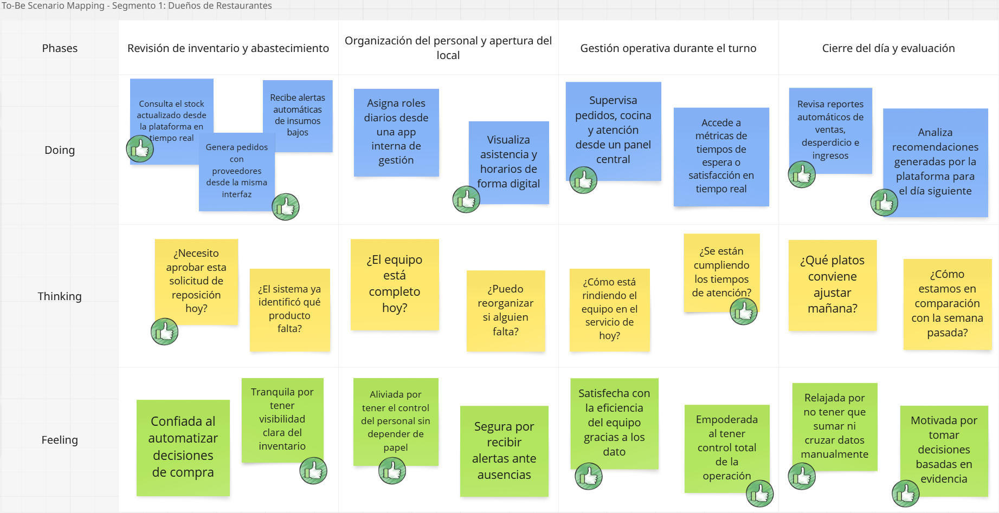
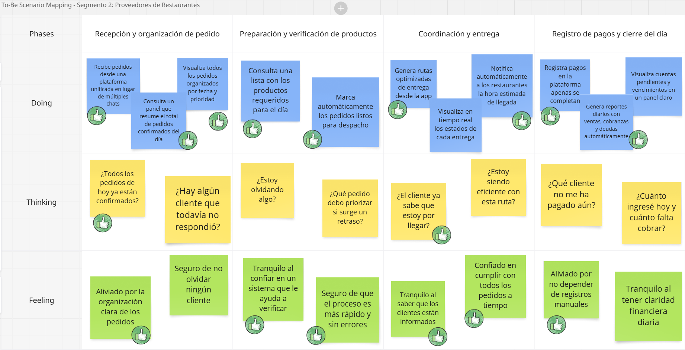
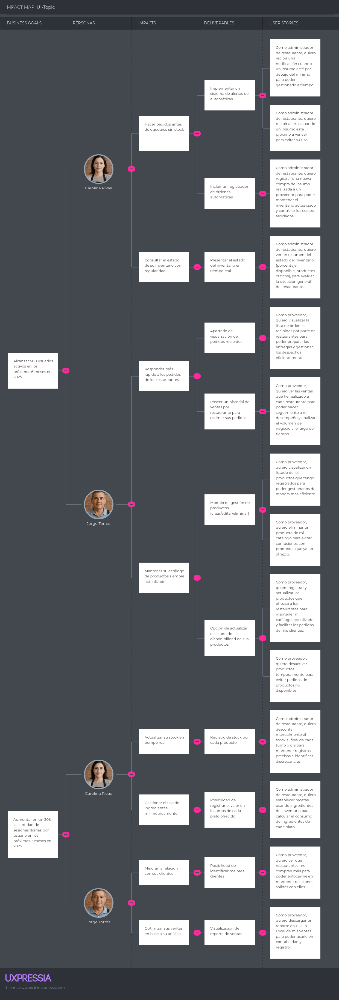
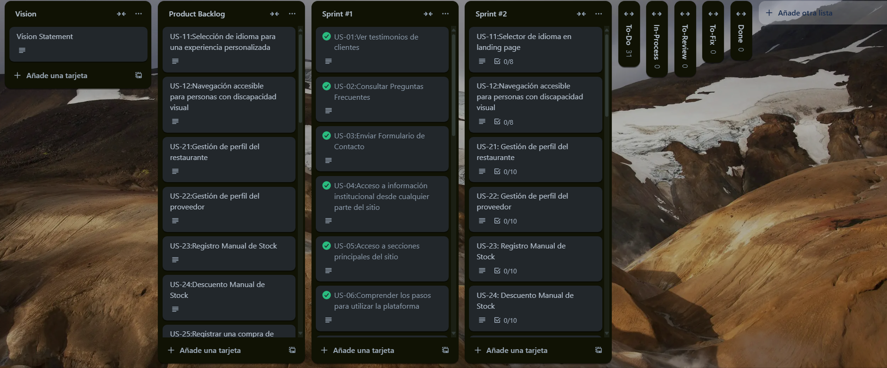

# Capítulo III: Requirements Specification

## 3.1 To-Be Scenario Mapping

**Segmento Objetivo 1:** Dueños o Administradores de Restaurantes

Este escenario To-Be fue construido tras una revisión detallada del escenario As-Is de Carolina Rivas y de las oportunidades de mejora identificadas a partir de las entrevistas. Se definieron las fases del proceso y se contrastaron con las actuales. Se priorizaron mejoras en eficiencia, control, automatización y reducción de frustraciones operativas.

**Segmento objetivo 2:** Proveedores de Restaurantes

Este escenario To-Be fue construido a partir del análisis del escenario As-Is de Jorge Torres. se incorporaron mejoras basadas en las necesidades y frustraciones. El equipo propuso una experiencia futura donde Jorge cuenta con una plataforma digital para gestionar pedidos, organizar rutas, registrar pagos y comunicarse con los restaurantes

## 3.2 User Stories

<table>
    <tr>
        <td>Epic / Story ID</td>
        <td>Título</td>
        <td>Descripción</td>
        <td>Criterios de Aceptación</td>
        <td>Relacionado con (Epic ID)</td>
    </tr>
    <tr>
        <td>EP-01</td>
        <td>Comunicación de Valor y Conversión en la Página de Inicio</td>
        <td>Como visitante, quiero entender claramente el valor de la plataforma y ser guiado mediante acciones concretas, para sentirme motivado a registrarme o descargar la aplicación.</td>
        <td></td>
        <td></td>
    </tr>
    <tr>
        <td>EP-02</td>
        <td>Accesibilidad de la plataforma</td>
        <td>Como visitante con cualquier tipo de dispositivo o capacidad, quiero que la página de inicio sea clara, rápida y accesible, para navegar sin dificultades y tener una buena primera impresión de la plataforma.</td>
        <td></td>
        <td></td>
    </tr>
    <tr>
        <td>EP-03</td>
        <td>Gestión de autenticación y acceso de usuarios</td>
        <td>Como usuario de la plataforma, quiero poder registrarme, iniciar sesión y recuperar mi contraseña, para acceder a mis funcionalidades de forma segura y sin inconvenientes, incluso si olvido mis credenciales.</td>
        <td></td>
        <td></td>
    </tr>
    <tr>
        <td>EP-04</td>
        <td>Gestión de Suscripción y Acceso al Dashboard</td>
        <td>Como usuario de la plataforma, quiero gestionar mi suscripción desde el dashboard, para poder renovar, ver el estado de mi plan y saber cuándo expira.</td>
        <td></td>
        <td></td>
    </tr>
    <tr>
        <td>EP-05</td>
        <td>Gestión de perfil</td>
        <td>Como usuario, quiero poder visualizar y actualizar mi información personal o comercial, para mantener mis datos actualizados, generar confianza y facilitar la comunicación dentro de la plataforma.</td>
        <td></td>
        <td></td>
    </tr>
    <tr>
        <td>EP-06</td>
        <td>Gestión de Stock de Inventario para Operaciones en Restaurantes</td>
        <td>Como administrador de restaurante, quiero gestionar los niveles de inventario de todos los insumos, para asegurar la continuidad operativa, reducir el desperdicio y mantener el control del stock en todo momento.</td>
        <td></td>
        <td></td>
    </tr>
    <tr>
        <td>EP-07</td>
        <td>Gestión de Compras de Insumos</td>
        <td>Como administrador de restaurante, quiero registrar y consultar las compras de insumos realizadas, para tener control del abastecimiento, reducir pérdidas y mantener actualizado el inventario.</td>
        <td></td>
        <td></td>
    </tr>
    <tr>
        <td>EP-08</td>
        <td>Gestión de recetas para pedidos</td>
        <td>Como administrador de restaurante, quiero gestionar recetas vinculadas a insumos del inventario, para controlar mejor el consumo y tener trazabilidad en la preparación de platos.</td>
        <td></td>
        <td></td>
    </tr>
    <tr>
        <td>EP-09</td>
        <td>Panel de control y estadísticas</td>
        <td>Como administrador del restaurante, quiero visualizar un panel con métricas clave, para tomar decisiones estratégicas</td>
        <td></td>
        <td></td>
    </tr>
    <tr>
        <td>EP-10</td>
        <td>Alertas inteligentes</td>
        <td>Como administrador de restaurante, quiero recibir alertas automáticas sobre el estado del inventario y eventos importantes, para tomar decisiones oportunas que eviten la escasez de insumos o el exceso de stock.</td>
        <td></td>
        <td></td>
    </tr>
    <tr>
        <td>EP-11</td>
        <td>Seguimiento de entregas</td>
        <td>Como administrador de restaurante, quiero consultar el estado actual de mis pedidos, para tener visibilidad en tiempo real del progreso de cada entrega y planificar mejor mi operación interna. Y como proveedor, quiero actualizar el estado de las órdenes, para mantener informados a los restaurantes y organizar mis despachos de forma eficiente.</td>
        <td></td>
        <td></td>
    </tr>
    <tr>
        <td>EP-12</td>
        <td>Calificaciones y feedback a proveedores</td>
        <td>Como administrador de restaurante, quiero calificar y dejar comentarios sobre los proveedores con los que trabajo, para compartir mi experiencia, ayudar a otros restaurantes a tomar decisiones informadas y brindar retroalimentación útil a los proveedores.</td>
        <td></td>
        <td></td>
    </tr>
    <tr>
        <td>EP-13</td>
        <td>Gestión de Productos Ofrecidos</td>
        <td>Como proveedor, quiero registrar, editar y eliminar los productos que ofrezco a los restaurantes, para asegurar que mi catálogo esté siempre actualizado y facilitar la gestión de pedidos.</td>
        <td></td>
        <td></td>
    </tr>
    <tr>
        <td>EP-14</td>
        <td>Recepción y Gestión de Órdenes</td>
        <td>Como proveedor, quiero recibir, visualizar y actualizar el estado de las órdenes realizadas por restaurantes, para organizar mis entregas, garantizar puntualidad y mantener una buena comunicación con mis clientes.</td>
        <td></td>
        <td></td>
    </tr>
    <tr>
        <td>EP-15</td>
        <td>Historial de Ventas y Acceso a Facturación, para Proveedores</td>
        <td>Como proveedor, quiero acceder a un historial detallado de mis ventas a cada restaurante, para poder descargar reportes de facturación e identificar a mis mejores clientes.</td>
        <td></td>
        <td></td>
    </tr>
    <tr>
        <td>EP-16</td>
        <td>Gestión de Proveedores</td>
        <td>Como administrador de restaurante, quiero poder agregar, editar, visualizar y eliminar proveedores desde la plataforma, para tener un control eficiente de quiénes suministran los insumos y facilitar la comunicación.</td>
        <td></td>
        <td></td>
    </tr>
    <tr>
        <td>US-01</td>
        <td>Acceso a la plataforma</td>
        <td>Como visitante o usuario, quiero tener la posibilidad de registrarme si no tengo una cuenta o iniciar sesión si ya la tengo, para poder acceder a los servicios de la plataforma.</td>
        <td>Escenario 1: Registro de nuevo usuario Dado que el visitante no posee una cuenta registrada,  cuando solicita iniciar el registro como nuevo usuario,  entonces el sistema debe permitir el ingreso de datos personales requeridos  y registrar al visitante como nuevo usuario de la plataforma  Escenario 2: Inicio de sesión de usuario existente  Dado que el usuario ya cuenta con una cuenta registrada,  cuando proporciona sus credenciales para iniciar sesión,  entonces el sistema debe validarlas  y permitir el acceso a la plataforma.</td>
        <td>EP-01</td>
    </tr>
    <tr>
        <td>US-02</td>
        <td>Recuperación de contraseña</td>
        <td>Como usuario, quiero recuperar el acceso a mi cuenta mediante la restauración de mi contraseña, para continuar utilizando la plataforma incluso si olvidé mis credenciales.</td>
        <td>**Escenario 1: Solicitud de recuperación de contraseña** Dado que el usuario no ha iniciado sesión y desea recuperar el acceso,  cuando solicita iniciar el proceso de recuperación de contraseña,  entonces el sistema le permite ingresar su dirección de correo electrónico asociada a la cuenta **Escenario 2: Envío de instrucciones de recuperación** Dado que el usuario ha proporcionado una dirección de correo electrónico válida,  cuando envía la solicitud de recuperación,  entonces el sistema genera un medio seguro para restablecer la contraseña y notifica al usuario que se han enviado instrucciones al canal correspondiente **Escenario 3: Enlace inválido o expirado** Dado que el usuario accede a un medio de recuperación previamente generado,  cuando dicho recurso ya no es válido o ha expirado,  entonces el sistema informa que la recuperación no puede completarse Y ofrece la posibilidad de generar una nueva solicitud. **Escenario 4: Restablecimiento exitoso** Dado que el usuario accede a un recurso válido para restaurar su contraseña,  cuando proporciona una nueva contraseña que cumple con las reglas establecidas,  entonces el sistema actualiza su información de acceso  Y confirma que podrá ingresar con sus nuevas credenciales</td>
        <td>EP-01</td>
    </tr>
    <tr>
        <td>US-03</td>
        <td>Soporte de acceso según estado de suscripción</td>
        <td>Como usuario, quiero que mi acceso al sistema esté condicionado al estado activo de mi suscripción, para garantizar que solo pueda utilizar todas las funcionalidades mientras mi plan esté vigente.</td>
        <td>**Escenario 1: Acceso completo con suscripción activa**  Dado que el usuario posee una suscripción vigente,  cuando inicia sesión en la plataforma,  entonces el sistema permite el uso completo de las funcionalidades habilitadas por su plan  Escenario 2: Acceso restringido con suscripción inactiva  Dado que el usuario tiene una suscripción vencida o inactiva,  cuando intenta acceder a funcionalidades del sistema,  entonces el sistema restringe su acceso y muestra un mensaje que informa sobre el estado de la suscripción  Escenario 3: Acceso denegado a funcionalidades exclusivas Dado que el usuario no posee una suscripción activa,  cuando intenta utilizar una funcionalidad reservada para suscriptores,  entonces el sistema bloquea el acceso a dicha funcionalidad y ofrece la opción de renovar o actualizar su plan.  Escenario 4: Restauración del acceso tras renovación.  Dado que el usuario ha renovado su suscripción de forma exitosa,  cuando vuelve a ingresar al sistema,  entonces el sistema actualiza su estado  y permite nuevamente el uso de todas las funcionalidades correspondientes a su plan</td>
        <td>EP-01</td>
    </tr>
    <tr>
        <td>US-04</td>
        <td>Gestión manual de stock e insumos</td>
        <td>Como visitante del sitio web, quiero acceder fácilmente a información sobre redes sociales, contacto y aspectos legales, para obtener soporte o informarme sobre las condiciones de uso de la plataforma.</td>
        <td>**Escenario 1: Registro manual de stock** Dado que el administrador de restaurante se encuentra en la sección de inventario,  cuando agrega un insumo al catalogo de insumos registra el tipo de insumo,  así como el stock mínimo y máximo,  entonces el sistema actualiza el inventario y muestra un mensaje de éxito.  Escenario 2: Registro manual de stoc Dado que el administrador de restaurante está en la sección de inventario,  cuando agrega un insumo del catálogo registra el stock actual y la fecha de expiración si es perecible,  entonces el sistema actualiza el inventario y muestra un mensaje de éxito  Escenario 3: Validación de datos de stock Dado que el administrador ingresa datos para el stock,  cuando los datos son negativos o no numéricos,  entonces el sistema muestra un mensaje de error y evita la actualización  Escenario 4: Descuento manual de stock  Dado que el administrador identifica un insumo para descontar del stock del inventario,  cuando registra una cantidad válida para descuento,  entonces el sistema actualiza el stock y confirma la operación;   Escenario 5: Advertencia por descuento excesivo  Dado que el administrador ingresa una cantidad de descuento de stock mayor al stock actual,  cuando intenta guardar el descuento,  entonces el sistema muestra una advertencia y solicita confirmación antes de proceder. </td>
        <td>EP-01</td>
    </tr>
    <tr>
        <td>US-05</td>
        <td>Gestión integral de notificaciones de inventario</td>
        <td>Como administrador de restaurante, quiero recibir notificaciones automáticas por vencimiento próximo, exceso o escasez de stock en los insumos, para tomar decisiones logísticas y oportunas, y evitar pérdidas, desperdicios o quiebres de stock.</td>
        <td>Escenario 1: Notificación del sistema por vencimiento próximo. Dado que un insumo tiene una fecha de vencimiento registrada  cuando faltan 5 días o menos para su vencimiento  entonces el sistema marca el insumo en la lista de inventario.   Escenario 2: Notificación automática por vencimiento.  Dado que existen insumos en el inventario  cuando el sistema detecta insumos con vencimiento próximo  entonces envía una notificación al administrador de restaurante.   Escenario 3: Notificación del sistema por exceso de stock.  Dado que un insumo tiene definido un stock máximo permitido  cuando el stock actual es igual o mayor a ese valor  entonces el sistema resalta el insumo como excedente en el listado de inventario.   Escenario 4: Notificación del sistema por bajo stock.  Dado que un insumo tiene un stock mínimo de referencia  cuando el stock actual es menor o igual al mínimo establecido  entonces el sistema resalta el insumo como escaso en el listado de inventario.</td>
        <td>EP-01</td>
    </tr>
    <tr>
        <td>US-06</td>
        <td>Enviar comentarios y calificaciones sobre pedidos</td>
        <td>Como administrador de restaurante, quiero calificar y dejar comentarios sobre los pedidos recibidos de los proveedores, para dar retroalimentación sobre la calidad del servicio y los productos.</td>
        <td>Escenario 1: Registro exitoso de retroalimentación. Dado que el pedido ha sido entregado  cuando el administrador de restaurante proporciona una calificación válida y un comentario  entonces el sistema registra la retroalimentación y la asocia al pedido y proveedor correspondiente.   Escenario 2: Intento de calificación de pedido no entregado.  Dado que el pedido aún no ha sido marcado como entregado  cuando el administrador de restaurante intenta registrar una calificación  entonces el sistema rechaza la operación e informa que solo se pueden calificar pedidos entregados.   Escenario 3: Datos inválidos en la retroalimentación.  Dado que el administrador de restaurante proporciona una calificación fuera del rango permitido o un comentario vacío  cuando intenta registrar la retroalimentación  entonces el sistema muestra un mensaje de error indicando los datos inválidos.</td>
        <td>EP-01</td>
    </tr>
    <tr>
        <td>US-07</td>
        <td>Gestionar productos en el inventario</td>
        <td>Como proveedor, quiero gestionar la información de los productos que ofrezco a los restaurantes, para mantener mi catálogo de productos actualizado y facilitar los pedidos de mis clientes.</td>
        <td>Escenario 1: Visualizar listado de productos. Dado que el proveedor ha iniciado sesión  cuando accede a la sección de productos  entonces el sistema muestra todos los productos que tiene registrados y que están actualmente ofrecidos.   Escenario 2: Registrar un nuevo producto.  Dado que el proveedor proporciona nombre, descripción, categoría y precio unitario del producto  cuando confirma el registro del nuevo producto y lo agrega a su inventario  entonces el sistema añade el producto al catálogo y lo hace visible para los restaurantes asociados.   Escenario 3: Editar un producto existente.  Dado que un producto ya existe en el inventario del proveedor  cuando actualiza uno o más de sus atributos  entonces el sistema guarda los cambios y los refleja en el inventario actualizado.   Escenario 4: Eliminar un producto.  Dado que un producto existe en el inventario del proveedor  cuando el proveedor decide eliminarlo y confirma la acción  entonces el sistema remueve el producto y deja de mostrarlo a los restaurantes asociados.   Escenario 5: Desactivar un producto temporalmente.  Dado que un producto no está disponible  cuando el proveedor cambia su estado a inactivo  entonces el sistema oculta el producto y deja de mostrarlo a los restaurantes.   Escenario 6: Reactivar un producto.  Dado que un producto inactivo vuelve a estar disponible  cuando el proveedor cambia su estado a activo  entonces el sistema muestra nuevamente el producto en el catálogo disponible para los restaurantes.   Escenario 7: Intento de gestión con datos incompletos o inválidos.  Dado que el proveedor omite uno o más campos obligatorios o ingresa datos inválidos al crear o actualizar un producto  cuando intenta completar la acción  entonces el sistema muestra un mensaje de error indicando qué datos faltan o son incorrectos.</td>
        <td>EP-01</td>
    </tr>
    <tr>
        <td>US-08</td>
        <td>Gestión de Proveedores</td>
        <td>Como administrador de restaurante, quiero seleccionar proveedores disponibles en la plataforma y guardarlos en mi lista personal, para acceder fácilmente a su información cuando necesite realizar pedidos.</td>
        <td>Escenario 1: Agregar nuevo proveedor. Dado que el administrador de restaurante accede a la sección de proveedores  cuando ingresa el nombre del proveedor que busca lo selecciona y lo confirma  entonces el sistema guarda al proveedor y lo incluye en su lista de proveedores.   Escenario 2: Visualizar lista de proveedores.  Dado que existen proveedores registrados  cuando el administrador de restaurante accede a la sección de proveedores  entonces el sistema muestra la lista con nombre contacto y estado de cada proveedor.   Escenario 4: Eliminar proveedor.  Dado que el administrador desea eliminar un proveedor de su lista  cuando confirma la eliminación  entonces el sistema elimina al proveedor y se actualiza la lista de proveedores.   Escenario 5: Búsqueda por nombre.  Dado que hay múltiples proveedores registrados  cuando el administrador ingresa un nombre parcial o completo en la búsqueda  entonces el sistema actualiza la lista mostrando solo los proveedores cuyo nombre coincide.   Escenario 6: Filtrado por categoría.  Dado que existen proveedores con diferentes categorías  cuando el administrador selecciona una categoría para filtrar  entonces el sistema muestra solo los proveedores que coinciden con esa categoría.   Escenario 7: Combinación de filtros.  Dado que el administrador aplica múltiples criterios de búsqueda  cuando utiliza nombre y categoría simultáneamente  entonces el sistema muestra solo los proveedores que cumplen con todos los criterios aplicados.</td>
        <td>EP-01</td>
    </tr>
    <tr>
        <td>US-09</td>
        <td>Gestión de receta</td>
        <td>Como administrador de restaurante, quiero mantener actualizadas las recetas del menú según las necesidades del negocio, para asegurar que solo estén disponibles las preparaciones activas y relevantes.</td>
        <td>Escenario 1: Agregar una nueva receta. Dado que el administrador necesita incluir una nueva preparación en el menú  cuando indica su nombre, ingredientes y valor de venta  entonces el sistema registra la preparación como receta activa  y la hace disponible para futuras operaciones del restaurante.   Escenario 2: Ajustar una receta existente.  Dado que una receta contiene información desactualizada o requiere cambios  cuando el administrador actualiza sus detalles  entonces el sistema almacena los cambios y asegura que se reflejen en las funciones que dependen de esa receta.   Escenario 3: Retirar una receta no vigente.  Dado que una receta ya no forma parte del menú actual y no está vinculada a operaciones recientes  cuando el administrador solicita su retiro entonces el sistema la remueve de las recetas activas y conserva la trazabilidad histórica correspondiente.</td>
        <td>EP-01</td>
    </tr>
    <tr>
        <td>US-10</td>
        <td>Consultar detalles de una receta registrada</td>
        <td>Como administrador de restaurante, quiero consultar la información detallada de una receta, para revisar los ingredientes utilizados y sus cantidades por porción.</td>
        <td>Escenario 1: Consulta general. Dado que existen recetas registradas  cuando el administrador de restaurante accede a una receta específica  entonces el sistema muestra el nombre porciones insumos y cantidades asociadas.   Escenario 2: Receta inexistente.  Dado que se intenta acceder a una receta eliminada o inexistente  cuando el administrador de restaurante la consulta por ID o nombre  entonces el sistema muestra un mensaje indicando que no se encuentra disponible.</td>
        <td>EP-01</td>
    </tr>
    <tr>
        <td>US-11</td>
        <td>Gestión de perfil</td>
        <td>Como usuario quiero actualizar mi perfil para mantener mi información al día y asegurar que sea correctamente mostrada a otros usuarios en la plataforma.</td>
        <td>Escenario 1: Edición de datos básicos. Dado que el usuario ha accedido a su sección de perfil  cuando actualiza datos como nombre correo electrónico teléfono dirección o descripción del negocio  entonces el sistema guarda los cambios y los refleja en su perfil.   Escenario 2: Subida de imagen de perfil o logo.  Dado que el usuario desea personalizar la imagen de su perfil  cuando selecciona una imagen válida y la carga  entonces el sistema la almacena y la muestra correctamente en el panel de perfil.   Escenario 3: Validación de campos obligatorios.   Dado que el usuario está editando su perfil  cuando deja campos obligatorios en blanco o introduce datos inválidos  por ejemplo un correo con formato incorrecto  entonces el sistema muestra mensajes de error claros  y no permite guardar los cambios hasta que los datos sean válidos.</td>
        <td>EP-02</td>
    </tr>
    <tr>
        <td>US-12</td>
        <td>Visualizar ingredientes más usados</td>
        <td>Como administrador, quiero ver los ingredientes más usados durante un período definido (semana, mes), para entender el consumo frecuente y anticipar reposiciones.</td>
        <td>Escenario 1: Visualización de ingredientes frecuentes. Dado que el administrador de restaurante ha ingresado al dashboard  cuando selecciona un período de análisis (por ejemplo, “últimos 7 días”)  entonces el sistema muestra los ingredientes más utilizados durante ese período.   Escenario 2: Cambio de período.  Dado que el administrador de restaurante visualiza los ingredientes más usados  cuando cambia el período de análisis a otro (por ejemplo, “último mes”)  entonces el sistema actualiza la información mostrada con los datos correspondientes.</td>
        <td>EP-02</td>
    </tr>
    <tr>
        <td>US-13</td>
        <td>Ver alertas recientes</td>
        <td>Como administrador, quiero ver alertas importantes (productos por vencer, bajo stock, etc.), para tomar acciones correctivas a tiempo.</td>
        <td>Escenario 1: Visualización de alertas. Dado que el administrador accede al panel de control  cuando el sistema detecta productos por vencer o con bajo stock  entonces se muestran alertas clasificadas por tipo (vencimiento, stock, etc.).   Escenario 2: Archivado de alertas.  Dado que una alerta ha sido revisada por el administrador  cuando esta se marca como revisada  entonces desaparece del panel principal y se almacena en un historial de alertas.</td>
        <td>EP-02</td>
    </tr>
    <tr>
        <td>US-14</td>
        <td>Identificar a los Mejores Clientes</td>
        <td>Como proveedor, quiero ver qué restaurantes me compran más, para poder enfocarme en mantener relaciones sólidas con ellos.</td>
        <td>**Escenario 1: Ordenamiento de clientes por volumen de ventas** Dado que el proveedor solicita información sobre sus mejores clientes,  cuando define un rango de fechas válido,  entonces el sistema presenta una lista ordenada de restaurantes  según el monto total adquirido durante ese periodo</td>
        <td>EP-02</td>
    </tr>
    <tr>
        <td>US-15</td>
        <td>Actualización manual de estado del inventario</td>
        <td>Como administrador de restaurante, quiero actualizar manualmente el estado del inventario, para asegurar que los insumos sean descontados correctamente y el inventario refleje información actualizada.</td>
        <td>Escenario 1: Visualización previa a la actualización del inventario. Dado que existen ventas registradas pendientes de aplicar al inventario  cuando el administrador de restaurante accede a la sección de actualización manual del inventario  entonces el sistema muestra una lista con información completa de  cada venta pendiente a registrar en el inventario.   Escenario 2: Actualización manual del estado del inventario.  Dado que existen ventas registradas pendientes de aplicar al inventario  cuando el administrador de restaurante confirma la acción  entonces el sistema descuenta los insumos correspondientes y actualiza el stock del inventario.</td>
        <td>EP-02</td>
    </tr>
    <tr>
        <td>US-16</td>
        <td>Gestión de ventas</td>
        <td>Como empleado del restaurante, quiero registrar y gestionar las ventas del restaurante según las recetas e insumos disponibles, para para mantener un registro preciso del consumo.</td>
        <td>Escenario 1: Selección de platos e insumos adicionales. Dado que el cliente del restaurante realiza una compra  cuando el empleado indica los platos e insumos adicionales vendidos  entonces el sistema registra la venta incluyendo fecha, hora y los elementos seleccionados.   Escenario 2: Registro de venta pendiente de actualización en el inventario.  Dado que la venta incluye platos con recetas registradas e insumos adicionales  cuando se confirma la venta  entonces el sistema marca la venta como pendiente de descontar del inventario  y la registra en el sistema para futuras actualizaciones de stock.  Escenario 3: Edición previa a la actualización de inventario.  Dado que el administrador de restaurante visualiza ventas aún no aplicadas al inventario  cuando edita o elimina una venta  entonces el sistema ajusta el estado de las ventas pendientes a ntes de que se confirme su aplicación al inventario.</td>
        <td>EP-02</td>
    </tr>
    <tr>
        <td>US-17</td>
        <td>Seguimiento de una orden</td>
        <td>Como proveedor, quiero establecer el estado de una orden, para que el restaurante conozca la etapa actual de la orden.</td>
        <td>Escenario 1: Cambio exitoso de estado de una orden. Dado que el proveedor visualiza una orden pendiente de actualización  cuando establece el nuevo estado de la orden con “Preparando”, “En camino” o “Entregado”  entonces el sistema actualiza el estado y notifica al restaurante sobre el cambio.   Escenario 2: Fallo al cambiar el estado por falta de permisos.  Dado que el proveedor intenta modificar una orden ya finalizada  cuando intenta establecer un nuevo estado  entonces el sistema muestra un mensaje de error indicando que no se puede modificar una orden finalizada.</td>
        <td>EP-03</td>
    </tr>
    <tr>
        <td>US-18</td>
        <td>Visualización de calificaciones recibidas</td>
        <td>Como proveedor, quiero ver los comentarios y calificaciones de mis órdenes completadas, para evaluar mi desempeño y mejorar la calidad de mis servicios.</td>
        <td>Escenario 1: Consulta general de feedback. Dado que el proveedor desea revisar su desempeño  cuando accede a la sección de calificaciones  entonces el sistema muestra los puntajes y comentarios asociados a sus servicios.   Escenario 2: Visualizar promedio total de calificaciones.  Dado que el proveedor accede a la sección de calificaciones  cuando el sistema carga todos los comentarios y puntajes de las órdenes completadas  entonces muestra un valor numérico con el promedio total de las calificaciones recibidas.</td>
        <td>EP-03</td>
    </tr>
    <tr>
        <td>US-19</td>
        <td>Visualizar y gestionar ordenes recibidas</td>
        <td>Como proveedor, quiero visualizar la lista de órdenes solicitadas por los restaurantes, para preparar las entregas y gestionar los despachos eficientemente.</td>
        <td>Escenario 1: Visualizar todas las órdenes entrantes. Dado que hay órdenes pendientes asignadas al proveedor  cuando accede a la sección de órdenes  entonces el sistema muestra una lista con el nombre del restaurante  los ítems solicitados las cantidades y la fecha de entrega requerida.   Escenario 2: Confirmar una orden para despacho. Dado que una orden está en situación “pendiente”  cuando el proveedor la confirma entonces el sistema cambia su estado a “aprobada” y notifica al restaurante.   Escenario 3: Rechazar una orden.  Dado que una orden no es viable  cuando el proveedor la rechaza e ntonces el sistema marca la orden como “rechazada” y notifica al restaurante con el motivo.</td>
        <td>EP-03</td>
    </tr>
    <tr>
        <td>US-20</td>
        <td>Visualizar información específica de una orden</td>
        <td>Como proveedor, quiero ver todos los datos asociados a una orden específica, para prepararla correctamente.</td>
        <td>Escenario 1: Seleccionar una orden desde el listado. Dado que el proveedor ha seleccionado una orden desde el listado,  cuando se presenta la vista de detalle de la orden  entonces el sistema muestra todos los productos incluidos, sus cantidades, precios y descripción de la orden.</td>
        <td>EP-04</td>
    </tr>
    <tr>
        <td>US-21</td>
        <td>Visualizar historial de órdenes por restaurante</td>
        <td>Como proveedor, quiero ver las órdenes que he completado de cada restaurante, para llevar un registro de mis entregas anteriores y evaluar el historial de órdenes por cliente.</td>
        <td>Escenario 1: Filtrar órdenes completadas por restaurante. Dado que el proveedor accede a la sección de historial de órdenes  cuando selecciona un restaurante específico y filtra las órdenes completadas  entonces el sistema muestra una lista de todas las órdenes finalizadas correspondientes a ese restaurante.   Escenario 2: Visualizar órdenes en orden cronológico.  Dado que el proveedor accede a la sección de historial de órdenes  cuando el sistema carga las órdenes registradas  entonces muestra las órdenes ordenadas de la más reciente a la más antigua.</td>
        <td>EP-05</td>
    </tr>
    <tr>
        <td>US-22</td>
        <td>Descargar reportes de historial de órdenes cumplidas</td>
        <td>Como proveedor, quiero descargar un reporte en Excel de las órdenes completadas, para analizar fácilmente las ventas y llevar un control detallado de mis entregas.</td>
        <td>Escenario 1: Generación de reporte con éxito. Dado que el proveedor visualiza las órdenes aceptadas  cuando solicita un reporte  entonces el sistema debe generar un archivo Excel con los datos de todas las órdenes aceptadas.   Escenario 2: Aplicación de filtros previos a la generación de reporte.  Dado que el proveedor ha definido un estado de orden o restaurante específico  cuando se genera el reporte  entonces el sistema debe generar un archivo que incluya únicamente la información filtrada.</td>
        <td>EP-05</td>
    </tr>
    <tr>
        <td>US-23</td>
        <td>Cambio de contraseña</td>
        <td>Como usuario autenticado, quiero tener la posibilidad de cambiar mi contraseña desde la aplicación, para mantener la seguridad de mi cuenta y prevenir accesos no autorizados.</td>
        <td>Escenario 1: Cambio exitoso de contraseña. Dado que el usuario está autenticado y accede a la opción de cambiar contraseña  cuando proporciona su contraseña actual, una nueva contraseña válida y su confirmación  entonces el sistema actualiza la contraseña y muestra un mensaje de confirmación indicando que el cambio fue exitoso.   Escenario 2: Contraseña actual incorrecta. Dado que el usuario intenta cambiar su contraseña  cuando proporciona una contraseña actual incorrecta  entonces el sistema rechaza la solicitud y muestra un mensaje de error indicando que la contraseña actual no coincide.</td>
        <td>EP-06</td>
    </tr>
    <tr>
        <td>US-24</td>
        <td>Eliminar cuenta</td>
        <td>Como usuario autenticado, quiero tener la opción de eliminar permanentemente mi cuenta, para poder dejar de utilizar el servicio y borrar todos mis datos personales asociados.</td>
        <td>Escenario 1: Eliminación exitosa de la cuenta. Dado que el usuario está autenticado y accede a la opción de eliminar su cuenta  cuando confirma su decisión mediante un paso de verificación (hacer clic en "Confirmar eliminación")  entonces el sistema elimina su cuenta y datos personales  y muestra un mensaje de confirmación indicando que la cuenta ha sido eliminada exitosamente.   Escenario 2: Confirmación no realizada.  Dado que el usuario ha iniciado el proceso de eliminación  cuando no completa el paso de verificación o cancela la acción  entonces el sistema no elimina la cuenta y mantiene el acceso del usuario sin cambios.</td>
        <td>EP-06</td>
    </tr>
    <tr>
        <td>US-25</td>
        <td>Ver testimonios de clientes</td>
        <td>Como visitante del sitio web, quiero leer testimonios de otros dueños o administradores de restaurantes y proveedores, para confiar más en la plataforma antes de registrarme.</td>
        <td>Escenario 1: Ver sección de testimonios. Dado que un visitante accede al sitio web  cuando accede a la sección de testimonios  entonces ve al menos tres testimonios y cada uno muestra el nombre, el rol (dueño, proveedor, etc.) y su comentario.</td>
        <td>EP-07</td>
    </tr>
    <tr>
        <td>US-26</td>
        <td>Consultar Preguntas Frecuentes</td>
        <td>Como visitante, quiero ver una lista de preguntas frecuentes, para resolver mis dudas sin contactar al soporte.</td>
        <td>Escenario 1: Visualización de respuestas claras en FAQ. Dado que un visitante accede a la sección de preguntas frecuentes  cuando consulta su contenido  entonces el sistema muestra una lista de al menos tres preguntas frecuentes y  cada pregunta está acompañada de una respuesta visible y redactada en lenguaje claro y directo.</td>
        <td>EP-07</td>
    </tr>
    <tr>
        <td>US-27</td>
        <td>Consultas directas al equipo de la plataforma</td>
        <td>Como visitante, quiero poder proporcionar mi nombre, correo electrónico y un mensaje, para comunicarme directamente con el equipo de la plataforma y recibir una respuesta a mis consultas o comentarios.</td>
        <td>Escenario 1: Validación y almacenamiento exitoso de la solicitud. Dado que un visitante proporciona un nombre, un correo electrónico válido y un mensaje,  cuando envía la información  entonces el sistema valida los datos ingresados y almacena la solicitud correctamente.   Escenario 2: Confirmación de recepción al visitante.  Dado que el sistema ha almacenado correctamente la solicitud de contacto,  cuando finaliza el proceso sin errores  entonces el sistema muestra un mensaje de confirmación con el texto “Gracias por tu mensaje, te responderemos pronto”.</td>
        <td>EP-08</td>
    </tr>
    <tr>
        <td>US-28</td>
        <td>Visualización persistente de información institucional en todo el sitio</td>
        <td>Como visitante del sitio web, quiero acceder fácilmente a información sobre redes sociales, contacto y aspectos legales, para obtener soporte o conocer las condiciones de uso de la plataforma.</td>
        <td>Escenario 1: Disponibilidad de información institucional. Dado que el visitante navega por el sitio web  cuando accede a diferentes secciones  entonces puede consultar en todo momento la información de contacto redes sociales y aspectos legales;   Escenario 2: Acceso a contenido legal.  Dado que el visitante desea consultar los términos y condiciones  cuando accede a la sección de Términos y Condiciones  entonces visualiza la información legal completa y comprensible.</td>
        <td>EP-08</td>
    </tr>
    <tr>
        <td>US-29</td>
        <td>Acceso a secciones principales del sitio</td>
        <td>Como visitante del sitio web, quiero acceder fácilmente a las distintas secciones del sitio desde la página principal, para orientarme y navegar sin dificultad.</td>
        <td>Escenario 1: Acceso a secciones clave desde el sitio web. Dado que el visitante accede al sitio web  cuando el contenido inicial está disponible  entonces puede acceder a las secciones principales del sitio tales como Inicio, Beneficios, Cómo funciona y Contacto.</td>
        <td>EP-08</td>
    </tr>
    <tr>
        <td>US-30</td>
        <td>Conocer el funcionamiento general de la plataforma</td>
        <td>Como visitante del sitio web, quiero que se presenten de forma clara y estructurada las etapas para usar la plataforma, para comprender rápidamente el flujo general de funcionamiento.</td>
        <td>Escenario 1: Presentación estructurada del funcionamiento. Dado que el visitante accede al sitio web  cuando revisa la información sobre el funcionamiento de la plataforma  entonces puede ver hasta cuatro etapas claramente definidas que explican el proceso de uso.</td>
        <td>EP-09</td>
    </tr>
    <tr>
        <td>US-31</td>
        <td>Opción de comprender el funcionamiento mediante recurso audiovisual</td>
        <td>Como visitante del sitio web, quiero tener la opción de acceder a un video explicativo acerca del funcionamiento de la plataforma, para entender su uso de forma visual y dinámica.</td>
        <td>Escenario 1: Visualización de video explicativo. Dado que un visitante se encuentra en la sección de “¿Cómo funciona?”  cuando se le muestra la opción de ver el video explicativo  entonces el visitante puede reproducir un video embebido directamente en la página.</td>
        <td>EP-09</td>
    </tr>
    <tr>
        <td>US-32</td>
        <td>Comprensión del propósito y valor desde el inicio</td>
        <td>Como visitante del sitio web, quiero entender de inmediato el propósito y los beneficios de la plataforma, para decidir si es relevante para mis necesidades.</td>
        <td>Escenario 1: Claridad del mensaje principal. Dado que un visitante accede al sitio web  cuando la página ha cargado completamente  entonces comprende claramente el propósito y los beneficios de la plataforma.   Escenario 2: Accesibilidad del mensaje en diferentes dispositivos.  Dado que un visitante accede al sitio desde un dispositivo móvil o de escritorio  cuando se muestra la sección principal  entonces percibe el mensaje de valor de forma legible y comprensible sin importar el tipo de dispositivo.</td>
        <td>EP-09</td>
    </tr>
    <tr>
        <td>US-33</td>
        <td>Visualización de beneficios según perfil de usuario</td>
        <td>Como visitante del sitio web, quiero ver beneficios adaptados a mi perfil (dueño o administrador de restaurante, o proveedor), para entender cómo la plataforma me ayuda específicamente.</td>
        <td>Escenario 1: Segmentación por perfil. Dado que un visitante se desplaza hasta la sección de beneficios  cuando visualiza el contenido de dicha sección  entonces encuentra información diferenciada según el perfil:  una para dueños o administradores de restaurantes y otra para proveedores.   Escenario 2: Accesibilidad desde dispositivos móviles.   Dado que un visitante accede al sitio desde un dispositivo móvil  cuando se desplaza hasta la sección de beneficios  entonces el contenido segmentado se presenta de forma legible y comprensible desde pantallas pequeñas.</td>
        <td>EP-10</td>
    </tr>
    <tr>
        <td>US-34</td>
        <td>Selección de idioma para una experiencia personalizada</td>
        <td>Como visitante o usuario, quiero cambiar entre los idiomas inglés y español fácilmente, para interactuar con la plataforma en el idioma que me resulte más cómodo.</td>
        <td>Escenario 1: Cambio exitoso de idioma. Dado que el idioma actual de la plataforma está configurado en inglés  cuando el visitante o usuario solicita el uso del idioma español  entonces el sistema actualiza todo el contenido textual visible a español.   Escenario 2: Persistencia del idioma seleccionado.  Dado que el visitante o usuario ha cambiado el idioma predeterminado de la plataforma  cuando se produce una nueva solicitud dentro de la misma sesión  entonces el idioma previamente seleccionado se mantiene sin necesidad de reconfiguración.</td>
        <td>EP-10</td>
    </tr>
    <tr>
        <td>US-35</td>
        <td>Navegación accesible para personas con discapacidad visual</td>
        <td>Como visitante o usuario con discapacidad visual, quiero utilizar un lector de pantalla para acceder al contenido del sitio, para comprender toda la información disponible en la plataforma sin barreras.</td>
        <td>Escenario 1: Accesibilidad de la información textual con lector de pantalla. Dado que un visitante o usuario accede al sitio usando un lector de pantalla compatible  cuando interactúa con las distintas secciones  entonces el lector interpreta y vocaliza el contenido textual enlaces y botones de forma comprensible y en orden lógico.   Escenario 2: Provisión de alternativas textuales para contenido visual.  Dado que el sitio incluye imágenes íconos o elementos gráficos relevantes para la comprensión del contenido  cuando un visitante o usuario utiliza el lector de pantalla  entonces el sistema proporciona alternativas textuales descriptivas  mediante atributos accesibles como alt aria-label o etiquetas semánticas.</td>
        <td>EP-10</td>
    </tr>
    <tr>
        <td>US-36</td>
        <td>Optimización para pantallas de escritorio</td>
        <td>Como proveedor, quiero marcar el estado de una entrega, para que el restaurante sepa en qué etapa va</td>
        <td>Escenario 1:Visualización adaptativa en pantallas de escritorio. Dado que el usuario o visitante accede a la plataforma desde un navegador con una resolución igual o mayor a 1280px  cuando se carga la interfaz principal  entonces el sistema organiza el contenido de forma que la información relevante  esté visible sin necesidad de interacción adicional  y los elementos estén distribuidos de forma clara para facilitar la comprensión  y el acceso a las funciones disponibles.</td>
        <td>EP-11</td>
    </tr>
    <tr>
        <td>US-37</td>
        <td>Optimización para pantallas de tablet</td>
        <td>Como usuario o visitante que accede desde una tablet u otro dispositivo con pantalla intermedia, quiero que el contenido de la plataforma se reorganice para ese formato,, para acceder a las funcionalidades sin esfuerzo adicional y con la información claramente presentada.</td>
        <td>Escenario 1: Visualización optimizada en pantallas intermedias. Dado que el usuario o visitante accede a la plataforma desde un dispositivo con resolución entre 768px y 1024px  cuando se carga la interfaz principal  entonces el contenido debe presentarse con una estructura ajustada a ese ancho  y la información clave debe estar organizada de forma que sea legible  y accesible sin acciones adicionales</td>
        <td>EP-12</td>
    </tr>
    <tr>
        <td>US-38</td>
        <td>Optimización para dispositivos móviles móviles</td>
        <td>Como visitante del sitio web que accede desde un dispositivo móvil, quiero que el contenido de inicio se ajuste adecuadamente al tamaño de pantalla, para poder leer la información sin dificultad e interactuar por el contenido de forma cómoda.</td>
        <td>Escenario 1: Visualización optimizada en pantallas móviles. Dado que el visitante accede al sitio web desde un dispositivo con resolución menor a 768px  cuando se carga el sitio  entonces el contenido debe reorganizarse en una disposición vertical con bloques apilados  y los textos e imágenes deben escalarse correctamente para garantizar legibilidad  y evitar desbordes o desplazamiento horizontal innecesario.</td>
        <td>EP-12</td>
    </tr>
    <tr>
        <td>US-39</td>
        <td>Navegación fluida entre secciones</td>
        <td>Como visitante, quiero que cada sección del sitio esté claramente diferenciada, para comprender fácilmente la estructura del contenido y recorrerlo sin perderme.</td>
        <td>Escenario 1: Identificación clara de secciones. Dado que un visitante accede al sitio web desde cualquier dispositivo  cuando se desplaza por el contenido  entonces identifica cada sección como una unidad separada  y comprende el flujo natural de lectura sin necesidad de interacción adicional.</td>
        <td>EP-13</td>
    </tr>
    <tr>
        <td>US-40</td>
        <td>Inclusión de videos explicativos en el sitio web</td>
        <td>Como visitante, quiero visualizar videos sobre el equipo de Restock y sobre el funcionamiento del producto para conocer quiénes están detrás del proyecto y entender mejor cómo funciona antes de usarlo.</td>
        <td>Escenario 1: Visualización del video sobre el equipo. Dado que el visitante ha interactuado hasta la sección “Sobre nosotros”  cuando llega al final de dicha sección  entonces debe visualizarse un video incrustado con una breve presentación del equipo  y este debe estar embebido, ser responsivo y reproducible desde diferentes dispositivos.   Escenario 2: Visualización del video sobre el producto.  Dado que el visitante ha interactuado hasta la sección “Tutorial”  cuando llega al final de dicha sección  entonces debe visualizar un video incrustado que explique brevemente cómo funciona la plataforma  y este debe mostrarse con diseño limpio, accesibilidad adecuada y compatibilidad móvil y de escritorio.</td>
        <td>EP-13</td>
    </tr>
    <tr>
        <td>US-41</td>
        <td>Acceso a la plataforma</td>
        <td>Como visitante o usuario, quiero tener la posibilidad de registrarme si no tengo una cuenta o iniciar sesión si ya la tengo, para poder acceder a los servicios de la plataforma.</td>
        <td>Escenario 1: Registro de nuevo usuario. Dado que el visitante no posee una cuenta registrada,  cuando solicita iniciar el registro como nuevo usuario  entonces el sistema debe permitir el ingreso de los datos personales  requeridos y registrar al visitante como nuevo usuario de la plataforma.  Escenario 2: Inicio de sesión de usuario existente.  Dado que el usuario ya cuenta con una cuenta registrada,  cuando proporciona sus credenciales  entonces el sistema debe validarlas y permitir el acceso a la plataforma.</td>
        <td>EP-13</td>
    </tr>
    <tr>
        <td>TS001</td>
        <td>Registro y autenticación de usuarios mediante API RESTful</td>
        <td>Como desarrollador, quiero enviar enlaces de recuperación de contraseña a través del servicio de correo Resend, para que los usuarios puedan restablecer su contraseña de forma segura desde la aplicación web.</td>
        <td>**Escenario 1: Solicitud de recuperación exitosa** ` `Dado que el endpoint /api/v1/auth/forgot-password está disponible ` `Y existe un usuario registrado con el correo proporcionado ` `Cuando se envía una solicitud POST con un email válido ` `Entonces el sistema responde con estado 200 OK ` `Y se envía un correo electrónico con un enlace único de recuperación ` `Y el enlace contiene un token de restablecimiento con expiración temporal ` `**Escenario 2: Correo no registrado** ` `Dado que el endpoint /api/v1/auth/forgot-password está disponible ` `Y el correo enviado no pertenece a ningún usuario registrado ` `Cuando se envía la solicitud POST con ese email ` `Entonces el sistema responde con estado 404 Not Found ` `Y se incluye un mensaje indicando que el correo no está asociado a ninguna cuenta ` `**Escenario 3: Campo de email faltante o inválido** ` `Dado que se envía una solicitud POST sin el campo email o con un formato inválido ` `Cuando el sistema intenta procesarla ` `Entonces responde con estado 422 Unprocessable Entity ` `Y se incluye un mensaje de error describiendo la validación fallida ` `**Escenario 4: Falla al enviar el correo con Resend** ` `Dado que el servicio externo Resend no está disponible o falla en el envío ` `Cuando se intenta enviar el correo de recuperación ` `Entonces el sistema responde con estado 502 Bad Gateway ` `Y se incluye un mensaje indicando que ocurrió un error al intentar enviar el correo</td>
        <td>EP-03</td>
    </tr>
    <tr>
        <td>TS002</td>
        <td>Recuperar contraseña mediante API RESTful usando Resend</td>
        <td>Como desarrollador, quiero enviar enlaces de recuperación de contraseña a través del servicio de correo Resend, para que los usuarios puedan restablecer su contraseña de forma segura desde la aplicación web.</td>
        <td>**Escenario 1: Solicitud de recuperación exitosa** ` `Dado que el endpoint /api/v1/auth/forgot-password está disponible ` `Y existe un usuario registrado con el correo proporcionado ` `Cuando se envía una solicitud POST con un email válido ` `Entonces el sistema responde con estado 200 OK ` `Y se envía un correo electrónico con un enlace único de recuperación ` `Y el enlace contiene un token de restablecimiento con expiración temporal ` `**Escenario 2: Correo no registrado** ` `Dado que el endpoint /api/v1/auth/forgot-password está disponible ` `Y el correo enviado no pertenece a ningún usuario registrado ` `Cuando se envía la solicitud POST con ese email ` `Entonces el sistema responde con estado 404 Not Found ` `Y se incluye un mensaje indicando que el correo no está asociado a ninguna cuenta ` `**Escenario 3: Campo de email faltante o inválido** ` `Dado que se envía una solicitud POST sin el campo email o con un formato inválido ` `Cuando el sistema intenta procesarla ` `Entonces responde con estado 422 Unprocessable Entity ` `Y se incluye un mensaje de error describiendo la validación fallida ` `**Escenario 4: Falla al enviar el correo con Resend** ` `Dado que el servicio externo Resend no está disponible o falla en el envío ` `Cuando se intenta enviar el correo de recuperación ` `Entonces el sistema responde con estado 502 Bad Gateway ` `Y se incluye un mensaje indicando que ocurrió un error al intentar enviar el correo</td>
        <td>EP-03</td>
    </tr>
    <tr>
        <td>TS003</td>
        <td>Gestión del estado de suscripción mediante API RESTful</td>
        <td>Como desarrollador, quiero consultar el estado de suscripción de un usuario mediante una API, para que el sistema pueda determinar su nivel de acceso según su vigencia y ofrecer opciones de renovación.</td>
        <td>**Escenario 1: Obtener estado actual de suscripción** ` `Dado que el endpoint /api/v1/subscription/status/:id está disponible ` `Y el usuario está autenticado correctamente ` `Cuando se realiza una solicitud GET ` `Entonces el sistema responde con estado 200 OK ` `Y retorna un objeto JSON con el estado de la suscripción: active, expired, expiring_soon o none,` `Y también incluye campos como start\_date, end\_date y days_remaining si aplica ` `**Escenario 2: Renovación de suscripción** ` `Dado que el endpoint /api/v1/subscription/renew está disponible ` `Y el usuario tiene una suscripción expired o expiring_soon ` `Cuando se envía una solicitud POST con los datos de pago o plan ` `Entonces el sistema responde con estado 200 OK ` `Y la suscripción se reactiva con una nueva start\_date y end\_date</td>
        <td>EP-03</td>
    </tr>
    <tr>
        <td>TS004</td>
        <td>Sistema de notificaciones de inventario mediante API RESTful</td>
        <td>Como desarrollador, quiero obtener notificaciones de inventario (vencimiento próximo y exceso de stock) mediante una API REST, para que pueda construir funcionalidades de notificación y visualización en la aplicación del administrador de restaurante.</td>
        <td>**Escenario: Obtener insumos con vencimiento próximo** ` `Dado que el endpoint /api/v1/notifications/expiring-supplies está disponible, cuando se hace una solicitud GET, entonces se recibe una lista JSON de insumos con vencimiento en 5 días o menos, incluyendo nombre, fecha de vencimiento y días restantes.` `**Escenario: Obtener insumos con exceso de stock** ` `Dado que el endpoint /api/v1/notifications/exceeding-stock está disponible, cuando se hace una solicitud GET, entonces se recibe una lista JSON de insumos que superan su stock máximo, incluyendo nombre, stock actual y stock máximo permitido.</td>
        <td>EP-03</td>
    </tr>
    <tr>
        <td>TS005</td>
        <td>Gestión de proveedores mediante API RESTful</td>
        <td>Como desarrollador, quiero gestionar proveedores (crear, editar, eliminar, buscar y filtrar) mediante una API REST, para que pueda construir funcionalidades de gestión de proveedores en la aplicación del administrador de restaurante.</td>
        <td>**Escenario: Agregar nuevo proveedor** ` `Dado que el endpoint /api/v1/proveedores está disponible, cuando se envía una solicitud POST con datos válidos (nombre, contacto, tipo de insumo), entonces se recibe una respuesta 201 con el proveedor creado.` `**Escenario: Visualizar lista de proveedores** ` `Dado que el endpoint /api/v1/proveedores está disponible, cuando se hace una solicitud GET, entonces se recibe una lista JSON con nombre, contacto y estado de cada proveedor.` `**Escenario: Editar información de proveedor** ` `Dado que el endpoint /api/v1/proveedores/{id} está disponible, cuando se envía una solicitud PUT con nueva información, entonces el sistema actualiza los datos y devuelve el proveedor actualizado.` `**Escenario: Eliminar proveedor** ` `Dado que el endpoint /api/v1/proveedores/{id} está disponible, cuando se envía una solicitud DELETE y se confirma la operación, entonces el proveedor es eliminado y se recibe una respuesta 204.` `**Escenario: Búsqueda por nombre** ` `Dado que el endpoint /api/v1/proveedores?nombre=valor está disponible, cuando se envía un parámetro de búsqueda por nombre, entonces la respuesta incluye solo proveedores cuyo nombre coincide parcial o totalmente.` `**Escenario: Filtrado por estado** ` `Dado que existen proveedores con estados distintos, cuando se usa el parámetro estado=activo</td>
        <td>inactivo, entonces la lista devuelta corresponde a proveedores en ese estado.` `**Escenario: Combinación de filtros** ` `Dado que se usa una consulta como /api/v1/proveedores?nombre=agua&estado=activo, cuando se hace la solicitud, entonces solo se retornan proveedores activos cuyo nombre coincide.</td>
    </tr>
    <tr>
        <td>TS006</td>
        <td>Gestionar insumos  mediante API RESTful</td>
        <td>Como desarrollador, quiero gestionar productos (listar, crear, actualizar, eliminar, activar y desactivar) a través de una API REST, para que pueda construir funcionalidades que permitan a los proveedores mantener actualizado su catálogo en la plataforma.</td>
        <td>**Escenario: Visualizar listado de productos** ` `Dado que el endpoint /api/v1/supplies está disponible, cuando se hace una solicitud GET con el token del proveedor, entonces se recibe una lista JSON con todos los productos registrados.` `**Escenario: Registrar un nuevo producto** ` `Dado que el endpoint /api/v1/supplies está disponible, cuando se envía una solicitud POST con name, description, category y price, entonces se recibe una respuesta 201 y el producto es creado con un ID único y visible en el catálogo del proveedor.` `**Escenario: Editar un producto existente** ` `Dado que el endpoint /api/v1/supplies/{id} está disponible, cuando se envía una solicitud PUT con nuevos valores para uno o más atributos, entonces se recibe una respuesta 200 ` `y el producto es actualizado correctamente.` `**Escenario: Eliminar un producto** ` `Dado que el endpoint /api/v1/supplies/{id} está disponible, cuando se envía una solicitud DELETE con un producto válido, entonces se recibe una respuesta 204 ` `y el producto deja de estar disponible para los restaurantes.` `**Escenario: Desactivar un producto temporalmente** ` `Dado que el endpoint /api/v1/supplies/{id}/estado está disponible, cuando se envía una solicitud PATCH con el estado ""inactivo"", entonces el sistema actualiza el estado y deja de mostrar el producto en el catálogo.` `**Escenario: Reactivar un producto** ` `Dado que el producto está inactivo, cuando se envía una solicitud PATCH a /api/v1/supplies/{id}/status con estado ""active"", entonces el producto vuelve a mostrarse en el catálogo disponible.` `**Escenario: Gestión con datos incompletos o inválidos** ` `Dado que el endpoint /api/v1/supplies está disponible, cuando se envía una solicitud POST o PUT con datos faltantes o inválidos, entonces se recibe una respuesta 400 o 422 ` `Y un mensaje de error detallado en el cuerpo de la respuesta.</td>
        <td>EP-03</td>
    </tr>
    <tr>
        <td>TS007</td>
        <td>Registrar comentarios y calificaciones sobre pedidos mediante API RESTful</td>
        <td>Como desarrollador, quiero registrar comentarios y calificaciones sobre pedidos mediante una API REST, para que pueda construir funcionalidades que permitan a los administradores de restaurante dejar retroalimentación útil sobre los proveedores.</td>
        <td>**Escenario: Registro exitoso de retroalimentación** ` `Dado que el endpoint /api/v1/feedback está disponible,` `cuando se envía una solicitud POST con un pedidoId, calificación válida y comentario,` `entonces se recibe una respuesta con estado 201 ` `y el cuerpo contiene la retroalimentación registrada con su respectivo ID, pedido asociado y proveedor correspondiente.`  `**Escenario: Intento de calificación de pedido no entregado** ` `Dado que el endpoint /api/v1/feedback está disponible,` `cuando se envía una solicitud POST con pedidoId no entregado,` `entonces se recibe una respuesta con estado 400 ` `y el cuerpo contiene el mensaje: "No se puede registrar calificación: el pedido aún no ha sido entregado."`  `**Escenario: Datos inválidos en la retroalimentación** ` `Dado que el endpoint /api/v1/feedback está disponible,` `cuando se envía una solicitud POST con una calificación fuera del rango permitido o un comentario vacío,` `entonces se recibe una respuesta con estado 422 ` `y el cuerpo contiene un mensaje de error indicando los campos inválidos.</td>
        <td>EP-03</td>
    </tr>
    <tr>
        <td>TS008</td>
        <td>Registro histórico de eventos críticos de insumos</td>
        <td>Como desarrollador, quiero implementar un sistema de registro automático de eventos críticos (vencimientos, bajo stock, sobre stock) en una colección de historial, para que el administrador de restaurante pueda auditar cuándo y por qué ocurrieron problemas con insumos.</td>
        <td>**Escenario: Registro de vencimiento próximo** ` `Dado que un insumo se encuentra a 5 días o menos de su fecha de vencimiento,` `cuando se detecta esta condición en el proceso automático,` `entonces se guarda un evento en la colección `supply_event_logs` con el tipo `"EXPIRATION_SOON"` y los datos del insumo afectado.`  `**Escenario: Registro de exceso de stock** ` `Dado que el stock actual supera el stock máximo,` `cuando se detecta esta condición,` `entonces se guarda un evento `"OVERSTOCKED"` con los valores relevantes en `supply_event_logs`.`  `**Escenario: Registro de bajo stock** ` `Dado que el stock actual está por debajo del stock mínimo,` `cuando se detecta esta condición,` `entonces se guarda un evento `"LOW_STOCK"` con los valores relevantes en `supply_event_logs`.`  `**Escenario: Consulta del historial de eventos** ` `Dado que el endpoint `/api/v1/supplies/events` permite consultar registros,` `cuando se hace una petición GET,` `entonces se devuelve una lista paginada de eventos filtrables por fecha, tipo y código de insumo.</td>
        <td>EP-03</td>
    </tr>
    <tr>
        <td>TS009</td>
        <td>Crear recetas mediante API RESTful</td>
        <td>Como desarrollador, quiero crear una receta mediante un API REST, para registrar nuevas recetas y permitir su integración con el módulo de gestión de platos e inventario.</td>
        <td>**Escenario 1: Creación exitosa de una receta** ` `Dado que se recibe una solicitud POST con nombre y lista de ingredientes válidos ` `Cuando se envía la solicitud al recurso /api/v1/recipes ` `Entonces el sistema responde con estado 201 Created ` `Y retorna en el cuerpo de la respuesta el identificador único de la receta creada ` `**Escenario 2: Solicitud rechazada por datos inválidos** ` `Dado que se recibe una solicitud POST con información faltante o inválida ` `Cuando se intenta registrar una receta mediante el recurso /api/v1/recipes ` `Entonces el sistema responde con estado 422 Unprocessable Entity ` `Y retorna en el cuerpo de la respuesta un mensaje de error detallando los campos inválidos o ausentes.</td>
        <td>EP-03</td>
    </tr>
    <tr>
        <td>TS010</td>
        <td>Consultar recetas mediante API RESTful</td>
        <td>Como desarrollador, quiero consultar recetas mediante una API REST, para permitir la obtención de la lista completa de recetas registradas y facilitar su visualización o integración con otros módulos del sistema.</td>
        <td>**Escenario 1: Consulta exitosa de recetas registradas** ` `Dado que existen recetas previamente registradas en el sistema ` `Cuando se envía una solicitud GET al recurso /api/v1/recipes ` `Entonces el sistema responde con estado 200 OK ` `Y retorna en el cuerpo de la respuesta un arreglo JSON con los datos de las recetas registradas ` `**Escenario 2: Consulta sin resultados** ` `Dado que no existen recetas registradas en el sistema ` `Cuando se envía una solicitud GET al recurso /api/v1/recipes ` `Entonces el sistema responde con estado 200 OK ` `Y retorna en el cuerpo de la respuesta un arreglo JSON vacío</td>
        <td>EP-03</td>
    </tr>
    <tr>
        <td>TS011</td>
        <td>Actualizar recetas mediante API RESTful</td>
        <td>Como desarrollador, quiero actualizar recetas mediante una API REST, para permitir la actualización de recetas existentes, corrigiendo o ajustando sus ingredientes y otros detalles relevantes.</td>
        <td>**Escenario 1: Actualización exitosa de receta existente** ` `Dado que existe una receta registrada con identificador 10 ` `Cuando se envía una solicitud PUT al recurso /api/v1/recipes/10 con datos válidos, incluyendo una nueva lista de ingredientes ` `Entonces el sistema actualiza la receta correspondiente ` `Y responde con estado 200 OK ` `Y retorna en el cuerpo de la respuesta la receta actualizada o un mensaje confirmando la modificación ` `**Escenario 2: Solicitud rechazada por errores de validación** ` `Dado que se prepara una solicitud PUT con datos incompletos o inválidos ` `Cuando se intenta actualizar la receta con identificador 10 mediante el recurso /api/v1/recipes/10 ` `Entonces el sistema responde con estado 422 Unprocessable Entity ` `Y retorna un mensaje de error detallando los campos que no cumplen con las reglas de validación</td>
        <td>EP-03</td>
    </tr>
    <tr>
        <td>TS012</td>
        <td>Eliminar una receta mediante API RESTful</td>
        <td>Como desarrollador, quiero eliminar una receta mediante una API REST, para permitir la eliminación de recetas que ya no se utilizan o fueron creadas por error.</td>
        <td>**Escenario 1: Eliminación exitosa de receta existente** ` `Dado que existe una receta registrada con identificador 7 ` `Cuando se envía una solicitud DELETE al recurso /api/v1/recipes/7 ` `Entonces el sistema elimina la receta correspondiente ` `Y responde con estado 204 No Content ` `**Escenario 2: Eliminación de receta inexistente** ` `Dado que no existe una receta registrada con identificador 999 ` `Cuando se envía una solicitud DELETE al recurso /api/v1/recipes/999 ` `Entonces el sistema responde con estado 404 Not Found ` `Y retorna en el cuerpo de la respuesta un mensaje indicando que la receta no fue encontrada</td>
        <td>EP-03</td>
    </tr>
    <tr>
        <td>TS013</td>
        <td>Obtener perfil mediante API RESTful</td>
        <td>Como desarrollador, quiero acceder a los datos del perfil del usuario autenticado mediante una API REST, para que el sistema pueda utilizarlos en funcionalidades que dependan de la identidad y atributos del usuario.</td>
        <td>**Escenario 1: Obtener perfil exitosamente** ` `Dado que el endpoint ""api/v1/profile/:id"" está disponible ` `Y que se proporciona un token JWT válido en la solicitud ` `Cuando se realiza una petición GET al endpoint ` `Entonces se recibe una respuesta con código 200 ` `Y el cuerpo de la respuesta incluye el id, nombre, email, rol, URL de imagen y estado (activo/inactivo) del usuario ` `**Escenario 2: Solicitud no autorizada** ` `Dado que el endpoint ""api/v1/profile/:id"" está disponible ` `Y no se proporciona un token válido o el token ha expirado ` `Cuando se realiza una petición GET al endpoint ` `Entonces se recibe una respuesta con código 401 ` `Y el cuerpo de la respuesta indica que el acceso no está autorizado</td>
        <td>EP-03</td>
    </tr>
    <tr>
        <td>TS014</td>
        <td>Actualizar perfil mediante API RESTful</td>
        <td>Como desarrollador, quiero permitir la actualización del perfil del usuario autenticado mediante una API REST, para asegurar que la información personal pueda mantenerse actualizada.</td>
        <td>**Escenario 1: Actualización exitosa** ` `Dado que el endpoint ""api/v1/profile/:id"" está disponible ` `Y que se incluye un token JWT válido y un cuerpo con campos válidos (nombre, descripción, teléfono)` `Cuando se realiza una solicitud PUT al endpoint ` `Entonces se recibe una respuesta con código 200 ` `Y el cuerpo de la respuesta contiene los datos actualizados junto con el id del usuario ` `**Escenario 2: Datos inválidos** ` `Dado que el endpoint ""api/v1/profile/:id"" está disponible ` `Y que el cuerpo de la solicitud contiene al menos un campo con formato inválido (por ejemplo, un teléfono con letras)` `Cuando se realiza una solicitud PUT al endpoint ` `Entonces se recibe una respuesta con código 400 ` `Y el cuerpo de la respuesta contiene detalles de los errores de validación</td>
        <td>EP-03</td>
    </tr>
    <tr>
        <td>TS015</td>
        <td>Subir imagen de perfil mediante API RESTful usando Cloudinary</td>
        <td>Como desarrollador, quiero subir una imagen al servicio Cloudinary desde una API REST, para almacenarla de forma centralizada y referenciarla mediante una URL, permitiendo su uso tanto en el perfil como en la sección de recetas.</td>
        <td>**Escenario 1: Imagen válida** ` `Dado que el endpoint ""api/v1/profile/images/:id"" está disponible ` `Y que se recibe un archivo de imagen válido (JPG, PNG o WEBP) junto con un id de usuario ` `Cuando se realiza una solicitud POST al endpoint ` `Entonces se recibe una respuesta con código 200 ` `Y el sistema sube la imagen a Cloudinary, guarda la URL y la asocia al usuario correspondiente ` `**Escenario 2: Imagen no válida** ` `Dado que el endpoint ""api/v1/profile/images/:id"" está disponible ` `Y que el archivo recibido no corresponde a un formato soportado ` `Cuando se realiza una solicitud POST al endpoint ` `Entonces se recibe una respuesta con código 415 ` `Y el cuerpo de la respuesta indica que el tipo de archivo no es soportado ` `**Escenario 3: Imagen faltante en la solicitud** ` `Dado que se realiza una solicitud POST al endpoint api/v1/profile/images/:id ` `Y que no se incluye ningún archivo de imagen en el cuerpo de la solicitud ` `Cuando se procesa la solicitud ` `Entonces se recibe una respuesta con un código 400 Bad Request</td>
        <td>EP-03</td>
    </tr>
    <tr>
        <td>TS016</td>
        <td>Obtener lista para ingredientes más usados mediante API RESTful</td>
        <td>nan</td>
        <td>Como desarrollador, quiero consultar los ingredientes más utilizados en un período determinado mediante una API REST, para permitir el análisis de su frecuencia de uso ` `**Y** facilitar decisiones sobre abastecimiento.` `**Escenario 1:** Obtener ingredientes más usados por periodo ` `Dado que el endpoint ""/api/v1/ingredients/most-used"" está disponible ` `Y que se especifica un parámetro de período como ?period=7d ` `Cuando se realiza una petición GET al endpoint ` `Entonces se recibe una respuesta con código 200 OK ` `Y el cuerpo de la respuesta incluye una lista de ingredientes con los campos id, nombre y cantidad_utilizada ` `**Escenario 2:** Periodo no especificado ` `Dado que el endpoint /api/v1/ingredients/most-used está disponible ` `Y que no se especifica el parámetro period ` `Cuando se realiza una petición GET al endpoint ` `Entonces se recibe una respuesta con código 400 Bad Request ` `Y un mensaje que indique que el parámetro period es obligatorio</td>
        <td>EP-06</td>
    </tr>
    <tr>
        <td>TS017</td>
        <td>Obtener lista de alertas recientes  mediante API RESTful</td>
        <td>Como desarrollador, quiero consultar las alertas recientes generadas por el sistema mediante una API REST, para integrarlas en paneles de monitoreo o activar respuestas automatizadas.</td>
        <td>**Escenario 1: Obtener alertas recientes** ` `Dado que el endpoint ""/api/v1/alerts"" está disponible ` `Y existen productos con bajo stock o próximos a vencer ` `Cuando se realiza una solicitud GET al endpoint ` `Entonces se recibe una respuesta con código 200 OK ` `Y el cuerpo contiene un JSON con alertas clasificadas por tipo (vencimiento, stock, etc.)` `**Escenario 2: No hay alertas recientes** ` `Dado que el endpoint ""/api/v1/alerts"" está disponible ` `Y no se han generado alertas recientes ` `Cuando se realiza una solicitud GET al endpoint ` `Entonces se recibe una respuesta con código 200 OK ` `Y el cuerpo contiene una lista vacía de alertas</td>
        <td>EP-03</td>
    </tr>
    <tr>
        <td>TS018</td>
        <td>Obtener lista de mejores clientes mediante API RESTful</td>
        <td>Como desarrollador, quiero consultar los restaurantes con mayor volumen de compras a un proveedor mediante una API REST, para mostrar un ranking de clientes prioritarios por período definido.</td>
        <td>**Escenario: Obtener ranking de mejores clientes** ` `Dado que el endpoint ""/api/v1/supplier/top-clients"" está disponible ` `Y se proporcionan los parámetros startDate y endDate en la solicitud ` `cuando se realiza una petición GET al endpoint ` `entonces se recibe una respuesta con código 200 OK ` `Y el sistema devuelve una lista de restaurantes ordenados por el monto total de compras en ese período ` `**Escenario: Fechas no proporcionadas** ` `Dado que el endpoint ""/api/v1/supplier/top-clients"" está disponible ` `Y no se envían los parámetros startDate o endDate, cuando se realiza una petición GET, entonces se recibe una respuesta con código 400 Bad Request ` `Y un mensaje indicando que ambos parámetros son obligatorios</td>
        <td>EP-03</td>
    </tr>
    <tr>
        <td>TS019</td>
        <td>Actualizar estado de orden mediante API RESTful</td>
        <td>Como desarrollador, quiero actualizar el estado de una orden mediante una API RESTful, para que pueda integrarse fácilmente con otros módulos del sistema y automatizar flujos relacionados al seguimiento de entregas.</td>
        <td>**Escenario 1: Estado actualizado correctamente.**` `Dado que el Endpoint “/api/v1/orders/:id/status” está disponible,` `Cuando el método PATCH es enviado con el campo estado en el body,` `Entonces el sistema actualiza el estado y responde con status 200 OK.` `**Escenario 2: No se actualiza el estado.**` `Dado que el Endpoint “/api/v1/orders/:id/status” está disponible,` `Cuando el método PATCH es enviado sin incluir el campo requerido,` `Entonces el sistema responde con status 400 Bad Request y un mensaje de error indicando que el estado es obligatorio.</td>
        <td>EP-03</td>
    </tr>
    <tr>
        <td>TS020</td>
        <td>Consultar estado de entrega mediante API RESTful</td>
        <td>Como desarrollador, quiero consultar el estado de una orden mediante una API RESTful, para monitorear el progreso de la entrega.</td>
        <td>‌` `**Escenario 1: Recuperación exitosa del estado** ` `Dado que el endpoint ""/api/v1/orders/:id/status"" está disponible, el desarrollador está autenticado y el ID de orden existe, cuando se realiza una solicitud GET a /api/v1/orders/:id/status, entonces la API responde con código HTTP 200 OK y retorna un objeto JSON con el estado actual de la orden, por ejemplo: ""status"": ""on the way"".` `‌` `**Escenario 2: Acceso no autorizado** ` `Dado que el endpoint ""/api/v1/orders/:id/status"" está disponible, cuando se realiza una solicitud GET sin autenticación o con permisos insuficientes, entonces la API responde con código HTTP 401 Unauthorized, según corresponda, y un mensaje de error adecuado.</td>
        <td>EP-03</td>
    </tr>
    <tr>
        <td>TS021</td>
        <td>Obtener calificaciones de servicios de proveedores mediante API RESTful</td>
        <td>nan</td>
        <td>Como desarrollador, quiero obtener las calificaciones relacionadas a las ordenes completadas de un proveedor, para integrarlas en servicios analíticos que respalden decisiones automatizadas ` `**Escenario 1: Calificaciones disponibles** ` `Dado que el endpoint “/api/v1/ratings/supplierId” está disponible y el proveedor tiene ratings registrados, cuando se realiza una solicitud GET al endpoint con un ID de proveedor válido, entonces el sistema responde con código HTTP 200 OK y retorna un JSON con la lista de calificaciones, incluyendo comentarios y puntajes ` `‌` `**Escenario 2: Sin calificaciones registradas** ` `Dado que el endpoint “/api/v1/ratings/supplierId” está disponible y el proveedor no tiene ratings registrados, cuando se realiza una solicitud GET al endpoint con un ID de producto válido, entonces el sistema responde con código HTTP 204 No Content y retorna un JSON vacío.</td>
        <td>EP-03</td>
    </tr>
    <tr>
        <td>TS022</td>
        <td>Gestionar órdenes recibidas mediante API RESTful</td>
        <td>Como desarrollador, quiero visualizar y gestionar órdenes recibidas, para consultar y actualizar el estado de órdenes recibidas, de forma que se pueda coordinar correctamente el despacho de productos.</td>
        <td>**Escenario 1: Obtener órdenes recibidas** ` `Dado que el endpoint ""/api/v1/orders/supplierId"" está disponible, cuando se realiza una solicitud GET con el ID del proveedor, entonces el sistema responde con código HTTP 200 OK y devuelve la lista de órdenes asociadas al proveedor.` `‌` `**Escenario 2: Confirmar o rechazar orden** ` `Dado que el endpoint ""/api/v1/orders/supplierId/id/situation "" está disponible, cuando se realiza una solicitud PATCH con el ID de la orden y la nueva situación (confirmed o declined), entonces el sistema actualiza la situación de la orden y responde con código HTTP 200 OK.` `‌` `**Escenario 3: Datos inválidos o ID inexistente** ` `Dado que el endpoint ""/api/v1/orders/id/situation"" está disponible, cuando se realiza una solicitud PATCH con datos incompletos o un ID de orden inexistente, entonces el sistema responde con status 404.</td>
        <td>EP-03</td>
    </tr>
    <tr>
        <td>TS023</td>
        <td>Consultar detalles de una orden mediante API RESTful</td>
        <td>Como desarrollador, quiero consultar detalles de una orden específica mediante API RESTful, para obtener los detalles de una orden específica por su ID y visualizar toda la información antes del despacho.</td>
        <td>‌` `**Escenario 1: ID válido de orden** ` `Dado que el endpoint “/api/v1/orders/supplierId/id” está disponible, cuando se realiza una solicitud GET con un ID válido de orden, entonces el sistema responde con código HTTP 200 OK y devuelve los detalles completos de la orden, incluyendo productos, restaurante y fecha de solicitud.` `‌` `**Escenario 2: Orden no encontrada** ` `Dado que el endpoint “/api/v1/orders/supplierId/id” está disponible, cuando se realiza una solicitud GET con un ID que no corresponde a ninguna orden, entonces el sistema responde con código HTTP 404 Not Found y un mensaje indicando que la orden no fue encontrada.</td>
        <td>EP-03</td>
    </tr>
    <tr>
        <td>TS024</td>
        <td>Obtener historial de ordenes mediante API RESTful</td>
        <td>Como desarrollador, quiero obtener todas las órdenes que un proveedor realizó a un restaurante, ordenadas por fecha, para construir funcionalidades que permitan visualizar cronológicamente el historial de órdenes.</td>
        <td>‌` `**Escenario 1: Recuperación cronológica de órdenes.**` `Dado que el Endpoint “/api/v1/supplier/orders/restaurantId” está disponible y se proporciona un restaurantId válido, cuando se realiza una solicitud GET con el parámetro restaurantId={id}, entonces el sistema responde con código HTTP 200 OK y retorna una lista de órdenes ordenadas cronológicamente por fecha.` `**Escenario 2: Restaurant ID inválido o inexistente** ` `Dado que el Endpoint “/api/v1/supplier/orders/restaurantId” está disponible pero se proporciona un restaurantId inválido o inexistente, cuando se realiza una solicitud GET con el parámetro restaurantId={id}, entonces el sistema responde con código HTTP 404 Not Found y un mensaje de error indicando que el restaurante no fue encontrado.</td>
        <td>EP-03</td>
    </tr>
    <tr>
        <td>TS025</td>
        <td>Exportar reporte de historial de órdenes completados mediante API RESTful</td>
        <td>Como desarrollador, quiero generar un reporte en Excel de las órdenes completadas de un proveedor, para facilitar el análisis, la contabilidad y la toma de decisiones mediante la exportación de datos estructurados y filtrables.</td>
        <td>‌` `**Escenario 1: Exportación exitosa del reporte en Excel** ` `Dado que el Endpoint “/api/v1/supplier/orders/supplierId/export” está disponible y el proveedor tiene órdenes completadas, cuando se realiza una solicitud GET con un supplierId válido, entonces el sistema responde con código HTTP 200 OK y retorna un archivo .xlsx con el historial de órdenes completadas.` `‌` `**Escenario 2: Exportación filtrada del reporte** ` `Dado que el Endpoint “/api/v1/supplier/orders/supplierId/export” está disponible y el proveedor especifica filtros válidos por restaurante y estado, cuando se realiza una solicitud GET con los parámetros state y restaurantId, entonces el sistema responde con código HTTP 200 OK y devuelve un archivo descargable en formato Excel con los datos de ventas filtrados.` `‌` `**Escenario 3: Filtros inválidos o datos faltantes** ` `Dado que el Endpoint “/api/v1/supplier/orders/supplierId/export” está disponible pero se envía la solicitud sin los parámetros obligatorios, cuando se realiza una solicitud GET con filtros incorrectos, entonces el sistema responde con código HTTP 400 Bad Request y un mensaje de error indicando que los parámetros de filtrado son inválidos o están incompletos.</td>
        <td>EP-03</td>
    </tr>
    <tr>
        <td>TS026</td>
        <td>Gestionar ventas e inventario mediante API RESTful</td>
        <td>nan</td>
        <td>Como desarrollador, quiero implementar funcionalidades, para registrar y gestionar ventas, así como actualizar manualmente el estado del inventario mediante APIs RESTful,` `**Escenario 1: Registro de venta con platos e insumos adicionales** ` `Dado que el endpoint “/api/v1/restaurant/sales” está disponible para registrar ventas, cuando se recibe una solicitud POST con detalles de platos e insumos adicionales y fecha de compra, entonces el sistema guarda la venta con estado ""pendiente de registro en el inventario"" y responde con código HTTP 201 Created.` `‌` `**Escenario 2: Consulta de ventas pendientes para actualización de inventario** ` `Dado que el endpoint “/api/v1/restaurant/sales” está disponible, cuando se recibe una solicitud GET para obtener ventas pendientes de registro en el inventario, entonces el sistema responde con código HTTP 200 OK y devuelve la lista detallada de ventas pendientes.` `‌` `**Escenario 3: Edición o eliminación de venta pendiente** ` `Dado que el endpoint “/api/v1/restaurant/sales/id” está disponible para modificar ventas, cuando se recibe una solicitud PATCH o DELETE para editar o eliminar una venta pendiente de aplicar al inventario, entonces el sistema actualiza o elimina la venta y responde con código HTTP 200 OK, actualizando la lista de ventas pendientes.` `‌` `**Escenario 4: Actualización manual del inventario** ` `Dado que el endpoint “/api/v1/restaurant/sales” está disponible para aplicar ventas al inventario, cuando se recibe una solicitud POST para confirmar la actualización, entonces el sistema descuenta los insumos correspondientes en el inventario, cambia el estado de las ventas a ""actualizadas"" y responde con código HTTP 200 OK.</td>
        <td>EP-06</td>
    </tr>
    <tr>
        <td>TS027</td>
        <td>Cambio de contraseña mediante API RESTful</td>
        <td>Como desarrollador, quiero permitir el cambio de contraseña mediante un endpoint REST, para que los usuarios puedan mantener su cuenta segura actualizando sus credenciales cuando lo deseen.</td>
        <td>‌` `**Escenario 1: Cambio de contraseña exitoso** ` `Dado que el recurso /api/v1/auth/change-password está disponible ` `Y el usuario está autenticado correctamente ` `Y proporciona la contraseña actual correcta ` `Y la nueva contraseña cumple con los requisitos de seguridad ` `Cuando se realiza una solicitud POST con los datos requeridos (current\_password, new\_password, new\_password\_confirmation)` `Entonces el sistema actualiza la contraseña del usuario ` `Y responde con código 200 OK ` `Y retorna un mensaje de confirmación del cambio de contraseñaet ` `**Escenario 2: Contraseña actual incorrecta** ` `Dado que el usuario está autenticado correctamente ` `Y el recurso /api/v1/auth/change-password está disponible ` `Cuando se realiza una solicitud POST con una contraseña actual incorrecta ` `Entonces el sistema responde con código 400 Bad Request ` `Y retorna un mensaje indicando que la contraseña actual es incorrecta ` `**Escenario 3: Nueva contraseña inválida** ` `Dado que el usuario está autenticado correctamente ` `Y el recurso /api/v1/auth/change-password está disponible ` `Cuando se realiza una solicitud POST con una nueva contraseña que no cumple las reglas de seguridad ` `Entonces el sistema responde con código 422 Unprocessable Entity ` `Y retorna un mensaje detallando los errores de validación de la nueva contraseña</td>
        <td>EP-03</td>
    </tr>
    <tr>
        <td>TS028</td>
        <td>Eliminar cuenta mediante API RESTful</td>
        <td>Como desarrollador, quiero permitir que los usuarios eliminen su cuenta a través de un endpoint REST, para que puedan ejercer control sobre su información personal y cerrar su cuenta cuando lo deseen.</td>
        <td>**Escenario 1: Cambio de contraseña exitoso** ` `Dado que el recurso /api/v1/auth/change-password está disponible ` `Y el usuario está autenticado correctamente ` `Y proporciona la contraseña actual correcta ` `Y la nueva contraseña cumple con los requisitos de seguridad ` `Cuando se realiza una solicitud POST con los datos requeridos (current\_password, new\_password, new\_password\_confirmation)` `Entonces el sistema actualiza la contraseña del usuario ` `Y responde con código 200 OK ` `Y retorna un mensaje de confirmación del cambio de contraseñaet ` `**Escenario 2: Contraseña actual incorrecta** ` `Dado que el usuario está autenticado correctamente ` `Y el recurso /api/v1/auth/change-password está disponible ` `Cuando se realiza una solicitud POST con una contraseña actual incorrecta ` `Entonces el sistema responde con código 400 Bad Request ` `Y retorna un mensaje indicando que la contraseña actual es incorrecta ` `**Escenario 3: Nueva contraseña inválida** ` `Dado que el usuario está autenticado correctamente ` `Y el recurso /api/v1/auth/change-password está disponible ` `Cuando se realiza una solicitud POST con una nueva contraseña que no cumple las reglas de seguridad ` `Entonces el sistema responde con código 422 Unprocessable Entity ` `Y retorna un mensaje detallando los errores de validación de la nueva contraseña</td>
        <td>EP-03</td>
    </tr>
</table>

## 3.3 Impact Mapping

A continuación se presenta el Impact Map de Restock , el cual permite visualizar de manera clara cómo las funcionalidades clave de la aplicación se alinean con los objetivos de negocio, considerando a los actores involucrados y los impactos esperados en su comportamiento.

## 3.4 Product Backlog

En esta sección se presenta el Product Backlog de Restock, que contiene las historias de usuario priorizadas y sus respectivas estimaciones de esfuerzo en puntos de historia. Este backlog es una herramienta clave para la planificación y gestión del desarrollo del producto, permitiendo al equipo enfocarse en las funcionalidades más importantes y valiosas para los usuarios.

<table>
    <tr>
        <td># Order</td>
        <td>User Story ID</td>
        <td>Título</td>
        <td>Descripcion</td>
        <td>Story Points</td>
    </tr>
    <tr>
        <td>1</td>
        <td>US-01</td>
        <td>Acceso a la plataforma</td>
        <td>Como visitante o usuario, quiero tener la posibilidad de registrarme si no tengo una cuenta o iniciar sesión si ya la tengo, para poder acceder a los servicios de la plataforma.</td>
        <td>1</td>
    </tr>
    <tr>
        <td>2</td>
        <td>US-02</td>
        <td>Recuperación de contraseña</td>
        <td>Como usuario, quiero recuperar el acceso a mi cuenta mediante la restauración de mi contraseña, para continuar utilizando la plataforma incluso si olvidé mis credenciales.</td>
        <td>2</td>
    </tr>
    <tr>
        <td>3</td>
        <td>US-03</td>
        <td>Soporte de acceso según estado de suscripción</td>
        <td>Como usuario, quiero que mi acceso al sistema esté condicionado al estado activo de mi suscripción, para garantizar que solo pueda utilizar todas las funcionalidades mientras mi plan esté vigente.</td>
        <td>1</td>
    </tr>
    <tr>
        <td>4</td>
        <td>US-04</td>
        <td>Gestión manual de stock e insumos</td>
        <td>Como visitante del sitio web, quiero acceder fácilmente a información sobre redes sociales, contacto y aspectos legales, para obtener soporte o informarme sobre las condiciones de uso de la plataforma.</td>
        <td>3</td>
    </tr>
    <tr>
        <td>5</td>
        <td>US-05</td>
        <td>Gestión integral de notificaciones de inventario</td>
        <td>Como administrador de restaurante, quiero recibir notificaciones automáticas por vencimiento próximo, exceso o escasez de stock en los insumos, para tomar decisiones logísticas y oportunas, y evitar pérdidas, desperdicios o quiebres de stock.</td>
        <td>3</td>
    </tr>
    <tr>
        <td>6</td>
        <td>US-06</td>
        <td>Enviar comentarios y calificaciones sobre pedidos</td>
        <td>Como administrador de restaurante, quiero calificar y dejar comentarios sobre los pedidos recibidos de los proveedores, para dar retroalimentación sobre la calidad del servicio y los productos.</td>
        <td>2</td>
    </tr>
    <tr>
        <td>7</td>
        <td>US-07</td>
        <td>Gestionar productos en el inventario</td>
        <td>Como proveedor, quiero gestionar la información de los productos que ofrezco a los restaurantes, para mantener mi catálogo de productos actualizado y facilitar los pedidos de mis clientes.</td>
        <td>5</td>
    </tr>
    <tr>
        <td>8</td>
        <td>US-08</td>
        <td>Gestión de Proveedores</td>
        <td>Como administrador de restaurante, quiero seleccionar proveedores disponibles en la plataforma y guardarlos en mi lista personal, para acceder fácilmente a su información cuando necesite realizar pedidos.</td>
        <td>3</td>
    </tr>
    <tr>
        <td>9</td>
        <td>US-09</td>
        <td>Gestión de receta</td>
        <td>Como administrador de restaurante, quiero mantener actualizadas las recetas del menú según las necesidades del negocio, para asegurar que solo estén disponibles las preparaciones activas y relevantes.</td>
        <td>3</td>
    </tr>
    <tr>
        <td>10</td>
        <td>US-10</td>
        <td>Consultar detalles de una receta registrada</td>
        <td>Como administrador de restaurante, quiero consultar la información detallada de una receta, para revisar los ingredientes utilizados y sus cantidades por porción.</td>
        <td>1</td>
    </tr>
    <tr>
        <td>11</td>
        <td>US-11</td>
        <td>Gestión de perfil</td>
        <td>Como usuario quiero actualizar mi perfil para mantener mi información al día y asegurar que sea correctamente mostrada a otros usuarios en la plataforma.</td>
        <td>1</td>
    </tr>
    <tr>
        <td>12</td>
        <td>US-12</td>
        <td>Visualizar ingredientes más usados</td>
        <td>Como administrador, quiero ver los ingredientes más usados durante un período definido (semana, mes), para entender el consumo frecuente y anticipar reposiciones.</td>
        <td>1</td>
    </tr>
    <tr>
        <td>13</td>
        <td>US-13</td>
        <td>Ver alertas recientes</td>
        <td>Como administrador, quiero ver alertas importantes (productos por vencer, bajo stock, etc.), para tomar acciones correctivas a tiempo.</td>
        <td>1</td>
    </tr>
    <tr>
        <td>14</td>
        <td>US-14</td>
        <td>Identificar a los Mejores Clientes</td>
        <td>Como proveedor, quiero ver qué restaurantes me compran más, para poder enfocarme en mantener relaciones sólidas con ellos.</td>
        <td>1</td>
    </tr>
    <tr>
        <td>15</td>
        <td>US-15</td>
        <td>Actualización manual de estado del inventario</td>
        <td>Como administrador de restaurante, quiero actualizar manualmente el estado del inventario, para asegurar que los insumos sean descontados correctamente y el inventario refleje información actualizada.</td>
        <td>1</td>
    </tr>
    <tr>
        <td>16</td>
        <td>US-16</td>
        <td>Gestión de ventas</td>
        <td>Como empleado del restaurante, quiero registrar y gestionar las ventas del restaurante según las recetas e insumos disponibles, para para mantener un registro preciso del consumo.</td>
        <td>3</td>
    </tr>
    <tr>
        <td>17</td>
        <td>US-17</td>
        <td>Seguimiento de una orden</td>
        <td>Como proveedor, quiero establecer el estado de una orden, para que el restaurante conozca la etapa actual de la orden.</td>
        <td>1</td>
    </tr>
    <tr>
        <td>18</td>
        <td>US-18</td>
        <td>Visualización de calificaciones recibidas</td>
        <td>Como proveedor, quiero ver los comentarios y calificaciones de mis órdenes completadas, para evaluar mi desempeño y mejorar la calidad de mis servicios.</td>
        <td>1</td>
    </tr>
    <tr>
        <td>19</td>
        <td>US-19</td>
        <td>Visualizar y gestionar ordenes recibidas</td>
        <td>Como proveedor, quiero visualizar la lista de órdenes solicitadas por los restaurantes, para preparar las entregas y gestionar los despachos eficientemente.</td>
        <td>3</td>
    </tr>
    <tr>
        <td>20</td>
        <td>US-20</td>
        <td>Visualizar información específica de una orden</td>
        <td>Como proveedor, quiero ver todos los datos asociados a una orden específica, para prepararla correctamente.</td>
        <td>1</td>
    </tr>
    <tr>
        <td>21</td>
        <td>US-21</td>
        <td>Visualizar historial de órdenes por restaurante</td>
        <td>Como proveedor, quiero ver las órdenes que he completado de cada restaurante, para llevar un registro de mis entregas anteriores y evaluar el historial de órdenes por cliente.</td>
        <td>1</td>
    </tr>
    <tr>
        <td>22</td>
        <td>US-22</td>
        <td>Descargar reportes de historial de órdenes cumplidas</td>
        <td>Como proveedor, quiero descargar un reporte en Excel de las órdenes completadas, para analizar fácilmente las ventas y llevar un control detallado de mis entregas.</td>
        <td>1</td>
    </tr>
    <tr>
        <td>23</td>
        <td>US-23</td>
        <td>Cambio de contraseña</td>
        <td>Como usuario autenticado, quiero tener la posibilidad de cambiar mi contraseña desde la aplicación, para mantener la seguridad de mi cuenta y prevenir accesos no autorizados.</td>
        <td>1</td>
    </tr>
    <tr>
        <td>24</td>
        <td>US-24</td>
        <td>Eliminar cuenta</td>
        <td>Como usuario autenticado, quiero tener la opción de eliminar permanentemente mi cuenta, para poder dejar de utilizar el servicio y borrar todos mis datos personales asociados.</td>
        <td>1</td>
    </tr>
    <tr>
        <td>25</td>
        <td>US-25</td>
        <td>Ver testimonios de clientes</td>
        <td>Como visitante del sitio web, quiero leer testimonios de otros dueños o administradores de restaurantes y proveedores, para confiar más en la plataforma antes de registrarme.</td>
        <td>1</td>
    </tr>
    <tr>
        <td>26</td>
        <td>US-26</td>
        <td>Consultar Preguntas Frecuentes</td>
        <td>Como visitante, quiero ver una lista de preguntas frecuentes, para resolver mis dudas sin contactar al soporte.</td>
        <td>1</td>
    </tr>
    <tr>
        <td>27</td>
        <td>US-27</td>
        <td>Consultas directas al equipo de la plataforma</td>
        <td>Como visitante, quiero poder proporcionar mi nombre, correo electrónico y un mensaje, para comunicarme directamente con el equipo de la plataforma y recibir una respuesta a mis consultas o comentarios.</td>
        <td>1</td>
    </tr>
    <tr>
        <td>28</td>
        <td>US-28</td>
        <td>Visualización persistente de información institucional en todo el sitio</td>
        <td>Como visitante del sitio web, quiero acceder fácilmente a información sobre redes sociales, contacto y aspectos legales, para obtener soporte o conocer las condiciones de uso de la plataforma.</td>
        <td>1</td>
    </tr>
    <tr>
        <td>29</td>
        <td>US-29</td>
        <td>Acceso a secciones principales del sitio</td>
        <td>Como visitante del sitio web, quiero acceder fácilmente a las distintas secciones del sitio desde la página principal, para orientarme y navegar sin dificultad.</td>
        <td>1</td>
    </tr>
    <tr>
        <td>30</td>
        <td>US-30</td>
        <td>Conocer el funcionamiento general de la plataforma</td>
        <td>Como visitante del sitio web, quiero que se presenten de forma clara y estructurada las etapas para usar la plataforma, para comprender rápidamente el flujo general de funcionamiento.</td>
        <td>1</td>
    </tr>
    <tr>
        <td>31</td>
        <td>US-31</td>
        <td>Opción de comprender el funcionamiento mediante recurso audiovisual</td>
        <td>Como visitante del sitio web, quiero tener la opción de acceder a un video explicativo acerca del funcionamiento de la plataforma, para entender su uso de forma visual y dinámica.</td>
        <td>1</td>
    </tr>
    <tr>
        <td>32</td>
        <td>US-32</td>
        <td>Comprensión del propósito y valor desde el inicio</td>
        <td>Como visitante del sitio web, quiero entender de inmediato el propósito y los beneficios de la plataforma, para decidir si es relevante para mis necesidades.</td>
        <td>1</td>
    </tr>
    <tr>
        <td>33</td>
        <td>US-33</td>
        <td>Visualización de beneficios según perfil de usuario</td>
        <td>Como visitante del sitio web, quiero ver beneficios adaptados a mi perfil (dueño o administrador de restaurante, o proveedor), para entender cómo la plataforma me ayuda específicamente.</td>
        <td>1</td>
    </tr>
    <tr>
        <td>34</td>
        <td>US-34</td>
        <td>Selección de idioma para una experiencia personalizada</td>
        <td>Como visitante o usuario, quiero cambiar entre los idiomas inglés y español fácilmente, para interactuar con la plataforma en el idioma que me resulte más cómodo.</td>
        <td>1</td>
    </tr>
    <tr>
        <td>35</td>
        <td>US-35</td>
        <td>Navegación accesible para personas con discapacidad visual</td>
        <td>Como visitante o usuario con discapacidad visual, quiero utilizar un lector de pantalla para acceder al contenido del sitio, para comprender toda la información disponible en la plataforma sin barreras.</td>
        <td>1</td>
    </tr>
    <tr>
        <td>36</td>
        <td>US-36</td>
        <td>Optimización para pantallas de escritorio</td>
        <td>Como proveedor, quiero marcar el estado de una entrega, para que el restaurante sepa en qué etapa va</td>
        <td>1</td>
    </tr>
    <tr>
        <td>37</td>
        <td>US-37</td>
        <td>Optimización para pantallas de tablet</td>
        <td>Como usuario o visitante que accede desde una tablet u otro dispositivo con pantalla intermedia, quiero que el contenido de la plataforma se reorganice para ese formato,, para acceder a las funcionalidades sin esfuerzo adicional y con la información claramente presentada.</td>
        <td>1</td>
    </tr>
    <tr>
        <td>38</td>
        <td>US-38</td>
        <td>Optimización para dispositivos móviles móviles</td>
        <td>Como visitante del sitio web que accede desde un dispositivo móvil, quiero que el contenido de inicio se ajuste adecuadamente al tamaño de pantalla, para poder leer la información sin dificultad e interactuar por el contenido de forma cómoda.</td>
        <td>1</td>
    </tr>
    <tr>
        <td>39</td>
        <td>US-39</td>
        <td>Navegación fluida entre secciones</td>
        <td>Como visitante, quiero que cada sección del sitio esté claramente diferenciada, para comprender fácilmente la estructura del contenido y recorrerlo sin perderme.</td>
        <td>1</td>
    </tr>
    <tr>
        <td>40</td>
        <td>US-40</td>
        <td>Inclusión de videos explicativos en el sitio web</td>
        <td>Como visitante, quiero visualizar videos sobre el equipo de Restock y sobre el funcionamiento del producto para conocer quiénes están detrás del proyecto y entender mejor cómo funciona antes de usarlo.</td>
        <td>1</td>
    </tr>
    <tr>
        <td>41</td>
        <td>US-41</td>
        <td>Acceso a la plataforma</td>
        <td>Como visitante o usuario, quiero tener la posibilidad de registrarme si no tengo una cuenta o iniciar sesión si ya la tengo, para poder acceder a los servicios de la plataforma.</td>
        <td>1</td>
    </tr>
    <tr>
        <td>42</td>
        <td>TS001</td>
        <td>Registro y autenticación de usuarios mediante API RESTful</td>
        <td>Como desarrollador, quiero enviar enlaces de recuperación de contraseña a través del servicio de correo Resend, para que los usuarios puedan restablecer su contraseña de forma segura desde la aplicación web.</td>
        <td>2</td>
    </tr>
    <tr>
        <td>43</td>
        <td>TS002</td>
        <td>Recuperar contraseña mediante API RESTful usando Resend</td>
        <td>Como desarrollador, quiero enviar enlaces de recuperación de contraseña a través del servicio de correo Resend, para que los usuarios puedan restablecer su contraseña de forma segura desde la aplicación web.</td>
        <td>1</td>
    </tr>
    <tr>
        <td>44</td>
        <td>TS003</td>
        <td>Gestión del estado de suscripción mediante API RESTful</td>
        <td>Como desarrollador, quiero consultar el estado de suscripción de un usuario mediante una API, para que el sistema pueda determinar su nivel de acceso según su vigencia y ofrecer opciones de renovación.</td>
        <td>2</td>
    </tr>
    <tr>
        <td>45</td>
        <td>TS004</td>
        <td>Sistema de notificaciones de inventario mediante API RESTful</td>
        <td>Como desarrollador, quiero obtener notificaciones de inventario (vencimiento próximo y exceso de stock) mediante una API REST, para que pueda construir funcionalidades de notificación y visualización en la aplicación del administrador de restaurante.</td>
        <td>3</td>
    </tr>
    <tr>
        <td>46</td>
        <td>TS005</td>
        <td>Gestión de proveedores mediante API RESTful</td>
        <td>Como desarrollador, quiero gestionar proveedores (crear, editar, eliminar, buscar y filtrar) mediante una API REST, para que pueda construir funcionalidades de gestión de proveedores en la aplicación del administrador de restaurante.</td>
        <td>3</td>
    </tr>
    <tr>
        <td>47</td>
        <td>TS006</td>
        <td>Gestionar insumos  mediante API RESTful</td>
        <td>Como desarrollador, quiero gestionar productos (listar, crear, actualizar, eliminar, activar y desactivar) a través de una API REST, para que pueda construir funcionalidades que permitan a los proveedores mantener actualizado su catálogo en la plataforma.</td>
        <td>2</td>
    </tr>
    <tr>
        <td>48</td>
        <td>TS007</td>
        <td>Registrar comentarios y calificaciones sobre pedidos mediante API RESTful</td>
        <td>Como desarrollador, quiero registrar comentarios y calificaciones sobre pedidos mediante una API REST, para que pueda construir funcionalidades que permitan a los administradores de restaurante dejar retroalimentación útil sobre los proveedores.</td>
        <td>1</td>
    </tr>
    <tr>
        <td>49</td>
        <td>TS008</td>
        <td>Registro histórico de eventos críticos de insumos</td>
        <td>Como desarrollador, quiero implementar un sistema de registro automático de eventos críticos (vencimientos, bajo stock, sobre stock) en una colección de historial, para que el administrador de restaurante pueda auditar cuándo y por qué ocurrieron problemas con insumos.</td>
        <td>5</td>
    </tr>
    <tr>
        <td>50</td>
        <td>TS009</td>
        <td>Crear recetas mediante API RESTful</td>
        <td>Como desarrollador, quiero crear una receta mediante un API REST, para registrar nuevas recetas y permitir su integración con el módulo de gestión de platos e inventario.</td>
        <td>1</td>
    </tr>
    <tr>
        <td>51</td>
        <td>TS010</td>
        <td>Consultar recetas mediante API RESTful</td>
        <td>Como desarrollador, quiero consultar recetas mediante una API REST, para permitir la obtención de la lista completa de recetas registradas y facilitar su visualización o integración con otros módulos del sistema.</td>
        <td>1</td>
    </tr>
    <tr>
        <td>52</td>
        <td>TS011</td>
        <td>Actualizar recetas mediante API RESTful</td>
        <td>Como desarrollador, quiero actualizar recetas mediante una API REST, para permitir la actualización de recetas existentes, corrigiendo o ajustando sus ingredientes y otros detalles relevantes.</td>
        <td>1</td>
    </tr>
    <tr>
        <td>53</td>
        <td>TS012</td>
        <td>Eliminar una receta mediante API RESTful</td>
        <td>Como desarrollador, quiero eliminar una receta mediante una API REST, para permitir la eliminación de recetas que ya no se utilizan o fueron creadas por error.</td>
        <td>1</td>
    </tr>
    <tr>
        <td>54</td>
        <td>TS013</td>
        <td>Obtener perfil mediante API RESTful</td>
        <td>Como desarrollador, quiero acceder a los datos del perfil del usuario autenticado mediante una API REST, para que el sistema pueda utilizarlos en funcionalidades que dependan de la identidad y atributos del usuario.</td>
        <td>1</td>
    </tr>
    <tr>
        <td>55</td>
        <td>TS014</td>
        <td>Actualizar perfil mediante API RESTful</td>
        <td>Como desarrollador, quiero permitir la actualización del perfil del usuario autenticado mediante una API REST, para asegurar que la información personal pueda mantenerse actualizada.</td>
        <td>1</td>
    </tr>
    <tr>
        <td>56</td>
        <td>TS015</td>
        <td>Subir imagen de perfil mediante API RESTful usando Cloudinary</td>
        <td>Como desarrollador, quiero subir una imagen al servicio Cloudinary desde una API REST, para almacenarla de forma centralizada y referenciarla mediante una URL, permitiendo su uso tanto en el perfil como en la sección de recetas.</td>
        <td>1</td>
    </tr>
    <tr>
        <td>57</td>
        <td>TS016</td>
        <td>Obtener lista para ingredientes más usados mediante API RESTful</td>
        <td>nan</td>
        <td>1</td>
    </tr>
    <tr>
        <td>58</td>
        <td>TS017</td>
        <td>Obtener lista de alertas recientes  mediante API RESTful</td>
        <td>Como desarrollador, quiero consultar las alertas recientes generadas por el sistema mediante una API REST, para integrarlas en paneles de monitoreo o activar respuestas automatizadas.</td>
        <td>1</td>
    </tr>
    <tr>
        <td>59</td>
        <td>TS018</td>
        <td>Obtener lista de mejores clientes mediante API RESTful</td>
        <td>Como desarrollador, quiero consultar los restaurantes con mayor volumen de compras a un proveedor mediante una API REST, para mostrar un ranking de clientes prioritarios por período definido.</td>
        <td>1</td>
    </tr>
    <tr>
        <td>60</td>
        <td>TS019</td>
        <td>Actualizar estado de orden mediante API RESTful</td>
        <td>Como desarrollador, quiero actualizar el estado de una orden mediante una API RESTful, para que pueda integrarse fácilmente con otros módulos del sistema y automatizar flujos relacionados al seguimiento de entregas.</td>
        <td>1</td>
    </tr>
    <tr>
        <td>61</td>
        <td>TS020</td>
        <td>Consultar estado de entrega mediante API RESTful</td>
        <td>Como desarrollador, quiero consultar el estado de una orden mediante una API RESTful, para monitorear el progreso de la entrega.</td>
        <td>1</td>
    </tr>
    <tr>
        <td>62</td>
        <td>TS021</td>
        <td>Obtener calificaciones de servicios de proveedores mediante API RESTful</td>
        <td>nan</td>
        <td>1</td>
    </tr>
    <tr>
        <td>63</td>
        <td>TS022</td>
        <td>Gestionar órdenes recibidas mediante API RESTful</td>
        <td>Como desarrollador, quiero visualizar y gestionar órdenes recibidas, para consultar y actualizar el estado de órdenes recibidas, de forma que se pueda coordinar correctamente el despacho de productos.</td>
        <td>3</td>
    </tr>
    <tr>
        <td>64</td>
        <td>TS023</td>
        <td>Consultar detalles de una orden mediante API RESTful</td>
        <td>Como desarrollador, quiero consultar detalles de una orden específica mediante API RESTful, para obtener los detalles de una orden específica por su ID y visualizar toda la información antes del despacho.</td>
        <td>1</td>
    </tr>
    <tr>
        <td>65</td>
        <td>TS024</td>
        <td>Obtener historial de ordenes mediante API RESTful</td>
        <td>Como desarrollador, quiero obtener todas las órdenes que un proveedor realizó a un restaurante, ordenadas por fecha, para construir funcionalidades que permitan visualizar cronológicamente el historial de órdenes.</td>
        <td>1</td>
    </tr>
    <tr>
        <td>66</td>
        <td>TS025</td>
        <td>Exportar reporte de historial de órdenes completados mediante API RESTful</td>
        <td>Como desarrollador, quiero generar un reporte en Excel de las órdenes completadas de un proveedor, para facilitar el análisis, la contabilidad y la toma de decisiones mediante la exportación de datos estructurados y filtrables.</td>
        <td>1</td>
    </tr>
    <tr>
        <td>67</td>
        <td>TS026</td>
        <td>Gestionar ventas e inventario mediante API RESTful</td>
        <td>nan</td>
        <td>1</td>
    </tr>
    <tr>
        <td>68</td>
        <td>TS027</td>
        <td>Cambio de contraseña mediante API RESTful</td>
        <td>Como desarrollador, quiero permitir el cambio de contraseña mediante un endpoint REST, para que los usuarios puedan mantener su cuenta segura actualizando sus credenciales cuando lo deseen.</td>
        <td>1</td>
    </tr>
    <tr>
        <td>69</td>
        <td>TS028</td>
        <td>Eliminar cuenta mediante API RESTful</td>
        <td>Como desarrollador, quiero permitir que los usuarios eliminen su cuenta a través de un endpoint REST, para que puedan ejercer control sobre su información personal y cerrar su cuenta cuando lo deseen.</td>
        <td>1</td>
    </tr>
</table>

### 3.4.1 Evidencia del Product Backlog

A continuación, se presenta una captura de pantalla del backlog de historias de usuario gestionado en la herramienta Trello.

El tablero está estructurado en torno a diversas épicas que agrupan funcionalidades afines, y cada historia está vinculada a su correspondiente epic.

Asimismo, se puede acceder directamente al backlog mediante el siguiente enlace:

[Ver Product Backlog en Trello](https://trello.com/invite/b/681ab5854ac93bbc3c456c4e/ATTI3bc282d94f00464507f472fdaccf5ab62C45DF4D/sprint-backlog-2)
