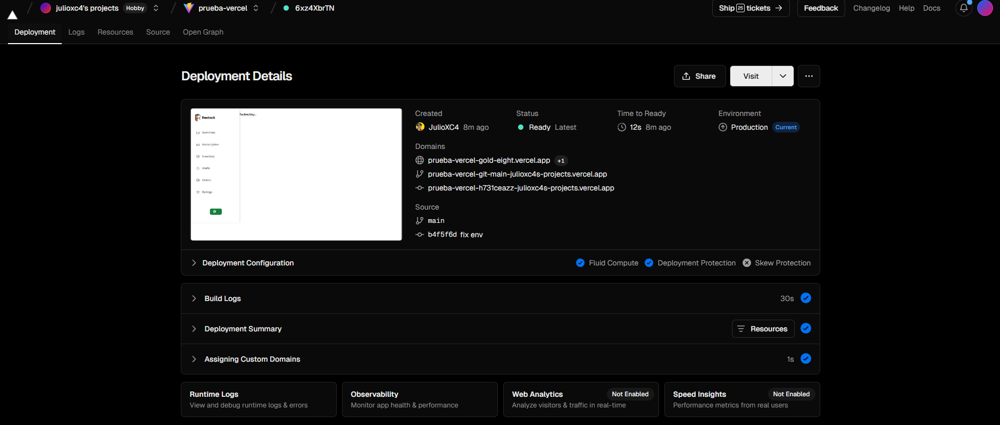
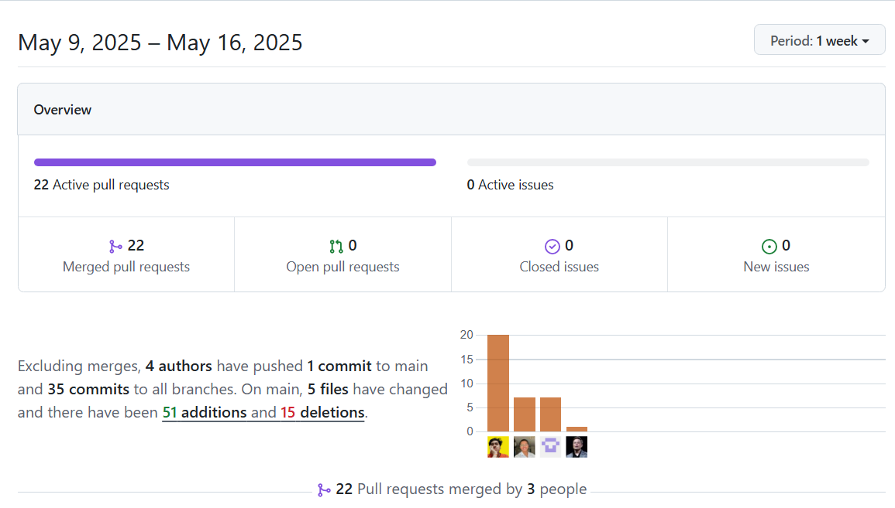
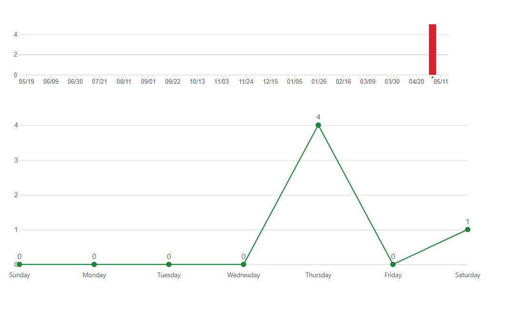
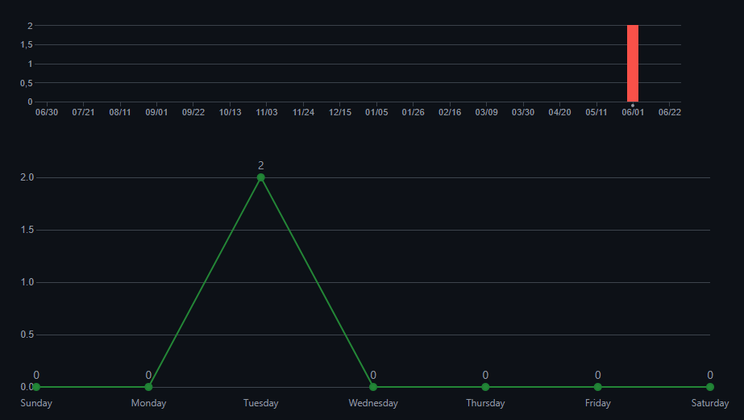

# Capítulo V: Product Implementation, Validation & Deployment

## 5.1 Software Configuration Management

### 5.1.1. Software Development Environment Configuration

A continuación, se listan las herramientas y estándares adoptados por el equipo para el desarrollo colaborativo del sistema:

| Actividad               | Herramienta / Guía                                                                                                                                                               | Propósito                                                                    | Tipo de acceso / Ruta                                                                                                                                                                                               |
| ----------------------- | --------------------------------------------------------------------------------------------------------------------------------------------------------------------------------- | ----------------------------------------------------------------------------- | ------------------------------------------------------------------------------------------------------------------------------------------------------------------------------------------------------------------- |
| Project Management      | Trello Software                                                                                                                                                                   | Seguimiento de backlog, tareas y sprints.                                     | SaaS –[https://trello.com/](https://trello.com/software/jira)                                                                                                                                                         |
| Requirements Management | Gherkin Conventions                                                                                                                                                               | Escritura legible de requisitos con formato Given/When/Then.                  | [https://cucumber.io/docs/gherkin/](https://cucumber.io/docs/gherkin/)                                                                                                                                                 |
| Product UX/UI Design    | Figma                                                                                                                                                                             | Prototipos y diseño responsive.                                              | SaaS –[https://figma.com](https://figma.com)                                                                                                                                                                          |
| Frontend Dev            | HTML, CSS, JavaScript, Vue                                                                                                                                                        | Construcción de la interfaz web.                                             | [https://vuejs.org/guide/introduction.html](https://vuejs.org/guide/introduction.html)                                                                                                                                 |
| Backend Dev             | C# + ASP.NET Core                                                                                                                                                                 | Implementación de servicios y lógica del backend.                           | [https://learn.microsoft.com/en-us/aspnet/core](https://learn.microsoft.com/en-us/aspnet/core)                                                                                                                         |
| IDE                     | Rider + WebStorm                                                                                                                                                                  | Desarrollo, testing y depuración.                                            | [https://www.jetbrains.com/rider](https://www.jetbrains.com/rider) / [https://www.jetbrains.com/webstorm](https://www.jetbrains.com/webstorm)                                                                             |
| Code Standards          | Google HTML/CSS Style Guide, Vue Style Guide, MDN Guidelines, W3C JavaScript Style Guide, Google JavaScript Style Guide, C# Coding Conventions, Microsoft ASP.NET Core Guidelines | Aplicación de buenas prácticas de desarrollo en frontend y backend.         | [https://developer.mozilla.org/](https://developer.mozilla.org/) / [https://learn.microsoft.com/en-us/dotnet/csharp/fundamentals/coding-style](https://learn.microsoft.com/en-us/dotnet/csharp/fundamentals/coding-style) |
| Version Control         | Git + GitHub                                                                                                                                                                      | Control de versiones y trabajo colaborativo.                                  | SaaS –[https://github.com](https://github.com)                                                                                                                                                                        |
| Software Deployment     | Github pages                                                                                                                                                                      | Despliegue continuo de la aplicación para ambientes de prueba y validación. | SaaS –[https://railway.app](https://railway.app) / [https://render.com](https://render.com)                                                                                                                              |
| Software Documentation  | Notion + Postman                                                                                                                                                                  | Documentación técnica del sistema y pruebas de API.                         | SaaS –[https://www.notion.so](https://www.notion.so) / [https://www.postman.com](https://www.postman.com)                                                                                                                |

### 5.1.2 Source Code Management

En esta sección el equipo establece los medios y esquema de organización que aplicará para el seguimiento de modificaciones. Para ello se utilizará **GitHub** como plataforma y sistema de control de versiones.

A continuación se indican los URLs de los repositorios de GitHub para cada producto:

- **Landing Page**: [https://github.com/Aplicaciones-Web-Curso-UPC/UI-Topic-landing](https://github.com/Aplicaciones-Web-Curso-UPC/UI-Topic-landing)
- **Frontend Web Application**: [https://github.com/Aplicaciones-Web-Curso-UPC/UI-Topic-frontend](https://github.com/Aplicaciones-Web-Curso-UPC/UI-Topic-frontend)

### GitFlow Workflow

Se implementará el modelo de ramificación propuesto por Vincent Driessen en su artículo *“A successful Git branching model”*, conocido como **GitFlow**. Este modelo organiza el trabajo en las siguientes ramas:

- `main`: Rama principal, contiene siempre el código en producción.
- `develop`: Rama de desarrollo principal, donde se integran las funcionalidades antes de pasar a producción.
- `feature/*`: Ramas creadas a partir de `develop` para desarrollar nuevas funcionalidades.**Convención de nombres:** `feature/<nombre-corto-descriptivo>`_Ejemplo: `feature/login-auth`_
- `release/*`: Ramas creadas desde `develop` cuando se prepara una nueva versión para producción.**Convención de nombres:** `release/<versión>`_Ejemplo: `release/1.2.0`_
- `hotfix/*`: Ramas creadas desde `main` para corregir errores críticos en producción.
  **Convención de nombres:** `hotfix/<descripción-corta>`
  _Ejemplo: `hotfix/fix-payment-bug`_

### Versionado Semántico

Se aplicará el esquema de **Semantic Versioning 2.0.0**, con el siguiente formato:

- **MAJOR**: Incompatibilidades en la API.
- **MINOR**: Nuevas funcionalidades sin romper compatibilidad.
- **PATCH**: Correcciones de errores menores y ajustes sin afectar funcionalidades.

_Ejemplo de versión:_ `v1.3.2`

### Convenciones de Commits

Se utilizará el estándar de **Conventional Commits** para los mensajes de commits. Esto facilitará la automatización en los procesos de integración continua y generación de changelogs.

**Ejemplos:**

- `feat: add login functionality`
- `fix: correct null pointer exception on user service`
- `chore: update dependencies`

### 5.1.3. Source Code Style Guide & Conventions

#### Frontend (Landing Page - HTML, CSS, JavaScript)

##### Convenciones generales:

- **Idioma**: Todo el código, incluyendo nombres de variables, funciones y clases, está escrito en **inglés**.
- **Indentación**: 2 espacios.
- **Formato de archivos**: `.html`, `.css`, `.js`
- **Estilo de código adoptado**:
  - [W3Schools HTML Style Guide](https://www.w3schools.com/html/html5_syntax.asp)
  - [Google HTML/CSS Style Guide](https://google.github.io/styleguide/htmlcssguide.html)

##### Nomenclatura:

- **Clases CSS**: `kebab-case` (ej. `main-container`)
- **IDs HTML**: `camelCase` (ej. `mainContent`)
- **Variables JS**: `camelCase` (ej. `userName`)
- **Funciones JS**: `camelCase` (ej. `handleClick()`)

#### Frontend Web App (Vue.js + JavaScript)

##### Convenciones generales:

- **Idioma**: Código completamente en **inglés**.
- **Estructura de carpetas**: Segregación por módulos y componentes.
- **Indentación**: 2 espacios.
- **Formato de archivos**: `.vue`, `.js`, `.css`

##### Estilo de código adoptado:

- [Vue.js Style Guide (Oficial)](https://vuejs.org/guide/reusability/style-guide.html)
- [Airbnb JavaScript Style Guide](https://github.com/airbnb/javascript)

##### Nomenclatura:

- **Componentes Vue**: `PascalCase` (ej. `UserProfile.vue`)
- **Variables y funciones JS**: `camelCase` (ej. `userName`, `handleSubmit()`)
- **Archivos**: `kebab-case` (ej. `user-profile.vue`)
- **Props**: `camelCase` en JavaScript, `kebab-case` en templates HTML (ej. prop: `userProfile`, uso: `user-profile`)
- **Eventos personalizados**: `kebab-case` (ej. `user-logged-in`)
- **Clases CSS**: `kebab-case`

---

#### Backend (ASP.NET + C#)

##### Convenciones generales:

- **Idioma**: Código y documentación interna en **inglés**.
- **Indentación**: 4 espacios.
- **Formato de archivos**: `.cs`

##### Estilo de código adoptado:

- [Microsoft C# Coding Conventions](https://learn.microsoft.com/en-us/dotnet/csharp/fundamentals/coding-style/coding-conventions)
- [ASP.NET Core Best Practices](https://learn.microsoft.com/en-us/aspnet/core/fundamentals/index)

##### Nomenclatura:

- **Clases**: `PascalCase` (ej. `UserService`)
- **Métodos**: `PascalCase` (ej. `GetUserById()`)
- **Variables locales**: `camelCase` (ej. `userRepository`)
- **Constantes**: `PascalCase` o `UPPER_SNAKE_CASE` (según si es `const` o `readonly static`) (ej. `MaxUsers`)
- **Interfaces**: `IPascalCase` (ej. `IUserRepository`)
- **Endpoints (URLs)**: `kebab-case` (ej. `/api/user-profile`)
- **Namespaces**: `PascalCase` y estructurados jerárquicamente (ej. `ProjectName.ModuleName.FeatureName`)

### 5.1.4 Software Deployment Configuration

Para la Landing Page desarrollada en HTML, CSS y JavaScript, la configuración del despliegue en GitHub Pages se define de la siguiente manera:

**Repositorio de Código Fuente**

Se debe crear un repositorio en GitHub y subir todos los archivos del proyecto (HTML, CSS, JS).
Es obligatorio que el archivo `index.html` esté ubicado en la raíz del repositorio para poder realizar el despliegue correctamente.

#### **Frontend Principal (Vue + PrimeVue)**

El frontend principal de la aplicación ha sido desarrollado utilizando **Vue 3** junto con **PrimeVue** como librería de componentes. El despliegue lo realizamos mediante **Vercel**.

**Pasos para el despliegue**:

1. Ejecutar el comando de compilación:
   npm run build
2. Esto generará una carpeta dist/ con todos los archivos listos para producción.
3. Subir el contenido de la carpeta dist y conectar el repositorio original a Vercel.

## 5.2 Landing Page, Services & Applications Implementation

### 5.2.1 Sprint 1

#### 5.2.1.1. Sprint Planning 1

A continuación, se presenta la planificación correspondiente a nuestro Sprint 1, el cual tiene como enfoque principal el desarrollo de la landing page de Restock. En esta etapa inicial, el equipo definió el objetivo del sprint, seleccionó las historias de usuario más relevantes y estableció los entregables clave que permitirán construir una primera versión funcional y visualmente atractiva de la página. Esta planificación busca asegurar un entendimiento compartido entre todos los miembros del equipo y sentar las bases para comunicar eficazmente el valor de la plataforma a los usuarios potenciales.

| Sprint #                             | Sprint 1                                                                                                                                                                                                                                                                                                                                                                                                                                                                                                                              |
| ------------------------------------ | ------------------------------------------------------------------------------------------------------------------------------------------------------------------------------------------------------------------------------------------------------------------------------------------------------------------------------------------------------------------------------------------------------------------------------------------------------------------------------------------------------------------------------------- |
| **Sprint Planning Background** |                                                                                                                                                                                                                                                                                                                                                                                                                                                                                                                                       |
| Date                                 | 2025-04-23                                                                                                                                                                                                                                                                                                                                                                                                                                                                                                                            |
| Time                                 | 19:00 pm (GMT-5)                                                                                                                                                                                                                                                                                                                                                                                                                                                                                                                      |
| Location                             | Modalidad remota mediante la plataforma Discord                                                                                                                                                                                                                                                                                                                                                                                                                                                                                       |
| Prepared By                          | Shapiama Rivera, Gabriela Nicole                                                                                                                                                                                                                                                                                                                                                                                                                                                                                                      |
| Attendees (to planning meeting)      | Avendaño Balarezo, Williams Eduardo / Castro Alejos / Julio, Guerra Perez, José Jahaziel / Guzmán Cabrejos, Yaku Mateo / Shapiama Rivera, Gabriela Nicole                                                                                                                                                                                                                                                                                                                                                                          |
| Sprint 0 Review Summary              | Dado que este es el sprint inicial, no se presenta un resumen del sprint anterior.                                                                                                                                                                                                                                                                                                                                                                                                                                                    |
| Sprint 0 Retrospective Summary       | Dado que este es el sprint inicial, no se presenta una retroalimentación del sprint anterior.                                                                                                                                                                                                                                                                                                                                                                                                                                        |
| **Sprint Goal & User Stories** |                                                                                                                                                                                                                                                                                                                                                                                                                                                                                                                                       |
| Sprint 1 Goal                        | Nos enfocamos en implementar la estructura principal y las funcionalidades clave de la landing page pública de Restock. Creemos que esto aportará una percepción más sólida del producto y despertará mayor interés entre los usuarios potenciales, al comunicar de forma clara el valor y los beneficios de la plataforma. Esto se confirmará cuando los visitantes puedan navegar de manera fluida por la página, comprendan fácilmente qué ofrece Restock y muestren intención de interactuar o registrarse. |
| Sprint 1 Velocity                    | 27 puntos                                                                                                                                                                                                                                                                                                                                                                                                                                                                                                                             |
| Sum of Story Points                  | 27 puntos                                                                                                                                                                                                                                                                                                                                                                                                                                                                                                                             |

#### 5.2.1.2 Aspect Leaders and Collaborators

#### 5.2.1.3 Sprint Backlog 1

El objetivo principal de este Sprint es diseñar, implementar y validar las secciones del landing page, asegurando una navegación fluida, una experiencia responsiva en todos los dispositivos y funcionalidades críticas como registro, inicio de sesión y recuperación de contraseña. Se busca garantizar que el usuario final pueda interactuar de manera sencilla y eficiente con la plataforma, mejorando su satisfacción y promoviendo el cumplimiento de los objetivos de negocio.

**screenshot del Board**

https://trello.com/b/75YJ9YcB/sprint-backlog-2

 

| User Story ID | User Story Title                                                | Task ID | Task Title                | Task Description                                                                                          | Estimated Hours |
| ------------- | --------------------------------------------------------------- | ------- | ------------------------- | --------------------------------------------------------------------------------------------------------- | --------------- |
| US-08         | Mostrar Mensaje de Valor en la Sección Principal               | T001    | Diseñar sección         | Crear diseño visual para 'mostrar mensaje de valor en la sección principal'.                            | 1/2 h           |
|               |                                                                 | T002    | Implementar funcionalidad | Codificar el componente necesario para 'mostrar mensaje de valor en la sección principal'.               | 1h              |
|               |                                                                 | T003    | Realizar pruebas          | Verificar que 'mostrar mensaje de valor en la sección principal' funcione correctamente.                 | 1/2h            |
| US-09         | Mostrar Beneficios Segmentados por Tipo de Usuario              | T004    | Diseñar sección         | Crear diseño visual para 'mostrar beneficios segmentados por tipo de usuario'.                           | 1/2h            |
|               |                                                                 | T005    | Implementar funcionalidad | Codificar el componente necesario para 'mostrar beneficios segmentados por tipo de usuario'.              | 1h              |
|               |                                                                 | T006    | Realizar pruebas          | Verificar que 'mostrar beneficios segmentados por tipo de usuario' funcione correctamente.                | 1/2h            |
| US-10         | Incluir Llamados a la Acción (CTA) con Redirección y Descarga | T007    | Diseñar sección         | Crear diseño visual para 'incluir llamados a la acción (cta) con redirección y descarga'.              | 1/2h            |
|               |                                                                 | T008    | Implementar funcionalidad | Codificar el componente necesario para 'incluir llamados a la acción (cta) con redirección y descarga'. | 1h              |
|               |                                                                 | T009    | Realizar pruebas          | Verificar que 'incluir llamados a la acción (cta) con redirección y descarga' funcione correctamente.   | 1/2h            |
| US-05         | Visualización de la barra de navegación                       | T010    | Diseñar sección         | Crear diseño visual para 'visualización de la barra de navegación'.                                    | 1/2h            |
|               |                                                                 | T011    | Implementar funcionalidad | Codificar el componente necesario para 'visualización de la barra de navegación'.                       | 1h              |
|               |                                                                 | T012    | Realizar pruebas          | Verificar que 'visualización de la barra de navegación' funcione correctamente.                         | 1/2h            |
| US-06         | Visualización de pasos del funcionamiento                      | T013    | Diseñar sección         | Crear diseño visual para 'visualización de pasos del funcionamiento'.                                   | 1/2h            |
|               |                                                                 | T014    | Implementar funcionalidad | Codificar el componente necesario para 'visualización de pasos del funcionamiento'.                      | 1h              |
|               |                                                                 | T015    | Realizar pruebas          | Verificar que 'visualización de pasos del funcionamiento' funcione correctamente.                        | 1/2h            |
| US-07         | Alternativa con video explicativo                               | T016    | Diseñar sección         | Crear diseño visual para 'alternativa con video explicativo'.                                            | 1/2h            |
|               |                                                                 | T017    | Implementar funcionalidad | Codificar el componente necesario para 'alternativa con video explicativo'.                               | 1h              |
|               |                                                                 | T018    | Realizar pruebas          | Verificar que 'alternativa con video explicativo' funcione correctamente.                                 | 1/2h            |
| US-04         | Visualización de footer en landing page                        | T019    | Diseñar sección         | Crear diseño visual para 'visualización de footer en landing page'.                                     | 1/2h            |
|               |                                                                 | T020    | Implementar funcionalidad | Codificar el componente necesario para 'visualización de footer en landing page'.                        | 2h              |
|               |                                                                 | T021    | Realizar pruebas          | Verificar que 'visualización de footer en landing page' funcione correctamente.                          | 1/2h            |
| US-01         | Ver testimonios de clientes                                     | T022    | Diseñar sección         | Crear diseño visual para 'ver testimonios de clientes'.                                                  | 2h              |
|               |                                                                 | T023    | Implementar funcionalidad | Codificar el componente necesario para 'ver testimonios de clientes'.                                     | 1/2h            |
|               |                                                                 | T024    | Realizar pruebas          | Verificar que 'ver testimonios de clientes' funcione correctamente.                                       | 1h              |
| US-02         | Consultar Preguntas Frecuentes                                  | T025    | Diseñar sección         | Crear diseño visual para 'consultar preguntas frecuentes'.                                               | 1/2h            |
|               |                                                                 | T026    | Implementar funcionalidad | Codificar el componente necesario para 'consultar preguntas frecuentes'.                                  | 1h              |
|               |                                                                 | T027    | Realizar pruebas          | Verificar que 'consultar preguntas frecuentes' funcione correctamente.                                    | 1/2h            |
| US-03         | Enviar Formulario de Contacto                                   | T028    | Diseñar sección         | Crear diseño visual para 'enviar formulario de contacto'.                                                | 1h              |
|               |                                                                 | T029    | Implementar funcionalidad | Codificar el componente necesario para 'enviar formulario de contacto'.                                   | 1/2h            |
|               |                                                                 | T030    | Realizar pruebas          | Verificar que 'enviar formulario de contacto' funcione correctamente.                                     | 1h              |
| US-16         | Navegación fluida entre secciones                              | T031    | Diseñar sección         | Crear diseño visual para 'navegación fluida entre secciones'.                                           | 1/2h            |
|               |                                                                 | T032    | Implementar funcionalidad | Codificar el componente necesario para 'navegación fluida entre secciones'.                              | 1h              |
|               |                                                                 | T033    | Realizar pruebas          | Verificar que 'navegación fluida entre secciones' funcione correctamente.                                | 1/2h            |
| US-13         | Visualización responsive en desktop                            | T034    | Diseñar sección         | Crear diseño visual para 'visualización responsive en desktop'.                                         | 1/2h            |
|               |                                                                 | T035    | Implementar funcionalidad | Codificar el componente necesario para 'visualización responsive en desktop'.                            | 1h              |
|               |                                                                 | T036    | Realizar pruebas          | Verificar que 'visualización responsive en desktop' funcione correctamente.                              | 1/2h            |
| US-15         | Visualización responsive en dispositivos móviles              | T037    | Diseñar sección         | Crear diseño visual para 'visualización responsive en dispositivos móviles'.                           | 1h              |
|               |                                                                 | T038    | Implementar funcionalidad | Codificar el componente necesario para 'visualización responsive en dispositivos móviles'.              | 1/2h            |
|               |                                                                 | T039    | Realizar pruebas          | Verificar que 'visualización responsive en dispositivos móviles' funcione correctamente.                | 1/2h            |
| US-14         | Visualización responsive en tablet                             | T040    | Diseñar sección         | Crear diseño visual para 'visualización responsive en tablet'.                                          | 1/2h            |
|               |                                                                 | T041    | Implementar funcionalidad | Codificar el componente necesario para 'visualización responsive en tablet'.                             | 1h              |
|               |                                                                 | T042    | Realizar pruebas          | Verificar que 'visualización responsive en tablet' funcione correctamente.                               | 1/2h            |
| US-17         | Registro                                                        | T043    | Diseñar sección         | Crear diseño visual para 'registro'.                                                                     | 2h              |
|               |                                                                 | T044    | Implementar funcionalidad | Codificar el componente necesario para 'registro'.                                                        | 2h              |
|               |                                                                 | T045    | Realizar pruebas          | Verificar que 'registro' funcione correctamente.                                                          | 1h              |
| US-18         | Inicio de sesión                                               | T046    | Diseñar sección         | Crear diseño visual para 'inicio de sesión'.                                                            | 2h              |
|               |                                                                 | T047    | Implementar funcionalidad | Codificar el componente necesario para 'inicio de sesión'.                                               | 1h              |
|               |                                                                 | T048    | Realizar pruebas          | Verificar que 'inicio de sesión' funcione correctamente.                                                 | 1h              |
| US-19         | Recuperación de contraseña                                    | T049    | Diseñar sección         | Crear diseño visual para 'recuperación de contraseña'.                                                 | 2h              |
|               |                                                                 | T050    | Implementar funcionalidad | Codificar el componente necesario para 'recuperación de contraseña'.                                    | 1/2h            |
|               |                                                                 | T051    | Realizar pruebas          | Verificar que 'recuperación de contraseña' funcione correctamente.                                      | 1h              |

#### 5.2.1.4 Development Evidence for Sprint Review

En esta sección se presentan los avances de implementación realizados durante el Sprint 1, el cual tuvo como objetivo principal construir la Landing Page de la plataforma Restock.
Se desarrollaron múltiples secciones, aplicando principios de diseño responsivo, buenas prácticas de codificación y asegurando consistencia con el estilo visual definido para el proyecto. Los entregables principales de este sprint incluyen la creación de secciones como About Us, Benefits, Testimonials, FAQ, Tutorial, Contact, Footer, además de la implementación de mejoras de SEO, formularios de acceso, y enlaces de descarga.

| Repository                        | Branch                   | Commit Id | Commit Message                                                        | Commit Message Body                                                                      | Commited on (Date) |
| --------------------------------- | ------------------------ | --------- | --------------------------------------------------------------------- | ---------------------------------------------------------------------------------------- | ------------------ |
| GabrielaShapiama/UI-Topic-landing | feature/access           | 936d1db   | feat(access): add access forms.                                       | Implemented the login and registration forms with appropriate field validations.         | 27-04-2025         |
| Yaku Guzman/UI-Topic-landing      | feature/footer-section   | fc81879   | feat(footer-section): add footer section, footer css and icons        | Designed and styled the footer component, added navigation links and social media icons. | 27-04-2025         |
| Yaku Guzman/UI-Topic-landing      | feature/contacto-section | c4988c0   | feat(contacto-section): add contact section, contact css              | Developed the contact form section, added input fields and styling for responsiveness.   | 27-04-2025         |
| Yaku Guzman/UI-Topic-landing      | feature/tutorial-section | 1bda3eb   | feat(tutorial-section): add tutorial section, tutorial css and images | Created the tutorial guide section with step-by-step images and responsive layout.       | 27-04-2025         |
| Williams/UI-Topic-landing         | feature/descargar        | 219e86a   | feat(descargar): adding download section(html,css)                    | Built the download section including download buttons and responsive design.             | 27-04-2025         |
| Williams/UI-Topic-landing         | feature/preguntas        | bf2f8f9   | fix(preguntas): updating frecuent questions(html,css,js)              | Updated the FAQ section to improve its structure, styling, and dynamic functionality.    | 27-04-2025         |
| Williams/UI-Topic-landing         | feature/preguntas        | c2882d0   | feat(preguntas): adding frecuent questions(html,css)                  | Added the frequently asked questions section with collapsible answers.                   | 27-04-2025         |
| Williams/UI-Topic-landing         | feature/testimonios      | 4be7138   | feat(testimonios): adding testimonios(html,css)                       | Developed the testimonials section with client feedback and applied custom styles.       | 27-04-2025         |
| jahazielgg/UI-Topic-landing       | feature/benefits         | 34e3804   | feat(benefits): add benefits section.                                 | Created the benefits section highlighting key features and advantages.                   | 27-04-2025         |
| jahazielgg/UI-Topic-landing       | feature/about-us-section | ac7366b   | feat(about-us): add about us section.                                 | Implemented the about us section including company mission and vision statements.        | 27-04-2025         |
| jahazielgg/UI-Topic-landing       | feature/hero-section     | f9716bd   | feat(hero-section): add hero section.                                 | Built the hero section with main headline, supporting text, and CTA button.              | 27-04-2025         |
| jahazielgg/UI-Topic-landing       | feature/develop          | e10bc23   | chore: initial commit.                                                | Set up the initial project structure and configurations for the landing page.            | 27-04-2025         |
| jahazielgg/UI-Topic-landing       | main                     | 31a94bc   | Initial commit                                                        | Initialized the repository with basic project files.                                     | 27-04-2025         |

##### Productos según alcance del Sprint

###### Landing Page

Durante el Sprint 1 se implementó la Landing Page de Restock. Los principales avances fueron:

- Diseño responsivo adaptado a diferentes tamaños de pantalla.
- Creación de secciones: Hero, Sobre Nosotros, Beneficios, Testimonios, Preguntas Frecuentes, Tutorial, Contacto y Footer.
- Aplicación de buenas prácticas de accesibilidad (uso de etiquetado semántico, contraste adecuado).
- Optimización inicial para motores de búsqueda (SEO básico) con metaetiquetas y atributos relevantes.
- Implementación de navegación fluida entre secciones mediante anclas y smooth scrolling.
- Validación de compatibilidad en navegadores modernos y dispositivos móviles.

#### 5.2.1.5 Execution Evidence for Sprint Review

A continuación, se presenta el video de la landing page. Este muestra la interacción principal de los usuarios con la plataforma, destacando los flujos de navegación, diseño responsivo y la estructura general de la aplicación.

**Video de landing page:**

[https://shorturl.at/sFmpy](https://shorturl.at/sFmpy)

#### 5.2.1.6 Services Documentation Evidence for Sprint Review

Durante este sprint se completó el diseño e implementación del Landing Page del sistema, el cual forma parte del acceso inicial al sistema y constituye un punto de entrada fundamental para los usuarios. Aunque no se implementaron endpoints tradicionales de tipo REST en este sprint, se documenta a continuación la URL del recurso publicado, junto con evidencia de despliegue, interacción y commits relacionados.

**Descripción del Logro:**

-Implementación del Landing Page estático.

-Deployment del landing page.

##### Recursos del Sprint

| Recurso      | Acción implementada   | Método HTTP | URL / Endpoint                                                 | Link de repositorio                                                |
| ------------ | ---------------------- | ------------ | -------------------------------------------------------------- | ------------------------------------------------------------------ |
| Landing Page | Visualización inicial | GET          | https://aplicaciones-web-curso-upc.github.io/UI-Topic-landing/ | https://github.com/Aplicaciones-Web-Curso-UPC/UI-Topic-landing.git |

**Documentacion**
Commit 4d6b92f: Initial commit

#### 5.2.1.7. Software Deployment Evidence for Sprint Review.

Durante este Sprint, se realizaron actividades de despliegue de la Landing Page utilizando GitHub Pages como plataforma de hosting. A continuación, se detallan los pasos ejecutados:

1- Se accedió a la sección Settings del repositorio.
Dentro de Pages, se seleccionó la rama (develop) y la carpeta (root) desde la cual GitHub Pages debía publicar el sitio.
Se guardaron los cambios para activar la publicación automática.

2- por default ya esta activado el https

3- En la seccion "All workflows" se puede ver que la app se esta deployando.

4- El landing page fue exitosamente deployado

5- Se obtuvo y verificó la URL pública proporcionada por GitHub Pages.

#### 5.2.1.8 Team Collaboration Insights during Sprint

##### Desarrollo de las Actividades de Implementación

Durante el Sprint 1, el equipo de Restock se enfocó en el desarrollo de la **Landing Page**.
Las actividades de implementación se llevaron a cabo de la siguiente manera:

- Se crearon ramas específicas para cada sección o funcionalidad (`feature/[nombre-de-seccion]`), permitiendo un trabajo paralelo organizado.
- Cada miembro del equipo asumió la responsabilidad de desarrollar una o más secciones de la Landing Page.
- Se realizaron commits frecuentes, registrando avances de manera continua y detallada.
- Las funcionalidades desarrolladas se integraron mediante Pull Requests hacia la rama `develop`.
- Se mantuvo una comunicación constante mediante la plataforma Discord para coordinar avances y resolver dudas en tiempo real.
- Se aplicaron buenas prácticas de programación, control de versiones y colaboración en equipo.

Gracias a esta organización, se logró cumplir de manera efectiva el objetivo del sprint, garantizando que todos los integrantes contribuyeran de forma activa en el desarrollo de la Landing Page.

##### Evidencia de Colaboración en GitHub

Se presenta a continuación la captura de los insights del repositorio de GitHub, correspondiente al Sprint 1:

**Insights:**

- **37 Pull Requests** fusionados correctamente.
- **5 autores** contribuyendo al repositorio.
- **56 commits** realizados en el periodo del Sprint.
- Participación activa de todos los miembros asignados al desarrollo de la Landing Page.

### 5.2.2 Sprint 2

#### 5.2.2.1. Sprint Planning 2

| Sprint #                             | Sprint 2                                                                                                                                                                                                                                                                                                                                                                                                                                                                                                                                                                                                                                                                                         |
| ------------------------------------ | ------------------------------------------------------------------------------------------------------------------------------------------------------------------------------------------------------------------------------------------------------------------------------------------------------------------------------------------------------------------------------------------------------------------------------------------------------------------------------------------------------------------------------------------------------------------------------------------------------------------------------------------------------------------------------------------------ |
| **Sprint Planning Background** |                                                                                                                                                                                                                                                                                                                                                                                                                                                                                                                                                                                                                                                                                                  |
| Date                                 | 2025-05-05                                                                                                                                                                                                                                                                                                                                                                                                                                                                                                                                                                                                                                                                                       |
| Time                                 | 08:00 pm (GMT-5)                                                                                                                                                                                                                                                                                                                                                                                                                                                                                                                                                                                                                                                                                 |
| Location                             | Modalidad remota mediante la plataforma Discord                                                                                                                                                                                                                                                                                                                                                                                                                                                                                                                                                                                                                                                  |
| Prepared By                          | Guzmán Cabrejos, Yaku Mateo                                                                                                                                                                                                                                                                                                                                                                                                                                                                                                                                                                                                                                                                     |
| Attendees (to planning meeting)      | Avendaño Balarezo, Williams Eduardo / Castro Alejos, Julio / Guerra Perez, José Jahaziel / Guzmán Cabrejos, Yaku Mateo / Shapiama Rivera, Gabriela Nicole                                                                                                                                                                                                                                                                                                                                                                                                                                                                                                                                     |
| Sprint 1 Review Summary              | Durante el Sprint 1 se logró implementar casi en su totalidad la Landing Page del sistema Restock, desarrollando secciones  clave como el header, footer, sección de beneficios y preguntas frecuentes,  así como la integración inicial de estilos globales y tipografía. Quedó faltante  la funcionalidad de cambio de idioma, la cual será prioridad para el siguiente  sprint. El equipo cumplió con los entregables establecidos, respetando el diseño  de mockups y la guía de estilos. Se identificaron oportunidades de mejora en  la velocidad de desarrollo y gestión de tiempos.                                                        |
| Sprint 1 Retrospective Summary       | Durante el Sprint 1, el equipo logró avanzar de forma coordinada y efectiva en el desarrollo de la landing page, sin enfrentar mayores dificultades. Cada integrante  cumplió puntualmente con las secciones asignadas, lo que permitió avanzar según lo planificado. La adopción de convenciones comunes en el código y el diseño contribuyó a mantener la coherencia del producto y facilitó la integración entre partes. Como mejora para el siguiente sprint, se acordó implementar revisiones diarias (daily reviews) que permitan alinear mejor los avances, detectar bloqueos tempranos y mejorar la comunicación continua entre miembros. |
| **Sprint Goal & User Stories** |                                                                                                                                                                                                                                                                                                                                                                                                                                                                                                                                                                                                                                                                                                  |
| Sprint 2 Goal                        | Nuestro enfoque está en  brindar información clara y detallada a los visitantes de la plataforma, así como habilitar funcionalidades clave para los usuarios del sistema  interno. Creemos que esto proporciona  mayor comprensión del propósito de la solución  a los visitantes y mejora la eficiencia operativa del personal de los restaurantes. Esto  se confirmará cuando  los visitantes puedan explorar contenido relevante desde el acceso  público, y los usuarios autenticados naveguen por el panel principal y accedan a al menos  tres módulos funcionales del sistema.                                                                     |
| Sprint 2 Velocity                    | 93                                                                                                                                                                                                                                                                                                                                                                                                                                                                                                                                                                                                                                                                                               |
| Sum of Story Points                  | 91                                                                                                                                                                                                                                                                                                                                                                                                                                                                                                                                                                                                                                                                                               |

#### 5.2.2.2 Aspect Leaders and Collaborators

##### Aspect Leaders and Collaborators

Durante el Sprint 2,  se ha definido el desarrollo e integración de los módulos principales del frontend de la aplicación web interna  Restock , abarcando funcionalidades clave como la gestión de productos, pedidos, inventario y compras. Estas implementaciones buscan optimizar los procesos internos y mejorar la trazabilidad del inventario, brindando mayor eficiencia a los administradores de restaurantes y su personal.

Con el fin de mantener una coordinación efectiva y una comunicación fluida entre los integrantes del equipo, se estructuró la matriz de liderazgo y colaboración (LACX), donde se asignó un líder (L) encargado de cada funcionalidad y colaboradores (C) que brindan apoyo en su implementación.

| Team Member (Last Name, First Name) | GitHub Username    | Configuración de perfil | Panel de suscripción y planes | Alertas para proveedores | Calificaciones de proveedores | Barra de navegación | Alertas para restaurantes | Registro de recetas | Registro de ventas de restaurantes | Registro de proveedores desde restaurantes | Inventario de insumos | Pedidos a proveedores | Ordenes de proveedores | Resumen de datos |
| :---------------------------------- | :----------------- | :----------------------- | :----------------------------- | :----------------------- | :---------------------------- | :------------------- | :------------------------ | :------------------ | :--------------------------------- | :----------------------------------------- | :-------------------- | :--------------------- | :--------------------- | :--------------- |
| Vendaño Balarezo, Williams Eduardo | dev-willy-code     | C                        | L                              | L                        | L                             | C                    | C                         | C                   | L                                  | C                                          | C                     | C                      | C                      | C                |
| Castro Alejos, Julio                | JulioXC4           | C                        | C                              | C                        | C                             | C                    | C                         | C                   | C                                  | C                                          | L                     | C                      | C                      | C                |
| Guerra Perez, José Jahaziel        | jahazielgg         | L                        | C                              | C                        | C                             | L                    | L                         | L                   | C                                  | C                                          | C                     | C                      | C                      | C                |
| Guzmán Cabrejos, Yaku Mateo        | yak-cod            | C                        | C                              | C                        | C                             | C                    | C                         | C                   | C                                  | L                                          | C                     | C                      | C                      | L                |
| Shapiama Rivera, Gabriela Nicole    | GabrielaShapiama28 | C                        | C                              | C                        | C                             | C                    | C                         | C                   | C                                  | C                                          | C                     | L                      | L                      | C                |

#### 5.2.2.3 Sprint Backlog 2

El objetivo principal de este Sprint es desarrollar la interfaz frontend de los dashboards para **administradores de restaurantes y proveedores**, enfocándose en una estructura clara, navegación eficiente y visualización adecuada de datos críticos.

Además, se realizaron mejoras en el *landing page*, incluyendo la implementación de un **toggle de idioma** (inglés/español) y la incorporación de **atributos de accesibilidad** como `aria-label` y `lang`, asegurando mayor inclusión y cumplimiento de estándares web.

[[https://shorturl.at/X5KyX](https://shorturl.at/X5KyX)]

#### 5.2.2.4 Development Evidence for Sprint Review

En esta sección se presentan los avances realizados durante el Sprint 2, centrado en el desarrollo de los módulos principales de la aplicación web interna de Restock.
El objetivo principal fue implementar funcionalidades claves para la gestión de productos, pedidos, inventario y compras, con el fin de mejorar la eficiencia operativa y la trazabilidad de los recursos dentro de los restaurantes.

Durante este sprint se avanzó en la autenticación de usuarios, el diseño del panel principal y la implementación inicial de tres módulos funcionales clave.

##### Commits Relevantes

| Repository                         | Branch                   | Commit Id | Commit Message                                       | Commit Message Body                                                          | Commited on (Date) |
| ---------------------------------- | ------------------------ | --------- | ---------------------------------------------------- | ---------------------------------------------------------------------------- | ------------------ |
| jahazielgg/UI-Topic-frontend       | feature/auth-module      | a23f45d   | feat(auth): implement login and registration logic   | Creación de flujo de autenticación con validaciones y redirecciones.       | 04-05-2025         |
| GabrielaShapiama/UI-Topic-frontend | feature/dashboard-layout | b76a2fc   | feat(dashboard): add layout and navigation           | Estructura base del dashboard con navegación lateral y superior.            | 05-05-2025         |
| Williams/UI-Topic-frontend         | feature/inventory-module | c98f312   | feat(inventory): initial inventory module            | Implementación inicial de la vista de inventario con formulario de insumos. | 06-05-2025         |
| Yaku Guzman/UI-Topic-frontend      | feature/orders-module    | d12e7af   | feat(orders): orders module view and status tracking | Desarrollo de listado de pedidos y seguimiento de estado.                    | 07-05-2025         |
| jahazielgg/UI-Topic-frontend       | feature/products-module  | e4501aa   | feat(products): create product management UI         | Vista para gestión de productos del restaurante y filtros por proveedor.    | 07-05-2025         |
| GabrielaShapiama/UI-Topic-frontend | feature/sidebar          | f12cbb9   | feat(ui): add sidebar navigation                     | Integración de barra lateral con íconos y secciones principales.           | 08-05-2025         |
| Williams/UI-Topic-frontend         | main                     | 1349abc   | chore: merge feature branches to main                | Integración de módulos principales al branch principal.                    | 08-05-2025         |

#### 5.2.2.5 Execution Evidence for Sprint Review

A continuación, se presenta el video del frontend de la aplicación web interna. Este demuestra la interacción de los usuarios autenticados con los módulos principales del sistema, incluyendo la navegación por el sidebar, la gestión de productos, el seguimiento de alertas y el control de inventario.

**Video del frontend:** 

 
[Enlace al video](https://upcedupe-my.sharepoint.com/:v:/g/personal/u202021885_upc_edu_pe/ETDVDbf3CyRHspaBM0QOKCwBJu3DhOq9j9Un5OmGHZvtHA?e=4b2Tin&nav=eyJyZWZlcnJhbEluZm8iOnsicmVmZXJyYWxBcHAiOiJTdHJlYW1XZWJBcHAiLCJyZWZlcnJhbFZpZXciOiJTaGFyZURpYWxvZy1MaW5rIiwicmVmZXJyYWxBcHBQbGF0Zm9ybSI6IldlYiIsInJlZmVycmFsTW9kZSI6InZpZXcifX0%3D)

#### 5.2.2.6 Services Documentation Evidence for Sprint Review

Durante este sprint se completó al 100% el desarrollo del Landing Page del sistema, consolidando su estructura visual, diseño responsivo, traducción multilenguaje y funcionalidades de navegación. Asimismo, se avanzó de forma significativa en la construcción del frontend del sistema, incluyendo componentes claves como el menú lateral, el dashboard inicial, el módulo de gestión de insumos y la arquitectura modular en Vue.js bajo DDD (Domain-Driven Design).

Aunque no se desplegaron endpoints REST aún, se documentan a continuación los recursos y avances relevantes del sprint, junto con evidencia de despliegue y repositorio de código.

**Descripción del Logro:**

- Finalización del Landing Page (100%).
- Implementación completa de diseño responsivo, i18n, y redirecciones funcionales.
- Estructura de frontend modular iniciada (menu sidebar, dashboard y componentes base).
- Aplicación de buenas prácticas de organización por bounded contexts en Vue.
- Integración visual basada en PrimeVue, PrimeFlex y PrimeIcons.

#### 5.2.2.7 Software Deployment Evidence for Sprint Review

Durante este Sprint, se realizaron las actividades de despliegue del frontend de la aplicación web desarrollada con Vue 3 y PrimeVue utilizando la plataforma **Vercel**. A continuación, se detallan los pasos ejecutados:

1. Se accedió a [https://vercel.com](https://vercel.com) e inició sesión con una cuenta de GitHub.
   Luego, se seleccionó la opción **"Add New Project"** para importar el repositorio `UI-Topic-frontend`.

2. Se seleccionó el repositorio `UI-Topic-frontend` y se configuró el proyecto.
   Vercel detectó automáticamente que se trataba de un proyecto Vue 3, por lo que sugirió las configuraciones por defecto para el build.

3. Se verificaron las configuraciones:

- **Framework**: Vue.js
- **Build Command**: `npm run build`
- **Output Directory**: `dist`

Se procedió a desplegar haciendo clic en **"Deploy"**.

4. El proceso de build y despliegue fue iniciado por Vercel, mostrando en tiempo real los logs del pipeline.

5. Una vez finalizado el despliegue, se mostró la URL pública de acceso a la aplicación.
   Se probó exitosamente el funcionamiento de la aplicación en dicha URL.

[https://ui-topic-frontend.vercel.app/](https://ui-topic-frontend.vercel.app/)

#### 5.2.2.8 Team Collaboration Insights during Sprint.

Se crearon ramas específicas para cada sección o funcionalidad (feature/[nombre-de-seccion]), permitiendo un trabajo paralelo organizado.
Cada miembro del equipo asumió la responsabilidad de desarrollar una o más secciones del Frontend.
Se realizaron commits frecuentes, registrando avances de manera continua y detallada.
Las funcionalidades desarrolladas se integraron mediante Pull Requests hacia la rama develop.
Se mantuvo una comunicación constante mediante la plataforma Discord para coordinar avances y resolver dudas en tiempo real.
Se aplicaron buenas prácticas de programación, control de versiones y colaboración en equipo.

##### **Analíticos de colaboración**

##### **Analíticos de commits de GitHub**

### Recursos del Sprint

| Recurso              | Acción implementada                                | Método HTTP | URL / Endpoint                                                 | Link de repositorio                                             |
| -------------------- | --------------------------------------------------- | ------------ | -------------------------------------------------------------- | --------------------------------------------------------------- |
| Landing Page         | Visualización completa y funcional del landing     | GET          | https://aplicaciones-web-curso-upc.github.io/UI-Topic-landing/ | https://github.com/Aplicaciones-Web-Curso-UPC/UI-Topic-landing  |
| UI del sistema (WIP) | Avance en el sistema (menú, dashboard, inventario) | GET          | https://ui-topic-frontend.vercel.app/dashboard                 | https://github.com/Aplicaciones-Web-Curso-UPC/UI-Topic-frontend |
|                      |                                                     |              |                                                                |                                                                 |

### 5.2.3. Sprint 3

#### 5.2.3.1. Sprint Planning 3

| Sprint #                             | Sprint 2                                                                                                                                                                                                                                                                                                                                                                                                                                                                                                                                                                                                                                                                                                                                                                                                                                                                                                                                                                                                                                                                                                                                                                                                                                                                                                                                                                                                             |
| ------------------------------------ | -------------------------------------------------------------------------------------------------------------------------------------------------------------------------------------------------------------------------------------------------------------------------------------------------------------------------------------------------------------------------------------------------------------------------------------------------------------------------------------------------------------------------------------------------------------------------------------------------------------------------------------------------------------------------------------------------------------------------------------------------------------------------------------------------------------------------------------------------------------------------------------------------------------------------------------------------------------------------------------------------------------------------------------------------------------------------------------------------------------------------------------------------------------------------------------------------------------------------------------------------------------------------------------------------------------------------------------------------------------------------------------------------------------------- |
| **Sprint Planning Background** |                                                                                                                                                                                                                                                                                                                                                                                                                                                                                                                                                                                                                                                                                                                                                                                                                                                                                                                                                                                                                                                                                                                                                                                                                                                                                                                                                                                                                      |
| Date                                 | 2025-06-21                                                                                                                                                                                                                                                                                                                                                                                                                                                                                                                                                                                                                                                                                                                                                                                                                                                                                                                                                                                                                                                                                                                                                                                                                                                                                                                                                                                                           |
| Time                                 | 08:00 pm (GMT-5)                                                                                                                                                                                                                                                                                                                                                                                                                                                                                                                                                                                                                                                                                                                                                                                                                                                                                                                                                                                                                                                                                                                                                                                                                                                                                                                                                                                                     |
| Location                             | Modalidad remota mediante la plataforma Discord                                                                                                                                                                                                                                                                                                                                                                                                                                                                                                                                                                                                                                                                                                                                                                                                                                                                                                                                                                                                                                                                                                                                                                                                                                                                                                                                                                      |
| Prepared By                          | Guerra Perez, José Jahaziel                                                                                                                                                                                                                                                                                                                                                                                                                                                                                                                                                                                                                                                                                                                                                                                                                                                                                                                                                                                                                                                                                                                                                                                                                                                                                                                                                                                         |
| Attendees (to planning meeting)      | Avendaño Balarezo, Williams Eduardo / Castro Alejos, Julio / Guerra Perez, José Jahaziel  / Guzmán Cabrejos, Yaku Mateo / Shapiama Rivera, Gabriela Nicole                                                                                                                                                                                                                                                                                                                                                                                                                                                                                                                                                                                                                                                                                                                                                                                                                                                                                                                                                                                                                                                                                                                                                                                                                                                   |
| Sprint 2 Review Summary              | Durante el Sprint 2 se logró una mejora significativa en la experiencia de inicio para nuevos usuarios,  al rediseñar e integrar la landing page con el frontend principal de la aplicación web Restock. Se  avanzó considerablemente en el desarrollo del módulo frontend, incorporando funcionalidades clave  como la gestión de inventario, notificaciones, analíticas y suscripciones para los perfiles de administradores  y proveedores. El equipo demostró una sólida coordinación y colaboración en la implementación de estos  componentes, respetando los lineamientos definidos en la planificación. Como oportunidad de  mejora, se identificó la necesidad de fortalecer aún más la alineación del equipo con los objetivos  priorizados del sprint, para asegurar una entrega aún más consistente en próximos ciclos.                                                                                                                                                                                                                                                                                                                                                                                                                                                                                                                      |
| Sprint 2 Retrospective Summary       | Durante el Sprint 2, el equipo mantuvo una comunicación fluida y una coordinación efectiva, lo cual permitió avanzar de forma sólida en varios módulos clave del frontend. La integración  continua, las revisiones cruzadas de código y la claridad en las responsabilidades asignadas  fueron aspectos destacados que facilitaron un buen ritmo de trabajo. Como oportunidad de mejora, se identificó la necesidad de reforzar el seguimiento y  cumplimiento de los objetivos priorizados, así como de mejorar la estimación de tiempos en  algunos flujos más complejos. También se mencionó la importancia de alinear aún más los  esfuerzos individuales con los objetivos de entrega colectivos.                                                                                                                                                                                                                                                                                                                                                                                                                                                                                                                                                                                                                                                            |
| **Sprint Goal & User Stories** |                                                                                                                                                                                                                                                                                                                                                                                                                                                                                                                                                                                                                                                                                                                                                                                                                                                                                                                                                                                                                                                                                                                                                                                                                                                                                                                                                                                                                      |
| Sprint 3 Goal                       | Nuestro enfoque está en entregar una experiencia funcional completa para los principales segmentos de usuario de la plataforma: mejorar la landing page para  comunicar de forma clara nuestra propuesta de valor a nuevos visitantes; habilitar  la gestión de ventas, recetas y pedidos para los administradores de restaurantes;  permitir a los proveedores visualizar y gestionar las órdenes que reciben; e integrar  el flujo de pagos de suscripción para ambos perfiles. Además, buscamos proporcionar  APIs REST documentadas para que el equipo frontend pueda implementar las vistas  correspondientes de manera fluida. Creemos que esto ofrece mayor usabilidad y operatividad para los administradores  y proveedores, una mejor experiencia de entrada para los visitantes, y una integración  más eficiente entre el backend y el desarrollo frontend, a fin de facilitar la validación  de la plataforma, acelerar la adopción de usuarios y alinear a todos los equipos  involucrados. Esto se confirmará cuando los visitantes puedan acceder a la nueva landing page,  los administradores y proveedores puedan simular sus flujos clave (ventas, recetas,  pedidos, suscripciones), y el equipo frontend consuma exitosamente los endpoints  de backend para construir las vistas correspondientes. |
| Sprint 3 Velocity                    | 90                                                                                                                                                                                                                                                                                                                                                                                                                                                                                                                                                                                                                                                                                                                                                                                                                                                                                                                                                                                                                                                                                                                                                                                                                                                                                                                                                                                                                   |
| Sum of Story Points                  | 88                                                                                                                                                                                                                                                                                                                                                                                                                                                                                                                                                                                                                                                                                                                                                                                                                                                                                                                                                                                                                                                                                                                                                                                                                                                                                                                                                                                                                   |

#### 5.2.3.3 Sprint Backlog 3
El objetivo principal de este Sprint es consolidar una experiencia funcional completa para los distintos perfiles de usuario dentro de la plataforma Restock. Se prioriza la mejora de la landing page para comunicar eficazmente la propuesta de valor a nuevos visitantes, así como la habilitación de módulos clave como la gestión de ventas, recetas y pedidos para los administradores de restaurantes, y la gestión de órdenes para los proveedores.

Asimismo, se trabajará en la integración del flujo de pagos por suscripción y en la provisión de APIs REST documentadas, permitiendo al equipo frontend consumir endpoints de forma eficiente para construir las vistas requeridas. Este enfoque integral busca mejorar la usabilidad, operatividad y cohesión entre el frontend y backend, facilitando la validación funcional de la plataforma y avanzando hacia su adopción por parte de los usuarios finales.

[[Enlace al Trello Sprint 2](assets/images/cap-5/sprint-backlog3-1.png)]

| User Story ID | User Story Title                                                | Task ID | Task Title                | Task Description                                                                                          | Estimated Hours |
| ------------- | --------------------------------------------------------------- | ------- | ------------------------- | --------------------------------------------------------------------------------------------------------- | --------------- |
| US-02         | Recuperación de contraseña               | T001    |          | Diseñar la pantalla de solicitud de recuperación de contraseña'.                            |  h           |
|          |                | T002    |           Conectar la pantalla con el endpoint /api/v1/auth/forgot-password.                           | | h           |
|          |                | T003    |           Diseñar la pantalla de restablecimiento de contraseña (formulario de nueva contraseña).      |                      | h           |
|          |                | T004    |           Implementar manejo de tokens inválidos o expirados en el frontend                          |  | h           |
|          |                | T005    |           Conectar formulario de nueva contraseña con endpoint /api/v1/auth/reset-password             |               | h           |
|               |     
| US-03         | Soporte de acceso según estado de suscripción               | T001    |          | Consultar el estado de suscripción del usuario al iniciar sesión.                            |  h           |
|          |                | T002    |           Mostrar o restringir funcionalidades según el estado de suscripción                         |   | h           |
|          |                | T003    |           Diseñar una vista de advertencia para usuarios con suscripción vencida o inactiva               |             | h           |
|          |                | T004    |           Redirigir o bloquear el acceso a rutas protegidas si el estado no es válido                      |      | h           |
|          |                | T005    |           Verificar y actualizar el acceso luego de la renovación                         |   | h           |
| US-04         |      Gestión manual de stock e insumos          | T001    |   Implementar interfaz de edición de stock e insumo       | Diseñar y desarrollar un formulario o sección para que el administrador registre el stock actual, nivel máximo y descuentos manuales. Incluir campos necesarios y diseño validado con UX básico.                            |  h           |
|          |                | T002    |     Validar entradas de stock en frontend y backend     | Agregar validaciones tanto para evitar valores negativos o no numéricos en stock, nivel máximo y descuento. Incluir advertencias o bloqueos según corresponda.                            | h           |
|          |                | T003    |  Desarrollar lógica de actualización de stock        | Implementar lógica para actualizar el stock de un insumo, aplicando registros nuevos, con control de errores y advertencias.                            | h           |
|          |                | T004    |    Registrar compras y actualizar stock      | Crear el flujo completo para registrar una compra de insumo: formulario, validaciones, actualización de stock, y registro del costo en historial.                            | h           |
|          |                | T005    |   Manejar mensajes de éxito y error en la interfaz       | Integrar mensajes visuales para notificar al usuario sobre operaciones exitosas (registro, actualización, descuento) y errores (validaciones, datos faltantes o inválidos).                            | h           |
| US-05         |       Gestión integral de notificaciones de inventario         | T001    |   Mostrar alertas visuales en listado de inventario       | Implementar lógica y diseño en la vista de inventario                             |  h           |
|          |                | T002    |     Integrar bandera de vencimiento     | A partir de la fecha de vencimiento de cada insumo, calcular si debe marcarse como próximo a vencer. Mostrar tooltip o badge indicando días restantes si corresponde.                            | h           |
|          |                | T003    |  Habilitar y mostrar configuración de notificaciones automáticas        | Agregar en una sección donde el administrador pueda habilitar/deshabilitar las notificaciones automáticas.                            | h           |
|          |                | T004    |    Mostrar aviso en la interfaz si hay notificaciones recientes      | Agregar un componente de notificación que muestre alertas recientes de vencimiento o bajo stock si han sido enviadas.                            | h           |
| US-06         |       Enviar comentarios y calificaciones sobre pedidos         | T001    |   Crear componente de retroalimentación para pedidos entregados       | Diseñar e implementar un componente reutilizable que permita al administrador de restaurante ver un pedido entregado.                             |  h           |
|          |                | T002    |     Validar calificación y comentario en frontend     | Agregar validaciones al formulario de retroalimentación                            | h           |
|          |                | T003    |  Enviar retroalimentación y mostrar confirmación        | Registrar la retroalimentación asegurándose de enviar el ID del pedido, calificación y comentario.                            | h           |
| US-07         |       Gestionar productos en el inventario         | T001    |   Implementar vista de listado y estados de productos del proveedor       | Crear una vista que muestre todos los productos registrados del proveedor                             |  h           |
|          |                | T002    |     Crear formulario unificado para registrar y editar productos     | Implementar un formulario reutilizable para crear o editar productos                            | h           |
|          |                | T003    |  Integrar acciones CRUD en el catálogo del proveedor        |Desde la vista del listado: Permitir crear un nuevo producto (abre formulario), Permitir editar un producto existente, Permitir eliminar un producto con confirmación, Permitir activar/desactivar un producto con botones de cambio de estado.                           | h           |
| US-07         |       Gestionar productos en el inventario         | T001    |   Implementar vista de listado y estados de productos del proveedor       | Crear una vista que muestre todos los productos registrados del proveedor                             |  h           |
|          |                | T002    |     Crear formulario unificado para registrar y editar productos     | Implementar un formulario reutilizable para crear o editar productos                            | h           |
|          |                | T003    |  Integrar acciones CRUD en el catálogo del proveedor        |Desde la vista del listado: Permitir crear un nuevo producto (abre formulario), Permitir editar un producto existente, Permitir eliminar un producto con confirmación, Permitir activar/desactivar un producto con botones de cambio de estado.                           | h           |
| US-08         |   Gestión de proveedores             | T001    |          |                            |  h           |
|          |                | T002    |         |                            | h           |
|          |                | T003    |          |                           | h           |
| US-09         |   Gestión de receta             | T001    |          |                            |  h           |
|          |                | T002    |         |                            | h           |
|          |                | T003    |          |                           | h           |
| US-10         |   Consultar detalles de una receta registrada             | T001    |          |                            |  h           |
|          |                | T002    |         |                            | h           |
|          |                | T003    |          |                           | h           |
| US-15         |   Actualización manual de estado del inventario             | T001    |                  Diseñar pantalla de edición manual de inventario con campos editables por insumo.    |                |  h           |
|          |                | T002    |                Implementar la lógica de validación de cantidades ingresadas.              |       | h           |
|          |                | T003    |                    Mostrar confirmación visual de inventario actualizado correctamente.     |            | h           |
|          |                | T004    |                Agregar mensajes de error si los valores ingresados son inválidos.           |         | h           |
|          |                | T005    |                    Integrar la pantalla a la vista principal de administración de insumos.  |               | h           |
|          |                | T006    |                    Documentar el proceso de actualización manual desde el frontend.           |      | h           |
| US-16         |   Gestión de ventas             | T001    |                  Implementar la lógica de validación de insumos disponibles antes de confirmar una venta.    |                |  h           |
|          |                | T002    |                Integrar el consumo de recetas asociadas para mostrar impacto en insumos.          |           | h           |
|          |                | T003    |                    Documentar el flujo de gestión de ventas desde el frontend.            |     | h           |
| US-17         |  Seguimiento de una orden         | T001    |                  Diseñar vista para mostrar y seleccionar el estado actual de cada orden.  |                  |  h           |
|          |                | T002    |                Implementar selector gráfico para cambiar el estado (en espera, preparando, en camino, entregado).  |                   | h           |
|          |                | T003    |                    Actualizar colores de la fila de la orden de acuerdo al estado actual.          |      | h           |
|          |                | T004    |                   Documentar el flujo visual de seguimiento de una orden.       |         | h           |
| US-19         |  Visualizar y gestionar ordenes recibidas         | T001    |                  Crear pantalla con listado de órdenes solicitadas (tabla).             |       |  h           |
|          |                | T002    |                Implementar modal para actualizar la situación de una orden (aceptado o denegado) y establecer fecha estimada de entrega.             |        | h           |
|          |                | T003    |                    Permitir ordenamiento por fecha.         |       | h           |
|          |                | T004    |                    Permitir ordenamiento por fecha.       |         | h           |
|          |                | T005    |                    Incluir botón de acceso rápido al detalle de cada orden.       |         | h           |
|          |                | T006    |                    Actualizar automáticamente lista si hay cambios recientes.       |         | h           |
|          |                | T007    |                   Documentar funcionalidad de visualización y gestión de órdenes.      |         | h           |
| US-20         |  Visualizar información específica de una orden         | T001    |Diseñar vista detallada que muestre todos los campos de una orden (ítems, cantidades, cliente, etc.).|       |  h           |
|          |                | T002    |Implementar navegación desde listado general a detalle de orden.|        | h           |
|          |                | T003    |Mostrar estado actual y fecha estimada de entrega.|       | h           |
|          |                | T004    |Agregar sección para observaciones o notas de la orden.|         | h           |
|          |                | T005    |Documentar visualización específica de orden por ID.|         | h           |
| US-21         |  Visualizar historial de órdenes por restaurante         | T001    |Crear sección que agrupe órdenes completadas por restaurante.|       |  h           |
|          |                | T002    |Permitir búsqueda de restaurante por nombre.|        | h           |
|          |                | T003    |Mostrar las órdenes en orden cronológico según se prefiera.|       | h           |
|          |                | T004    |Incluir detalles básicos como fecha, monto y estado.|         | h           |
|          |                | T005    |Implementar paginación para historial largo.|         | h           |
|          |                | T006    |Documentar flujo del historial por restaurante.|         | h           |
| US-22         |  Descargar reportes de historial de órdenes cumplidas         | T001    |Diseñar botón de exportación en pantalla de historial.|       |  h           |
|          |                | T002    |Solicitar confirmación antes de descargar reporte.|        | h           |
|          |                | T003    |Dar feedback si la descarga fue exitosa o hubo errores.|       | h           |
|          |                | T004    |Documentar proceso de descarga de reportes desde interfaz.|         | h           |
| US-23         |  Cambio de contraseña         | T001    |Mostrar opción de “Cambiar contraseña” en la configuración de la cuenta|       |  h           |
|          |                | T002    |Validar que la nueva contraseña cumpla con los requisitos de seguridad|        | h           |
|          |                | T003    |Verificar coincidencia entre nueva contraseña y su confirmación|       | h           |
|          |                | T004    |Enviar solicitud de cambio de contraseña al servidor|         | h           |
|          |                | T005    |Mostrar mensaje de éxito tras el cambio correcto o Mostrar mensaje de error si la contraseña actual es incorrecta|         | h           |
| US-24         |  Eliminar cuenta         | T001    |Mostrar opción “Eliminar cuenta” en la configuración del perfil|       |  h           |
|          |                | T002    |Solicitar paso de verificación para confirmar la eliminación|        | h           |
|          |                | T003    |Enviar la solicitud de eliminación de cuenta al servidor|       | h           |
|          |                | T004    |Confirmar visualmente al usuario que la cuenta ha sido borrada.|         | h           |
|          |                | T005    |Redirigir al usuario a la página de inicio o despedida tras eliminar la cuenta|         | h           |
| TS-01         |  Registro y autenticación de usuarios mediante API RESTful         | T001    |Diseñar el modelo de usuario y estructura de base de datos|       |  h           |
|          |                | T002    |Implementar endpoint /api/v1/auth/register para registro de usuarios|        | h           |
|          |                | T003    |Implementar endpoint /api/v1/auth/login para autenticación|       | h           |
|          |                | T004    |Configurar control de errores y middleware de autenticación (JWT)|         | h           |
| TS-02         |  Recuperar contraseña mediante API RESTful usando Resend         | T001    |Diseñar e implementar el endpoint /api/v1/auth/forgot-password|       |  h           |
|          |                | T002    |Integrar servicio de correo Resend para envío del enlace de recuperación|        | h           |
|          |                | T003    |Implementar lógica de manejo de errores y respuestas HTTP estándar|       | h           |
|          |                | T004    |Crear y almacenar tokens seguros de recuperación de contraseña|         | h           |
| TS-03         |  Gestión del estado de suscripción mediante API RESTful         | T001    |Diseñar el modelo de suscripción de la base de datos|       |  h           |
|          |                | T002    |Implementar endpoint GET /api/v1/subscription/status/:id|        | h           |
|          |                | T003    |Implementar endpoint POST /api/v1/subscription/renew|       | h           |
|          |                | T004    |Agregar middleware o función auxiliar para evaluar el estado de la suscripción|         | h           |
| TS-04         |  Sistema de notificaciones de inventario mediante API RESTful         | T001    |Implementar endpoint /api/v1/notifications/expiring-supplies|       |  h           |
|          |                | T002    |Implementar endpoint /api/v1/notifications/exceeding-stock|        | h           |
|          |                | T003    |Diseñar y aplicar lógica de dominio para filtros de notificaciones|       | h           |
|          |                | T004    |Escribir pruebas unitarias para lógica de notificaciones|         | h           |
| TS-05         |  Gestión de proveedores mediante API RESTful         | T001    ||       |  h           |
|          |                | T002    | | |h           |
|          |                | T003    ||       | h           |
|          |                | T004    ||| h           |
| TS-06         |  Gestionar insumos  mediante API RESTful         | T001    |Implementar endpoint GET /api/v1/supplies/:id (Listar insumos del proveedor)|       |  h           |
|          |                | T002    |Implementar endpoint POST /api/v1/supplies (Crear nuevo insumo)| |h           |
|          |                | T003    |Implementar endpoint PUT /api/v1/supplies/{id} (Actualizar insumo)|       | h           |
|          |                | T004    |Implementar endpoint DELETE /api/v1/productos/{id} (Eliminar insumo)|| h           |
|          |                | T005    |Implementar endpoint PATCH /api/v1/productos/{id}/estado (Cambiar estado del insumo)| |h           |
|          |                | T006    |Validación y manejo de errores para creación y actualización| |h           |
|          |                | T007    |Implementar pruebas unitarias para todos los endpoints|| h           |
| TS-07         |  Registrar comentarios y calificaciones sobre pedidos mediante API RESTful         | T001    |Implementar endpoint POST /api/v1/feedback (Registrar retroalimentación)|       |  h           |
|          |                | T002    |Validar calificación y comentario en POST /api/v1/feedback|| h           |
|          |                | T003    |Validar estado del pedido antes de aceptar feedback|       | h           |
|          |                | T004    |Asociar retroalimentación al proveedor correspondiente| |h           |
|          |                | T005    |Implementar pruebas unitarias del endpoint| |h           |
| TS-08         |  Registro histórico de eventos críticos de insumos         | T001    |Crear colección supply_event_logs con campos: supplyId, type, detectedAt, details, severity.|       |  h           |
|          |                | T002    |Implementar lógica para detectar condiciones críticas en insumos y registrar evento automáticamente.|| h           |
|          |                | T003    |Crear servicio RESTful GET /api/v1/supplies/events con filtros por tipo, insumo y rango de fechas.|       | h           |
|          |                | T004    |Documentar tipos de eventos permitidos: "EXPIRATION_SOON", "LOW_STOCK", "OVERSTOCKED".| |h           |
|          |                | T005    |Agregar pruebas unitarias y de integración para asegurar el correcto registro de eventos críticos.|| h           |
| TS-09         |  Crear recetas mediante API RESTful         | T001    |Definir endpoint POST /api/v1/recipes en el controlador|       |  h           |
|          |                | T002    || |h           |
|          |                | T003    ||       | h           |
|          |                | T004    || |h           |
| TS-10         |Consultar recetas mediante API RESTful| T001    ||       |  h           |
|          |                | T002    || |h           |
|          |                | T003    ||       | h           |
|          |                | T004    || |h           |
|          |                | T005    || |h           |
| TS-11         |Actualizar recetas mediante API RESTful| T001    ||       |  h           |
|          |                | T002    || |h           |
|          |                | T003    ||       | h           |
|          |                | T004    || |h           |
|          |                | T005    || |h           |
| TS-12         |Eliminar una receta mediante API RESTful| T001    ||       |  h           |
|          |                | T002    |Validar campos requeridos en payload (nombre, ingredientes)| |h           |
|          |                | T003    |Crear lógica de persistencia con relación a insumos|       | h           |
|          |                | T004    || |h           |
|          |                | T005    |Escribir test unitario y de integración para el endpoint| |h           |
| TS-13         |Obtener perfil mediante API RESTful| T001    |Implementar endpoint GET /api/v1/profile/:id protegido por JWT|       |  h           |
|          |                | T002    |Validar que el token sea correcto antes de procesar la solicitud| |h           |
|          |                | T003    |Consultar y devolver información del perfil (id, nombre, email, URL de imagen, estado)|       | h           |
|          |                | T004    |Gestionar error 401 en caso de token inválido o expirado| |h           |
|          |                | T005    |Escribir test unitario y de integración para el endpoint| |h           |
| TS-14         |Actualizar perfil mediante API RESTful| T001    |Implementar endpoint PUT /api/v1/profile/:id con protección por JWT|       |  h           |
|          |                | T002    |Validar formato de campos| |h           |
|          |                | T003    |Actualizar los datos del perfil en la base de datos|       | h           |
|          |                | T004    |Retornar los datos actualizados con código 200| |h           |
|          |                | T005    |Retornar errores 400 con detalles si hay datos inválidos| |h           |
| TS-15         |Subir imagen de perfil mediante API RESTful usando Cloudinary| T001    |Implementar endpoint POST /api/v1/profile/images/id.|       |  h           |
|          |                | T002    |Validar formato de archivo antes de subir (JPG, PNG, WEBP)| |h           |
|          |                | T003    |Asociar la URL retornada por Cloudinary al usuario correspondiente|       | h           |
|          |                | T004    |Manejar errores por formato no soportado (415)| |h           |
| TS-16         |Obtener lista para ingredientes más usados mediante API RESTful| T001    |Implementar endpoint GET /api/v1/ingredients/most-used|       |  h           |
|          |                | T002    |Permitir parámetro ?period= con valores como 7d o 30d| |h           |
|          |                | T003    |Consultar datos agregados de ingredientes en base al periodo|       | h           |
|          |                | T004    |Retornar JSON con lista de ingredientes, id, nombre y cantidad_utilizada| |h           |
| TS-17         |Obtener lista de alertas recientes  mediante API RESTful| T001    |Implementar endpoint GET /api/v1/alerts|       |  h           |
|          |                | T002    |Clasificar alertas por tipo: vencimiento, bajo stock, etc| |h           |
|          |                | T003    |Retornar lista de alertas como JSON|       | h           |
|          |                | T004    |Retornar lista vacía si no hay alertas activas| |h           |
|          |                | T004    |Implementar filtros para pruebas| |h           |
| TS-18         |Obtener lista de mejores clientes mediante API RESTful| T001    |Implementar endpoint GET /api/v1/supplier/top-clients|       |  h           |
|          |                | T002    |Consultar base de datos y ordenar clientes por total de compras| |h           |
|          |                | T003    |Retornar JSON con campos: nombre_restaurante, total_compras| |h           |
|          |                | T004    |Agregar validación de fechas y manejo de errores| |h           |
| TS-19         |Actualizar estado de orden mediante API RESTful| T001    |Crear endpoint para cambiar estado de una orden por ID.|       |  h           |
|          |                | T002    |Aplicar lógica de seguridad (autenticación y permisos).| |h           |
|          |                | T003    |Manejar errores de estado inválido o inexistente.| |h           |
|          |                | T004    |Escribir pruebas para transiciones de estado comunes.| |h           |
|          |                | T005    |Documentar API de actualización de estado de órdenes.| |h           |
| TS-20         |Consultar estado de entrega mediante API RESTful| T001    |Crear endpoint para obtener estado actual de una orden.|       |  h           |
|          |                | T002    |Implementar control de acceso para proveedor o restaurante.| |h           |
|          |                | T003    |Optimizar respuesta solo con campos necesarios (estado, fecha).| |h           |
|          |                | T004    |Manejar errores si orden no existe.| |h           |
|          |                | T005    |Escribir pruebas unitarias del endpoint.| |h           |
|          |                | T006    |Documentar consulta del estado de entrega por ID.| |h           |
| TS-21         |Obtener calificaciones de servicios de proveedores mediante API RESTful| T001    |Crear endpoint para obtener calificaciones por proveedor ID.|       |  h           |
|          |                | T002    |Incluir datos como puntuación, comentario, fecha.| |h           |
|          |                | T003    |Agregar orden cronológico o filtros si se requiere.| |h           |
|          |                | T004    |Validar existencia del proveedor y autorización del solicitante.| |h           |
|          |                | T005    |Diseñar pruebas para distintos escenarios (sin calificaciones, múltiples).| |h           |
|          |                | T006    |Documentar la API de calificaciones del proveedor.| |h           |
| TS-22         |Gestionar órdenes recibidas mediante API RESTful| T001    |Crear endpoint para listar órdenes recibidas por proveedor.|       |  h           |
|          |                | T002    |Agregar filtros por estado, fecha o restaurante.| |h           |
|          |                | T003    |Manejar errores y datos faltantes en las solicitudes.| |h           |
|          |                | T004    |Probar la gestión completa de órdenes.| |h           |
|          |                | T005    |Documentar endpoints RESTful para gestión de órdenes recibidas.| |h           |
| TS-23         | Consultar detalles de una orden mediante API RESTful| T001    |Crear endpoint para obtener datos completos de una orden por ID.|       |  h           |
|          |                | T002    |Validar existencia de la orden y su pertenencia al proveedor.| |h           |
|          |                | T003    |Incluir ítems, cantidades, fecha de creación, cliente, etc.| |h           |
|          |                | T004    |Escribir pruebas para orden encontrada y no encontrada.| |h           |
|          |                | T005    |Documentar la estructura de respuesta y ejemplos de consulta.| |h           |
| TS-24         | Obtener historial de ordenes mediante API RESTful| T001    |Crear endpoint que devuelva órdenes de un proveedor agrupadas por restaurante.|       |  h           |
|          |                | T002    |Ordenar por fecha de forma descendente.| |h           |
|          |                | T003    |Permitir incluir filtros como fechas o estado.| |h           |
|          |                | T004    |Validar autenticación y permisos del proveedor.| |h           |
|          |                | T005    |Documentar endpoint de historial cronológico de órdenes.| |h           |
| TS-25         | Exportar reporte de historial de órdenes completados mediante API RESTful| T001    |Crear endpoint para generar archivo Excel del historial de órdenes completadas.|       |  h           |
|          |                | T002    |Permitir parámetros de filtrado (fechas, restaurantes).| |h           |
|          |                | T003    |Formatear columnas y contenido de forma clara y legible.| |h           |
|          |                | T004    |Asegurar que el archivo se descargue correctamente.| |h           |
|          |                | T005    |Probar el export en distintos navegadores/sistemas.| |h           |
|          |                | T006    |Documentar generación y descarga del reporte Excel.| |h           |
| TS-26         | Gestionar ventas e inventario mediante API RESTful| T001    |Crear endpoints para registrar ventas.|       |  h           |
|          |                | T002    |Implementar lógica de validación y verificación de stock antes de registrar una venta en el inventario.| |h           |
|          |                | T003    |Crear endpoint para actualizar manualmente el inventario.| |h           |
|          |                | T004    |Aplicar manejo de errores para transacciones inválidas o datos incompletos.| |h           |
|          |                | T005    |Diseñar pruebas unitarias y de integración para ambos endpoints.| |h           |
|          |                | T006    |Documentar los endpoints RESTful de ventas.| |h           |
| TS-27         | Cambio de contraseña mediante API RESTful| T001    |Crear endpoint seguro /api/v1/auth/change-password|       |  h           |
|          |                | T002    |Diseñar estructura del cuerpo de la solicitud| |h           |
|          |                | T003    |Implementar validación de entrada| |h           |
|          |                | T004    |Verificar contraseña actual del usuario| |h           |
|          |                | T005    |Actualizar la contraseña en base de datos| |h           |
| TS-28         | Eliminar cuenta mediante API RESTful| T001    |Crear endpoint seguro /api/v1/auth/delete-account|       |  h           |
|          |                | T002    |Diseñar estructura del cuerpo de la solicitud| |h           |
|          |                | T003    |Validar autenticación del usuario| |h           |
|          |                | T004    |Eliminar o desactivar la cuenta del usuario| |h           |
|          |                | T005    |Revocar tokens activos y sesiones| |h           |

#### 5.2.3.8. Execution Evidence for Sprint Review

A continuación, se muestra un video con los avances realizados durante el Sprint 3, en el cual se trabajó en la landing page, así como en el desarrollo del frontend y backend.

**Video del sprint 3:**

[https://shorturl.at/V5zDA](https://shorturl.at/V5zDA)

#### 5.2.3.8. Team Collaboration Insights during Sprint

Seguimos usando ramas específicas para cada sección o funcionalidad (feature/[nombre-de-seccion]), permitiendo un trabajo paralelo organizado.

Cada miembro del equipo asumió la responsabilidad de desarrollar una o más boundeds del Backend.
Se realizaron commits frecuentes, registrando avances de manera continua y detallada.
Las funcionalidades desarrolladas se integraron mediante Pull Requests hacia la rama develop.
Se mantuvo una comunicación constante mediante la plataforma Discord para coordinar avances y resolver dudas en tiempo real.
Se aplicaron buenas prácticas de programación, control de versiones y colaboración en equipo.

##### **Analíticos de colaboración**

##### **Analíticos de commits de GitHub**

## 5.3. Validation Interviews

### 5.3.1. Diseño de Entrevistas

Para garantizar que la aplicación cumpla con las necesidades reales de los usuarios finales, se diseñó un proceso de entrevistas de validación centrado en dos segmentos objetivos clave: **administradores de restaurantes** y **proveedores de insumos**. Cada sesión de validación incluirá interacción con el **Landing Page** y la **aplicación web** (desktop y mobile), siguiendo flujos de usuario específicos que cubren funcionalidades críticas del sistema.

## Objetivo General

Validar la usabilidad, comprensión y utilidad de las funcionalidades del sistema a través de sesiones controladas de interacción, aplicando principios de evaluación heurística y recogiendo observaciones cualitativas.

## Segmento 1: Administradores de Restaurantes

### Elementos a validar

- Claridad del valor ofrecido en el landing page.
- Flujo de suscripción y pago.
- Registro y gestión de insumos.
- Gestión de lotes e inventario.
- Gestión de ventas y recetas.
- Visualización y selección de proveedores.
- Realización y seguimiento de pedidos.
- Panel de alertas y resúmenes.

### Flujos de Usuario a evaluar

- **Desktop & Mobile User Flow 1:** Suscripción y pago con Stripe.
- **Desktop & Mobile User Flow 3:** Registro y gestión de insumos.
- **Desktop & Mobile User Flow 4:** Resumen e indicadores.
- **Desktop & Mobile User Flow 5:** Visualización de proveedores y productos.
- **Desktop & Mobile User Flow 6:** Seguimiento de pedidos.
- **Desktop & Mobile User Flow 7:** Comentarios a proveedores.
- **Desktop & Mobile User Flow 8:** Registro y visualización de ventas.
- **Desktop & Mobile User Flow 9:** Creación y gestión de recetas.

### Actividades durante la sesión

1. Navegar el Landing Page y explicar lo que entienden del producto.
2. Simular una suscripción desde un plan.
3. Usar el módulo de inventario: registrar, editar y filtrar insumos.
4. Acceder al panel de resumen y describir lo que entienden.
5. Navegar por proveedores, seleccionar uno y simular una orden.
6. Realizar comentarios sobre proveedores.
7. Registrar una venta.
8. Crear una receta.

## Segmento 2: Proveedores de Restaurantes

### Elementos a validar

- Claridad del valor en el Landing Page.
- Gestión de catálogo de productos.
- Eliminación de insumos no disponibles.
- Revisión de pedidos realizados por restaurantes.
- Interacción con comentarios recibidos.

### Flujos de Usuario a evaluar

- **Desktop & Mobile User Flow 1:** Suscripción y pago.
- **Desktop & Mobile User Flow 10:** Registro y gestión de productos en el catálogo.
- **Desktop & Mobile User Flow 11:** Eliminación de insumos.
- **Desktop & Mobile User Flow 12:** Gestión de órdenes recibidas.
- **Desktop & Mobile User Flow 13:** Panel principal del proveedor.

### Actividades durante la sesión

1. Explorar el Landing Page y describir su comprensión del producto.
2. Simular el proceso de registro y suscripción.
3. Ingresar al sistema y registrar productos en su catálogo.
4. Eliminar productos del catálogo.
5. Revisar pedidos recibidos de restaurantes.
6. Comentar sobre la utilidad de la interfaz de pedidos y feedback.

## Herramientas y Recursos para Validación

- **Formato de Evaluación Heurística:** Se aplicarán los 10 principios heurísticos de Nielsen en cada sesión.
- **Instrumento de observación:** Lista de verificación + sección de notas abiertas.
- **Grabación de pantalla y voz:** previa autorización, para análisis posterior.
### 5.3.2. Registro de Entrevistas
### 5.3.3. Evaluaciones según heurísticas

## 5.4. Video About-the-Product

A continuación, se presenta el video "About the Product" del sistema Restock, una solución tecnológica desarrollada para digitalizar y automatizar la gestión de inventarios y pedidos en restaurantes. Este video está dirigido principalmente a los visitantes del Landing Page, quienes desean conocer el modelo de negocio y las principales funcionalidades de la plataforma, así como a los usuarios potenciales de las aplicaciones, interesados en realizar tareas relacionadas con los procesos soportados por la solución.

El video comunica de forma clara y dinámica el propósito del producto, mostrando cómo Restock ayuda a reducir el desperdicio, mejorar la eficiencia operativa y fortalecer la relación entre administradores de restaurantes y proveedores. Se utiliza un tono consistente con la propuesta visual y comunicacional del producto, combinando narración, demostraciones de uso y escenarios reales.

Como parte de la validación del producto, se incluye también el testimonio de un administrador de restaurante entrevistado en la etapa de descubrimiento.

A continuación, se incluye un screenshot del video, junto con los enlaces de la versión publicada en Microsoft Stream y YouTube, y el detalle del timing.

[https://shorturl.at/4827U](https://shorturl.at/4827U)

