# bCapítulo V: Product Implementation, Validation & Deployment

## 5.1 Software Configuration Management

### 5.1.1. Software Development Environment Configuration

A continuación, se listan las herramientas y estándares adoptados por el equipo para el desarrollo colaborativo del sistema:

| Actividad               | Herramienta / Guía                                                                                                                                                               | Propósito                                                                    | Tipo de acceso / Ruta                                                                                                                                                                                               |
| ----------------------- | --------------------------------------------------------------------------------------------------------------------------------------------------------------------------------- | ----------------------------------------------------------------------------- | ------------------------------------------------------------------------------------------------------------------------------------------------------------------------------------------------------------------- |
| Project Management      | Trello Software                                                                                                                                                                   | Seguimiento de backlog, tareas y sprints.                                     | SaaS –[https://trello.com/](https://trello.com/software/jira)                                                                                                                                                         |
| Requirements Management | Gherkin Conventions                                                                                                                                                               | Escritura legible de requisitos con formato Given/When/Then.                  | [https://cucumber.io/docs/gherkin/](https://cucumber.io/docs/gherkin/)                                                                                                                                                 |
| Product UX/UI Design    | Figma                                                                                                                                                                             | Prototipos y diseño responsive.                                              | SaaS –[https://figma.com](https://figma.com)                                                                                                                                                                          |
| Frontend Dev            | HTML, CSS, JavaScript, Vue                                                                                                                                                        | Construcción de la interfaz web.                                             | [https://vuejs.org/guide/introduction.html](https://vuejs.org/guide/introduction.html)                                                                                                                                 |
| Backend Dev             | C# + ASP.NET Core                                                                                                                                                                 | Implementación de servicios y lógica del backend.                           | [https://learn.microsoft.com/en-us/aspnet/core](https://learn.microsoft.com/en-us/aspnet/core)                                                                                                                         |
| IDE                     | Rider + WebStorm                                                                                                                                                                  | Desarrollo, testing y depuración.                                            | [https://www.jetbrains.com/rider](https://www.jetbrains.com/rider) / [https://www.jetbrains.com/webstorm](https://www.jetbrains.com/webstorm)                                                                             |
| Code Standards          | Google HTML/CSS Style Guide, Vue Style Guide, MDN Guidelines, W3C JavaScript Style Guide, Google JavaScript Style Guide, C# Coding Conventions, Microsoft ASP.NET Core Guidelines | Aplicación de buenas prácticas de desarrollo en frontend y backend.         | [https://developer.mozilla.org/](https://developer.mozilla.org/) / [https://learn.microsoft.com/en-us/dotnet/csharp/fundamentals/coding-style](https://learn.microsoft.com/en-us/dotnet/csharp/fundamentals/coding-style) |
| Version Control         | Git + GitHub                                                                                                                                                                      | Control de versiones y trabajo colaborativo.                                  | SaaS –[https://github.com](https://github.com)                                                                                                                                                                        |
| Software Deployment     | Github pages                                                                                                                                                                      | Despliegue continuo de la aplicación para ambientes de prueba y validación. | SaaS –[https://railway.app](https://railway.app) / [https://render.com](https://render.com)                                                                                                                              |
| Software Documentation  | Swagger                                                                                                                                                                           | Documentación técnica del sistema y pruebas de API.                         | SaaS –[https://swagger.io/](https://swagger.io/)                                                                                                                                                                      |

### 5.1.2 Source Code Management

En esta sección el equipo establece los medios y esquema de organización que aplicará para el seguimiento de modificaciones. Para ello se utilizará **GitHub** como plataforma y sistema de control de versiones.

A continuación se indican los URLs de los repositorios de GitHub para cada producto:

- **Landing Page**: [https://shorturl.at/eWhNT](https://shorturl.at/eWhNT)
- **Frontend Web Application**: [https://shorturl.at/5DfMz](https://shorturl.at/5DfMz)
- **Backend Web Service**:  [https://shorturl.at/dBz1w](https://shorturl.at/dBz1w)

### GitFlow Workflow

Se implementará el modelo de ramificación propuesto por Vincent Driessen en su artículo *“A successful Git branching model”*, conocido como **GitFlow**. Este modelo organiza el trabajo en las siguientes ramas:

- `main`: Rama principal, contiene siempre el código en producción.
- `develop`: Rama de desarrollo principal, donde se integran las funcionalidades antes de pasar a producción.
- `feature/*`: Ramas creadas a partir de `develop` para desarrollar nuevas funcionalidades.**Convención de nombres:** `feature/<nombre-corto-descriptivo>`_Ejemplo: `feature/login-auth`_
- `release/*`: Ramas creadas desde `develop` cuando se prepara una nueva versión para producción.**Convención de nombres:** `release/<versión>`_Ejemplo: `release/1.2.0`_
- `hotfix/*`: Ramas creadas desde `main` para corregir errores críticos en producción.
  **Convención de nombres:** `hotfix/<descripción-corta>`
  _Ejemplo: `hotfix/fix-payment-bug`_

### Versionado Semántico

Se aplicará el esquema de **Semantic Versioning 2.0.0**, con el siguiente formato:

- **MAJOR**: Incompatibilidades en la API.
- **MINOR**: Nuevas funcionalidades sin romper compatibilidad.
- **PATCH**: Correcciones de errores menores y ajustes sin afectar funcionalidades.

_Ejemplo de versión:_ `v1.3.2`

### Convenciones de Commits

Se utilizará el estándar de **Conventional Commits** para los mensajes de commits. Esto facilitará la automatización en los procesos de integración continua y generación de changelogs.

**Ejemplos:**

- `feat: add login functionality`
- `fix: correct null pointer exception on user service`
- `chore: update dependencies`

### 5.1.3. Source Code Style Guide & Conventions

#### Frontend (Landing Page - HTML, CSS, JavaScript)

##### Convenciones generales:

- **Idioma**: Todo el código, incluyendo nombres de variables, funciones y clases, está escrito en **inglés**.
- **Indentación**: 2 espacios.
- **Formato de archivos**: `.html`, `.css`, `.js`
- **Estilo de código adoptado**:
  - [W3Schools HTML Style Guide](https://www.w3schools.com/html/html5_syntax.asp)
  - [Google HTML/CSS Style Guide](https://google.github.io/styleguide/htmlcssguide.html)

##### Nomenclatura:

- **Clases CSS**: `kebab-case` (ej. `main-container`)
- **IDs HTML**: `camelCase` (ej. `mainContent`)
- **Variables JS**: `camelCase` (ej. `userName`)
- **Funciones JS**: `camelCase` (ej. `handleClick()`)

#### Frontend Web App (Vue.js + JavaScript)

##### Convenciones generales:

- **Idioma**: Código completamente en **inglés**.
- **Estructura de carpetas**: Segregación por módulos y componentes.
- **Indentación**: 2 espacios.
- **Formato de archivos**: `.vue`, `.js`, `.css`

##### Estilo de código adoptado:

- Vue.js Style Guide (Oficial): https://vuejs.org/guide/reusability/style-guide.html
- Airbnb JavaScript Style Guide: https://github.com/airbnb/javascript

##### Nomenclatura:

- **Componentes Vue**: `PascalCase` (ej. `UserProfile.vue`)
- **Variables y funciones JS**: `camelCase` (ej. `userName`, `handleSubmit()`)
- **Archivos**: `kebab-case` (ej. `user-profile.vue`)
- **Props**: `camelCase` en JavaScript, `kebab-case` en templates HTML (ej. prop: `userProfile`, uso: `user-profile`)
- **Eventos personalizados**: `kebab-case` (ej. `user-logged-in`)
- **Clases CSS**: `kebab-case`

---

#### Backend (ASP.NET + C#)

##### Convenciones generales:

- **Idioma**: Código y documentación interna en **inglés**.
- **Indentación**: 4 espacios.
- **Formato de archivos**: `.cs`

##### Estilo de código adoptado:

- [Microsoft C# Coding Conventions](https://learn.microsoft.com/en-us/dotnet/csharp/fundamentals/coding-style/coding-conventions): https://learn.microsoft.com/en-us/dotnet/csharp/fundamentals/coding-style/coding-conventions
- ASP.NET Core Best Practices: https://learn.microsoft.com/en-us/aspnet/core/fundamentals/index

##### Nomenclatura:

- **Clases**: `PascalCase` (ej. `UserService`)
- **Métodos**: `PascalCase` (ej. `GetUserById()`)
- **Variables locales**: `camelCase` (ej. `userRepository`)
- **Constantes**: `PascalCase` o `UPPER_SNAKE_CASE` (según si es `const` o `readonly static`) (ej. `MaxUsers`)
- **Interfaces**: `IPascalCase` (ej. `IUserRepository`)
- **Endpoints (URLs)**: `kebab-case` (ej. `/api/user-profile`)
- **Namespaces**: `PascalCase` y estructurados jerárquicamente (ej. `ProjectName.ModuleName.FeatureName`)

### 5.1.4. Software Deployment Configuration

Esta sección detalla los pasos necesarios para desplegar de forma satisfactoria los productos digitales que componen la solución: el landing page, la aplicación web (frontend) y los Web Services (backend), partiendo desde sus respectivos repositorios de código fuente.

**1. Landing Page – HTML, CSS y JavaScript**

**Tecnología Base**

- Lenguajes: HTML5, CSS3, JavaScript
- Hosting: GitHub Pages

**Configuración y Despliegue**

*Repositorio de Código Fuente:*
La Landing Page se desarrolla utilizando HTML, CSS y JavaScript puro. Todos los archivos del proyecto deben subirse a un repositorio público en GitHub. Es obligatorio que el archivo `index.html` esté ubicado en la raíz del repositorio (`/`) para que GitHub Pages lo detecte correctamente como punto de entrada del sitio.

*Pasos de despliegue en GitHub Pages:*

1. Acceder al repositorio en GitHub.
2. Ir a la sección **Settings** del repositorio.
3. En el menú lateral, seleccionar **Pages**.
4. En el campo **Source**, elegir:
   - Rama: `main`
   - Carpeta: `/ (root)`
5. Guardar los cambios.

*Publicación:*
GitHub generará automáticamente una URL pública donde la Landing Page estará disponible, con el formato:
`https://<usuario>.github.io/<repositorio>/`

*Actualizaciones:*
Cualquier nuevo commit en la rama `main` será desplegado automáticamente por GitHub Pages, sin necesidad de acciones adicionales.

**2. Frontend Web Application – Vue**

**Tecnología Base**

- Framework: Vue 3
- Build Tool: Vite / Vue CLI (`npm run build`)
- Hosting: GitHub Pages

**Configuración y Despliegue**

*Repositorio de Código Fuente:*
El proyecto frontend está alojado en GitHub. El directorio de salida del build (`/dist`) contiene los archivos que deben ser publicados.

*Build:*
Se ejecuta el comando:

```bash
npm run build
```

Esto genera los archivos estáticos listos para producción.

*Despliegue en GitHub Pages:*
Para publicar el contenido del directorio `/dist` en GitHub Pages, se puede usar la herramienta `gh-pages` (npm) o realizar el despliegue manual mediante una rama `gh-pages`. También se puede configurar una acción de GitHub Actions para automatizar el proceso.

*Variables de entorno:*
Las URLs de los servicios REST del backend están configuradas como variables de entorno (por ejemplo, `VITE_API_URL`) y no están hardcodeadas.

*Entornos diferenciados:*

- Desarrollo: Vue se ejecuta localmente (`npm run dev`) apuntando a un entorno de backend local.
- Producción: El entorno de producción utiliza las variables definidas para apuntar al backend desplegado en Render.

*Integración con backend:*
La aplicación consume servicios expuestos por el backend a través de HTTP, usando los endpoints públicos definidos en la API REST.

**3. Web Services – C# ASP.NET 9.0**

**Tecnología Base**

- Framework: ASP.NET Core 9.0
- Lenguaje: C#
- Build Tool: `dotnet build`
- Contenedorización: Docker
- Base de datos: MySQL (freesqldatabase.com)
- Hosting: Render

**Configuración y Despliegue**

*Contenerización:*
El proyecto backend contiene un archivo `Dockerfile` que define la imagen Docker a construir. Esta imagen se utiliza en Render para ejecutar la aplicación como contenedor.

*Repositorio vinculado:*
El servicio está vinculado directamente a un repositorio GitHub desde Render. Al detectar el `Dockerfile`, Render construye y despliega automáticamente la imagen.

*Build:*
Render ejecuta el proceso de build con:

```bash
dotnet build  
```

seguido del `dotnet run` o comandos equivalentes para levantar el servidor.

*Variables de entorno:*En Render se configuran las credenciales necesarias para conectarse a la base de datos MySQL remota. Las variables incluyen:

- `DB_HOST`
- `DB_PORT`
- `DB_NAME`
- `DB_USERNAME`
- `DB_PASSWORD`

*Acceso a la base de datos:*
Se usa una base de datos MySQL alojada en freesqldatabase.com. La conexión se configura a través del archivo `appsettings.json` o `appsettings.Production.json`, leyendo las variables de entorno.

*Exposición de servicios:*
El backend expone una API RESTful consumida por el frontend. Los endpoints siguen convenciones REST y están documentados usando Swagger u OpenAPI si corresponde.

*Deploy automático:*
Cada push en la rama principal del repositorio activa automáticamente un nuevo despliegue en Render, sin necesidad de configurar pipelines adicionales.

## 5.2 Landing Page, Services & Applications Implementation

### 5.2.1 Sprint 1

#### 5.2.1.1. Sprint Planning 1

A continuación, se presenta la planificación correspondiente a nuestro Sprint 1, el cual tiene como enfoque principal el desarrollo de la landing page de Restock. En esta etapa inicial, el equipo definió el objetivo del sprint, seleccionó las historias de usuario más relevantes y estableció los entregables clave que permitirán construir una primera versión funcional y visualmente atractiva de la página. Esta planificación busca asegurar un entendimiento compartido entre todos los miembros del equipo y sentar las bases para comunicar eficazmente el valor de la plataforma a los usuarios potenciales.

| Sprint #                             | Sprint 1                                                                                                                                                                                                                                                                                                                                                                                                                                                                                                                              |
| ------------------------------------ | ------------------------------------------------------------------------------------------------------------------------------------------------------------------------------------------------------------------------------------------------------------------------------------------------------------------------------------------------------------------------------------------------------------------------------------------------------------------------------------------------------------------------------------- |
| **Sprint Planning Background** |                                                                                                                                                                                                                                                                                                                                                                                                                                                                                                                                       |
| Date                                 | 2025-04-23                                                                                                                                                                                                                                                                                                                                                                                                                                                                                                                            |
| Time                                 | 19:00 pm (GMT-5)                                                                                                                                                                                                                                                                                                                                                                                                                                                                                                                      |
| Location                             | Modalidad remota mediante la plataforma Discord                                                                                                                                                                                                                                                                                                                                                                                                                                                                                       |
| Prepared By                          | Shapiama Rivera, Gabriela Nicole                                                                                                                                                                                                                                                                                                                                                                                                                                                                                                      |
| Attendees (to planning meeting)      | Avendaño Balarezo, Williams Eduardo / Castro Alejos / Julio, Guerra Perez, José Jahaziel / Guzmán Cabrejos, Yaku Mateo / Shapiama Rivera, Gabriela Nicole                                                                                                                                                                                                                                                                                                                                                                          |
| Sprint 0 Review Summary              | Dado que este es el sprint inicial, no se presenta un resumen del sprint anterior.                                                                                                                                                                                                                                                                                                                                                                                                                                                    |
| Sprint 0 Retrospective Summary       | Dado que este es el sprint inicial, no se presenta una retroalimentación del sprint anterior.                                                                                                                                                                                                                                                                                                                                                                                                                                        |
| **Sprint Goal & User Stories** |                                                                                                                                                                                                                                                                                                                                                                                                                                                                                                                                       |
| Sprint 1 Goal                        | Nos enfocamos en implementar la estructura principal y las funcionalidades clave de la landing page pública de Restock.<br />Creemos que esto aportará una percepción más sólida del producto y despertará mayor interés entre los usuarios potenciales, al comunicar de forma clara el valor y los beneficios de la plataforma.<br />Esto se confirmará cuando los visitantes puedan navegar de manera fluida por la página, comprendan fácilmente qué ofrece Restock y muestren intención de interactuar o registrarse. |
| Sprint 1 Velocity                    | 18 puntos                                                                                                                                                                                                                                                                                                                                                                                                                                                                                                                             |
| Sum of Story Points                  | 18 puntos                                                                                                                                                                                                                                                                                                                                                                                                                                                                                                                             |

#### 5.2.1.2 Aspect Leaders and Collaborators

Durante el Sprint 1, se han definido los principales aspectos a desarrollar, correspondientes a funcionalidades específicas como la visualización de contenido, navegación fluida, adaptabilidad responsiva y gestión de autenticación de usuarios.

Con el objetivo de asegurar una comunicación clara y eficiente dentro del equipo, se elaboró la siguiente matriz de liderazgo y colaboración (LACX), asignando para cada aspecto un líder responsable (L) y colaboradores de apoyo (C).

| Team Member (Last Name, First Name) | GitHub Username    | Questions and Tutorial | About us | Benefits | Testimonials | Contact and Download |
| :---------------------------------- | :----------------- | :--------------------- | :------- | :------- | :----------- | :------------------- |
| Vendaño Balarezo, Williams Eduardo | dev-willy-code     | L                      | C        | C        | C            | C                    |
| Castro Alejos, Julio                | JulioXC4           | C                      | L        | C        | C            | C                    |
| Guerra Perez, José Jahaziel        | jahazielgp         | C                      | C        | L        | C            |                      |
| Guzmán Cabrejos, Yaku Mateo        | yak-cod            | C                      | C        | C        | L            | C                    |
| Shapiama Rivera, Gabriela Nicole    | GabrielaShapiama28 | C                      | C        | C        | C            | L                    |

#### 5.2.1.3 Sprint Backlog 1

El objetivo principal de este Sprint es diseñar, implementar y validar las secciones del landing page, asegurando una navegación fluida, una experiencia responsiva en todos los dispositivos y funcionalidades críticas como registro, inicio de sesión y recuperación de contraseña. Se busca garantizar que el usuario final pueda interactuar de manera sencilla y eficiente con la plataforma, mejorando su satisfacción y promoviendo el cumplimiento de los objetivos de negocio.

**Screenshot del Board**

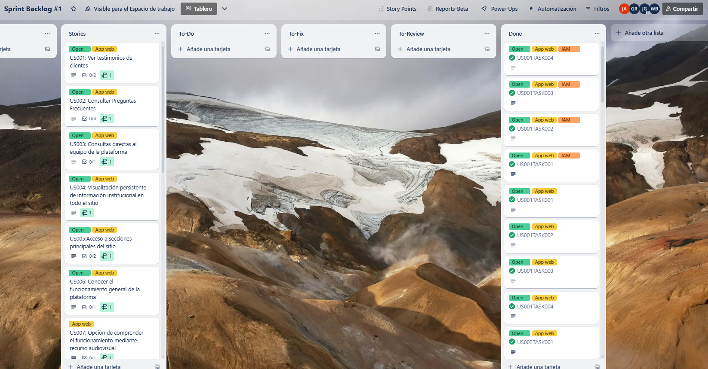
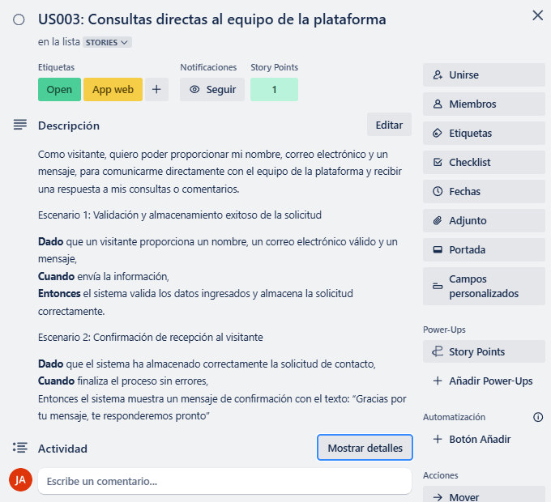

Trello: [https://shorturl.at/oCNpf](https://shorturl.at/oCNpf)

| Sprint #   | Sprint n                                                                  |                  |                                                                |                                                                                                                                                                                                              |                    |                    |                                                 |
| ---------- | ------------------------------------------------------------------------- | ---------------- | -------------------------------------------------------------- | ------------------------------------------------------------------------------------------------------------------------------------------------------------------------------------------------------------ | ------------------ | ------------------ | ----------------------------------------------- |
| User Story |                                                                           | Work-item / Task |                                                                |                                                                                                                                                                                                              |                    |                    |                                                 |
| ID         | Title                                                                     | Id               | Title                                                          | Description                                                                                                                                                                                                  | Estimation (hours) | Assigned To        | Status (To-do / In-Process / To-Review / Done)) |
| US-001     | Ver testimonios de clientes                                               | T001             | Diseño de la Sección de Testimonios                          | Diseñar una sección visualmente destacada para testimonios.                                                                                                                                                | 1/2h               | Williams Avendaño | Done                                            |
|            |                                                                           | T002             | Implementación de Testimonios                                 | Mostrar mínimo tres testimonios con nombre, rol y comentario.                                                                                                                                               | 1h                 | Williams Avendaño | Done                                            |
|            |                                                                           | T003             | Armonización de Estilos UI                                    | Aplicar estilos consistentes (tipografía, colores, disposición).                                                                                                                                           | 1/2h               | Williams Avendaño | Done                                            |
| US-0002    | Consultar Preguntas Frecuentes                                            | T001             | Definición de Preguntas Frecuentes                            | Definir al menos tres preguntas frecuentes con sus respuestas claras y breves.                                                                                                                               | 1/2h               | Williams Avendaño | Done                                            |
|            |                                                                           | T002             | Integración de Contenido Estático en FAQ                     | Incluir las preguntas y respuestas directamente en el contenido estático de la sección FAQ.                                                                                                                | 1h                 | Williams Avendaño | Done                                            |
|            |                                                                           | T003             | Asegurar Visibilidad Directa de Respuestas FAQ                 | Verificar que las respuestas estén visibles de forma directa sin necesidad de interacción.                                                                                                                 | 1/2h               | Williams Avendaño | Done                                            |
| US-003     | Consultas directas al equipo de la plataforma                             | T001             | Diseño de Formulario de Contacto                              | Diseñar un formulario limpio con campos de nombre, correo y mensaje.                                                                                                                                        | 1/2h               | Julio Castro       | Done                                            |
|            |                                                                           | T002             | Implementación de Validación Visual en Formulario            | Aplicar validación visual (mensajes de error si faltan datos).                                                                                                                                              | 1h                 | Julio Castro       | Done                                            |
|            |                                                                           | T003             | Mensaje de Confirmación de Envío de Formulario               | Mostrar un mensaje de confirmación claro tras el envío.                                                                                                                                                    | 1/2h               | Julio Castro       | Done                                            |
| US-004     | Visualización persistente de información institucional en todo el sitio | T001             | Implementación de Footer Fijo                                 | Implementar una sección fija en el pie de página con enlaces a redes sociales, contacto y aviso legal.                                                                                                     | 1/2h               | Julio Castro       | Done                                            |
|            |                                                                           | T002             | Creación de Sección "Términos y Condiciones"                | Crear la sección de "Términos y Condiciones" con contenido legal claro y accesible.                                                                                                                        | 1h                 | Julio Castro       | Done                                            |
|            |                                                                           | T003             | Visibilidad Global de Información Institucional               | Asegurar que la sección de información institucional esté visible en todas las vistas públicas del sitio.                                                                                                | 1/2h               | Julio Castro       | Done                                            |
| US-005     | Acceso a secciones principales del sitio                                  | T001             | Definición de Rutas Internas                                  | Definir y estructurar las rutas internas para las secciones: Inicio, Beneficios, Cómo funciona y Contacto.                                                                                                  | 1/2h               | Julio Castro       | Done                                            |
|            |                                                                           | T002             | Implementación de Menú de Navegación Principal              | Implementar un menú de navegación accesible desde la página principal que enlace a las secciones principales del sitio.                                                                                   | 1h                 | Yaku Guzmán       | Done                                            |
|            |                                                                           | T003             | Verificación de Redirección de Enlaces de Navegación        | Asegurar que cada enlace de navegación redirija correctamente a su respectiva sección dentro del sitio.                                                                                                    | 1/2h               | Yaku Guzmán       | Done                                            |
| US-006     | Conocer el funcionamiento general de la plataforma                        | T001             | Definición de Contenido de Etapas Explicativas                | Definir el contenido de las cuatro etapas que explican el funcionamiento general de la plataforma. explicativo'.                                                                                             | 1/2h               | Yaku Guzmán       | Done                                            |
|            |                                                                           | T002             | Estructuración de Sección "Cómo Funciona"                   | Estructurar la sección informativa que describa paso a paso cómo utilizar la plataforma.                                                                                                                   | 1h                 | Yaku Guzmán       | Done                                            |
|            |                                                                           | T003             | Implementación Visual de Etapas Secuenciales                  | Implementar la visualización de las cuatro etapas de forma secuencial y clara dentro del sitio.                                                                                                             | 1/2h               | Yaku Guzmán       | Done                                            |
| US-007     | Opción de comprender el funcionamiento mediante recurso audiovisual      | T001             | Estructura para Visualización de Video Explicativo            | Implementación de estructura necesarios para asegurar que el video explicativo se muestre correctamente                                                                                                     | 1/2h               | Yaku Guzmán       | Done                                            |
| US-008     | Comprensión del propósito y valor desde el inicio                       | T001             | Estructura para Visualización de Beneficios Generales         | Implementación de estructura necesarios para asegurar que los beneficios se muestren correctamente                                                                                                          | 2h                 | Yaku Guzmán       | Done                                            |
| US-009     | Visualización de beneficios según perfil de usuario                     | T001             | Estructura para Visualización de Beneficios Personalizados    | Implementación de estructura necesarios para asegurar que los beneficios adaptados a mi perfil se muestre correctamente.                                                                                    | 1/2h               | Gabriela Shapiama  | Done                                            |
| US-010     | Selección de idioma para una experiencia personalizada                   | T001             | Preparación de Contenido Multilingüe (ES/EN)                 | Preparar el contenido de la landing page y web application en dos idiomas (español e inglés).                                                                                                              | 1h                 | Gabriela Shapiama  | Done                                            |
|            |                                                                           | T002             | Implementación de Selector de Idioma                          | Implementar botón que permita cambiar entre ambos idiomas.                                                                                                                                                  | 1/2h               | Gabriela Shapiama  | Done                                            |
|            |                                                                           | T003             | Persistencia de Selección de Idioma                           | Guardar la selección del idioma para que se mantenga al recargar la página.                                                                                                                                | 1h                 | Gabriela Shapiama  | Done                                            |
| US011      | Navegación accesible para personas con discapacidad visual               | T001             | Diseño de Navegación Fluida                                  | Crear diseño visual para 'navegación fluida entre secciones'.                                                                                                                                              | 1/2h               | Gabriela Shapiama  | Done                                            |
|            |                                                                           | T002             | Codificación de Componente de Navegación Fluida              | Codificar el componente necesario para 'navegación fluida entre secciones'.                                                                                                                                 | 1h                 | Gabriela Shapiama  | Done                                            |
|            |                                                                           | T003             | Verificación de Navegación Fluida                            | Verificar que 'navegación fluida entre secciones' funcione correctamente.                                                                                                                                   | 1/2h               | Gabriela Shapiama  | Done                                            |
| US-012     | Optimización para pantallas de escritorio                                | T001             | Definición de Breakpoint para Desktop                         | Definir breakpoint específico para resolución ≥ 1280px en hoja de estilos principal (ej. media queries o framework CSS utilizado)                                                                         | 1/2h               | Gabriela Shapiama  | Done                                            |
|            |                                                                           | T002             | Ajuste de Layout Principal para Desktop                        | Reorganizar layout principal (header, sidebar, content) para aprovechar el espacio horizontal sin superposición ni columnas colapsadas                                                                      | 1h                 | Gabriela Shapiama  | Done                                            |
|            |                                                                           | T003             | Mejora de Legibilidad en Desktop                               | Ajustar tipografía, padding y márgenes para mejorar legibilidad en pantallas grandes                                                                                                                       | 1/2h               | Gabriela Shapiama  | Done                                            |
| US-013     | Optimización para pantallas de tablet                                    | T001             | Definición de Breakpoint para Tablets/Laptops                 | Definir breakpoint específico para resolución ≥ 1024px en hoja de estilos principal (ej. media queries o framework CSS utilizado)                                                                         | 1h                 | Jahaziel Guerra    | Done                                            |
|            |                                                                           | T002             | Ajuste de Layout Principal para Tablets/Laptops                | Reorganizar layout principal (header, sidebar, content) para aprovechar el espacio horizontal sin superposición ni columnas colapsadas                                                                      | 1/2h               | Jahaziel Guerra    | Done                                            |
|            |                                                                           | T003             | Mejora de Legibilidad en Tablets/Laptops                       | Ajustar tipografía, padding y márgenes para mejorar legibilidad en pantallas grandes                                                                                                                       | 1/2h               | Jahaziel Guerra    | Done                                            |
| US-014     | Optimización para dispositivos móviles                                  | T001             | Definición de Breakpoint para Tablets                         | Definir breakpoint específico para resolución ≥ 768px en hoja de estilos principal (ej. media queries o framework CSS utilizado)                                                                          | 1/2h               | Jahaziel Guerra    | Done                                            |
|            |                                                                           | T002             | Ajuste de Layout Principal para Tablets                        | Reorganizar layout principal (header, sidebar, content) para optimizar el espacio horizontal                                                                                                                 | 1h                 | Jahaziel Guerra    | Done                                            |
|            |                                                                           | T003             | Mejora de Legibilidad en Tablets                               | Ajustar tipografía, padding y márgenes para mejorar legibilidad en pantallas pequeñas                                                                                                                     | 1/2h               | Jahaziel Guerra    | Done                                            |
| US-015     | Navegación fluida entre secciones                                        | T001             | Implementación de Transiciones de Navegación Fluidas         | Implementar una experiencia de navegación fluida y sin interrupciones entre las diferentes secciones de la aplicación, garantizando transiciones rápidas, suaves y coherentes con la interfaz de usuario. | 2h                 | Jahaziel Guerra    | Done                                            |
| US-016     | Inclusión de videos explicativos en el sitio web                         | T001             | Estructura para Visualización de video explicativo            | Implementación de video explicativo mostrado correctamente                                                                                                                                                  | 1h                 | Jahaziel Guerra    | Done                                            |
| US-017     | Acceso a la plataforma                                                    | T001             | Mostrar formulario de inicio de sesión                        | Mostrar un formulario sencillo con campos para correo electrónico y contraseña. Asegurarse de que sea accesible y responsivo.                                                                              | 1h                 | Jahaziel Guerra    | Done                                            |
|            |                                                                           | T002             | Validar formato de correo y requerir contraseña obligatoria.  | Validar que el formato del correo electrónico sea correcto y que el campo de la contraseña no quede vacío. Mostrar mensajes de error apropiados.                                                          | 2h                 | Jahaziel Guerra    | Done                                            |
|            |                                                                           | T003             | Implementar botón de "Iniciar sesión" para enviar los datos. | Implementar botón de "Iniciar sesión" para enviar los datos                                                                                                                                                | 1h                 | Jahaziel Guerra    | Done                                            |
|            |                                                                           | T004             | Redirigir al usuario tras el inicio de sesión exitoso         | Redirigir al usuario tras el inicio de sesión exitoso                                                                                                                                                       | 1h                 | Jahaziel Guerra    | Done                                            |

#### 5.2.1.4 Development Evidence for Sprint Review

En esta sección se presentan los avances de implementación realizados durante el Sprint 1, el cual tuvo como objetivo principal construir la Landing Page de la plataforma Restock.
Se desarrollaron múltiples secciones, aplicando principios de diseño responsivo, buenas prácticas de codificación y asegurando consistencia con el estilo visual definido para el proyecto. Los entregables principales de este sprint incluyen la creación de secciones como About Us, Benefits, Testimonials, FAQ, Tutorial, Contact, Footer, además de la implementación de mejoras de SEO, formularios de acceso, y enlaces de descarga.

| Repository                        | Branch                   | Commit Id | Commit Message                                                        | Commit Message Body                                                                      | Commited on (Date) |
| --------------------------------- | ------------------------ | --------- | --------------------------------------------------------------------- | ---------------------------------------------------------------------------------------- | ------------------ |
| GabrielaShapiama/UI-Topic-landing | feature/access           | 936d1db   | feat(access): add access forms.                                       | Implemented the login and registration forms with appropriate field validations.         | 27-04-2025         |
| Yaku Guzman/UI-Topic-landing      | feature/footer-section   | fc81879   | feat(footer-section): add footer section, footer css and icons        | Designed and styled the footer component, added navigation links and social media icons. | 27-04-2025         |
| Yaku Guzman/UI-Topic-landing      | feature/contacto-section | c4988c0   | feat(contacto-section): add contact section, contact css              | Developed the contact form section, added input fields and styling for responsiveness.   | 27-04-2025         |
| Yaku Guzman/UI-Topic-landing      | feature/tutorial-section | 1bda3eb   | feat(tutorial-section): add tutorial section, tutorial css and images | Created the tutorial guide section with step-by-step images and responsive layout.       | 27-04-2025         |
| Williams/UI-Topic-landing         | feature/descargar        | 219e86a   | feat(descargar): adding download section(html,css)                    | Built the download section including download buttons and responsive design.             | 27-04-2025         |
| Williams/UI-Topic-landing         | feature/preguntas        | bf2f8f9   | fix(preguntas): updating frecuent questions(html,css,js)              | Updated the FAQ section to improve its structure, styling, and dynamic functionality.    | 27-04-2025         |
| Williams/UI-Topic-landing         | feature/preguntas        | c2882d0   | feat(preguntas): adding frecuent questions(html,css)                  | Added the frequently asked questions section with collapsible answers.                   | 27-04-2025         |
| Williams/UI-Topic-landing         | feature/testimonios      | 4be7138   | feat(testimonios): adding testimonios(html,css)                       | Developed the testimonials section with client feedback and applied custom styles.       | 27-04-2025         |
| jahazielgg/UI-Topic-landing       | feature/benefits         | 34e3804   | feat(benefits): add benefits section.                                 | Created the benefits section highlighting key features and advantages.                   | 27-04-2025         |
| jahazielgg/UI-Topic-landing       | feature/about-us-section | ac7366b   | feat(about-us): add about us section.                                 | Implemented the about us section including company mission and vision statements.        | 27-04-2025         |
| jahazielgg/UI-Topic-landing       | feature/hero-section     | f9716bd   | feat(hero-section): add hero section.                                 | Built the hero section with main headline, supporting text, and CTA button.              | 27-04-2025         |
| jahazielgg/UI-Topic-landing       | feature/develop          | e10bc23   | chore: initial commit.                                                | Set up the initial project structure and configurations for the landing page.            | 27-04-2025         |
| jahazielgg/UI-Topic-landing       | main                     | 31a94bc   | Initial commit                                                        | Initialized the repository with basic project files.                                     | 27-04-2025         |

##### Productos según alcance del Sprint

###### Landing Page

Durante el Sprint 1 se implementó la Landing Page de Restock. Los principales avances fueron:

- Diseño responsivo adaptado a diferentes tamaños de pantalla.
- Creación de secciones: Hero, Sobre Nosotros, Beneficios, Testimonios, Preguntas Frecuentes, Tutorial, Contacto y Footer.
- Aplicación de buenas prácticas de accesibilidad (uso de etiquetado semántico, contraste adecuado).
- Optimización inicial para motores de búsqueda (SEO básico) con metaetiquetas y atributos relevantes.
- Implementación de navegación fluida entre secciones mediante anclas y smooth scrolling.
- Validación de compatibilidad en navegadores modernos y dispositivos móviles.

#### 5.2.1.5 Execution Evidence for Sprint Review

En este primer sprint, se desarrolló la Landing Page de Restock, que sirve como punto de entrada para los usuarios interesados en la plataforma. Esto incluye la presentación de nuestro servicio, información sobre la empresa y acceso a funcionalidades clave.

Se implementaron secciones como:

**Hero Section**: Presentación visual atractiva con un llamado a la acción.


**Sobre Nosotros**: Información sobre la misión y visión de Restock.


**Beneficios**: Sección que destaca las ventajas de utilizar Restock.


**Testimonios**: Opiniones de usuarios satisfechos con la plataforma.


A continuación, se presenta el video de la landing page. Este muestra la interacción principal de los usuarios con la plataforma, destacando los flujos de navegación, diseño responsivo y la estructura general de la aplicación.

**Video de landing page:**

[https://shorturl.at/sFmpy](https://shorturl.at/sFmpy)
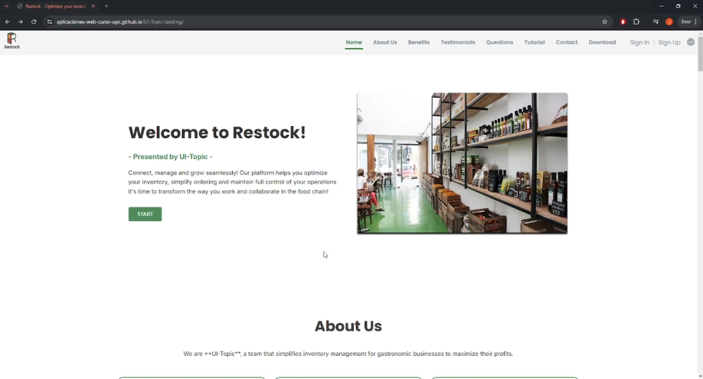

#### 5.2.1.6 Services Documentation Evidence for Sprint Review

Durante este sprint se completó el diseño e implementación del Landing Page del sistema, el cual forma parte del acceso inicial al sistema y constituye un punto de entrada fundamental para los usuarios. Aunque no se implementaron endpoints tradicionales de tipo REST en este sprint, se documenta a continuación la URL del recurso publicado, junto con evidencia de despliegue, interacción y commits relacionados.

**Descripción del Logro:**

-Implementación del Landing Page estático.

-Deployment del landing page.

##### Recursos del Sprint

| Recurso      | Acción implementada   | Método HTTP | URL / Endpoint                                                 | Link de repositorio                                                |
| ------------ | ---------------------- | ------------ | -------------------------------------------------------------- | ------------------------------------------------------------------ |
| Landing Page | Visualización inicial | GET          | https://aplicaciones-web-curso-upc.github.io/UI-Topic-landing/ | https://github.com/Aplicaciones-Web-Curso-UPC/UI-Topic-landing.git |

**Documentacion**
Commit 4d6b92f: Initial commit

#### 5.2.1.7. Software Deployment Evidence for Sprint Review.

Durante este Sprint, se realizaron actividades de despliegue de la Landing Page utilizando GitHub Pages como plataforma de hosting. A continuación, se detallan los pasos ejecutados:

1- Se accedió a la sección Settings del repositorio.
Dentro de Pages, se seleccionó la rama (develop) y la carpeta (root) desde la cual GitHub Pages debía publicar el sitio.
Se guardaron los cambios para activar la publicación automática.

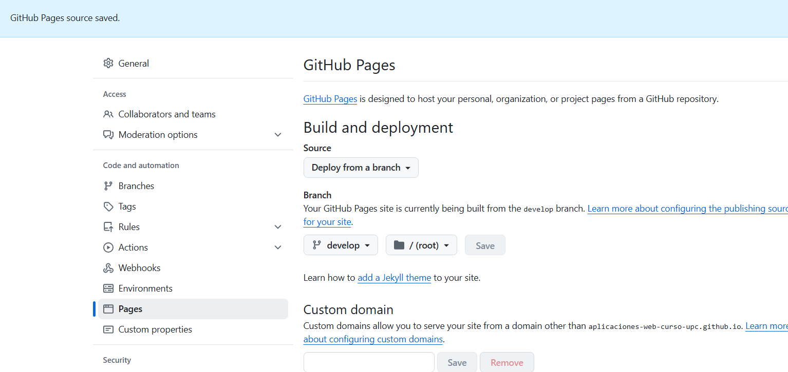

2- por default ya esta activado el https

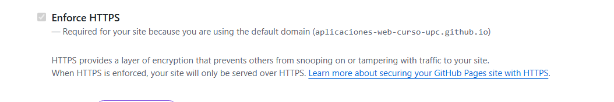

3- En la seccion "All workflows" se puede ver que la app se esta deployando.

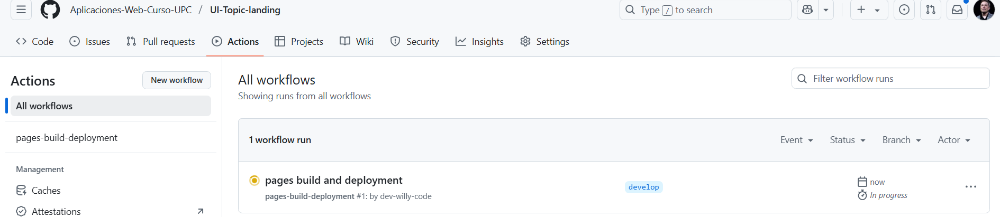

4- El landing page fue exitosamente deployado

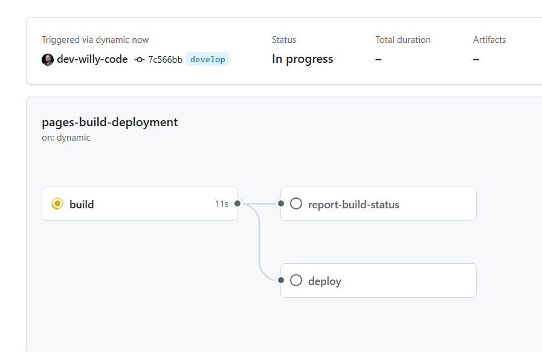

5- Se obtuvo y verificó la URL pública proporcionada por GitHub Pages.

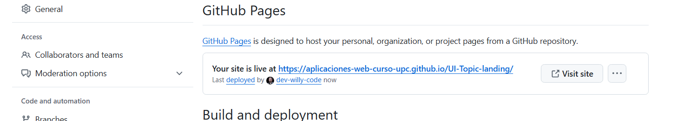

#### 5.2.1.8 Team Collaboration Insights during Sprint

##### Desarrollo de las Actividades de Implementación

Durante el Sprint 1, el equipo de Restock se enfocó en el desarrollo de la **Landing Page**.
Las actividades de implementación se llevaron a cabo de la siguiente manera:

- Se crearon ramas específicas para cada sección o funcionalidad (`feature/[nombre-de-seccion]`), permitiendo un trabajo paralelo organizado.
- Cada miembro del equipo asumió la responsabilidad de desarrollar una o más secciones de la Landing Page.
- Se realizaron commits frecuentes, registrando avances de manera continua y detallada.
- Las funcionalidades desarrolladas se integraron mediante Pull Requests hacia la rama `develop`.
- Se mantuvo una comunicación constante mediante la plataforma Discord para coordinar avances y resolver dudas en tiempo real.
- Se aplicaron buenas prácticas de programación, control de versiones y colaboración en equipo.

Gracias a esta organización, se logró cumplir de manera efectiva el objetivo del sprint, garantizando que todos los integrantes contribuyeran de forma activa en el desarrollo de la Landing Page.

##### Evidencia de Colaboración en GitHub

Se presenta a continuación la captura de los insights del repositorio de GitHub, correspondiente al Sprint 1:

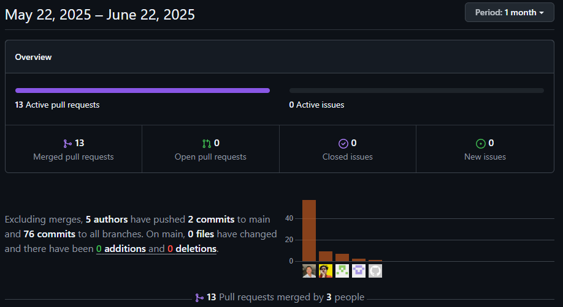

**Insights:**

- **13 Pull Requests** fusionados correctamente.
- **5 autores** contribuyendo al repositorio.
- **76 commits** realizados en el periodo del Sprint.
- Participación activa de todos los miembros asignados al desarrollo de la Landing Page.

### 5.2.2 Sprint 2

#### 5.2.2.1. Sprint Planning 2

| Sprint #                             | Sprint 2                                                                                                                                                                                                                                                                                                                                                                                                                                                                                                                                                                                                                                                                                                                                                                                           |
| ------------------------------------ | -------------------------------------------------------------------------------------------------------------------------------------------------------------------------------------------------------------------------------------------------------------------------------------------------------------------------------------------------------------------------------------------------------------------------------------------------------------------------------------------------------------------------------------------------------------------------------------------------------------------------------------------------------------------------------------------------------------------------------------------------------------------------------------------------- |
| **Sprint Planning Background** |                                                                                                                                                                                                                                                                                                                                                                                                                                                                                                                                                                                                                                                                                                                                                                                                    |
| Date                                 | 2025-05-05                                                                                                                                                                                                                                                                                                                                                                                                                                                                                                                                                                                                                                                                                                                                                                                         |
| Time                                 | 07:00 pm (GMT-5)                                                                                                                                                                                                                                                                                                                                                                                                                                                                                                                                                                                                                                                                                                                                                                                   |
| Location                             | Modalidad remota mediante la plataforma Discord                                                                                                                                                                                                                                                                                                                                                                                                                                                                                                                                                                                                                                                                                                                                                    |
| Prepared By                          | Guzmán Cabrejos, Yaku Mateo                                                                                                                                                                                                                                                                                                                                                                                                                                                                                                                                                                                                                                                                                                                                                                       |
| Attendees (to planning meeting)      | Avendaño Balarezo, Williams Eduardo / Castro Alejos, Julio / Guerra Perez, José Jahaziel / Guzmán Cabrejos, Yaku Mateo / Shapiama Rivera, Gabriela Nicole                                                                                                                                                                                                                                                                                                                                                                                                                                                                                                                                                                                                                                       |
| Sprint 1 Review Summary              | Durante el Sprint 1 se logró implementar casi en su totalidad la Landing Page del sistema Restock, desarrollando secciones clave como el header, footer, sección de beneficios y preguntas frecuentes, así como la integración inicial de estilos globales y tipografía. Quedó faltante la funcionalidad de cambio de idioma, la cual será prioridad para el siguiente sprint. El equipo cumplió con los entregables establecidos, respetando el diseño de mockups y la guía de estilos. Se identificaron oportunidades de mejora en la velocidad de desarrollo y gestión de tiempos.                                                                                                                                                                                                   |
| Sprint 1 Retrospective Summary       | Durante el Sprint 1, el equipo logró avanzar de forma coordinada y efectiva en el desarrollo de la landing page, sin enfrentar mayores dificultades. Cada integrante cumplió puntualmente con las secciones asignadas, lo que permitió avanzar según lo planificado. La adopción de convenciones comunes en el código y el diseño contribuyó a mantener la coherencia del producto y facilitó la integración entre partes. Como mejora para el siguiente sprint, se acordó implementar revisiones diarias (daily reviews) que permitan alinear mejor los avances, detectar bloqueos tempranos y mejorar la comunicación continua entre miembros.                                                                                                                                       |
| **Sprint Goal & User Stories** |                                                                                                                                                                                                                                                                                                                                                                                                                                                                                                                                                                                                                                                                                                                                                                                                    |
| Sprint 2 Goal                        | Nuestro enfoque está en  brindar información clara y detallada a los visitantes de la plataforma, así como habilitar la gestión de inventario, configuración de perfil, notificaciones, resumen de datos y gestión deventas para los usuarios del sistema  interno.<br />Creemos que esto proporciona  mayor comprensión del propósito de la solución a los visitantes y mejora la eficiencia operativa de insumos de los administradores de restaurantes y proveedores.<br />Esto se confirmará cuando  los visitantes puedan explorar contenido relevante desde el acceso  público, y los usuarios autenticados naveguen por el panel principal y accedan a los módulos de gestión de inventario, configuración de perfil, notificaciones, resumen de datos y ventas del sistema. |
| Sprint 2 Velocity                    | 45                                                                                                                                                                                                                                                                                                                                                                                                                                                                                                                                                                                                                                                                                                                                                                                                 |
| Sum of Story Points                  | 42                                                                                                                                                                                                                                                                                                                                                                                                                                                                                                                                                                                                                                                                                                                                                                                                 |

#### 5.2.2.2 Aspect Leaders and Collaborators

##### Aspect Leaders and Collaborators

Durante el Sprint 2,  se ha definido el desarrollo e integración de los módulos principales del frontend de la aplicación web interna  Restock , abarcando funcionalidades clave como la gestión de productos, pedidos, inventario y compras. Estas implementaciones buscan optimizar los procesos internos y mejorar la trazabilidad del inventario, brindando mayor eficiencia a los administradores de restaurantes y su personal.

Con el fin de mantener una coordinación efectiva y una comunicación fluida entre los integrantes del equipo, se estructuró la matriz de liderazgo y colaboración (LACX), donde se asignó un líder (L) encargado de cada funcionalidad y colaboradores (C) que brindan apoyo en su implementación.

<div style="font-size: 0.75em; overflow-x: auto;">

| Team Member (Last Name, First Name) | GitHub Username    | Configuración de perfil | Panel de suscripción | Notificaciones y calificaciones | Registro de ventas | Registro de proveedores | Inventario | Resumen de datos |
| :---------------------------------- | :----------------- | :----------------------- | :-------------------- | :------------------------------ | :----------------- | :---------------------- | :--------- | :--------------- |
| Vendaño Balarezo, Williams Eduardo | dev-willy-code     | C                        | L                     | C                               | C                  | C                       | C          | C                |
| Castro Alejos, Julio                | JulioXC4           | C                        | C                     | C                               | L                  | C                       | L          | C                |
| Guerra Perez, José Jahaziel        | jahazielgg         | C                        | C                     | L                               | C                  | C                       | C          | C                |
| Guzmán Cabrejos, Yaku Mateo        | yak-cod            | C                        | C                     | C                               | C                  | L                       | C          | L                |
| Shapiama Rivera, Gabriela Nicole    | GabrielaShapiama28 | L                        | C                     | C                               | C                  | C                       | C          | C                |

</div>

#### 5.2.2.3 Sprint Backlog 2

El objetivo principal de este Sprint es desarrollar la interfaz frontend de los dashboards para **administradores de restaurantes y proveedores**, enfocándose en una estructura clara, navegación eficiente y visualización adecuada de datos críticos.

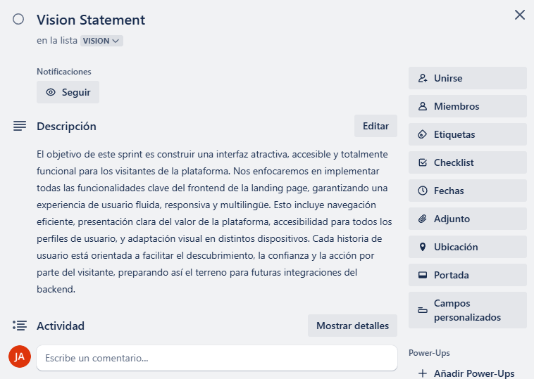

Además, se realizaron mejoras en el *landing page*, incluyendo la implementación de un **toggle de idioma** (inglés/español) y la incorporación de **atributos de accesibilidad** como `aria-label` y `lang`, asegurando mayor inclusión y cumplimiento de estándares web.

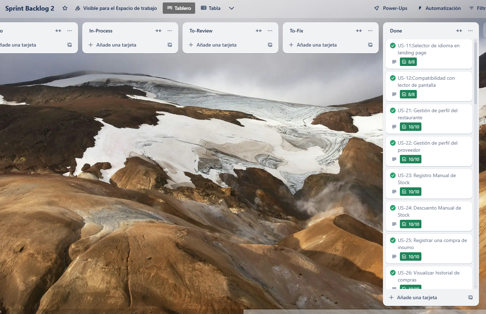

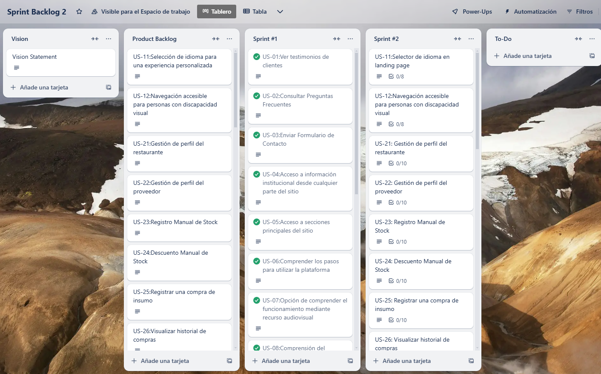

Trello: [https://shorturl.at/X5KyX](https://shorturl.at/X5KyX)

| User Story ID | User Story Title                                      | Task ID | Task Title                | Task Description                                                                                          | Estimated Hours |
| ------------- | ----------------------------------------------------- | ------- | ------------------------- | --------------------------------------------------------------------------------------------------------- | --------------- |
| US-08         | Selector de idioma en landing page                    | T001    | Diseñar sección         | Crear diseño visual para 'mostrar mensaje de valor en la sección principal'.                            | 1/2 h           |
|               |                                                       | T002    | Implementar funcionalidad | Codificar el componente necesario para 'mostrar mensaje de valor en la sección principal'.               | 1h              |
|               |                                                       | T003    | Realizar pruebas          | Verificar que 'mostrar mensaje de valor en la sección principal' funcione correctamente.                 | 1/2h            |
| US-09         | Optimización para pantallas de tablet                | T004    | Diseñar sección         | Crear diseño visual para 'mostrar beneficios segmentados por tipo de usuario'.                           | 1/2h            |
|               |                                                       | T005    | Implementar funcionalidad | Codificar el componente necesario para 'mostrar beneficios segmentados por tipo de usuario'.              | 1h              |
|               |                                                       | T006    | Realizar pruebas          | Verificar que 'mostrar beneficios segmentados por tipo de usuario' funcione correctamente.                | 1/2h            |
| US-10         | Acceso limitado según estado de suscripción         | T007    | Diseñar sección         | Crear diseño visual para 'incluir llamados a la acción (cta) con redirección y descarga'.              | 1/2h            |
|               |                                                       | T008    | Implementar funcionalidad | Codificar el componente necesario para 'incluir llamados a la acción (cta) con redirección y descarga'. | 1h              |
|               |                                                       | T009    | Realizar pruebas          | Verificar que 'incluir llamados a la acción (cta) con redirección y descarga' funcione correctamente.   | 1/2h            |
| US-05         | Registrar una compra de insumo                        | T010    | Diseñar sección         | Crear diseño visual para 'visualización de la barra de navegación'.                                    | 1/2h            |
|               |                                                       | T011    | Implementar funcionalidad | Codificar el componente necesario para 'visualización de la barra de navegación'.                       | 1h              |
|               |                                                       | T012    | Realizar pruebas          | Verificar que 'visualización de la barra de navegación' funcione correctamente.                         | 1/2h            |
| US-06         | Gestión de perfil del restaurante                    | T013    | Diseñar sección         | Crear diseño visual para 'visualización de pasos del funcionamiento'.                                   | 1/2h            |
|               |                                                       | T014    | Implementar funcionalidad | Codificar el componente necesario para 'visualización de pasos del funcionamiento'.                      | 1h              |
|               |                                                       | T015    | Realizar pruebas          | Verificar que 'visualización de pasos del funcionamiento' funcione correctamente.                        | 1/2h            |
| US-07         | Gestión de perfil del proveedor                      | T016    | Diseñar sección         | Crear diseño visual para 'alternativa con video explicativo'.                                            | 1/2h            |
|               |                                                       | T017    | Implementar funcionalidad | Codificar el componente necesario para 'alternativa con video explicativo'.                               | 1h              |
|               |                                                       | T018    | Realizar pruebas          | Verificar que 'alternativa con video explicativo' funcione correctamente.                                 | 1/2h            |
| US-04         | Actualización manual y edición previa de inventario | T019    | Diseñar sección         | Crear diseño visual para 'visualización de footer en landing page'.                                     | 1/2h            |
|               |                                                       | T020    | Implementar funcionalidad | Codificar el componente necesario para 'visualización de footer en landing page'.                        | 2h              |
|               |                                                       | T021    | Realizar pruebas          | Verificar que 'visualización de footer en landing page' funcione correctamente.                          | 1/2h            |
| US-01         | Visualizar ingredientes más usados                   | T022    | Diseñar sección         | Crear diseño visual para 'ver testimonios de clientes'.                                                  | 2h              |
|               |                                                       | T023    | Implementar funcionalidad | Codificar el componente necesario para 'ver testimonios de clientes'.                                     | 1/2h            |
|               |                                                       | T024    | Realizar pruebas          | Verificar que 'ver testimonios de clientes' funcione correctamente.                                       | 1h              |
| US-02         | Consultar Preguntas Frecuentes                        | T025    | Diseñar sección         | Crear diseño visual para 'consultar preguntas frecuentes'.                                               | 1/2h            |
|               |                                                       | T026    | Implementar funcionalidad | Codificar el componente necesario para 'consultar preguntas frecuentes'.                                  | 1h              |
|               |                                                       | T027    | Realizar pruebas          | Verificar que 'consultar preguntas frecuentes' funcione correctamente.                                    | 1/2h            |
| US-23         | Visualización de feedback                            | T028    | Diseñar sección         | Crear diseño visual para 'enviar formulario de contacto'.                                                | 1h              |
|               |                                                       | T029    | Implementar funcionalidad | Codificar el componente necesario para 'enviar formulario de contacto'.                                   | 1/2h            |
|               |                                                       | T030    | Realizar pruebas          | Verificar que 'enviar formulario de contacto' funcione correctamente.                                     | 1h              |
| US-26         | Navegación fluida entre secciones                    | T031    | Diseñar sección         | Crear diseño visual para 'navegación fluida entre secciones'.                                           | 1/2h            |
|               |                                                       | T032    | Implementar funcionalidad | Codificar el componente necesario para 'navegación fluida entre secciones'.                              | 1h              |
|               |                                                       | T033    | Realizar pruebas          | Verificar que 'navegación fluida entre secciones' funcione correctamente.                                | 1/2h            |
| US-13         | Visualización responsive en desktop                  | T034    | Diseñar sección         | Crear diseño visual para 'visualización responsive en desktop'.                                         | 1/2h            |
|               |                                                       | T035    | Implementar funcionalidad | Codificar el componente necesario para 'visualización responsive en desktop'.                            | 1h              |
|               |                                                       | T036    | Realizar pruebas          | Verificar que 'visualización responsive en desktop' funcione correctamente.                              | 1/2h            |
| US-15         | Visualización responsive en dispositivos móviles    | T037    | Diseñar sección         | Crear diseño visual para 'visualización responsive en dispositivos móviles'.                           | 1h              |
|               |                                                       | T038    | Implementar funcionalidad | Codificar el componente necesario para 'visualización responsive en dispositivos móviles'.              | 1/2h            |
|               |                                                       | T039    | Realizar pruebas          | Verificar que 'visualización responsive en dispositivos móviles' funcione correctamente.                | 1/2h            |
| US-14         | Visualización responsive en tablet                   | T040    | Diseñar sección         | Crear diseño visual para 'visualización responsive en tablet'.                                          | 1/2h            |
|               |                                                       | T041    | Implementar funcionalidad | Codificar el componente necesario para 'visualización responsive en tablet'.                             | 1h              |
|               |                                                       | T042    | Realizar pruebas          | Verificar que 'visualización responsive en tablet' funcione correctamente.                               | 1/2h            |
| US-45         | Estado general del inventario                         | T043    | Diseñar sección         | Crear diseño visual para 'registro'.                                                                     | 2h              |
|               |                                                       | T044    | Implementar funcionalidad | Codificar el componente necesario para 'registro'.                                                        | 2h              |
|               |                                                       | T045    | Realizar pruebas          | Verificar que 'registro' funcione correctamente.                                                          | 1h              |
| US-47         | Identificar a los Mejores Clientes                    | T046    | Diseñar sección         | Crear diseño visual para 'inicio de sesión'.                                                            | 2h              |
|               |                                                       | T047    | Implementar funcionalidad | Codificar el componente necesario para 'inicio de sesión'.                                               | 1h              |
|               |                                                       | T048    | Realizar pruebas          | Verificar que 'inicio de sesión' funcione correctamente.                                                 | 1h              |
| US-49         | Búsqueda y Filtrado de Proveedores                   | T049    | Diseñar sección         | Crear diseño visual para 'recuperación de contraseña'.                                                 | 2h              |
|               |                                                       | T050    | Implementar funcionalidad | Codificar el componente necesario para 'recuperación de contraseña'.                                    | 1/2h            |
|               |                                                       | T051    | Realizar pruebas          | Verificar que 'recuperación de contraseña' funcione correctamente.                                      | 1h              |

#### 5.2.2.4 Development Evidence for Sprint Review

En esta sección se presentan los avances realizados durante el Sprint 2, centrado en el desarrollo de los módulos principales de la aplicación web interna de Restock.

**1. Landing Page:**
La siguiente tabla resume los commits realizados en el repositorio `UI-Topic-landing`, que incluyen mejoras en la accesibilidad, correcciones de errores y adición de nuevas funcionalidades.

<table>
    <tr>
        <td>Repository</td>
        <td>Branch</td>
        <td>Commit Id</td>
        <td>Commit Message</td>
        <td>Commit Message Body</td>
        <td>Commited on (Date)</td>
    </tr>
    <tr>
        <td>GabrielaShapiama/UI-Topic-landing</td>
        <td>feature/acces</td>
        <td>f3de2d0</td>
        <td>fix(access): remove incorrect image.</td>
        <td>Removed an incorrect image that was incorrectly placed in the access module.</td>
        <td>26-04-2025</td>
    </tr>
    <tr>
        <td>Yaku Guzman/UI-Topic-landing</td>
        <td>feature/tutorial-section</td>
        <td>1c1d5e2</td>
        <td>fix(tutorial-section): fix tutorial links width</td>
        <td>Fixed the width issue affecting the layout of tutorial links on different screens.</td>
        <td>26-04-2025</td>
    </tr>
    <tr>
        <td>Williams/UI-Topic-landing</td>
        <td>feature/seo-tags-meta-tags</td>
        <td>b50e3c3</td>
        <td>feat(seo-tags-meta-tags): adding seo tags and meta tags</td>
        <td>Added SEO and meta tags to improve page indexing and online visibility.</td>
        <td>26-04-2025</td>
    </tr>
    <tr>
        <td>JulioXC4/UI-Topic-landing</td>
        <td>feature/voice-reader-accessibility</td>
        <td>936c01d</td>
        <td>feat(voice): add file voice.js</td>
        <td>Added a new JavaScript file to handle voice-related functionalities.</td>
        <td>26-04-2025</td>
    </tr>
    <tr>
        <td>JulioXC4/UI-Topic-landing</td>
        <td>feature/language-toggle</td>
        <td>5bf2a4f</td>
        <td>feat(navbar): add language switch icon and console log for future functionality</td>
        <td>Introduced a language switcher icon and set up console logs for future multi-language support.</td>
        <td>26-04-2025</td>
    </tr>
    <tr>
        <td>GabrielaShapiama/UI-Topic-landing</td>
        <td>feature/acces</td>
        <td>4fd9958</td>
        <td>fix(access): fix text position.</td>
        <td>Adjusted the text alignment issues on the access screen.</td>
        <td>26-04-2025</td>
    </tr>
    <tr>
        <td>GabrielaShapiama/UI-Topic-landing</td>
        <td>feature/acces</td>
        <td>a9b89b2</td>
        <td>fix(access): remove incorrect css.</td>
        <td>Removed unnecessary or incorrect CSS rules from the access styles.</td>
        <td>26-04-2025</td>
    </tr>
    <tr>
        <td>GabrielaShapiama/UI-Topic-landing</td>
        <td>feature/acces</td>
        <td>c0f15db</td>
        <td>style(access): change buttons format.</td>
        <td>Updated the button styles to align with the platform's visual guidelines.</td>
        <td>25-04-2025</td>
    </tr>
    <tr>
        <td>jahazielgp/UI-Topic-landing</td>
        <td>feature/fix-navbar</td>
        <td>e293098</td>
        <td>fix(navbar): fix navbar.</td>
        <td>Fixed layout and functionality issues in the navigation bar.</td>
        <td>25-04-2025</td>
    </tr>
</table>

**2. Web Application (Frontend):**
La siguiente tabla resume los commits realizados en el repositorio `UI-Topic-Frontend`, que incluyen la implementación de la gestión de productos, inventario y resumen, con el fin de mejorar la eficiencia operativa y la trazabilidad de los recursos dentro de los administradores de restaurantes y proveedores.

| Repository                            | Branch  | Commit Id           | Commit Message | Commit Message Body                                                                                                                               | Commited on (Date) |
| ------------------------------------- | ------- | ------------------- | -------------- | ------------------------------------------------------------------------------------------------------------------------------------------------- | ------------------ |
| Yaku Guzman/UI-Topic-frontend         | develop | Yaku Guzman         | bd6c32e        | feat(restaurant-analytics): add carrousel.                                                                                                        |                    |
| Yaku Guzman/UI-Topic-frontend         | develop | Yaku Guzman         | f8d1229        | feat(supplier-analytics): add json server behavior.                                                                                               |                    |
| Williams/UI-Topic-frontend            | develop | Williams            | 36a496a        | feat(mock): adding mock.user                                                                                                                      |                    |
| Yaku Guzman/UI-Topic-frontend         | develop | Yaku Guzman         | 046f822        | routes: fix routes behavior.                                                                                                                      |                    |
| Yaku Guzman/UI-Topic-frontend         | develop | Yaku Guzman         | 37843c2        | chore: fix behavior                                                                                                                               |                    |
| Yaku Guzman/UI-Topic-frontend         | develop | Yaku Guzman         | 883367d        | fix(restaurant-supplier): fix internal routing.                                                                                                   |                    |
| Yaku Guzman/UI-Topic-frontend         | develop | Yaku Guzman         | 61f2e4b        | feat(restaurant-supplier): add restaurant supplier catalog.                                                                                       |                    |
| jahazielgg/UI-Topic-frontend          | develop | jahazielgg          | 966f47a        | fix(router): rename supplier reviews route to ratings                                                                                             |                    |
| jahazielgg/UI-Topic-frontend          | develop | jahazielgg          | af04b7f        | feat(router): update user data structure and add role-based routing                                                                               |                    |
| JulioXC4/UI-Topic-frontend            | develop | JulioXC4            | 1c01a96        | fix: fix sidebar                                                                                                                                  |                    |
| Julio Castro Alejos/UI-Topic-frontend | develop | Julio Castro Alejos | cba3b83        | Update inventory-supply-create-and-edit.component.vue                                                                                             |                    |
| Julio Castro Alejos/UI-Topic-frontend | develop | Julio Castro Alejos | 7564e45        | Update inventory-supply-add-and-edit.component.vue                                                                                                |                    |
| Julio Castro Alejos/UI-Topic-frontend | develop | Julio Castro Alejos | 6d3c52e        | Update inventory.component.vue                                                                                                                    |                    |
| JulioXC4/UI-Topic-frontend            | develop | JulioXC4            | 3623ec4        | fix: fix supplies                                                                                                                                 |                    |
| Yaku Guzman/UI-Topic-frontend         | develop | Yaku Guzman         | 340c7dd        | feat(supplier-analytics-route): add supplier analytics route.                                                                                     |                    |
| Yaku Guzman/UI-Topic-frontend         | develop | Yaku Guzman         | e225fbd        | feat(supplier-analytics): add supplier analytics summary components and page                                                                      |                    |
| jahazielgg/UI-Topic-frontend          | develop | jahazielgg          | a2b2637        | fix(styles): update menu link padding and improve color consistency in styles                                                                     |                    |
| Yaku Guzman/UI-Topic-frontend         | develop | Yaku Guzman         | 90ff1c4        | feat(restaurant-analytics): add restaurant analytics summary components and page                                                                  |                    |
| JulioXC4/UI-Topic-frontend            | develop | JulioXC4            | e415b5d        | fix: color                                                                                                                                        |                    |
| JulioXC4/UI-Topic-frontend            | develop | JulioXC4            | c7c86df        | fix: functions                                                                                                                                    |                    |
| JulioXC4/UI-Topic-frontend            | develop | JulioXC4            | 4fb746f        | fix: delete function                                                                                                                              |                    |
| JulioXC4/UI-Topic-frontend            | develop | JulioXC4            | 6ad2d54        | fix: styles                                                                                                                                       |                    |
| JulioXC4/UI-Topic-frontend            | develop | JulioXC4            | b13e97b        | fix: styles                                                                                                                                       |                    |
| JulioXC4/UI-Topic-frontend            | develop | JulioXC4            | 3c1f216        | fix: styles (sidebar, html components)                                                                                                            |                    |
| JulioXC4/UI-Topic-frontend            | develop | JulioXC4            | 26904fc        | chore: folder structure based on bounded context in the project                                                                                   |                    |
| JulioXC4/UI-Topic-frontend            | develop | JulioXC4            | 2099c0b        | fix: add inventory (components)                                                                                                                   |                    |
| JulioXC4/UI-Topic-frontend            | develop | JulioXC4            | e8f17f2        | fix: add inventory modal (calendar)                                                                                                               |                    |
| JulioXC4/UI-Topic-frontend            | develop | JulioXC4            | fd8a1cf        | fix: inventory management with modal for adding and editing supplies, add search functionality, and connect modal to inventory actions            |                    |
| JulioXC4/UI-Topic-frontend            | develop | JulioXC4            | 0d31b31        | feat: integrate inventory management with modal for adding and editing supplies, add search functionality, and connect modal to inventory actions |                    |
| JulioXC4/UI-Topic-frontend            | develop | JulioXC4            | 2f7cc13        | feat(inventory): add edit button to supply cards and integrate modal for editing                                                                  |                    |
| jahazielgg/UI-Topic-frontend          | develop | jahazielgg          | 55dbceb        | feat(sidebar): restructure app layout with sidebar and router integration                                                                         |                    |
| jahazielgg/UI-Topic-frontend          | develop | jahazielgg          | a2e9a33        | feat(i18n): add language switcher component and update translations for sidebar                                                                   |                    |
| jahazielgg/UI-Topic-frontend          | develop | jahazielgg          | b0d0145        | feat(api): add mock user data with json-server and configure router                                                                               |                    |
| jahazielgg/UI-Topic-frontend          | develop | jahazielgg          | 5c22699        | feat(user): add user entity, service, and user card component for user data management.                                                           |                    |
| JulioXC4/UI-Topic-frontend            | develop | JulioXC4            | d787a0c        | feat(inventory): implement supplies and inventory management section with modal form and carousel                                                 |                    |
| JulioXC4/UI-Topic-frontend            | develop | JulioXC4            | 458ec4a        | feat(inventory): progress on empty state and ingredient creation UI                                                                               |                    |
| JulioXC4/UI-Topic-frontend            | develop | JulioXC4            | 3645809        | chore: install dependencies and setup base tooling for Vue project                                                                                |                    |
| Julio Castro Alejos/UI-Topic-frontend | develop | Julio Castro Alejos | 50e43fd        | Delete .vscode directory                                                                                                                          |                    |
| Julio Castro Alejos/UI-Topic-frontend | develop | Julio Castro Alejos | 3274b65        | Delete package-lock.json                                                                                                                          |                    |
| JulioXC4/UI-Topic-frontend            | develop | JulioXC4            | 7e3e6c0        | chore: create Vue 3 project with Vite                                                                                                             |                    |
| Julio Castro Alejos/UI-Topic-frontend | develop | Julio Castro Alejos | 5ee5558        | Initial commit                                                                                                                                    |                    |

#### 5.2.2.5 Execution Evidence for Sprint Review

A continuación, se presenta el video del frontend de la aplicación web interna. Este demuestra la interacción de los usuarios autenticados con los módulos principales del sistema, incluyendo la navegación por el sidebar, la gestión de productos, el seguimiento de alertas y el control de inventario.

**Video del frontend:**
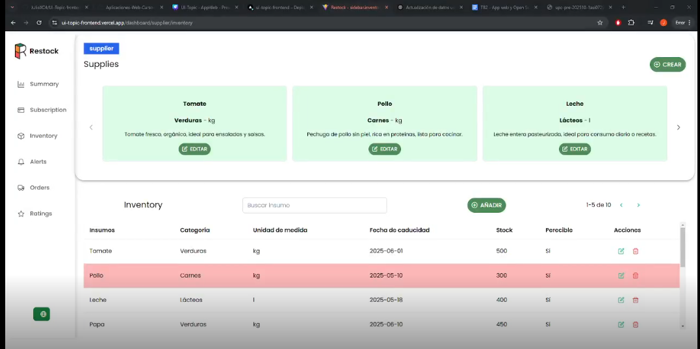

[https://short-link.me/16eW0](https://short-link.me/16eW0)

#### 5.2.2.6 Services Documentation Evidence for Sprint Review

Durante este Sprint se avanzó en el desarrollo del **frontend interno de Restock**, habilitando múltiples rutas navegables para los usuarios autenticados (administradores de restaurante y proveedores), en una estructura basada en Vue Router, Domain-Driven Design y componentes cargados dinámicamente. Aunque aún no se han documentado endpoints REST con OpenAPI, se despliegan a continuación los recursos navegables disponibles, que forman parte del ecosistema de consumo de servicios web del sistema.

**Descripción del Logro:**

* Finalización del Landing Page e implementación multilenguaje.
* Desarrollo modular del frontend con rutas específicas por rol (restaurante y proveedor).
* Estructura basada en Vue Router, DDD y carga lazy de componentes.
* Integración visual con PrimeVue y buenas prácticas de separación por contextos.

##### Rutas accesibles del sistema (Frontend)

| Recurso / Vista               | Acción implementada                        | Método HTTP | URL relativa                            | Propósito funcional                                   |
| ----------------------------- | ------------------------------------------- | ------------ | --------------------------------------- | ------------------------------------------------------ |
| Landing Page                  | Visualización pública inicial             | GET          | `/` (con redirección de rol)         | Acceso inicial y redirección por tipo de usuario      |
| Supplier Inventory            | Visualización de inventario de proveedor   | GET          | `/dashboard/supplier/inventory`       | Gestión del inventario del proveedor                  |
| Restaurant Inventory          | Visualización de inventario de restaurante | GET          | `/dashboard/restaurant/inventory`     | Control de insumos del restaurante                     |
| Restaurant Summary Overview   | Resumen analítico del restaurante          | GET          | `/dashboard/restaurant/summary`       | Dashboard de datos clave del restaurante               |
| Supplier Summary Overview     | Resumen analítico del proveedor            | GET          | `/dashboard/supplier/summary`         | Dashboard de datos clave del proveedor                 |
| Supplier Catalog (Restaurant) | Catálogo de proveedores                    | GET          | `/dashboard/restaurant/suppliers`     | Visualización y exploración de proveedores           |
| Supplier Detail (Restaurant)  | Detalle de proveedor específico            | GET          | `/dashboard/restaurant/suppliers/:id` | Información detallada del proveedor y su catálogo    |
| Supplier Reviews              | Visualización de calificaciones            | GET          | `/dashboard/supplier/ratings`         | Revisión de calificaciones recibidas por el proveedor |

##### Despliegue de recursos

| Recurso          | Acción implementada   | Método HTTP | URL / Endpoint                                                             | Repositorio                                                                         |
| ---------------- | ---------------------- | ------------ | -------------------------------------------------------------------------- | ----------------------------------------------------------------------------------- |
| Landing Page     | Visualización inicial | GET          | [Landing URL](https://aplicaciones-web-curso-upc.github.io/UI-Topic-landing/) | [UI-Topic-landing](https://github.com/Aplicaciones-Web-Curso-UPC/UI-Topic-landing.git) |
| Frontend Interno | Navegación por rutas  | GET          | [App URL](https://ui-topic-frontend.vercel.app)                               | [UI-Topic-frontend](https://github.com/Aplicaciones-Web-Curso-UPC/UI-Topic-frontend)   |

##### Evidencia de interacción

* Video de navegación por módulos del sistema:
  [https://short-link.me/16eW0](https://short-link.me/16eW0)
* Captura de la interfaz en funcionamiento:
  

##### Commits relacionados

| Commit ID   | Descripción                                                                                   | Autor       |
| ----------- | ---------------------------------------------------------------------------------------------- | ----------- |
| `0d31b31` | `feat(inventory): integrate inventory management with modal for adding and editing supplies` | JulioXC4    |
| `61f2e4b` | `feat(restaurant-supplier): add restaurant supplier catalog.`                                | Yaku Guzman |
| `55dbceb` | `feat(sidebar): restructure app layout with sidebar and router integration`                  | jahazielgg  |

#### 5.2.2.7 Software Deployment Evidence for Sprint Review

Durante este Sprint, se realizaron las actividades de despliegue del frontend de la aplicación web desarrollada con Vue 3 y PrimeVue utilizando la plataforma **Vercel**. A continuación, se detallan los pasos ejecutados:

1. Se accedió a [https://vercel.com](https://vercel.com) e inició sesión con una cuenta de GitHub.
   Luego, se seleccionó la opción **"Add New Project"** para importar el repositorio `UI-Topic-frontend`.

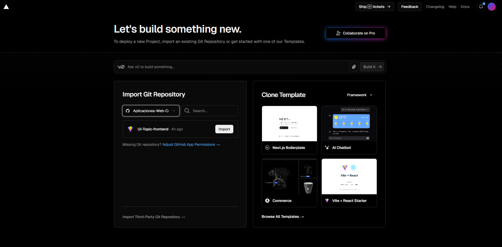

2. Se seleccionó el repositorio `UI-Topic-frontend` y se configuró el proyecto.
   Vercel detectó automáticamente que se trataba de un proyecto Vue 3, por lo que sugirió las configuraciones por defecto para el build.

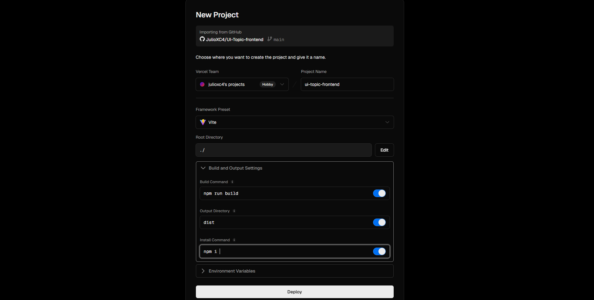

3. Se verificaron las configuraciones:

- **Framework**: Vue.js
- **Build Command**: `npm run build`
- **Output Directory**: `dist`

Se procedió a desplegar haciendo clic en **"Deploy"**.

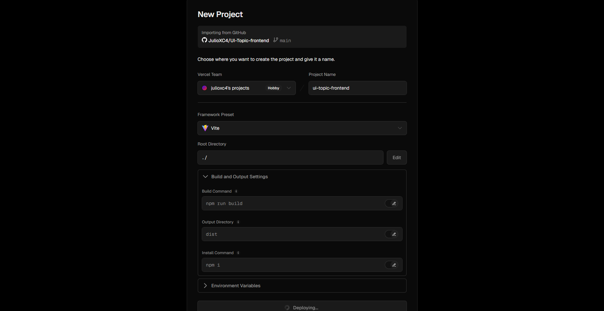

4. El proceso de build y despliegue fue iniciado por Vercel, mostrando en tiempo real los logs del pipeline.

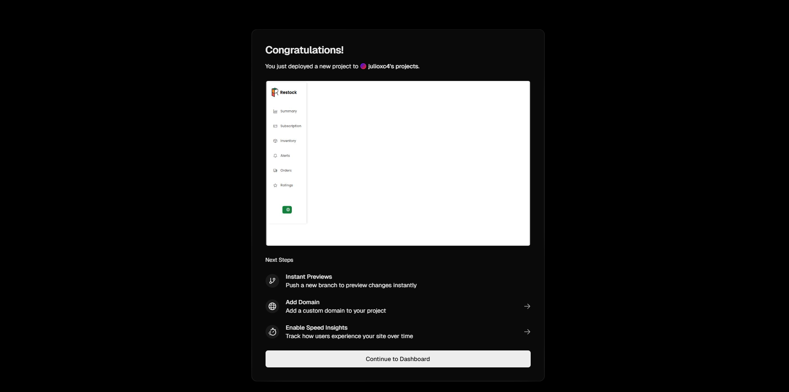

5. Una vez finalizado el despliegue, se mostró la URL pública de acceso a la aplicación.
   Se probó exitosamente el funcionamiento de la aplicación en dicha URL.

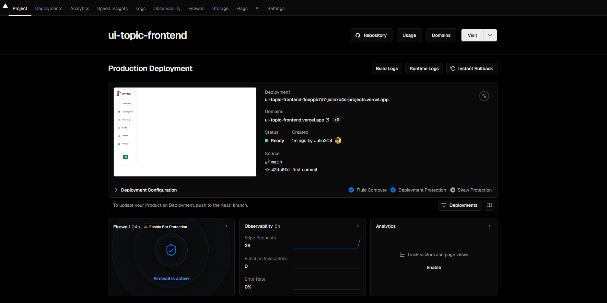

[https://ui-topic-frontend.vercel.app/](https://ui-topic-frontend.vercel.app/)

#### 5.2.2.8 Team Collaboration Insights during Sprint.

Durante el sprint, se adoptaron estrategias de colaboración efectivas que permitieron un desarrollo fluido y bien organizado del proyecto. A continuación se detallan las prácticas aplicadas:

- Se crearon ramas específicas por funcionalidad o sección, siguiendo la convención `feature/[nombre-de-seccion]`. Esto facilitó un trabajo paralelo sin conflictos y mantuvo el repositorio estructurado.
- Cada integrante fue responsable del desarrollo de una o más secciones del frontend, distribuyéndose el trabajo de forma equitativa.
- Se realizaron **commits frecuentes y atómicos**, lo que permitió un seguimiento detallado del progreso y facilitó la revisión del código.
- Todas las funcionalidades fueron integradas a través de *pull requests* hacia la rama `develop`, garantizando control de calidad mediante revisiones cruzadas.
- La comunicación entre los miembros del equipo fue constante, utilizando la plataforma **Discord** como canal principal para coordinación diaria, resolución de dudas y toma de decisiones técnicas.
- Se aplicaron buenas prácticas de control de versiones con Git, como descripciones claras en los commits, ramas temáticas, y revisión colaborativa mediante PRs.
- El equipo también se enfocó en la calidad del código, utilizando estructuras consistentes, siguiendo estándares de codificación, y asegurando coherencia en estilos y convenciones.

##### **Analíticos de colaboración**

**1. Landing Page:**

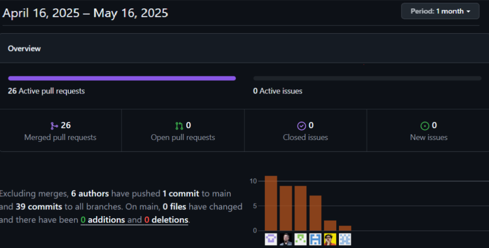

- Total de commits realizados: **39**
- Total de autores contribuyentes: **5**
- Nivel de participación equilibrado entre todos los miembros
- El gráfico muestra una distribución consistente de actividad a lo largo del sprint

**2. Web Application (Frontend):**

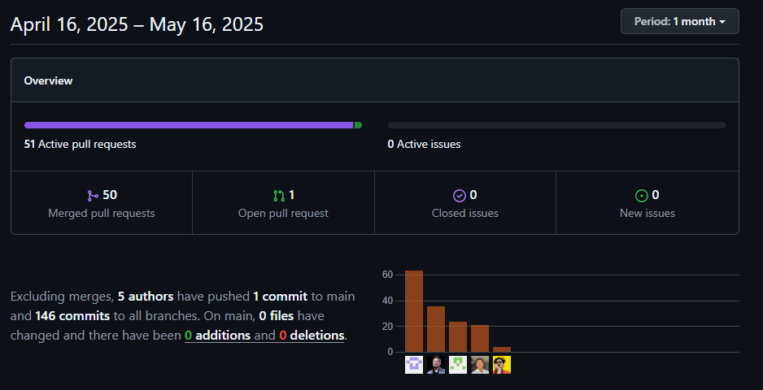

- Total de commits realizados: **146**
- Total de autores contribuyentes: **5**
- Nivel de participación equilibrado entre todos los miembros
- El gráfico muestra una distribución consistente de actividad a lo largo del sprint

##### **Analíticos de *commits* y *pull requests* en GitHub**

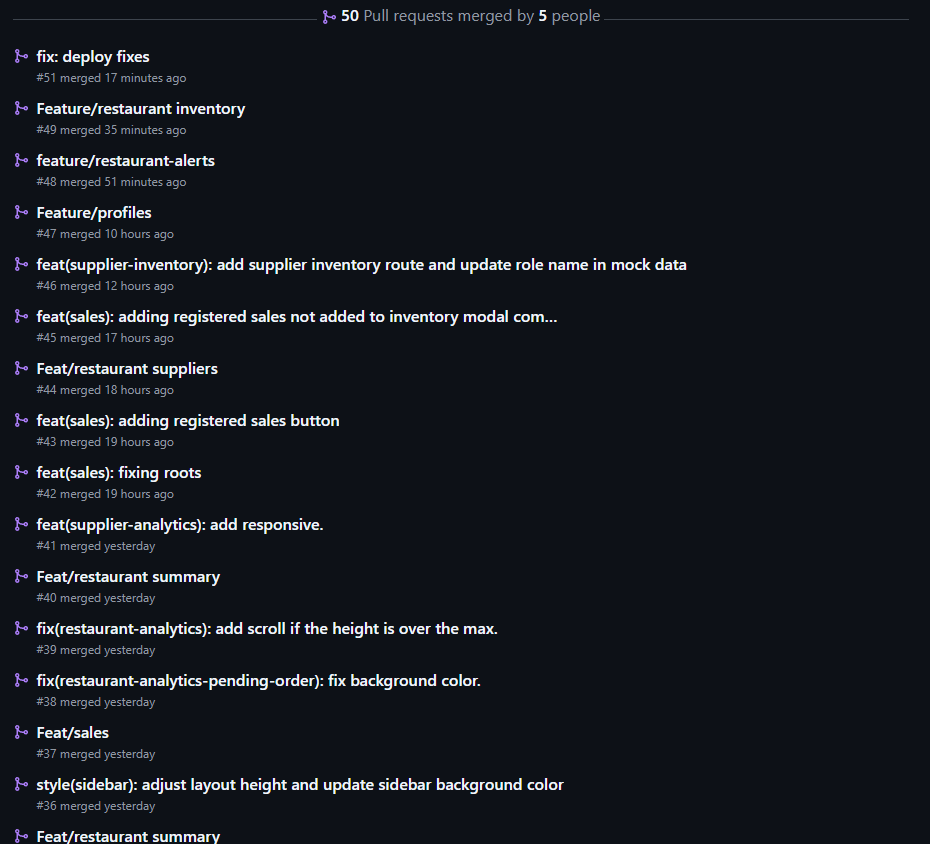

- Total de *pull requests* registradas: **50**
- *Pull requests* actualmente abiertas: **1**
- Todas las PRs contaron con revisiones por al menos un miembro del equipo
- El flujo de integración continua fue respetado en todas las funcionalidades importantes

Estas métricas reflejan una colaboración activa, estructurada y bien gestionada por parte del equipo, lo que contribuyó significativamente a la calidad final del producto entregado.

### Recursos del Sprint

| Recurso              | Acción implementada                                | Método HTTP | URL / Endpoint                                                 | Link de repositorio                                             |
| -------------------- | --------------------------------------------------- | ------------ | -------------------------------------------------------------- | --------------------------------------------------------------- |
| Landing Page         | Visualización completa y funcional del landing     | GET          | https://aplicaciones-web-curso-upc.github.io/UI-Topic-landing/ | https://github.com/Aplicaciones-Web-Curso-UPC/UI-Topic-landing  |
| UI del sistema (WIP) | Avance en el sistema (menú, dashboard, inventario) | GET          | https://ui-topic-frontend.vercel.app/dashboard                 | https://github.com/Aplicaciones-Web-Curso-UPC/UI-Topic-frontend |

### 5.2.3. Sprint 3

#### 5.2.3.1. Sprint Planning 3

| Sprint #                             | Sprint 3                                                                                                                                                                                                                                                                                                                                                                                                                                                                                                                                                                                                                                                                                                                                                                                                                                                                                                                                                                                                                                                                                                                                                                                                                                                                                                                                                                                                                                                                                                                                                                                                                                                                                                                                                                                                                                                                                                                                             |
| ------------------------------------ | ---------------------------------------------------------------------------------------------------------------------------------------------------------------------------------------------------------------------------------------------------------------------------------------------------------------------------------------------------------------------------------------------------------------------------------------------------------------------------------------------------------------------------------------------------------------------------------------------------------------------------------------------------------------------------------------------------------------------------------------------------------------------------------------------------------------------------------------------------------------------------------------------------------------------------------------------------------------------------------------------------------------------------------------------------------------------------------------------------------------------------------------------------------------------------------------------------------------------------------------------------------------------------------------------------------------------------------------------------------------------------------------------------------------------------------------------------------------------------------------------------------------------------------------------------------------------------------------------------------------------------------------------------------------------------------------------------------------------------------------------------------------------------------------------------------------------------------------------------------------------------------------------------------------------------------------------------- |
| **Sprint Planning Background** |                                                                                                                                                                                                                                                                                                                                                                                                                                                                                                                                                                                                                                                                                                                                                                                                                                                                                                                                                                                                                                                                                                                                                                                                                                                                                                                                                                                                                                                                                                                                                                                                                                                                                                                                                                                                                                                                                                                                                      |
| Date                                 | 2025-06-21                                                                                                                                                                                                                                                                                                                                                                                                                                                                                                                                                                                                                                                                                                                                                                                                                                                                                                                                                                                                                                                                                                                                                                                                                                                                                                                                                                                                                                                                                                                                                                                                                                                                                                                                                                                                                                                                                                                                           |
| Time                                 | 08:00 pm (GMT-5)                                                                                                                                                                                                                                                                                                                                                                                                                                                                                                                                                                                                                                                                                                                                                                                                                                                                                                                                                                                                                                                                                                                                                                                                                                                                                                                                                                                                                                                                                                                                                                                                                                                                                                                                                                                                                                                                                                                                     |
| Location                             | Modalidad remota mediante la plataforma Discord                                                                                                                                                                                                                                                                                                                                                                                                                                                                                                                                                                                                                                                                                                                                                                                                                                                                                                                                                                                                                                                                                                                                                                                                                                                                                                                                                                                                                                                                                                                                                                                                                                                                                                                                                                                                                                                                                                      |
| Prepared By                          | Guerra Perez, José Jahaziel                                                                                                                                                                                                                                                                                                                                                                                                                                                                                                                                                                                                                                                                                                                                                                                                                                                                                                                                                                                                                                                                                                                                                                                                                                                                                                                                                                                                                                                                                                                                                                                                                                                                                                                                                                                                                                                                                                                         |
| Attendees (to planning meeting)      | Avendaño Balarezo, Williams Eduardo / Castro Alejos, Julio / Guerra Perez, José Jahaziel<br /> / Guzmán Cabrejos, Yaku Mateo / Shapiama Rivera, Gabriela Nicole                                                                                                                                                                                                                                                                                                                                                                                                                                                                                                                                                                                                                                                                                                                                                                                                                                                                                                                                                                                                                                                                                                                                                                                                                                                                                                                                                                                                                                                                                                                                                                                                                                                                                                                                                                                   |
| Sprint 2 Review Summary              | Durante el Sprint 2 se logró una mejora significativa en la experiencia de inicio para nuevos usuarios,<br /> al rediseñar e integrar la landing page con el frontend principal de la aplicación web Restock. Se<br /> avanzó considerablemente en el desarrollo del módulo frontend, incorporando funcionalidades clave <br />como la gestión de inventario, notificaciones, analíticas y suscripciones para los perfiles de administradores <br />y proveedores.<br />El equipo demostró una sólida coordinación y colaboración en la implementación de estos <br />componentes, respetando los lineamientos definidos en la planificación. Como oportunidad de <br />mejora, se identificó la necesidad de fortalecer aún más la alineación del equipo con los objetivos <br />priorizados del sprint, para asegurar una entrega aún más consistente en próximos ciclos.                                                                                                                                                                                                                                                                                                                                                                                                                                                                                                                                                                                                                                                                                                                                                                                                                                                                                                                                                                                                                                                      |
| Sprint 2 Retrospective Summary       | Durante el Sprint 2, el equipo mantuvo una comunicación fluida y una coordinación efectiva,<br />lo cual permitió avanzar de forma sólida en varios módulos clave del frontend. La integración <br />continua, las revisiones cruzadas de código y la claridad en las responsabilidades asignadas <br />fueron aspectos destacados que facilitaron un buen ritmo de trabajo.<br />Como oportunidad de mejora, se identificó la necesidad de reforzar el seguimiento y <br />cumplimiento de los objetivos priorizados, así como de mejorar la estimación de tiempos en <br />algunos flujos más complejos. También se mencionó la importancia de alinear aún más los <br />esfuerzos individuales con los objetivos de entrega colectivos.                                                                                                                                                                                                                                                                                                                                                                                                                                                                                                                                                                                                                                                                                                                                                                                                                                                                                                                                                                                                                                                                                                                                                                                            |
| **Sprint Goal & User Stories** |                                                                                                                                                                                                                                                                                                                                                                                                                                                                                                                                                                                                                                                                                                                                                                                                                                                                                                                                                                                                                                                                                                                                                                                                                                                                                                                                                                                                                                                                                                                                                                                                                                                                                                                                                                                                                                                                                                                                                      |
| Sprint 3 Goal                       | Nuestro enfoque está en presentar de forma efectiva nuestra propuesta de valor a los nuevos visitantes. También, habilitar la gestión de recetas y pedidos, así como mejorar la sección de ventas, para los administradores de restaurantes; incorporar la gestión de órdenes para los proveedores; y, en general, permitir a ambos segmentos realizar el pago de su suscripción. Asimismo, proporcionar, mediante el API de la plataforma, puntos de accesos a los desarrolladores frontend para que implementen funcionalidades relacionadas con gestión de pedidos, ventas, recetas, inventario, perfil y comentarios.<br />Creemos que esto ofrece a los visitantes mayor confianza hacia el equipo de trabajo y les permite conocer mejor la propuesta de valor. Del mismo modo, mejora los flujos de usuario, al permitir la realización de pagos de suscripción; agiliza las operaciones para los administradores de restaurantes, al facilitar la creación y gestión de ventas, la configuración de recetas y la gestión de pedidos; optimiza el tiempo operativo para los proveedores, al permitir el seguimiento de pedidos. Además, permite a los desarrolladores frontend implementar funcionalidades esenciales de forma más eficiente, incluyendo pedidos, ventas, recetas, inventario, perfil y comentarios.<br />Esto se confirmará cuando aumente la cantidad de visitantes que se registren en la plataforma. Del mismo modo, cuando se incremente la cantidad de ordenes, ventas e insumos que registran administradores de restaurantes en la plataforma; aumente el número de insumos registrados y órdenes gestionadas por los proveedores; y se incremente la cantidad de suscripciones por parte de ambos segmentos. Además, cuando los desarrolladores frontend aumenten la cantidad de funcionalidades relacionadas con el pedidos, ventas, recetas, inventario, perfil y comentarios en el frontend. |
| Sprint 3 Velocity                    | 60                                                                                                                                                                                                                                                                                                                                                                                                                                                                                                                                                                                                                                                                                                                                                                                                                                                                                                                                                                                                                                                                                                                                                                                                                                                                                                                                                                                                                                                                                                                                                                                                                                                                                                                                                                                                                                                                                                                                                   |
| Sum of Story Points                  | 57                                                                                                                                                                                                                                                                                                                                                                                                                                                                                                                                                                                                                                                                                                                                                                                                                                                                                                                                                                                                                                                                                                                                                                                                                                                                                                                                                                                                                                                                                                                                                                                                                                                                                                                                                                                                                                                                                                                                                   |

#### 5.2.3.2. Aspect Leaders and Collaborators.

Durante el Sprint 3,  se ha definido el desarrollo e integración de los módulos principales del frontend de la aplicación web interna  Restock  y del backend, abarcando funcionalidades clave como la gestión de productos, pedidos, inventario y compras. Estas implementaciones buscan optimizar los procesos internos y mejorar la trazabilidad del inventario, brindando mayor eficiencia a los administradores de restaurantes y su personal.

Con el fin de mantener una coordinación efectiva y una comunicación fluida entre los integrantes del equipo, se estructuró la matriz de liderazgo y colaboración (LACX), donde se asignó un líder (L) encargado de cada funcionalidad y colaboradores (C) que brindan apoyo en su implementación.

<div style="font-size: 0.75em; overflow-x: auto;">

| Team Member (Last Name, First Name) | GitHub Username    | Planning | Subscription | Profile | IAM | Analytics | Resource | Monitoring |
| :---------------------------------- | :----------------- | :------- | :----------- | :------ | :-- | :-------- | :------- | :--------- |
| Vendaño Balarezo, Williams Eduardo | dev-willy-code     | C        | L            | L       | L   | C         | C        | C          |
| Castro Alejos, Julio                | JulioXC4           | C        | C            | C       | C   | C         | C        | C          |
| Guerra Perez, José Jahaziel        | jahazielgg         | L        | C            | C       | C   | L         | L        | L          |
| Guzmán Cabrejos, Yaku Mateo        | yak-cod            | C        | C            | C       | C   | C         | C        | C          |
| Shapiama Rivera, Gabriela Nicole    | GabrielaShapiama28 | C        | C            | C       | C   | C         | C        | C          |

</div>

#### 5.2.3.3 Sprint Backlog 3

El objetivo principal de este Sprint es consolidar una experiencia funcional completa para los distintos perfiles de usuario dentro de la plataforma Restock. Se prioriza la mejora de la landing page para comunicar eficazmente la propuesta de valor a nuevos visitantes, así como la habilitación de módulos clave como la gestión de ventas, recetas y pedidos para los administradores de restaurantes, y la gestión de órdenes para los proveedores.

Asimismo, se trabajará en la integración del flujo de pagos por suscripción y en la provisión de APIs REST documentadas, permitiendo al equipo frontend consumir endpoints de forma eficiente para construir las vistas requeridas. Este enfoque integral busca mejorar la usabilidad, operatividad y cohesión entre el frontend y backend, facilitando la validación funcional de la plataforma y avanzando hacia su adopción por parte de los usuarios finales.

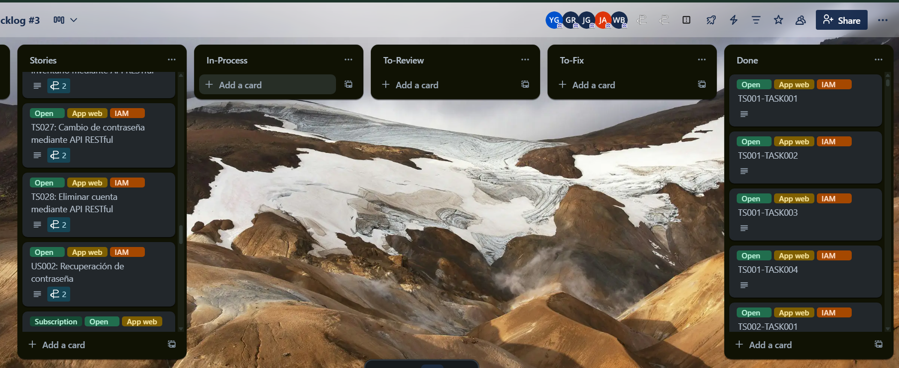

<table>
<thead>
        <!-- Fila 1: Sprint # y Sprint n -->
        <tr>
            <th>Sprint #</th>
            <th>Sprint n</th>
            <th></th>
            <th></th>
            <th></th>
            <th></th>
            <th></th>
            <th></th>
        </tr>
        <tr>
            <th>User Story</th>
            <th></th>
            <th>Work-item / Task</th>
            <th></th>
            <th></th>
            <th></th>
            <th></th>
            <th></th>
        </tr>
        <tr>
            <th>Id</th>
            <th>Title</th>
            <th>Id</th>
            <th>Title</th>
            <th>Description</th>
            <th>Estimation (hours)</th>
            <th>Assigned To</th>
            <th>Status (To-do / In-Process / To-Review / Done)</th>
        </tr>
    </thead>
    <tbody>
    <tr>
        <td>US-04</td>
        <td>Gestión manual de stock e insumos</td>
        <td>T001</td>
        <td>Implementar interfaz de edición de stock e insumo</td>
        <td>Diseñar y desarrollar un formulario o sección para que el administrador registre el stock actual, nivel máximo y descuentos manuales. Incluir campos necesarios y diseño validado con UX básico.</td>
        <td>1h</td>
        <td>Jahaziel Guerra</td>
        <td>Done</td>
    </tr>
    <tr>
        <td></td>
        <td></td>
        <td>T002</td>
        <td>Validar entradas de stock en frontend y backend</td>
        <td>Agregar validaciones tanto para evitar valores negativos o no numéricos en stock, nivel máximo y descuento. Incluir advertencias o bloqueos según corresponda.</td>
        <td>1h</td>
        <td>Jahaziel Guerra</td>
        <td>Done</td>
    </tr>
    <tr>
        <td></td>
        <td></td>
        <td>T003</td>
        <td>Desarrollar lógica de actualización de stock</td>
        <td>Implementar lógica para actualizar el stock de un insumo, aplicando registros nuevos, con control de errores y advertencias.</td>
        <td>1h</td>
        <td>Jahaziel Guerra</td>
        <td>Done</td>
    </tr>
    <tr>
        <td></td>
        <td></td>
        <td>T004</td>
        <td>Registrar compras y actualizar stock</td>
        <td>Crear el flujo completo para registrar una compra de insumo: formulario, validaciones, actualización de stock, y registro del costo en historial.</td>
        <td>1h</td>
        <td>Jahaziel Guerra</td>
        <td>Done</td>
    </tr>
    <tr>
        <td></td>
        <td></td>
        <td>T005</td>
        <td>Manejar mensajes de éxito y error en la interfaz</td>
        <td>Integrar mensajes visuales para notificar al usuario sobre operaciones exitosas (registro, actualización, descuento) y errores (validaciones, datos faltantes o inválidos).</td>
        <td>2h</td>
        <td>Jahaziel Guerra</td>
        <td>Done</td>
    </tr>
    <tr>
        <td>US-05</td>
        <td>Gestión integral de notificaciones de inventario</td>
        <td>T001</td>
        <td>Mostrar alertas visuales en listado de inventario</td>
        <td>Implementar lógica y diseño en la vista de inventario</td>
        <td>1/2h</td>
        <td>Yaku Guzmán</td>
        <td>Done</td>
    </tr>
    <tr>
        <td></td>
        <td></td>
        <td>T002</td>
        <td>Integrar bandera de vencimiento</td>
        <td>A partir de la fecha de vencimiento de cada insumo, calcular si debe marcarse como próximo a vencer. Mostrar tooltip o badge indicando días restantes si corresponde.</td>
        <td>2h</td>
        <td>Yaku Guzmán</td>
        <td>Done</td>
    </tr>
    <tr>
        <td></td>
        <td></td>
        <td>T003</td>
        <td>Habilitar y mostrar configuración de notificaciones automáticas</td>
        <td>Agregar en una sección donde el administrador pueda habilitar/deshabilitar las notificaciones automáticas.</td>
        <td>2h</td>
        <td>Yaku Guzmán</td>
        <td>Done</td>
    </tr>
    <tr>
        <td></td>
        <td></td>
        <td>T004</td>
        <td>Mostrar aviso en la interfaz si hay notificaciones recientes</td>
        <td>Agregar un componente de notificación que muestre alertas recientes de vencimiento o bajo stock si han sido enviadas.</td>
        <td>1h</td>
        <td>Yaku Guzmán</td>
        <td>Done</td>
    </tr>
    <tr>
        <td>US-06</td>
        <td>Enviar comentarios y calificaciones sobre pedidos</td>
        <td>T001</td>
        <td>Crear componente de retroalimentación para pedidos entregados</td>
        <td>Diseñar e implementar un componente reutilizable que permita al administrador de restaurante ver un pedido entregado.</td>
        <td>1h</td>
        <td>Yaku Guzmán</td>
        <td>Done</td>
    </tr>
    <tr>
        <td></td>
        <td></td>
        <td>T002</td>
        <td>Validar calificación y comentario en frontend</td>
        <td>Agregar validaciones al formulario de retroalimentación</td>
        <td>1h</td>
        <td>Yaku Guzmán</td>
        <td>Done</td>
    </tr>
    <tr>
        <td></td>
        <td></td>
        <td>T003</td>
        <td>Enviar retroalimentación y mostrar confirmación</td>
        <td>Registrar la retroalimentación asegurándose de enviar el ID del pedido, calificación y comentario.</td>
        <td>1h</td>
        <td>Yaku Guzmán</td>
        <td>Done</td>
    </tr>
    <tr>
        <td>US-07</td>
        <td>Gestionar productos en el inventario</td>
        <td>T001</td>
        <td>Implementar vista de listado y estados de productos del proveedor</td>
        <td>Crear una vista que muestre todos los productos registrados del proveedor</td>
        <td>2h</td>
        <td>Julio Castro</td>
        <td>Done</td>
    </tr>
    <tr>
        <td></td>
        <td></td>
        <td>T002</td>
        <td>Crear formulario unificado para registrar y editar productos</td>
        <td>Implementar un formulario reutilizable para crear o editar productos</td>
        <td>1h</td>
        <td>Julio Castro</td>
        <td>Done</td>
    </tr>
    <tr>
        <td></td>
        <td></td>
        <td>T003</td>
        <td>Integrar acciones CRUD en el catálogo del proveedor</td>
        <td>Desde la vista del listado: Permitir crear un nuevo producto (abre formulario), Permitir editar un producto existente, Permitir eliminar un producto con confirmación, Permitir activar/desactivar un producto con botones de cambio de estado.</td>
        <td>1h</td>
        <td>Julio Castro</td>
        <td>Done</td>
    </tr>
    <tr>
        <td>US-15</td>
        <td>Actualización manual de estado del inventario</td>
        <td>T001</td>
        <td>Diseñar pantalla de edición manual de inventario</td>
        <td>Diseñar pantalla de edición manual de inventario con campos editables por insumo.</td>
        <td>2h</td>
        <td>Julio Castro</td>
        <td>Done</td>
    </tr>
    <tr>
        <td></td>
        <td></td>
        <td>T002</td>
        <td>Validar cantidades ingresadas en pantalla de edición</td>
        <td>Implementar la lógica de validación de cantidades ingresadas.</td>
        <td>2h</td>
        <td>Julio Castro</td>
        <td>Done</td>
    </tr>
    <tr>
        <td></td>
        <td></td>
        <td>T003</td>
        <td>Mostrar confirmación de inventario actualizado</td>
        <td>Mostrar confirmación visual de inventario actualizado correctamente.</td>
        <td>1/2h</td>
        <td>Julio Castro</td>
        <td>Done</td>
    </tr>
    <tr>
        <td></td>
        <td></td>
        <td>T004</td>
        <td>Mostrar errores por valores inválidos</td>
        <td>Agregar mensajes de error si los valores ingresados son inválidos.</td>
        <td>1h</td>
        <td>Julio Castro</td>
        <td>Done</td>
    </tr>
    <tr>
        <td></td>
        <td></td>
        <td>T005</td>
        <td>Integrar pantalla de edición con vista principal</td>
        <td>Integrar la pantalla a la vista principal de administración de insumos.</td>
        <td>1h</td>
        <td>Gabriela Shapiama</td>
        <td>Done</td>
    </tr>
    <tr>
        <td></td>
        <td></td>
        <td>T006</td>
        <td>Documentar proceso de actualización manual</td>
        <td>Documentar el proceso de actualización manual desde el frontend.</td>
        <td>1h</td>
        <td>Gabriela Shapiama</td>
        <td>Done</td>
    </tr>
    <tr>
        <td>US-17</td>
        <td>Seguimiento de una orden</td>
        <td>T001</td>
        <td>Diseñar vista de seguimiento de estado de orden</td>
        <td>Diseñar vista para mostrar y seleccionar el estado actual de cada orden.</td>
        <td>1h</td>
        <td>Gabriela Shapiama</td>
        <td>Done</td>
    </tr>
    <tr>
        <td></td>
        <td></td>
        <td>T002</td>
        <td>Implementar selector de estado gráfico</td>
        <td>Implementar selector gráfico para cambiar el estado (en espera, preparando, en camino, entregado).</td>
        <td>1h</td>
        <td>Gabriela Shapiama</td>
        <td>Done</td>
    </tr>
    <tr>
        <td></td>
        <td></td>
        <td>T003</td>
        <td>Actualizar color según estado</td>
        <td>Actualizar colores de la fila de la orden de acuerdo al estado actual.</td>
        <td>1h</td>
        <td>Gabriela Shapiama</td>
        <td>Done</td>
    </tr>
    <tr>
        <td></td>
        <td></td>
        <td>T004</td>
        <td>Documentar flujo de seguimiento de órdenes</td>
        <td>Documentar el flujo visual de seguimiento de una orden.</td>
        <td>1/2h</td>
        <td>Gabriela Shapiama</td>
        <td>Done</td>
    </tr>
    <tr>
        <td>US-19</td>
        <td>Visualizar y gestionar ordenes recibidas</td>
        <td>T001</td>
        <td>Crear listado de órdenes recibidas</td>
        <td>Crear pantalla con listado de órdenes solicitadas (tabla).</td>
        <td>1h</td>
        <td>Gabriela Shapiama</td>
        <td>Done</td>
    </tr>
    <tr>
        <td></td>
        <td></td>
        <td>T002</td>
        <td>Implementar modal para actualizar situación de orden</td>
        <td>Implementar modal para actualizar la situación de una orden (aceptado o denegado) y establecer fecha estimada de entrega.</td>
        <td>1h</td>
        <td>Williams Avendaño</td>
        <td>Done</td>
    </tr>
    <tr>
        <td></td>
        <td></td>
        <td>T003</td>
        <td>Habilitar ordenamiento por fecha</td>
        <td>Permitir ordenamiento por fecha.</td>
        <td>2h</td>
        <td>Williams Avendaño</td>
        <td>Done</td>
    </tr>
    <tr>
        <td></td>
        <td></td>
        <td>T004</td>
        <td>Optimizar ordenamiento por fecha</td>
        <td>Permitir ordenamiento por fecha.</td>
        <td>1/2h</td>
        <td>Williams Avendaño</td>
        <td>Done</td>
    </tr>
    <tr>
        <td></td>
        <td></td>
        <td>T005</td>
        <td>Agregar acceso rápido al detalle de orden</td>
        <td>Incluir botón de acceso rápido al detalle de cada orden.</td>
        <td>1h</td>
        <td>Williams Avendaño</td>
        <td>Done</td>
    </tr>
    <tr>
        <td></td>
        <td></td>
        <td>T006</td>
        <td>Sincronizar lista de órdenes en tiempo real</td>
        <td>Actualizar automáticamente lista si hay cambios recientes.</td>
        <td>1h</td>
        <td>Williams Avendaño</td>
        <td>Done</td>
    </tr>
    <tr>
        <td></td>
        <td></td>
        <td>T007</td>
        <td>Documentar vista de gestión de órdenes</td>
        <td>Documentar funcionalidad de visualización y gestión de órdenes.</td>
        <td>1h</td>
        <td>Williams Avendaño</td>
        <td>Done</td>
    </tr>
    <tr>
        <td>US-20</td>
        <td>Visualizar información específica de una orden</td>
        <td>T001</td>
        <td>Diseñar vista detallada de una orden</td>
        <td>Diseñar vista detallada que muestre todos los campos de una orden (ítems, cantidades, cliente, etc.).</td>
        <td>1h</td>
        <td>Williams Avendaño</td>
        <td>Done</td>
    </tr>
    <tr>
        <td></td>
        <td></td>
        <td>T002</td>
        <td>Implementar navegación desde listado al detalle</td>
        <td>Implementar navegación desde listado general a detalle de orden.</td>
        <td>1h</td>
        <td>Jahaziel Guerra</td>
        <td>Done</td>
    </tr>
    <tr>
        <td></td>
        <td></td>
        <td>T003</td>
        <td>Mostrar estado y fecha estimada de entrega</td>
        <td>Mostrar estado actual y fecha estimada de entrega.</td>
        <td>1h</td>
        <td>Jahaziel Guerra</td>
        <td>Done</td>
    </tr>
    <tr>
        <td></td>
        <td></td>
        <td>T004</td>
        <td>Agregar sección de observaciones en detalle de orden</td>
        <td>Agregar sección para observaciones o notas de la orden.</td>
        <td>1/2h</td>
        <td>Jahaziel Guerra</td>
        <td>Done</td>
    </tr>
    <tr>
        <td></td>
        <td></td>
        <td>T005</td>
        <td>Documentar visualización detallada de orden</td>
        <td>Documentar visualización específica de orden por ID.</td>
        <td>1h</td>
        <td>Jahaziel Guerra</td>
        <td>Done</td>
    </tr>
    <tr>
        <td>US-21</td>
        <td>Visualizar historial de órdenes por restaurante</td>
        <td>T001</td>
        <td>Crear sección de historial por restaurante</td>
        <td>Crear sección que agrupe órdenes completadas por restaurante.</td>
        <td>1h</td>
        <td>Jahaziel Guerra</td>
        <td>Done</td>
    </tr>
    <tr>
        <td></td>
        <td></td>
        <td>T002</td>
        <td>Implementar búsqueda de restaurante por nombre</td>
        <td>Permitir búsqueda de restaurante por nombre.</td>
        <td>2h</td>
        <td>Jahaziel Guerra</td>
        <td>Done</td>
    </tr>
    <tr>
        <td></td>
        <td></td>
        <td>T003</td>
        <td>Ordenar historial por fecha</td>
        <td>Mostrar las órdenes en orden cronológico según se prefiera.</td>
        <td>1h</td>
        <td>Jahaziel Guerra</td>
        <td>Done</td>
    </tr>
    <tr>
        <td></td>
        <td></td>
        <td>T004</td>
        <td>Mostrar detalles básicos en historial</td>
        <td>Incluir detalles básicos como fecha, monto y estado.</td>
        <td>1h</td>
        <td>Jahaziel Guerra</td>
        <td>Done</td>
    </tr>
    <tr>
        <td></td>
        <td></td>
        <td>T005</td>
        <td>Implementar paginación en historial</td>
        <td>Implementar paginación para historial largo.</td>
        <td>2h</td>
        <td>Jahaziel Guerra</td>
        <td>Done</td>
    </tr>
    <tr>
        <td></td>
        <td></td>
        <td>T006</td>
        <td>Documentar historial de órdenes por restaurante</td>
        <td>Documentar flujo del historial por restaurante.</td>
        <td>1h</td>
        <td>Yaku Guzmán</td>
        <td>Done</td>
    </tr>
    <tr>
        <td>US-22</td>
        <td>Descargar reportes de historial de órdenes cumplidas</td>
        <td>T001</td>
        <td>Diseñar botón de exportación de reportes</td>
        <td>Diseñar botón de exportación en pantalla de historial.</td>
        <td>1h</td>
        <td>Yaku Guzmán</td>
        <td>Done</td>
    </tr>
    <tr>
        <td></td>
        <td></td>
        <td>T002</td>
        <td>Confirmar descarga de reporte</td>
        <td>Solicitar confirmación antes de descargar reporte.</td>
        <td>1/2h</td>
        <td>Yaku Guzmán</td>
        <td>Done</td>
    </tr>
    <tr>
        <td></td>
        <td></td>
        <td>T003</td>
        <td>Notificar resultado de descarga</td>
        <td>Dar feedback si la descarga fue exitosa o hubo errores.</td>
        <td>1h</td>
        <td>Yaku Guzmán</td>
        <td>Done</td>
    </tr>
    <tr>
        <td></td>
        <td></td>
        <td>T004</td>
        <td>Documentar proceso de exportación de reportes</td>
        <td>Documentar proceso de descarga de reportes desde interfaz.</td>
        <td>1h</td>
        <td>Yaku Guzmán</td>
        <td>Done</td>
    </tr>
    <tr>
        <td>TS-06</td>
        <td>Gestionar insumos  mediante API RESTful</td>
        <td>T001</td>
        <td>Crear endpoint para obtener insumos por ID de proveedor</td>
        <td>Implementar endpoint GET /api/v1/supplies/:id (Listar insumos del proveedor)</td>
        <td>1h</td>
        <td>Yaku Guzmán</td>
        <td>Done</td>
    </tr>
    <tr>
        <td></td>
        <td></td>
        <td>T002</td>
        <td>Crear endpoint para registrar nuevos insumos</td>
        <td>Implementar endpoint POST /api/v1/supplies (Crear nuevo insumo)</td>
        <td>h</td>
        <td>Yaku Guzmán</td>
        <td>Done</td>
    </tr>
    <tr>
        <td></td>
        <td></td>
        <td>T003</td>
        <td>Crear endpoint para actualizar insumo existente</td>
        <td>Implementar endpoint PUT /api/v1/supplies/{id} (Actualizar insumo)</td>
        <td>1h</td>
        <td>Yaku Guzmán</td>
        <td>Done</td>
    </tr>
    <tr>
        <td></td>
        <td></td>
        <td>T004</td>
        <td>Crear endpoint para eliminar insumo</td>
        <td>Implementar endpoint DELETE /api/v1/productos/{id} (Eliminar insumo)</td>
        <td>2h</td>
        <td>Yaku Guzmán</td>
        <td>Done</td>
    </tr>
    <tr>
        <td></td>
        <td></td>
        <td>T005</td>
        <td>Crear endpoint para cambiar estado de insumo</td>
        <td>Implementar endpoint PATCH /api/v1/productos/{id}/estado (Cambiar estado del insumo)</td>
        <td>2h</td>
        <td>Yaku Guzmán</td>
        <td>Done</td>
    </tr>
    <tr>
        <td></td>
        <td></td>
        <td>T006</td>
        <td>Validar entradas y manejar errores en insumos</td>
        <td>Validación y manejo de errores para creación y actualización</td>
        <td>1h</td>
        <td>Yaku Guzmán</td>
        <td>Done</td>
    </tr>
    <tr>
        <td></td>
        <td></td>
        <td>T007</td>
        <td>Escribir pruebas unitarias para endpoints de insumos</td>
        <td>Implementar pruebas unitarias para todos los endpoints</td>
        <td>2h</td>
        <td>Julio Castro</td>
        <td>Done</td>
    </tr>
    <tr>
        <td>TS-09</td>
        <td>Crear recetas mediante API RESTful</td>
        <td>T001</td>
        <td>Definir endpoint para registrar recetas</td>
        <td>Definir endpoint POST /api/v1/recipes en el controlador</td>
        <td>2h</td>
        <td>Julio Castro</td>
        <td>Done</td>
    </tr>
    <tr>
        <td></td>
        <td></td>
        <td>T002</td>
        <td>Validar campos requeridos en receta</td>
        <td>Validar campos requeridos en payload (nombre, ingredientes)</td>
        <td>1h</td>
        <td>Julio Castro</td>
        <td>Done</td>
    </tr>
    <tr>
        <td></td>
        <td></td>
        <td>T003</td>
        <td>Persistir relación entre receta e insumos</td>
        <td>Crear lógica de persistencia con relación a insumos</td>
        <td>2h</td>
        <td>Julio Castro</td>
        <td>Done</td>
    </tr>
    <tr>
        <td></td>
        <td></td>
        <td>T005</td>
        <td>Escribir pruebas para endpoint de recetas</td>
        <td>Escribir test unitario y de integración para el endpoint</td>
        <td>1h</td>
        <td>Julio Castro</td>
        <td>Done</td>
    </tr>
    </tbody>
</table>

Trello: [https:/linkcuts.org/9b6h7g0n](https://shorturl.at/zMioJ)

#### 5.2.3.4 Development Evidence for Sprint Review

**Landing page:**

Se ha actualizado la sección de tutoriales del sitio para ofrecer una experiencia más dinámica e intuitiva. Ahora, los videos pueden mostrarse en formato YouTube, lo que facilita su visualización directa en la página y mejora la integración de contenido educativo en la interfaz. Esta mejora busca hacer que el aprendizaje y la navegación sean más accesibles y eficientes para todos los usuarios.

| Repository                   | Branch  | Author      | Commit Id | Commit Message                                               | Commit Message Body                                                                                      | Commited on (Date) |
| ---------------------------- | ------- | ----------- | --------- | ------------------------------------------------------------ | -------------------------------------------------------------------------------------------------------- | ------------------ |
| Yaku Guzman/UI-Topic-landing | develop | Yaku Guzman | a1b950d   | feat(tutorial-section): add youtube format to tutorial video | Added support to embed YouTube videos in the tutorial section using a responsive video player component. | 30-05-2025         |

**Web Application Application (Frontend):**

Se avanzó considerablemente en el desarrollo del frontend de la plataforma, enfocada en la gestión de pedidos, perfiles de usuario, inventario y relaciones con proveedores. Se implementó soporte para múltiples idiomas (i18n), se reorganizaron y mejoraron los módulos de perfil y pedidos, y se integraron nuevas funcionalidades como filtros avanzados, exportación de datos y validaciones. También se refinaron componentes visuales y formularios dinámicos para mejorar la experiencia del usuario, y se adaptaron estructuras clave como los lotes en pedidos y suministros. Estos cambios buscan robustecer la plataforma y facilitar su uso en distintos contextos operativos.

| Repository                            | Branch  | Author              | Commit Id | Commit Message                                                                                                                   | Commit Message Body                                                                                                                                    | Commited on (Date) |
| ------------------------------------- | ------- | ------------------- | --------- | -------------------------------------------------------------------------------------------------------------------------------- | ------------------------------------------------------------------------------------------------------------------------------------------------------ | ------------------ |
| GabrielaShapiama/UI-Topic-Frontend    | develop | GabrielaShapiama    | 311238a   | feat(orders): add i18n feature.                                                                                                  | Added internationalization support for the orders module to enable multilingual interfaces.                                                            | 21-06-2025         |
| GabrielaShapiama/UI-Topic-Frontend    | develop | GabrielaShapiama    | b99be69   | feat(profiles): add i18n feature.                                                                                                | Integrated i18n functionality to the profiles section for multi-language support.                                                                      | 21-06-2025         |
| GabrielaShapiama/UI-Topic-Frontend    | develop | GabrielaShapiama    | 3c71d65   | feat(business): change categories business data.                                                                                 | Updated the structure and content of business categories for improved consistency.                                                                     | 19-06-2025         |
| GabrielaShapiama/UI-Topic-Frontend    | develop | GabrielaShapiama    | 1d7963a   | fix(suppliers): delete suppliers section.                                                                                        | Removed the obsolete suppliers section from the application.                                                                                           | 19-06-2025         |
| GabrielaShapiama/UI-Topic-Frontend    | develop | GabrielaShapiama    | 673e2b8   | feat(sidebar): add profile information to sidebar.                                                                               | Added display of user profile info to the sidebar for better context visibility.                                                                       | 19-06-2025         |
| GabrielaShapiama/UI-Topic-Frontend    | develop | GabrielaShapiama    | feb6c71   | feat(iam): add session service.                                                                                                  | Implemented session service for user identity and access management.                                                                                   | 19-06-2025         |
| GabrielaShapiama/UI-Topic-Frontend    | develop | GabrielaShapiama    | 4fe96df   | feat(profiles): add update profile data option.                                                                                  | Enabled functionality for users to update their profile details.                                                                                       | 19-06-2025         |
| GabrielaShapiama/UI-Topic-Frontend    | develop | GabrielaShapiama    | 10d2408   | feat(profiles): add current data to profile details.                                                                             | Enhanced profile details view to include current stored values.                                                                                        | 19-06-2025         |
| GabrielaShapiama/UI-Topic-Frontend    | develop | GabrielaShapiama    | 92e558c   | feat(profiles): add personal data update.                                                                                        | Added feature to allow updating of personal information.                                                                                               | 19-06-2025         |
| GabrielaShapiama/UI-Topic-Frontend    | develop | GabrielaShapiama    | 8de255d   | feat(profiles): add security data update.                                                                                        | Introduced fields and logic to update security-related profile data.                                                                                   | 19-06-2025         |
| GabrielaShapiama/UI-Topic-Frontend    | develop | GabrielaShapiama    | 7058def   | fix(profiles): fix profiles calls.                                                                                               | Fixed incorrect service or method calls in the profile module to ensure accurate data handling.                                                        | 19-06-2025         |
| GabrielaShapiama/UI-Topic-Frontend    | develop | GabrielaShapiama    | 5ef2f1f   | refactor(profiles): change profile properties format.                                                                            | Refactored the profile entity to use updated property naming and structure.                                                                            | 19-06-2025         |
| GabrielaShapiama/UI-Topic-Frontend    | develop | GabrielaShapiama    | 4757b0c   | refactor(users): change user properties format.                                                                                  | Standardized the user entity properties to follow the new expected format.                                                                             | 19-06-2025         |
| GabrielaShapiama/UI-Topic-Frontend    | develop | GabrielaShapiama    | dda707e   | feat(profiles): add business assembler.                                                                                          | Added a new assembler to map business-related data in the profiles module.                                                                             | 19-06-2025         |
| GabrielaShapiama/UI-Topic-Frontend    | develop | GabrielaShapiama    | 3302606   | feat(profiles): add business service.                                                                                            | Created a service to manage business data operations linked to profiles.                                                                               | 19-06-2025         |
| GabrielaShapiama/UI-Topic-Frontend    | develop | GabrielaShapiama    | 7abecc1   | feat(profiles): add business entity.                                                                                             | Defined a new business entity model to support business data in the application.                                                                       | 19-06-2025         |
| GabrielaShapiama/UI-Topic-Frontend    | develop | GabrielaShapiama    | 3c0c4e7   | feat(profiles): add update business data.                                                                                        | Enabled the update functionality for business information in the profile section.                                                                      | 19-06-2025         |
| GabrielaShapiama/UI-Topic-Frontend    | develop | GabrielaShapiama    | 8e9ed60   | feat(fake-api): add missing batches instances.                                                                                   | Added missing batch instances to the fake API for testing and development consistency.                                                                 | 19-06-2025         |
| GabrielaShapiama/UI-Topic-Frontend    | develop | GabrielaShapiama    | 88263f5   | feat(fake-api): add emails to profiles.                                                                                          | Included email attributes in profile objects within the fake API.                                                                                      | 19-06-2025         |
| GabrielaShapiama/UI-Topic-Frontend    | develop | GabrielaShapiama    | 14f4b63   | feat(fake-api): add business instances.                                                                                          | Added mock business data instances to the fake API for testing profile-business relations.                                                             | 19-06-2025         |
| GabrielaShapiama/UI-Topic-Frontend    | develop | GabrielaShapiama    | 0a3f753   | feat(orders): add delete filters option                                                                                          | Introduced a UI feature allowing users to reset or remove order filters.                                                                               | 19-06-2025         |
| GabrielaShapiama/UI-Topic-Frontend    | develop | GabrielaShapiama    | d68b135   | chore(orders): change details format.                                                                                            | Adjusted the layout and structure of the order details section for better readability.                                                                 | 18-06-2025         |
| GabrielaShapiama/UI-Topic-Frontend    | develop | GabrielaShapiama    | ccd3e9d   | fix(orders): add update stock of supplier inventory function.                                                                    | Implemented logic to update supplier inventory stock upon receiving orders.                                                                            | 18-06-2025         |
| GabrielaShapiama/UI-Topic-Frontend    | develop | GabrielaShapiama    | af17d3a   | fix(fake-api): fix incorrect instances.                                                                                          | Corrected improperly structured or incomplete mock data in the fake API.                                                                               | 18-06-2025         |
| Repository                            | Branch  | Author              | Commit Id | Commit Message                                                                                                                   | Commit Message Body                                                                                                                                    | Commited on (Date) |
| Williams/UI-Topic-Frontend            | develop | Williams            | 375d9e4   | feat(subscriptions): updating .ts                                                                                                | Updated the TypeScript logic for the subscriptions module with improved typings or new fields.                                                         | 17-06-2025         |
| JulioXC4/UI-Topic-Frontend            | develop | JulioXC4            | 919fce5   | fix(orders-to-suppliers): fix orders details email and orders select by batches without supplies                                 | Fixed issues in order detail emails and adjusted selection logic for batches not linked to supplies.                                                   | 17-06-2025         |
| JulioXC4/UI-Topic-Frontend            | develop | JulioXC4            | be05520   | feat(orders-to-suppliers): fix orders details                                                                                    | Improved rendering and logic for displaying supplier order details correctly.                                                                          | 17-06-2025         |
| JulioXC4/UI-Topic-Frontend            | develop | JulioXC4            | a51cf30   | feat(order-to-suppliers): add comments in page orders                                                                            | Added support for comments within the supplier orders page.                                                                                            | 17-06-2025         |
| jahazielgg/UI-Topic-Frontend          | develop | jahazielgg          | 92243a0   | feat(notifications): rename alerts to notifications and implement tabbed display for inventory and order updates                 | Renamed alert terminology to notifications and introduced tabs to separate inventory and order updates.                                                | 17-06-2025         |
| Williams/UI-Topic-Frontend            | develop | Williams            | 106ca32   | feat(subscriptions): updating htm,ts                                                                                             | Updated HTML and TypeScript files to improve subscriptions section behavior and presentation.                                                          | 17-06-2025         |
| GabrielaShapiama/UI-Topic-Frontend    | develop | GabrielaShapiama    | 5e32c27   | feat(orders): add filters.                                                                                                       | Added filter functionality to the orders view for enhanced user search experience.                                                                     | 17-06-2025         |
| GabrielaShapiama/UI-Topic-Frontend    | develop | GabrielaShapiama    | cddd007   | feat(orders): add dependencies to export excel.                                                                                  | Integrated new libraries to support exporting orders to Excel.                                                                                         | 17-06-2025         |
| GabrielaShapiama/UI-Topic-Frontend    | develop | GabrielaShapiama    | d3c52aa   | feat(supplier-orders-overview): add update order option.                                                                         | Enabled the supplier to update order details from the overview component.                                                                              | 17-06-2025         |
| GabrielaShapiama/UI-Topic-Frontend    | develop | GabrielaShapiama    | 9dc4398   | feat(orders): add default value to description in order entity.                                                                  | Set a default description value when creating or updating order entities.                                                                              | 17-06-2025         |
| GabrielaShapiama/UI-Topic-Frontend    | develop | GabrielaShapiama    | 1b7a46a   | chore(order-details): delete innecessary methods.                                                                                | Cleaned up unused or redundant methods in the order-details component.                                                                                 | 17-06-2025         |
| GabrielaShapiama/UI-Topic-Frontend    | develop | GabrielaShapiama    | 51d1c16   | chore(manage-new-orders): delete innecessary attributes.                                                                         | Removed unneeded properties to streamline the manage-new-orders component.                                                                             | 17-06-2025         |
| GabrielaShapiama/UI-Topic-Frontend    | develop | GabrielaShapiama    | 5f17bb0   | feat(edit-order): add update data option.                                                                                        | Added the ability to update order data directly from the edit order component.                                                                         | 17-06-2025         |
| GabrielaShapiama/UI-Topic-Frontend    | develop | GabrielaShapiama    | daf1a87   | chore(delivered-orders): delete innecessary methods.                                                                             | Removed deprecated or unused methods from the delivered-orders module.                                                                                 | 17-06-2025         |
| GabrielaShapiama/UI-Topic-Frontend    | develop | GabrielaShapiama    | 920fe40   | feat(approved-orders): add emit edit order.                                                                                      | Enabled event emission for editing orders directly in the approved orders section.                                                                     | 17-06-2025         |
| JulioXC4/UI-Topic-Frontend            | develop | JulioXC4            | e1d8e68   | feat(orders-to-supplier): add comments functionality, full i18n support, responsive layout, profile updates, and UI improvements | Introduced comments in orders, added internationalization, enhanced layout responsiveness, and improved UI elements.                                   | 17-06-2025         |
| GabrielaShapiama/UI-Topic-Frontend    | develop | GabrielaShapiama    | c6ecf08   | feat(orders): change state section style.                                                                                        | Restyled the visual layout of the order state section for better clarity.                                                                              | 17-06-2025         |
| GabrielaShapiama/UI-Topic-Frontend    | develop | GabrielaShapiama    | 0c2b1ca   | feat(orders): add null description option.                                                                                       | Allowed order descriptions to be optional or null during submission.                                                                                   | 17-06-2025         |
| GabrielaShapiama/UI-Topic-Frontend    | develop | GabrielaShapiama    | 5ad7b85   | refactor(order-details): refactor input data call.                                                                               | Improved how input data is fetched and passed in the order-details component.                                                                          | 17-06-2025         |
| GabrielaShapiama/UI-Topic-Frontend    | develop | GabrielaShapiama    | e922cf1   | feat(manage-new-orders): add validation.                                                                                         | Added form validation to the manage-new-orders workflow.                                                                                               | 17-06-2025         |
| GabrielaShapiama/UI-Topic-Frontend    | develop | GabrielaShapiama    | a621b80   | feat(orders): add order details component call.                                                                                  | Connected the orders view with the reusable order details component.                                                                                   | 17-06-2025         |
| GabrielaShapiama/UI-Topic-Frontend    | develop | GabrielaShapiama    | 51bf3a9   | feat(fake-api): add batches instances.                                                                                           | Populated the fake API with additional batch instances for development and testing.                                                                    | 17-06-2025         |
| Williams/UI-Topic-Frontend            | develop | Williams            | b3a9080   | feat(subscriptions): updating htm,ts                                                                                             | Update HTML and TypeScript files to enhance the subscription module's interface and interaction logic.                                                 | 17-06-2025         |
| Williams/UI-Topic-Frontend            | develop | Williams            | 7bec8c7   | feat(subscriptions): updating htm,ts                                                                                             | Refine subscription UI and update associated TypeScript code for improved maintainability and performance.                                             | 17-06-2025         |
| GabrielaShapiama/UI-Topic-Frontend    | develop | GabrielaShapiama    | 0664c21   | feat(supplier-orders-overview): update data in fake api.                                                                         | Adjust fake API to simulate supplier order overview data for UI development and testing purposes.                                                      | 16-06-2025         |
| GabrielaShapiama/UI-Topic-Frontend    | develop | GabrielaShapiama    | 5d57be3   | refactor(orders): change supplies to order-batches and type of date.                                                             | Replace supply references with order-batches and correct date typing for consistency across components.                                                | 16-06-2025         |
| GabrielaShapiama/UI-Topic-Frontend    | develop | GabrielaShapiama    | b4a2e25   | feat(orders): add order-batches data to orders assembler.                                                                        | Integrate order-batches data into the assembler logic for proper order construction in the frontend.                                                   | 16-06-2025         |
| GabrielaShapiama/UI-Topic-Frontend    | develop | GabrielaShapiama    | 11d1e21   | refactor(order-details): change supplies to order-batches.                                                                       | Update order details component to reflect new domain model using order-batches instead of supplies.                                                    | 16-06-2025         |
| GabrielaShapiama/UI-Topic-Frontend    | develop | GabrielaShapiama    | 7f1a8b5   | feat(manage-new-orders): update data in fake api.                                                                                | Modify fake API to provide updated mock data for the manage new orders module.                                                                         | 16-06-2025         |
| GabrielaShapiama/UI-Topic-Frontend    | develop | GabrielaShapiama    | aeb458e   | refactor(create-orders): change date typo.                                                                                       | Fix typo in date formatting within the create orders flow to prevent validation errors.                                                                | 16-06-2025         |
| GabrielaShapiama/UI-Topic-Frontend    | develop | GabrielaShapiama    | 3570cf2   | fix(fake-api): fix batch instances.                                                                                              | Resolve issues with incorrect batch instances in fake API to ensure accurate testing data.                                                             | 16-06-2025         |
| GabrielaShapiama/UI-Topic-Frontend    | develop | GabrielaShapiama    | 837a6ff   | feat(supplier-orders): change new id situation in the update.                                                                    | Update logic for handling new supplier order IDs to ensure consistency during updates.                                                                 | 16-06-2025         |
| GabrielaShapiama/UI-Topic-Frontend    | develop | GabrielaShapiama    | 8fea34e   | feat(app-config): add provide native data adapter for calendar.                                                                  | Add configuration to provide a native data adapter to support calendar component functionality.                                                        | 16-06-2025         |
| GabrielaShapiama/UI-Topic-Frontend    | develop | GabrielaShapiama    | ad1b7b4   | feat(manage-new-orders): improve form format.                                                                                    | Enhance layout and structure of the new orders management form for better usability.                                                                   | 16-06-2025         |
| GabrielaShapiama/UI-Topic-Frontend    | develop | GabrielaShapiama    | c247054   | feat(base-modal): add description option.                                                                                        | Extend base modal component to support optional descriptions for more detailed context.                                                                | 16-06-2025         |
| jahazielgg/UI-Topic-Frontend          | develop | jahazielgg          | 1fc416f   | feat(inventory): update modal forms to streamline batch and supply management                                                    | Improve modal forms to better handle batch and supply interactions, simplifying user workflows.                                                        | 14-06-2025         |
| jahazielgg/UI-Topic-Frontend          | develop | jahazielgg          | 12f0c1c   | feat(inventory): refactor form handling and enhance multi-step functionality in inventory forms                                  | Refactor inventory form handling to support multi-step processes and improve input validation.                                                         | 14-06-2025         |
| jahazielgg/UI-Topic-Frontend          | develop | jahazielgg          | ae25b2e   | feat(inventory): update supply selector to display supply names instead of descriptions                                          | Update supply selector to prioritize names over descriptions for clearer user experience.                                                              | 14-06-2025         |
| jahazielgg/UI-Topic-Frontend          | develop | jahazielgg          | 855590f   | feat(inventory): add edit button and display supply name in carousel                                                             | Added an edit button to the inventory UI and updated the carousel to show the supply name for better clarity.                                          | 14-06-2025         |
| jahazielgg/UI-Topic-Frontend          | develop | jahazielgg          | 3e35edd   | feat(inventory): enhance supply management with name display and edit functionality                                              | Improved the supply management module to include editable fields and better display of supply names.                                                   | 14-06-2025         |
| jahazielgg/UI-Topic-Frontend          | develop | jahazielgg          | a60096b   | feat(inventory): enhance supply management with name display and form updates                                                    | Enhanced forms in inventory management to display names clearly and improve form handling UX.                                                          | 14-06-2025         |
| jahazielgg/UI-Topic-Frontend          | develop | jahazielgg          | 00ca0de   | feat(inventory): update inventory table to display supply name instead of description                                            | Updated inventory table UI to show supply names, replacing previous description fields for better readability.                                         | 14-06-2025         |
| jahazielgg/UI-Topic-Frontend          | develop | jahazielgg          | 9c50f48   | feat(inventory): update product details including name, perishable status, and stock levels                                      | Extended product detail functionality to include name, perishable attribute, and stock level management.                                               | 14-06-2025         |
| jahazielgg/UI-Topic-Frontend          | develop | jahazielgg          | 6b1b5f0   | feat(inventory): add translation key for edit action in inventory management                                                     | Added translation key for the edit action button to support internationalization in the inventory section.                                             | 14-06-2025         |
| jahazielgg/UI-Topic-Frontend          | develop | jahazielgg          | 41c2fdf   | feat(inventory): update translation key for create supply action                                                                 | Updated i18n keys for the create supply action to improve translation consistency.                                                                     | 14-06-2025         |
| GabrielaShapiama/UI-Topic-Frontend    | develop | GabrielaShapiama    | 838c8ac   | feat(supplier-orders): add manage new orders modal call.                                                                         | Implemented logic to invoke the manage new orders modal from the supplier orders module.                                                               | 14-06-2025         |
| GabrielaShapiama/UI-Topic-Frontend    | develop | GabrielaShapiama    | 6a68a30   | refactor(supplier-orders): add manage new orders modal call.                                                                     | Refactored supplier orders module to trigger new orders modal via updated handler method.                                                              | 14-06-2025         |
| GabrielaShapiama/UI-Topic-Frontend    | develop | GabrielaShapiama    | d8df2f6   | refactor(delete): change label name of delete component.                                                                         | Updated delete component to use a more accurate and user-friendly label.                                                                               | 14-06-2025         |
| GabrielaShapiama/UI-Topic-Frontend    | develop | GabrielaShapiama    | a6955ea   | chore(role): change to supplier overview.                                                                                        | Changed user role configuration to default to supplier overview for relevant views.                                                                    | 14-06-2025         |
| GabrielaShapiama/UI-Topic-Frontend    | develop | GabrielaShapiama    | b7ad9b2   | chore(profile): comment attribute.                                                                                               | Added inline comment to clarify the purpose of a profile attribute in the user model.                                                                  | 14-06-2025         |
| GabrielaShapiama/UI-Topic-Frontend    | develop | GabrielaShapiama    | 033816a   | chore(order-to-supplier-batch): add batch to order to supplier batch service and assembler.                                      | Added batch data integration to both service and assembler in the order-to-supplier-batch process.                                                     | 14-06-2025         |
| GabrielaShapiama/UI-Topic-Frontend    | develop | GabrielaShapiama    | 730d391   | chore(new-orders): delete innecessary import.                                                                                    | Removed an unused import from the new orders module to clean up the codebase.                                                                          | 14-06-2025         |
| GabrielaShapiama/UI-Topic-Frontend    | develop | GabrielaShapiama    | cc8f70f   | feat(new-orders): add empty section.                                                                                             | Added a placeholder section to the new orders page for future content integration.                                                                     | 14-06-2025         |
| GabrielaShapiama/UI-Topic-Frontend    | develop | GabrielaShapiama    | a329094   | feat(manage-new-orders): call db json data.                                                                                      | Connected manage new orders module to use local db JSON data for testing and prototyping.                                                              | 14-06-2025         |
| GabrielaShapiama/UI-Topic-Frontend    | develop | GabrielaShapiama    | 0b496f7   | fix(delivered-orders): add empty section.                                                                                        | Added a placeholder section in the delivered orders component to support layout consistency.                                                           | 14-06-2025         |
| GabrielaShapiama/UI-Topic-Frontend    | develop | GabrielaShapiama    | 0ab5f41   | fix(base-modal): add label parameter to base modal service.                                                                      | Extended base modal service to accept an optional label parameter for better customization.                                                            | 14-06-2025         |
| GabrielaShapiama/UI-Topic-Frontend    | develop | GabrielaShapiama    | fa5c128   | fix(approved-orders): add empty section and delete component.                                                                    | Introduced an empty section placeholder and removed obsolete component from approved orders.                                                           | 14-06-2025         |
| GabrielaShapiama/UI-Topic-Frontend    | develop | GabrielaShapiama    | 7e7931f   | fix(orders): change supplyid attribute to batchid.                                                                               | Corrected supplyid references to batchid in orders module to align with updated data model.                                                            | 14-06-2025         |
| JulioXC4/UI-Topic-Frontend            | develop | JulioXC4            | 648b622   | feat(restaurant orders): added feedback modal with rating and comment, integrated supplier profile display                       | Introduced feedback modal allowing users to rate and comment; also linked supplier profile view and improved UI styling.                               | 14-06-2025         |
| JulioXC4/UI-Topic-Frontend            | develop | JulioXC4            | d6434cb   | feat(orders): added support for user comments on supplier orders                                                                 | Enabled users to leave comments on supplier orders to improve order tracking and feedback.                                                             | 13-06-2025         |
| JulioXC4/UI-Topic-Frontend            | develop | JulioXC4            | 316d9a7   | feat(order-to-supplier): added new properties to entities, assemblers, and services                                              | Updated order-to-supplier entities, assemblers, and services to support multi-batch creation with new properties.                                      | 13-06-2025         |
| GabrielaShapiama/UI-Topic-Frontend    | develop | GabrielaShapiama    | 57183d8   | feat(orders): add styles and inputs to delivered orders.                                                                         | Added CSS styles and input fields to the delivered orders section to improve user experience and interactivity.                                        | 13-06-2025         |
| GabrielaShapiama/UI-Topic-Frontend    | develop | GabrielaShapiama    | dfa5cdf   | feat(orders): add styles and inputs to approved orders.                                                                          | Applied styles and added form inputs to the approved orders section for better UX and data handling.                                                   | 13-06-2025         |
| GabrielaShapiama/UI-Topic-Frontend    | develop | GabrielaShapiama    | b738932   | feat(orders): add orders instances.                                                                                              | Implemented order instances functionality to allow multiple order entries and tracking within the orders module.                                       | 13-06-2025         |
| GabrielaShapiama/UI-Topic-Frontend    | develop | GabrielaShapiama    | ba8907e   | feat(orders): add missing attributes.                                                                                            | Added missing attributes to the orders module for better data completeness and integration.                                                            | 13-06-2025         |
| GabrielaShapiama/UI-Topic-Frontend    | develop | GabrielaShapiama    | 4e8e57d   | fix(orders): fix incorrect names.                                                                                                | Fixed issues with incorrect names in the orders data to ensure consistency and accuracy in the UI.                                                     | 13-06-2025         |
| GabrielaShapiama/UI-Topic-Frontend    | develop | GabrielaShapiama    | 8e6718b   | feat(orders): call db json data.                                                                                                 | Connected the orders module to fetch data from the local database in JSON format for more dynamic testing and content.                                 | 13-06-2025         |
| GabrielaShapiama/UI-Topic-Frontend    | develop | GabrielaShapiama    | ea88165   | feat(environment): add missing endpoints.                                                                                        | Added missing API endpoints to the environment configuration for better integration with external services.                                            | 13-06-2025         |
| GabrielaShapiama/UI-Topic-Frontend    | develop | GabrielaShapiama    | 69e6b8d   | feat(orders): add endpoint const to orders service.                                                                              | Added constant for the API endpoint to the orders service for improved maintainability and easier endpoint management.                                 | 13-06-2025         |
| GabrielaShapiama/UI-Topic-Frontend    | develop | GabrielaShapiama    | ce94209   | feat(orders): add requested products count attribute.                                                                            | Introduced a new attribute to track the count of requested products in the orders module for better data insights.                                     | 13-06-2025         |
| GabrielaShapiama/UI-Topic-Frontend    | develop | GabrielaShapiama    | c8c0525   | feat(profiles): add user id attribute.                                                                                           | Added a `user_id` attribute to the profiles module to better associate user profiles with orders and activities.                                     | 13-06-2025         |
| GabrielaShapiama/UI-Topic-Frontend    | develop | GabrielaShapiama    | a4334b0   | fix(orders): change supply id to batch id of the orders to supplier supply.                                                      | Corrected the supply ID reference to batch ID in the orders module to match the updated data model.                                                    | 13-06-2025         |
| JulioXC4/UI-Topic-Frontend            | develop | JulioXC4            | 6000ed0   | feat(orders): add order creation section, support multiple orders, and update supplier batches and db.json                       | Implemented a new section for order creation, added support for multiple orders, and updated supplier batches and database.                            | 13-06-2025         |
| jahazielgg/UI-Topic-Frontend          | develop | jahazielgg          | 8fc5bb3   | feat(inventory): implement translation for inventory components and update UI elements                                           | Added translation support to inventory components and made updates to UI elements for internationalization.                                            | 11-06-2025         |
| jahazielgg/UI-Topic-Frontend          | develop | jahazielgg          | 16ccaed   | feat(inventory): implement translation for inventory table headers and search placeholder                                        | Added translations for inventory table headers and updated the search placeholder text for better localization.                                        | 11-06-2025         |
| jahazielgg/UI-Topic-Frontend          | develop | jahazielgg          | ff4d380   | feat(inventory): enhance inventory form schema with dynamic expiration date for perishable items                                 | Updated the inventory form schema to support a dynamic expiration date field for perishable items.                                                     | 11-06-2025         |
| jahazielgg/UI-Topic-Frontend          | develop | jahazielgg          | 216c04a   | feat(inventory): enhance InventoryTableComponent with improved filtering and lifecycle methods                                   | Improved the `InventoryTableComponent` with better filtering options and optimized lifecycle methods for performance.                                | 11-06-2025         |
| jahazielgg/UI-Topic-Frontend          | develop | jahazielgg          | 9fdddfd   | feat(form): enhance CreateAndEditFormComponent with dynamic schema and initial data handling                                     | Improved the `CreateAndEditFormComponent` to support dynamic schema updates and handle initial data more effectively.                                | 11-06-2025         |
| jahazielgg/UI-Topic-Frontend          | develop | jahazielgg          | 0fac126   | feat(modal): refactor base modal to use ViewContainerRef for dynamic content injection                                           | Refactored the base modal to use `ViewContainerRef` for better dynamic content injection and improved reusability.                                   | 11-06-2025         |
| jahazielgg/UI-Topic-Frontend          | develop | jahazielgg          | a940862   | feat(inventory): enhance batch addition component with dynamic schema updates for perishable items                               | Updated the batch addition component to dynamically handle schema changes for perishable items, enhancing flexibility.                                 | 11-06-2025         |
| JulioXC4/UI-Topic-Frontend            | develop | JulioXC4            | f721ee6   | fix(env): corrected environment variables to match required backend paths                                                        | Fixed environment variables to align with the backend paths for correct API integration.                                                               | 11-06-2025         |
| JulioXC4/UI-Topic-Frontend            | develop | JulioXC4            | 20ed512   | feat(orders): adjusted services and models for order creation integration and other minor updates                                | Refined order services and models for better integration with the order creation flow and made minor updates for stability.                            | 11-06-2025         |
| JulioXC4/UI-Topic-Frontend            | develop | JulioXC4            | 0a9d75e   | feat(orders): added detail view modal, extended services                                                                         | Added a modal for viewing detailed order information and extended order services for enhanced user interaction.                                        | 10-06-2025         |
| GabrielaShapiama/UI-Topic-Frontend    | develop | GabrielaShapiama    | 073e414   | feat(orders): add edit order component.                                                                                          | Added the edit order component to allow users to modify existing orders directly from the interface.                                                   | 09-06-2025         |
| GabrielaShapiama/UI-Topic-Frontend    | develop | GabrielaShapiama    | 2059e98   | feat(orders): add manage new order component.                                                                                    | Implemented a component for managing new orders, including form inputs and validation.                                                                 | 09-06-2025         |
| GabrielaShapiama/UI-Topic-Frontend    | develop | GabrielaShapiama    | 0e5cf96   | feat(orders): add order details component.                                                                                       | Created the order details component to provide users with detailed information about each individual order.                                            | 09-06-2025         |
| GabrielaShapiama/UI-Topic-Frontend    | develop | GabrielaShapiama    | f79f296   | feat(orders): add filter component.                                                                                              | Added a filter component to enable users to search and filter orders based on different criteria.                                                      | 09-06-2025         |
| GabrielaShapiama/UI-Topic-Frontend    | develop | GabrielaShapiama    | bd4e3db   | feat(orders): add main tabs of orders.                                                                                           | Created main tabs for orders to organize them by categories (e.g., Pending, Delivered, Approved).                                                      | 09-06-2025         |
| GabrielaShapiama/UI-Topic-Frontend    | develop | GabrielaShapiama    | 9895e6a   | feat(environment): add environment endpoints.                                                                                    | Added new environment API endpoints to support dynamic data fetching in the frontend.                                                                  | 09-06-2025         |
| GabrielaShapiama/UI-Topic-Frontend    | develop | GabrielaShapiama    | c515ef1   | feat(orders): add order to supplier service.                                                                                     | Added a service for managing orders between suppliers, allowing better order tracking and status updates.                                              | 09-06-2025         |
| GabrielaShapiama/UI-Topic-Frontend    | develop | GabrielaShapiama    | 71470f5   | feat(orders): add order to supplier entity.                                                                                      | Introduced an entity to manage orders between suppliers, enhancing data consistency and relations.                                                     | 09-06-2025         |
| GabrielaShapiama/UI-Topic-Frontend    | develop | GabrielaShapiama    | e14cb8d   | feat(orders): add order to supplier assembler.                                                                                   | Developed an assembler for transforming order data before sending it to suppliers for processing.                                                      | 09-06-2025         |
| GabrielaShapiama/UI-Topic-Frontend    | develop | GabrielaShapiama    | a144076   | feat(orders): add order to supplier situation assembler.                                                                         | Added functionality to assemble order data in the context of supplier situations, improving the backend logic.                                         | 09-06-2025         |
| GabrielaShapiama/UI-Topic-Frontend    | develop | GabrielaShapiama    | 390d549   | feat(orders): add order to supplier situation entity.                                                                            | Introduced a new entity for managing orders in specific supplier situations for better tracking and reporting.                                         | 09-06-2025         |
| GabrielaShapiama/UI-Topic-Frontend    | develop | GabrielaShapiama    | 7c4c2f5   | feat(orders): add order to supplier situation service.                                                                           | Added service to handle orders in different supplier situations, ensuring smoother workflow and integration.                                           | 09-06-2025         |
| GabrielaShapiama/UI-Topic-Frontend    | develop | GabrielaShapiama    | 08539af   | feat(orders): add order to supplier state assembler.                                                                             | Introduced an assembler for handling the state of orders between suppliers, allowing better order management.                                          | 09-06-2025         |
| GabrielaShapiama/UI-Topic-Frontend    | develop | GabrielaShapiama    | f8b6f3d   | feat(orders): add order to supplier state entity.                                                                                | Added a new entity to handle the state of orders related to suppliers for more accurate tracking and status updates.                                   | 09-06-2025         |
| GabrielaShapiama/UI-Topic-Frontend    | develop | GabrielaShapiama    | 0b48e19   | feat(orders): add order to supplier state service.                                                                               | Implemented a service for managing the state of orders associated with suppliers, improving backend communication.                                     | 09-06-2025         |
| GabrielaShapiama/UI-Topic-Frontend    | develop | GabrielaShapiama    | 3b1acd0   | feat(orders): add order to supplier assembler.                                                                                   | Added assembler for transforming order data to supplier states, simplifying the order processing flow.                                                 | 09-06-2025         |
| GabrielaShapiama/UI-Topic-Frontend    | develop | GabrielaShapiama    | ca1f11c   | feat(orders): add order to supplier service.                                                                                     | Refined the service that handles orders between suppliers, ensuring smooth processing and delivery.                                                    | 09-06-2025         |
| GabrielaShapiama/UI-Topic-Frontend    | develop | GabrielaShapiama    | 341d6bb   | feat(orders): add order to supplier entity.                                                                                      | Updated the supplier entity to incorporate new order handling logic, enhancing the supplier integration.                                               | 09-06-2025         |
| JulioXC4/UI-Topic-Frontend            | develop | JulioXC4            | b149fe8   | feat(orders): add and refactor services, assemblers, and entities; improve orders table section                                  | Refactored and added new services, assemblers, and entities for better order handling, and improved the orders table UI.                               | 09-06-2025         |
| JulioXC4/UI-Topic-Frontend            | develop | JulioXC4            | 8e368e5   | feat(orders): split orders component, add services & assemblers, seed db.json with sample orders, and improve orders UI          | Refactored the orders component, added services and assemblers, seeded `db.json` with sample orders, and improved UI.                                | 09-06-2025         |
| GabrielaShapiama/UI-Topic-Frontend    | develop | GabrielaShapiama    | 331031f   | feat(supplier-orders): add supplier orders overview component to routes.                                                         | Added a component for supplier orders overview to improve route structure and data visibility.                                                         | 09-06-2025         |
| GabrielaShapiama/UI-Topic-Frontend    | develop | GabrielaShapiama    | 066970c   | feat(supplier-orders): add supplier orders overview component                                                                    | Introduced a new supplier orders overview component, providing easier access to key order data.                                                        | 09-06-2025         |
| GabrielaShapiama/UI-Topic-Frontend    | develop | GabrielaShapiama    | 7bd7b5a   | feat(supplier-orders): add order details component.                                                                              | Developed a component to view detailed supplier order information directly from the supplier orders page.                                              | 09-06-2025         |
| GabrielaShapiama/UI-Topic-Frontend    | develop | GabrielaShapiama    | 0ca144e   | feat(supplier-orders): add new orders component.                                                                                 | Created a component for adding new orders to the supplier orders section, improving order management functionality.                                    | 09-06-2025         |
| GabrielaShapiama/UI-Topic-Frontend    | develop | GabrielaShapiama    | fdd54d4   | feat(supplier-orders): add manage new order component.                                                                           | Implemented a component for managing new supplier orders, allowing for easier editing and processing of new orders.                                    | 09-06-2025         |
| GabrielaShapiama/UI-Topic-Frontend    | develop | GabrielaShapiama    | 0942e55   | feat(supplier-orders): add filter section component.                                                                             | Introduced a filter section to manage supplier orders based on specific criteria, improving user experience.                                           | 09-06-2025         |
| GabrielaShapiama/UI-Topic-Frontend    | develop | GabrielaShapiama    | 3e2ba0a   | feat(supplier-orders): add edit order component.                                                                                 | Added the component for editing supplier orders, allowing users to modify order details directly in the interface.                                     | 09-06-2025         |
| GabrielaShapiama/UI-Topic-Frontend    | develop | GabrielaShapiama    | d2f8f97   | feat(supplier-orders): add delivered orders component.                                                                           | Implemented the delivered orders component to track and display orders that have been successfully delivered.                                          | 09-06-2025         |
| GabrielaShapiama/UI-Topic-Frontend    | develop | GabrielaShapiama    | bd02ad9   | feat(supplier-orders): add approved orders component.                                                                            | Added the approved orders component to better manage and display orders that have been approved.                                                       | 09-06-2025         |
| Yaku Guzman/UI-Topic-Frontend         | develop | Yaku Guzman         | 7d14f38   | feat(restaurant-suppliers): add json server behavior.                                                                            | Updated the restaurant suppliers module to include json server behavior for better data handling and mock API integration.                             | 09-06-2025         |
| JulioXC4/UI-Topic-Frontend            | develop | JulioXC4            | 0ca35a4   | feat(orders): add order sections; modal improvements and service integration pending                                             | Added new order sections and made improvements to modals, with service integration pending for further functionality.                                  | 08-06-2025         |
| Williams/UI-Topic-Frontend            | develop | Williams            | 2ff5b88   | feat(sales): updating db.json                                                                                                    | Updated `db.json` to reflect changes in the sales data for testing and development purposes.                                                         | 03-06-2025         |
| Williams/UI-Topic-Frontend            | develop | Williams            | 67935e6   | feat(sales): updating db.json                                                                                                    | Another update to `db.json` to ensure consistency in the sales data across various modules.                                                          | 03-06-2025         |
| jahazielgg/UI-Topic-Frontend          | develop | jahazielgg          | e2d3ac1   | feat(supply-section): update title element and enhance styles for improved layout                                                | Updated the title element and enhanced styles in the supply section to improve visual appeal and layout consistency.                                   | 03-06-2025         |
| jahazielgg/UI-Topic-Frontend          | develop | jahazielgg          | a482710   | feat(supply): enhance supply entity and service to include category and unit measurement                                         | Enhanced the supply entity and service to include new properties for category and unit measurements, improving data handling.                          | 03-06-2025         |
| jahazielgg/UI-Topic-Frontend          | develop | jahazielgg          | d6d1e70   | feat(supplier-inventory): refactor form schema handling and enhance supply loading logic                                         | Refactored form schema handling in the supplier inventory section and improved logic for loading supplies.                                             | 03-06-2025         |
| jahazielgg/UI-Topic-Frontend          | develop | jahazielgg          | 966069b   | refactor(restaurant-recipes): remove unnecessary whitespace in component file                                                    | Removed unnecessary whitespace from the `restaurant-recipes` component file to improve code readability.                                             | 03-06-2025         |
| jahazielgg/UI-Topic-Frontend          | develop | jahazielgg          | 9d519a0   | feat(inventory): refactor inventory form schema and enhance supply loading logic                                                 | Refactored the inventory form schema and optimized the logic for better supply loading performance.                                                    | 03-06-2025         |
| jahazielgg/UI-Topic-Frontend          | develop | jahazielgg          | 4c215a4   | feat(styles): adjust inventory table styles for improved layout and readability                                                  | Adjusted styles of the inventory table to make it more readable and improve overall layout.                                                            | 03-06-2025         |
| jahazielgg/UI-Topic-Frontend          | develop | jahazielgg          | 69cca52   | feat(form): update ngModel binding for two-way data binding and clean up unused NgZone injection                                 | Updated the `ngModel` binding for two-way data binding and removed unused `NgZone` injection to simplify the form logic.                           | 03-06-2025         |
| jahazielgg/UI-Topic-Frontend          | develop | jahazielgg          | 2bc875f   | feat(inventory): add EventEmitter output to AddBatchToInventory component for better event handling                              | Added `EventEmitter` output to `AddBatchToInventory` component to handle events more effectively.                                                  | 03-06-2025         |
| jahazielgg/UI-Topic-Frontend          | develop | jahazielgg          | f51d292   | feat(batch): enhance batch service to retrieve batches with associated supplies                                                  | Enhanced the batch service to allow retrieval of batches with associated supplies for better tracking and management.                                  | 03-06-2025         |
| jahazielgg/UI-Topic-Frontend          | develop | jahazielgg          | d9c36db   | feat(database): add initial inventory entry with user association and timestamp                                                  | Added an initial inventory entry in the database with user association and timestamp for better traceability.                                          | 02-06-2025         |
| jahazielgg/UI-Topic-Frontend          | develop | jahazielgg          | c3fa7a3   | feat(styles): update font family to Poppins and enhance button styles for better UI                                              | Updated the font family to Poppins and enhanced button styles for a more modern and consistent user interface.                                         | 02-06-2025         |
| jahazielgg/UI-Topic-Frontend          | develop | jahazielgg          | b6f3377   | feat(modal): enhance BaseModalService to support custom injector values for dynamic dependency injection                         | Enhanced the `BaseModalService` to support custom injector values, allowing for more flexible dependency injection in modals.                        | 02-06-2025         |
| jahazielgg/UI-Topic-Frontend          | develop | jahazielgg          | 8c31e13   | feat(inventory): refactor restaurant inventory component to manage supplies and batches with improved modal handling             | Refactored the restaurant inventory component to better manage supplies and batches with improved modal handling.                                      | 02-06-2025         |
| jahazielgg/UI-Topic-Frontend          | develop | jahazielgg          | 8ae29f3   | feat(inventory): update inventory table to display supply details with fallback values                                           | Updated the inventory table to display supply details and added fallback values to ensure proper rendering in case of missing data.                    | 02-06-2025         |
| jahazielgg/UI-Topic-Frontend          | develop | jahazielgg          | b39325f   | feat(inventory): refactor inventory table component to handle batches and update event emitters                                  | Refactored the inventory table component to better handle batches and updated event emitters for improved interactivity.                               | 02-06-2025         |
| jahazielgg/UI-Topic-Frontend          | develop | jahazielgg          | 52027cd   | feat(environment): update endpoint paths for categories and unit measurements                                                    | Updated the API endpoint paths for categories and unit measurements to align with the latest backend specifications.                                   | 02-06-2025         |
| jahazielgg/UI-Topic-Frontend          | develop | jahazielgg          | a10f8cc   | feat(supply): create supply form component with handling for submission and cancellation                                         | Created a new supply form component with the necessary handlers for submitting and cancelling supply data.                                             | 02-06-2025         |
| jahazielgg/UI-Topic-Frontend          | develop | jahazielgg          | 63fa57c   | feat(category): implement category entity, assembler, and service methods for data handling                                      | Implemented a category entity, its assembler, and associated service methods to manage category data effectively.                                      | 02-06-2025         |
| jahazielgg/UI-Topic-Frontend          | develop | jahazielgg          | bfdbfa3   | feat(batch): add component for adding batches to inventory with form handling                                                    | Added a new batch component to facilitate adding batches to the inventory with appropriate form handling.                                              | 02-06-2025         |
| jahazielgg/UI-Topic-Frontend          | develop | jahazielgg          | 7d2450f   | feat(batch): implement batch entity, assembler, and service methods for CRUD operations                                          | Implemented batch entity, assembler, and service methods for performing CRUD operations on batch data.                                                 | 02-06-2025         |
| jahazielgg/UI-Topic-Frontend          | develop | jahazielgg          | 8fcd176   | feat(supply): implement supply assembler and service methods for entity conversion                                               | Implemented supply assembler and service methods to enable the conversion of supply data between different formats.                                    | 02-06-2025         |
| jahazielgg/UI-Topic-Frontend          | develop | jahazielgg          | d9f4a4c   | feat(unit-measurement): implement unit measurement assembler and service methods                                                 | Created unit measurement assembler and service methods to handle unit conversions and data management.                                                 | 02-06-2025         |
| jahazielgg/UI-Topic-Frontend          | develop | jahazielgg          | e208d3e   | feat(supply-selector): implement supply selector component with add and remove functionality                                     | Developed a supply selector component that allows users to add and remove supplies efficiently.                                                        | 01-06-2025         |
| jahazielgg/UI-Topic-Frontend          | develop | jahazielgg          | 8c23b9e   | feat(recipes-overview): implement restaurant recipes overview component with search, sorting, and CRUD functionality             | Implemented the restaurant recipes overview component, adding search, sorting, and full CRUD capabilities.                                             | 01-06-2025         |
| jahazielgg/UI-Topic-Frontend          | develop | jahazielgg          | d14331a   | fix(html): add newline at end of index.html for proper formatting                                                                | Fixed HTML formatting by adding a newline at the end of `index.html` to ensure clean and proper formatting.                                          | 01-06-2025         |
| jahazielgg/UI-Topic-Frontend          | develop | jahazielgg          | 7ed1641   | feat(delete): implement delete component with confirmation dialog and styling                                                    | Implemented a delete component that includes a confirmation dialog and proper styling for a better user experience.                                    | 01-06-2025         |
| jahazielgg/UI-Topic-Frontend          | develop | jahazielgg          | bb5026b   | feat(create-and-edit): implement create and edit recipe component with form and supply selector                                  | Created a component for creating and editing recipes with dynamic form handling and supply selector integration.                                       | 01-06-2025         |
| jahazielgg/UI-Topic-Frontend          | develop | jahazielgg          | 5a0cb8d   | feat(create-and-edit): implement create and edit form component with dynamic field rendering                                     | Implemented a form component for creating and editing recipes, with dynamic field rendering for better flexibility.                                    | 01-06-2025         |
| jahazielgg/UI-Topic-Frontend          | develop | jahazielgg          | 5030824   | feat(inventory): add delete component, supply selector, and refactor inventory table structure                                   | Added delete functionality, supply selector, and refactored the inventory table to enhance usability and structure.                                    | 01-06-2025         |
| jahazielgg/UI-Topic-Frontend          | develop | jahazielgg          | 3c97bae   | feat(inventory): add delete component and supply selector, refactor inventory table and recipe overview                          | Added a delete component and supply selector, refactored both the inventory table and recipe overview for improved flow.                               | 01-06-2025         |
| jahazielgg/UI-Topic-Frontend          | develop | jahazielgg          | cbf5639   | refactor(empty-section): update component structure and improve test imports                                                     | Refactored the `empty-section` component, improving the structure and enhancing test imports for better maintainability.                             | 01-06-2025         |
| jahazielgg/UI-Topic-Frontend          | develop | jahazielgg          | 483ac14   | feat(config): add Angular Material modules for dialog and button support                                                         | Added necessary Angular Material modules for dialog and button components to be supported throughout the project.                                      | 01-06-2025         |
| jahazielgg/UI-Topic-Frontend          | develop | jahazielgg          | 5216e9f   | feat(create-and-edit): refactor component to use BaseModalService and remove template                                            | Refactored the create and edit component to utilize `BaseModalService` for improved modal handling and removed unnecessary template.                 | 01-06-2025         |
| jahazielgg/UI-Topic-Frontend          | develop | jahazielgg          | c756ae0   | feat(modal): refactor base modal component for improved structure and styling                                                    | Refactored the base modal component to enhance its structure and styling, making it more flexible for future UI updates.                               | 01-06-2025         |
| jahazielgg/UI-Topic-Frontend          | develop | jahazielgg          | 9dd704c   | feat(db): normalize role names and restructure recipe supplies data                                                              | Normalized role names across the database and restructured the recipe supplies data to ensure consistency and ease of use.                             | 30-05-2025         |
| jahazielgg/UI-Topic-Frontend          | develop | jahazielgg          | 32ea64a   | feat(routes): add route for RestaurantRecipesOverviewComponent                                                                   | Added a new route for the `RestaurantRecipesOverviewComponent` to manage and view recipes more effectively.                                          | 30-05-2025         |
| jahazielgg/UI-Topic-Frontend          | develop | jahazielgg          | 32dde28   | feat(environment): add new API endpoints for recipes, supplies, categories, and unit measurements                                | Introduced new API endpoints to facilitate better management of recipes, supplies, categories, and unit measurements within the app.                   | 30-05-2025         |
| jahazielgg/UI-Topic-Frontend          | develop | jahazielgg          | 6989d1a   | feat(services): add getByQuery method for flexible data retrieval                                                                | Added a `getByQuery` method to the services layer, enabling more flexible data retrieval based on query parameters.                                  | 30-05-2025         |
| jahazielgg/UI-Topic-Frontend          | develop | jahazielgg          | 8d2b2e2   | feat(modals): update supply form modal to reflect CategoryService in label and clean up imports                                  | Updated the supply form modal to properly display the category service label and performed a clean-up of unused imports.                               | 30-05-2025         |
| jahazielgg/UI-Topic-Frontend          | develop | jahazielgg          | e3e320b   | feat(services): create SupplyService for supply management with CRUD operations                                                  | Developed `SupplyService` to handle CRUD operations for managing supplies in the system.                                                             | 30-05-2025         |
| jahazielgg/UI-Topic-Frontend          | develop | jahazielgg          | 8ae2c2a   | feat(services): add RecipeService and RecipeSupplyService for recipe and supply management                                       | Introduced `RecipeService` and `RecipeSupplyService` to manage recipes and their associated supplies more effectively.                             | 30-05-2025         |
| jahazielgg/UI-Topic-Frontend          | develop | jahazielgg          | ec63e39   | feat(entities): add Recipe and RecipeSupply classes with constructors for data management                                        | Created `Recipe` and `RecipeSupply` classes with constructors to better manage data and ensure consistency across the application.                 | 30-05-2025         |
| jahazielgg/UI-Topic-Frontend          | develop | jahazielgg          | c5f6707   | feat(modals): refactor base modal and create/edit components for improved structure and styling                                  | Refactored the base modal and developed new create/edit components for better user experience and maintainability.                                     | 30-05-2025         |
| jahazielgg/UI-Topic-Frontend          | develop | jahazielgg          | d0eb0f1   | feat(entities): refactor Category, Supply, and UnitMeasurement to classes with constructors and factory methods                  | Refactored `Category`, `Supply`, and `UnitMeasurement` into class-based structures with constructors and factory methods for better scalability. | 30-05-2025         |
| Williams/UI-Topic-Frontend            | develop | Williams            | bbdd5d9   | feat(sales): adding db.json                                                                                                      | Added `db.json` to support local storage and mock data for the sales feature.                                                                        | 29-05-2025         |
| Williams/UI-Topic-Frontend            | develop | Williams            | ed90a32   | feat(notifications): adding notifications                                                                                        | Integrated notification functionality for improved user communication within the platform.                                                             | 29-05-2025         |
| Williams/UI-Topic-Frontend            | develop | Williams            | 3094a70   | feat(sales): adding sale detail modal                                                                                            | Introduced a sale detail modal to provide a detailed view of individual sales transactions.                                                            | 29-05-2025         |
| Julio Castro Alejos/UI-Topic-Frontend | develop | Julio Castro Alejos | e0373fd   | Update db.json                                                                                                                   | Updated `db.json` to reflect recent changes in the application's mock data.                                                                          | 28-05-2025         |
| JulioXC4/UI-Topic-Frontend            | develop | JulioXC4            | 4efb6cb   | feat(db_data): add mock data for restaurant alerts and update routing;                                                           | Added mock data for restaurant alerts and made necessary updates to the routing system to reflect these changes.                                       | 28-05-2025         |
| Williams/UI-Topic-Frontend            | develop | Williams            | 9c85b29   | feat(sales): adding sales modal                                                                                                  | Introduced a sales modal to allow users to manage sales data more effectively.                                                                         | 28-05-2025         |
| Williams/UI-Topic-Frontend            | develop | Williams            | 8ac0869   | feat(sales): adding sales html                                                                                                   | Added HTML structure for the sales component to display sales-related information.                                                                     | 27-05-2025         |
| Williams/UI-Topic-Frontend            | develop | Williams            | 43b8c29   | feat(sales): adding sales styles                                                                                                 | Added styling to the sales component to improve its visual presentation and user interface.                                                            | 27-05-2025         |
| Williams/UI-Topic-Frontend            | develop | Williams            | 383a68c   | feat(sales): adding sales html                                                                                                   | Added HTML structure for another section of the sales component.                                                                                       | 27-05-2025         |
| Yaku Guzman/UI-Topic-Frontend         | develop | Yaku Guzman         | 876a260   | chore: clean restaurant_suppliers array on db json.                                                                              | Cleaned up the `restaurant_suppliers` array in `db.json` to remove unnecessary or redundant data.                                                  | 26-05-2025         |
| Yaku Guzman/UI-Topic-Frontend         | develop | Yaku Guzman         | f55ed62   | chore: optimize imports.                                                                                                         | Optimized import statements across the project to improve performance and maintainability.                                                             | 26-05-2025         |
| Yaku Guzman/UI-Topic-Frontend         | develop | Yaku Guzman         | c521d83   | feat(restaurant-supplier): add json server behavior.                                                                             | Implemented JSON server behavior for restaurant supplier data to enhance local development testing.                                                    | 26-05-2025         |
| Yaku Guzman/UI-Topic-Frontend         | develop | Yaku Guzman         | 8ad1e8f   | feat(restaurant-inventory): enhance supply management with modals and notifications                                              | Enhanced restaurant inventory management by adding modals for supply handling and notifications for better user interaction.                           | 17-05-2025         |
| Williams/UI-Topic-Frontend            | develop | Williams            | e113bd1   | first commit                                                                                                                     | Initial commit with basic setup and structure for the project.                                                                                         | 17-05-2025         |

**Web Services (Backend):**

En el backend de la plataforma se realizaron importantes avances enfocados en la gestión de recetas, suministros y lotes. Se implementaron las operaciones CRUD para recetas y el manejo detallado de sus insumos, además de validar y reforzar la integridad de datos mediante objetos de valor específicos. También se añadieron configuraciones para ambientes de desarrollo y producción, y se mejoraron las definiciones de columnas en la base de datos para optimizar el manejo de fechas, precios y cantidades. Se desarrollaron servicios y controladores que facilitan la interacción con los recursos, permitiendo una gestión eficiente y segura de los datos relacionados con el inventario y las operaciones del sistema.

| Repository                         | Branch  | Commit Id | Commit Message                                                                                                                | Commit Message Body                                                                                       | Commited on (Date) |
| ---------------------------------- | ------- | --------- | ----------------------------------------------------------------------------------------------------------------------------- | --------------------------------------------------------------------------------------------------------- | ------------------ |
| Julio Castro/restock-platform      | develop | 28992e7   | feat(domain): create CustomerSupply aggregate and constructor from command                                                    | Defined new domain aggregate `CustomerSupply` with constructor accepting command for initialization.    | 22-06-2025         |
| Julio Castro/restock-platform      | develop | 8d2c0a6   | feat(bc-resource): add queries for retrieving batches and supplies                                                            | Implemented batch and supply query services to retrieve data from the repository.                         | 22-06-2025         |
| Julio Castro/restock-platform      | develop | ca21492   | feat(bc-resource): implement commands for batch and supply creation and update                                                | Added command services and handlers to manage batch/supply lifecycle: create, update, and validations.    | 22-06-2025         |
| Gabriela Shapiama/restock-platform | develop | b313d35   | refactor(Program): simplify DbContext configuration and comment out HTTPS redirection                                         | Cleaned up Program.cs by simplifying the DbContext and removing HTTPS redirection for local use.          | 22-06-2025         |
| Gabriela Shapiama/restock-platform | develop | 04bdc72   | feat(server): configure Kestrel to listen on specified port from environment variable                                         | Enabled dynamic port binding for Kestrel using environment config in production.                          | 22-06-2025         |
| Gabriela Shapiama/restock-platform | develop | 9012237   | feat(configuration): add appsettings for local and production environments                                                    | Added `appsettings.Development.json` and `Production.json` for better environment segregation.        | 22-06-2025         |
| Gabriela Shapiama/restock-platform | develop | 9fd966d   | feat: enhance JSON serialization settings and improve database context configuration                                          | Updated JSON options (case, nulls, indentation) and added DbContext pooling and config cleanups.          | 21-06-2025         |
| Gabriela Shapiama/restock-platform | develop | 322ac8e   | feat(docker): add Dockerfile for building and running CatchUpPlatform.API                                                     | Created Dockerfile to containerize the backend API, exposing port 8080.                                   | 21-06-2025         |
| Gabriela Shapiama/restock-platform | develop | 000878d   | feat(configuration): update appsettings for production environment and remove token settings                                  | Refactored production settings to centralize connection strings and remove insecure token defaults.       | 21-06-2025         |
| Jahaziel Guerra/restock-platform   | develop | 467eb35   | feat(recipe): add AddRecipeSupplyCommand for adding supplies to recipes                                                       | Introduced new command record to support adding supplies to existing recipes.                             | 21-06-2025         |
| Jahaziel Guerra/restock-platform   | develop | a8fbb78   | feat(config): rename appsettings to appsettings.Production.json and update connection string for production environment       | Renamed config file and updated connection to point to production PostgreSQL.                             | 21-06-2025         |
| Jahaziel Guerra/restock-platform   | develop | 3b07ed2   | feat(recipe): update AddSupplyToRecipe to accept multiple supplies and change supplyId type to int in update/delete endpoints | Modified endpoints to handle multiple supplies per recipe and migrated `supplyId` to int.               | 20-06-2025         |
| Jahaziel Guerra/restock-platform   | develop | 0a4207b   | feat(recipe): change SupplyId type from Guid to int in recipe supply commands and resources                                   | Applied breaking change: supply identifiers switched from Guid to int for consistency.                    | 20-06-2025         |
| Jahaziel Guerra/restock-platform   | develop | 6c528c4   | feat(recipe): make recipe description optional and update related properties for nullable support                             | Adjusted models and commands to allow optional recipe descriptions and null-friendly validation.          | 19-06-2025         |
| Jahaziel Guerra/restock-platform   | develop | a49dd6a   | feat(recipe): add endpoints for listing, updating, and deleting recipe supplies; support optional supply inclusion in queries | Extended controller and services to manage lifecycle of recipe supplies and dynamic supply inclusion.     | 18-06-2025         |
| Jahaziel Guerra/restock-platform   | develop | e097162   | feat(recipe): add UpdateRecipeSupplyResource and support optional supply inclusion in assembler                               | Created resource and assembler support for partial supply update operations.                              | 18-06-2025         |
| Jahaziel Guerra/restock-platform   | develop | e3cbd61   | feat(recipe): add command records for updating and deleting recipe supplies                                                   | Added value-driven command records for updating/deleting recipe-supply relationships.                     | 18-06-2025         |
| Jahaziel Guerra/restock-platform   | develop | cb9dd37   | feat(recipe): add service methods for updating, deleting, and querying recipe supplies                                        | Implemented core service logic for recipe-supply operations (update/delete/query).                        | 18-06-2025         |
| Jahaziel Guerra/restock-platform   | develop | f7e4840   | feat(recipe): extend services and repository to support recipe supply update, delete, and querying                            | Refined domain and repository interfaces to enable full CRUD for recipe supplies.                         | 18-06-2025         |
| Jahaziel Guerra/restock-platform   | develop | 1679ec6   | feat(recipe): add endpoint and service logic to add supply to recipe                                                          | Added REST controller endpoint for recipe supply addition with service and assembler.                     | 18-06-2025         |
| Yaku Guzman/restock-platform       | develop | 5fd1781   | refactor(resource): remove Supplies input from CreateRecipeResource                                                           | Simplified input model for recipe creation by removing embedded supplies.                                 | 18-06-2025         |
| Yaku Guzman/restock-platform       | develop | df20fbe   | refactor(assembler): remove Supplies mapping from CreateRecipeCommandFromResourceAssembler                                    | Cleaned up assembler logic by eliminating mapping for nested supplies during recipe creation.             | 18-06-2025         |
| Julio Castro/restock-platform      | develop | bdcb05a   | refactor(command): remove Supplies input from CreateRecipeCommand and UpdateRecipeCommand                                     | Adjusted command definitions to decouple direct supplies manipulation in recipe actions.                  | 18-06-2025         |
| Julio Castro/restock-platform      | develop | a102df6   | feat(resource): add AddRecipeSupplyResource record for recipe supply input                                                    | Introduced dedicated DTO for adding recipe supplies via REST API.                                         | 18-06-2025         |
| Julio Castro/restock-platform      | develop | ac5c718   | feat: update AppDbContext to enforce generic DbContext options and clean up RecipeSupply configuration                        | Applied generics to `DbContext` and moved recipe-supply mappings to separate file.                      | 17-06-2025         |
| Julio Castro/restock-platform      | develop | 4a3b67d   | feat: refactor Recipe and RecipeSupply entity configurations for improved relationships and clarity                           | Refined EF Core configurations to better represent navigation and constraints.                            | 17-06-2025         |
| Julio Castro/restock-platform      | develop | 9460372   | feat: update Recipe and RecipeSupply entities for improved structure and validation                                           | Improved entity integrity, validations, and constructor logic.                                            | 17-06-2025         |
| Julio Castro/restock-platform      | develop | f1a57dc   | feat(restock): add bounded context folders                                                                                    | Created initial folder structure for bounded contexts: IAM, Profiles, Planning, etc.                      | 14-06-2025         |
| Julio Castro/restock-platform      | develop | 99d6426   | feat(resource): add supply entity.                                                                                            | Defined `Supply` entity with value objects and added to `Resource` domain model.                      | 14-06-2025         |
| Julio Castro/restock-platform      | develop | c7eeb8a   | feat(resource): add order to supplier batch entity.                                                                           | Created `OrderToSupplierBatch` entity to represent batch-level items in supplier orders.                | 14-06-2025         |
| Julio Castro/restock-platform      | develop | 416b45b   | feat(resource): add order to supplier entity.                                                                                 | Added `OrderToSupplier` aggregate to encapsulate supplier order data and business logic.                | 14-06-2025         |
| Julio Castro/restock-platform      | develop | dcc3a37   | feat(resource): add order to supplier states value object.                                                                    | Introduced `OrderToSupplierState` value object for encapsulating valid state transitions.               | 14-06-2025         |
| Julio Castro/restock-platform      | develop | 63f1055   | feat(resource): add order to supplier situations value object.                                                                | Defined `OrderToSupplierSituation` value object to represent business context of orders.                | 14-06-2025         |
| Julio Castro/restock-platform      | develop | edbb93b   | feat(resource): add batch entity.                                                                                             | Created `Batch` entity to store individual inventory batch information.                                 | 14-06-2025         |
| Julio Castro/restock-platform      | develop | dda6d96   | chore: delete  files.                                                                                                         | Removed unused or deprecated files from the project for cleanup.                                          | 14-06-2025         |
| Julio Castro/restock-platform      | develop | a744a30   | feat: improve database initialization and update API documentation for recipes                                                | Added data seeding and improved Swagger annotations for recipe-related endpoints.                         | 13-06-2025         |
| Yaku Guzman/restock-platform       | develop | 656fcc5   | feat: add token settings and default connection string to appsettings.json                                                    | Defined token and database configuration for local development in `appsettings.json`.                   | 13-06-2025         |
| Yaku Guzman/restock-platform       | develop | d6ace92   | feat: refactor Recipe and RecipeSupply entity configurations for improved clarity and consistency                             | Restructured EF Core entity configurations to align with domain relationships and constraints.            | 13-06-2025         |
| Yaku Guzman/restock-platform       | develop | e7c681f   | feat: update connection string and upgrade package versions in project files                                                  | Upgraded NuGet packages and aligned connection string for local SQL Server instance.                      | 13-06-2025         |
| Yaku Guzman/restock-platform       | develop | 5abad19   | feat: add Recipe and RecipeSupply entities with EF Core configuration                                                         | Created core entities and defined initial database mappings using Fluent API.                             | 13-06-2025         |
| Gabriela Shapiama/restock-platform | develop | 212fcef   | feat: change SupplyIdentifier to a record for improved immutability                                                           | Refactored `SupplyIdentifier` from class to record to support value-based equality.                     | 13-06-2025         |
| Gabriela Shapiama/restock-platform | develop | cba2e4a   | feat: add RecipesController for managing recipe operations                                                                    | Created REST controller for handling CRUD operations on recipes.                                          | 13-06-2025         |
| Gabriela Shapiama/restock-platform | develop | db32ad2   | feat: add RecipeRepository for managing recipe data persistence                                                               | Implemented `RecipeRepository` with methods for saving, updating, and retrieving recipe data.           | 13-06-2025         |
| Gabriela Shapiama/restock-platform | develop | af64949   | feat: implement RecipeCommandService and RecipeQueryService for recipe management                                             | Added services to encapsulate recipe logic and decouple command/query handling.                           | 13-06-2025         |
| Gabriela Shapiama/restock-platform | develop | 0790773   | feat: add resource and assembler classes for creating and transforming recipe data                                            | Created resource DTOs and assemblers to handle mapping between API and domain models.                     | 13-06-2025         |
| William Avendaño/restock-platform | develop | 567ab3b   | feat: refactor query classes to use concise syntax                                                                            | Optimized query methods using expression bodies and improved readability.                                 | 13-06-2025         |
| William Avendaño/restock-platform | develop | 3f13be2   | feat: add IRecipeCommandService and IRecipeQueryService interfaces for recipe management                                      | Defined service interfaces to enforce abstraction and support DI for recipe logic.                        | 13-06-2025         |
| William Avendaño/restock-platform | develop | f2e9aba   | feat: rename RecipeAggregate to Recipe and enhance supply management methods                                                  | Renamed aggregate for clarity and refactored supply methods for better maintainability.                   | 13-06-2025         |
| William Avendaño/restock-platform | develop | dce53a2   | feat: add IRecipeRepository interface for managing recipe data operations                                                     | Introduced repository interface to enable persistence abstraction.                                        | 13-06-2025         |
| William Avendaño/restock-platform | develop | c954b04   | feat(planning): add commands for creating, updating, and deleting recipes with supply management                              | Added core command records and handlers for complete recipe CRUD flow with supply integration.            | 13-06-2025         |
| William Avendaño/restock-platform | develop | 0ec9a0e   | feat: update README and rename Ingredient to Supply for clarity                                                               | Updated documentation to reflect entity renaming and purpose.                                             | 10-06-2025         |
| Repository                         | Branch  | Commit Id | Commit Message                                                                                                                | Commit Message Body                                                                                       | Commited on (Date) |
| ---------------------------------  | ------- | --------- | -------------------------------------------------------------------------------------------------------------------------     | --------------------------------------------------------------------------------------------------------- | ------------------ |
| William Avendaño/restock-platform | develop | 4a559f5   | feat: add RecipeSupply entity for managing supply identifiers and quantities                                                  | Introduced `RecipeSupply` entity to represent the association between recipes and their supplies.       | 10-06-2025         |
| William Avendaño/restock-platform | develop | f92c44f   | feat: enhance RecipeAggregate with properties and supply management methods                                                   | Extended `RecipeAggregate` with methods to handle adding and removing supplies.                         | 10-06-2025         |
| William Avendaño/restock-platform | develop | 537ec3d   | feat: add IRecipeService interface for handling recipe commands                                                               | Defined `IRecipeService` interface to abstract recipe operations in the application layer.              | 10-06-2025         |
| William Avendaño/restock-platform | develop | e666b24   | feat: add command classes for updating recipes and supplies                                                                   | Added command classes to encapsulate update logic for recipes and their associated supplies.              | 10-06-2025         |
| Jahaziel/restock-platform          | develop | fd5189e   | feat: add query classes for retrieving recipes and supplies by user and ID                                                    | Created query classes to support filtering recipes and supplies by user and identifiers.                  | 10-06-2025         |
| Jahaziel/restock-platform          | develop | 2e46c52   | feat: add EUnitMeasurement value object for representing unit measurements                                                    | Introduced `EUnitMeasurement` as a value object to ensure consistency and type safety in units.         | 10-06-2025         |
| Jahaziel/restock-platform          | develop | e099f32   | feat: add ECategories value object for managing recipe categories                                                             | Added `ECategories` enum to represent standardized recipe category values.                              | 10-06-2025         |
| Jahaziel/restock-platform          | develop | 3d4d897   | feat: rename RecipeName to RecipeIdentifier and add new value objects for RecipeImageURL, RecipePrice, and RecipeQuantity     | Refactored recipe-related value objects for better semantics and domain clarity.                          | 10-06-2025         |
| Julio-Castro/restock-platform      | develop | 1f61a76   | feat: add command classes for managing supplies and recipes in the domain model                                               | Introduced initial set of command classes to support domain-driven operations on supplies and recipes.    | 10-06-2025         |
| Julio-Castro/restock-platform      | develop | 3f23e35   | feat: add folders for Commands and Queries in the domain model                                                                | Organized domain logic into `Commands` and `Queries` folders for better modularity and separation.    | 07-06-2025         |
| Julio-Castro/restock-platform      | develop | 91ae3a7   | feat: add Recipe class to represent recipe entities with properties and ingredients                                           | Implemented core `Recipe` class including fields like name, price, and ingredients.                     | 07-06-2025         |
| Julio-Castro/restock-platform      | develop | 00f6d90   | feat: add RecipeName value object to represent recipe names                                                                   | Added `RecipeName` as a value object to encapsulate validation and formatting rules.                    | 07-06-2025         |
| Julio-Castro/restock-platform      | develop | 4a43ace   | feat: add methods to manage ingredients in Recipe class                                                                       | Implemented add/remove methods for managing ingredients in the `Recipe` entity.                         | 07-06-2025         |
| Julio-Castro/restock-platform      | develop | cc1745c   | feat: add RecipeAggregate class to manage recipe entities                                                                     | Created `RecipeAggregate` to encapsulate all logic related to recipe creation and modification.         | 07-06-2025         |
| Julio-Castro/restock-platform      | develop | 4037890   | feat: add Ingredient, IngredientName, and IngredientQuantity entities                                                         | Defined base classes for managing ingredients and their properties in the recipe context.                 | 07-06-2025         |
| Julio-Castro/restock-platform      | develop | 6e7fbad   | chore: initial commit                                                                                                         | Initial project setup and folder structure for Restock Platform.                                          | 03-06-2025         |
| Jahaziel/restock-platform          | main    | f629fef   | chore: initial commit                                                                                                         | Initialized repository with base configuration and placeholder folders for domain and application layers. | 03-06-2025         |

#### 5.2.3.5. Execution Evidence for Sprint Review

A continuación, se muestra un video con los avances realizados durante el Sprint 3, en el cual se trabajó en la landing page, así como en el desarrollo del frontend y backend.

**Video del sprint 3:**
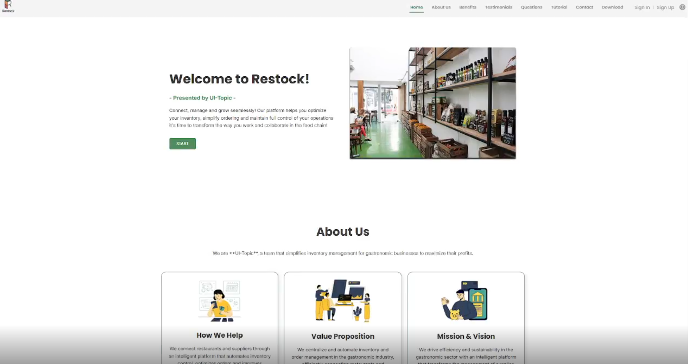
[https://shorturl.at/V5zDA](https://shorturl.at/V5zDA)

#### 5.2.3.6. Services Documentation Evidence for Sprint Review.

Durante este sprint se completó al 100% el desarrollo del Landing Page del sistema, consolidando su estructura visual, diseño responsivo, traducción multilenguaje y funcionalidades de navegación. Asimismo, se avanzó de forma significativa en la construcción del frontend del sistema, incluyendo componentes claves como el menú lateral, el dashboard inicial, el módulo de gestión de insumos y la arquitectura modular en Angular bajo DDD (Domain-Driven Design).

Aunque no se desplegaron endpoints REST aún, se documentan a continuación los recursos y avances relevantes del sprint, junto con evidencia de despliegue y repositorio de código.

**Descripción del Logro:**

- Finalización del Landing Page (100%).
- Implementación completa de diseño responsivo, i18n, y redirecciones funcionales.
- Estructura de frontend modular iniciada (menu sidebar, dashboard y componentes base).
- Aplicación de buenas prácticas de organización por bounded contexts en Angular.
- Integración visual basada en Vue con VuePrime y Primeflex.

### Recursos del Sprint

| Recurso                 | Acción implementada                                | Método HTTP | URL / Endpoint                                                                                  | Link de repositorio                               |
| ----------------------- | --------------------------------------------------- | ------------ | ----------------------------------------------------------------------------------------------- | ------------------------------------------------- |
| Landing Page            | Visualización completa y funcional del landing     | GET          | https://github.com/Restock-4292UI-Topic-landing/                                                | https://github.com/Restock-4292                   |
| UI del sistema (WIP)    | Avance en el sistema (menú, dashboard, inventario) | GET          | https://github.com/Restock-4368/UI-Topic-frontend                                               | https://github.com/Restock-4368/UI-Topic-frontend |
| Get supply by ID        | Obtener un insumo por ID                            | GET          | https://restock-platform-production-9355.up.railway.app/api/v1/supplies/{id}                    | https://github.com/Restock-4368/restock-platform  |
| Update a supply         | Actualizar un insumo                                | PUT          | https://restock-platform-production-9355.up.railway.app/api/v1/supplies/{id}                    | https://github.com/Restock-4368/restock-platform  |
| Delete a supply         | Eliminar un insumo                                  | DELETE       | https://restock-platform-production-9355.up.railway.app/api/v1/supplies/{id}                    | https://github.com/Restock-4368/restock-platform  |
| Get all supplies        | Listar todos los insumos                            | GET          | https://restock-platform-production-9355.up.railway.app/api/v1/supplies                         | https://github.com/Restock-4368/restock-platform  |
| Create a new supply     | Crear un nuevo insumo                               | POST         | https://restock-platform-production-9355.up.railway.app/api/v1/supplies                         | https://github.com/Restock-4368/restock-platform  |
| Get supplies by user ID | Listar insumos por ID de usuario                    | GET          | https://restock-platform-production-9355.up.railway.app/api/v1/supplies/user/{id}               | https://github.com/Restock-4368/restock-platform  |
| Get batch by ID         | Obtener un lote por ID                              | GET          | https://restock-platform-production-9355.up.railway.app/api/v1/batches/{id}                     | https://github.com/Restock-4368/restock-platform  |
| Update a batch          | Actualizar un lote                                  | PUT          | https://restock-platform-production-9355.up.railway.app/api/v1/batches/{id}                     | https://github.com/Restock-4368/restock-platform  |
| Delete a batch          | Eliminar un lote                                    | DELETE       | https://restock-platform-production-9355.up.railway.app/api/v1/batches/{id}                     | https://github.com/Restock-4368/restock-platform  |
| Get all batches         | Listar todos los lotes                              | GET          | https://restock-platform-production-9355.up.railway.app/api/v1/batches                          | https://github.com/Restock-4368/restock-platform  |
| Create a new batch      | Crear un nuevo lote                                 | POST         | https://restock-platform-production-9355.up.railway.app/api/v1/batches                          | https://github.com/Restock-4368/restock-platform  |
| Get batches by user ID  | Listar lotes por ID de usuario                      | GET          | https://restock-platform-production-9355.up.railway.app/api/v1/batches/user/{id}                | https://github.com/Restock-4368/restock-platform  |
| Get all ref supplies    | Ver insumos de referencia                           | GET          | https://restock-platform-production-9355.up.railway.app/api/v1/reference-supplies               | https://github.com/Restock-4368/restock-platform  |
| Get all ref categories  | Ver categorías de referencia                       | GET          | https://restock-platform-production-9355.up.railway.app/api/v1/reference-categories             | https://github.com/Restock-4368/restock-platform  |
| Get recipe by ID        | Obtener receta por ID                               | GET          | https://restock-platform-production-9355.up.railway.app/api/v1/recipes/{id}                     | https://github.com/Restock-4368/restock-platform  |
| Update recipe           | Actualizar receta                                   | PUT          | https://restock-platform-production-9355.up.railway.app/api/v1/recipes/{id}                     | https://github.com/Restock-4368/restock-platform  |
| Delete recipe           | Eliminar receta                                     | DELETE       | https://restock-platform-production-9355.up.railway.app/api/v1/recipes/{id}                     | https://github.com/Restock-4368/restock-platform  |
| Get all recipes         | Listar todas las recetas                            | GET          | https://restock-platform-production-9355.up.railway.app/api/v1/recipes                          | https://github.com/Restock-4368/restock-platform  |
| Create a new recipe     | Crear nueva receta                                  | POST         | https://restock-platform-production-9355.up.railway.app/api/v1/recipes                          | https://github.com/Restock-4368/restock-platform  |
| Get recipe supplies     | Obtener insumos de una receta                       | GET          | https://restock-platform-production-9355.up.railway.app/api/v1/recipes/{id}/supplies            | https://github.com/Restock-4368/restock-platform  |
| Add supply to recipe    | Agregar insumo a receta                             | POST         | https://restock-platform-production-9355.up.railway.app/api/v1/recipes/{id}/supplies            | https://github.com/Restock-4368/restock-platform  |
| Update recipe supply    | Actualizar insumo en receta                         | PUT          | https://restock-platform-production-9355.up.railway.app/api/v1/recipes/{id}/supplies/{supplyId} | https://github.com/Restock-4368/restock-platform  |
| Delete recipe supply    | Eliminar insumo de receta                           | DELETE       | https://restock-platform-production-9355.up.railway.app/api/v1/recipes/{id}/supplies/{supplyId} | https://github.com/Restock-4368/restock-platform  |

#### 5.2.3.7. Software Deployment Evidence for Sprint Review

Durante este sprint, se realizaron actividades de despliegue y pruebas de los servicios desarrollados, asegurando que las funcionalidades del sistema estén operativas y accesibles para los usuarios finales. A continuación, se detallan los pasos realizados:

1. Dockerfile: Se creó un Dockerfile para el backend del sistema, permitiendo la creación de una imagen que encapsula todas las dependencias y configuraciones necesarias para ejecutar el servicio.

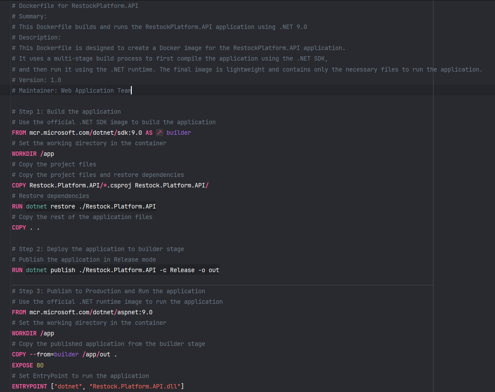

2. Iniciar un servicio en Render: Se creó un nuevo servicio en Render para el backend.

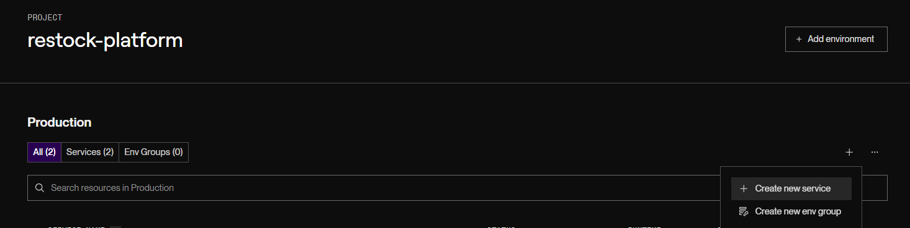

3. Configurar el servicio: Se configuró el servicio en Render, especificando el nombre del servicio, la región y el tipo de instancia.

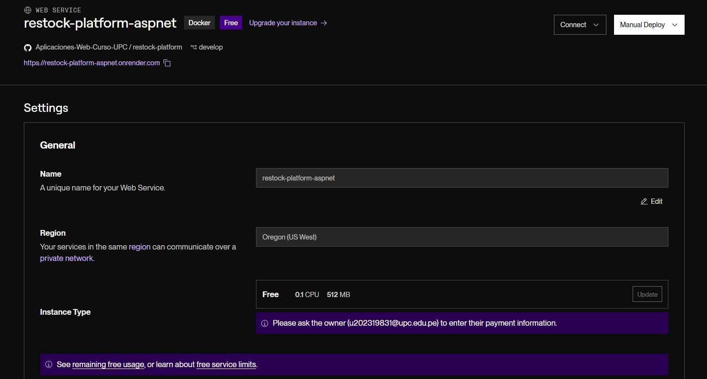

4. Variables de entorno: Se añadieron las variables de entorno necesarias para la configuración del servicio, como las credenciales de la base de datos y las claves de API.

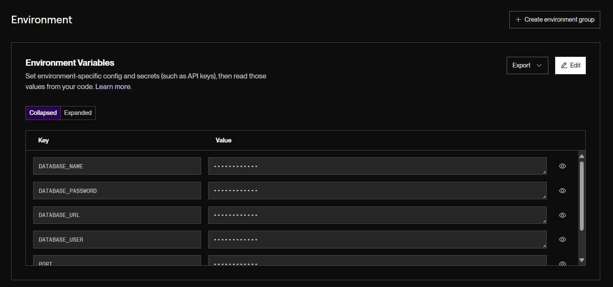

5. Despliegue del servicio: Se inició el despliegue del servicio en Render, lo que permitió que el backend estuviera disponible en la URL proporcionada.

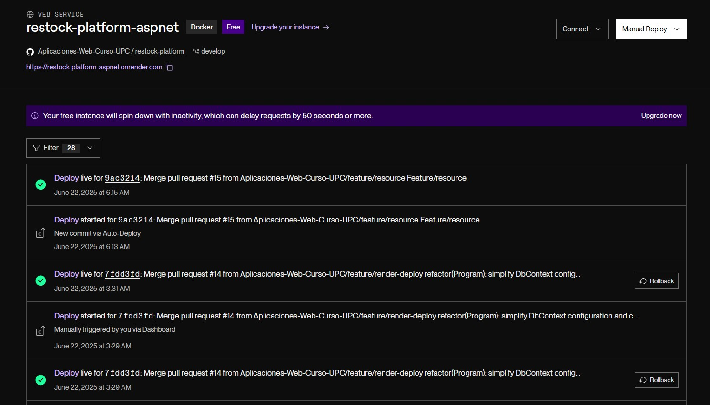

6. Verificación del despliegue: Se verificó que el servicio estuviera funcionando correctamente accediendo a la URL proporcionada por Render.

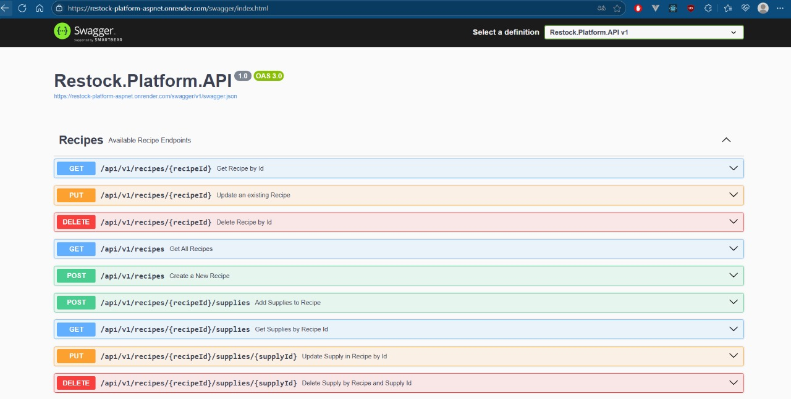

#### 5.2.3.8. Team Collaboration Insights during Sprint

Seguimos usando ramas específicas para cada sección o funcionalidad (feature/[nombre-de-seccion]), permitiendo un trabajo paralelo organizado.

Cada miembro del equipo asumió la responsabilidad de desarrollar una o más boundeds del Backend.
Se realizaron commits frecuentes, registrando avances de manera continua y detallada.
Las funcionalidades desarrolladas se integraron mediante Pull Requests hacia la rama develop.
Se mantuvo una comunicación constante mediante la plataforma Discord para coordinar avances y resolver dudas en tiempo real.
Se aplicaron buenas prácticas de programación, control de versiones y colaboración en equipo.

##### **Analíticos de colaboración**

**1. Landing Page:**


- Total de commits realizados: **39**
- Total de autores contribuyentes: **5**
- Nivel de participación equilibrado entre todos los miembros
- El gráfico muestra una distribución consistente de actividad a lo largo del sprint

**2. Web Application (Frontend):**


- Total de commits realizados: **146**
- Total de autores contribuyentes: **5**
- Nivel de participación equilibrado entre todos los miembros
- El gráfico muestra una distribución consistente de actividad a lo largo del sprint

**3. Web Services (Backend):**


- Total de commits realizados: **76**
- Total de autores contribuyentes: **5**
- Nivel de participación equilibrado entre todos los miembros
- El gráfico muestra una distribución consistente de actividad a lo largo del sprint

##### **Analíticos de commits de GitHub**


### 5.2.4. Sprint 4

#### 5.2.4.1. Sprint Planning 4

<table>
  <tr>
    <td>Sprint #</td>
    <td>Sprint 4</td>
  </tr>
  <tr>
    <td><strong>Sprint Planning Background</strong></td>
    <td></td>
  </tr>
  <tr>
    <td>Date</td>
    <td>2025-07-05</td>
  </tr>
  <tr>
    <td>Time</td>
    <td>08:00 pm (GMT-5)</td>
  </tr>
  <tr>
    <td>Location</td>
    <td>Modalidad remota mediante la plataforma Discord</td>
  </tr>
  <tr>
    <td>Prepared By</td>
    <td>Guerra Perez, José Jahaziel</td>
  </tr>
  <tr>
    <td>Attendees (to planning meeting)</td>
    <td>.Castro Alejos, Julio / Guerra Perez, José Jahaziel<br/> / Guzmán Cabrejos, Yaku Mateo / Navarro, Antonio / Shapiama Rivera, Gabriela Nicole</td>
  </tr>
  <tr>
    <td>Sprint 3 Review Summary</td>
    <td>Durante el Sprint 3 se logró integrar las funcionalidades esenciales para la gestión de recetas, ventas y pedidos, así como la visualización de suscripciones y perfil. Se implementaron flujos completos en frontend y backend para los administradores de restaurantes y proveedores, habilitando además el pago de suscripciones. El equipo demostró gran compromiso y coordinación, permitiendo avances notables en la implementación de casos de uso claves. Sin embargo, se identificaron oportunidades de mejora en la automatización de pruebas y en la gestión de errores complejos.</td>
  </tr>
  <tr>
    <td>Sprint 3 Retrospective Summary</td>
    <td>El equipo mantuvo una comunicación activa y resolvió bloqueos técnicos con rapidez, destacando el soporte mutuo entre miembros. Se identificó que algunos endpoints requerían mejoras en validación y documentación, lo que motivó a priorizar en este nuevo sprint las tareas técnicas orientadas a robustecer los servicios RESTful, implementar nuevas funcionalidades de cuenta (recuperación, eliminación, cambio de contraseña) y finalizar la lógica de notificaciones y feedback. Como mejora clave se acordó dividir mejor las tareas de testing y codificación para asegurar calidad sin comprometer la velocidad de entrega.</td>
  </tr>
  <tr>
    <td><strong>Sprint Goal & User Stories</strong></td>
    <td></td>
  </tr>
  <tr>
    <td>Sprint 4 Goal</td>
    <td>Este sprint está enfocado en robustecer la experiencia de usuario mediante la implementación completa de funcionalidades clave del perfil: recuperación de contraseña, cambio y eliminación de cuenta; reforzar el control de acceso mediante suscripciones activas; además de completar flujos críticos del sistema como la gestión de ventas, retroalimentación y notificaciones por insumos. También se priorizará la entrega de endpoints RESTful estables y bien documentados, permitiendo la integración efectiva entre frontend y backend.<br/>El éxito de este sprint se medirá cuando los usuarios puedan recuperar, cambiar o eliminar sus cuentas correctamente; se restrinja el acceso por suscripciones vencidas; los administradores puedan vender solo si hay insumos disponibles; y los proveedores puedan recibir feedback validado correctamente. Además, cuando se logre obtener notificaciones sobre eventos críticos del inventario, y se validen todos estos flujos mediante pruebas automatizadas.</td>
  </tr>
  <tr>
    <td>Sprint 4 Velocity</td>
    <td>60</td>
  </tr>
  <tr>
    <td>Sum of Story Points</td>
    <td>59</td>
  </tr>
</table>

#### 5.2.4.2. Aspect Leaders and Collaborators.

Durante el Sprint 4, se ha definido el desarrollo de los últimos módulos principales del frontend de la aplicación web interna Restock y del backend, abarcando funcionalidades clave como la gestión de productos, pedidos, inventario y compras. Estas implementaciones buscan optimizar los procesos internos y brindar mayor eficiencia a los administradores de restaurantes y proveedores de restaurantes.

Con el fin de mantener una coordinación efectiva y una comunicación fluida entre los integrantes del equipo, se estructuró la matriz de liderazgo y colaboración (LACX), donde se asignó un líder (L) encargado de cada funcionalidad y colaboradores (C) que brindan apoyo en su implementación.

<div style="font-size: 0.75em; overflow-x: auto;">

| Team Member (Last Name, First Name) | GitHub Username    | Planning | Subscription | Profile | IAM | Analytics | Resource | Monitoring |
| :---------------------------------- | :----------------- | :------- | :----------- | :------ | :-- | :-------- | :------- | :--------- |
| Castro Alejos, Julio                | JulioXC4           | C        | L            | C       | C   | C         | L        | C          |
| Guerra Perez, José Jahaziel        | jahazielgg         | L        | C            | C       | C   | L         | C        | C          |
| Guzmán Cabrejos, Yaku Mateo        | yak-cod            | C        | C            | C       | L   | C         | C        | C          |
| Shapiama Rivera, Gabriela Nicole    | GabrielaShapiama28 | C        | C            | L       | C   | C         | C        | L          |

</div>

#### 5.2.4.3. Sprint Backlog 4

El objetivo principal de este Sprint es implementar las funcionalidades restantes para completar la experiencia de usuario en la plataforma Restock, incluyendo la gestión de productos, pedidos y usuarios. Se priorizará la integración de los módulos desarrollados en Sprints anteriores y la validación de su funcionamiento en conjunto.

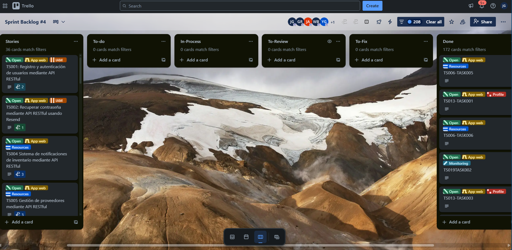

Trello: https:/linkcuts.org/dbgrf3vr

<table>
    <tr>
        <td>User Story ID</td>
        <td>User Story Title</td>
        <td>Task ID</td>
        <td>Task Title</td>
        <td>Task Description</td>
        <td>Estimated Hours</td>
        <td>Assigned To</td>
        <td>Status (To do / In-Process / To-Review / Done)</td>
    </tr>
    <tr>
        <td>US-02</td>
        <td>Recuperación de contraseña</td>
        <td>T001</td>
        <td>Diseñar pantalla de solicitud de recuperación</td>
        <td>Diseñar la pantalla de solicitud de recuperación de contraseña'.</td>
        <td>1h</td>
        <td>Antonio Navarro</td>
        <td>Done</td>
    </tr>
    <tr>
        <td></td>
        <td></td>
        <td>T002</td>
        <td>Conectar solicitud de recuperación con backend</td>
        <td>Conectar la pantalla con el endpoint /api/v1/auth/forgot-password.</td>
        <td>1h</td>
        <td>Antonio Navarro</td>
        <td>Done</td>
    </tr>
    <tr>
        <td></td>
        <td></td>
        <td>T003</td>
        <td>Diseñar formulario de nueva contraseña</td>
        <td>Diseñar la pantalla de restablecimiento de contraseña (formulario de nueva contraseña).</td>
        <td>1h</td>
        <td>Gabriela Shapiama</td>
        <td>To-Review</td>
    </tr>
    <tr>
        <td></td>
        <td></td>
        <td>T004</td>
        <td>Manejar tokens inválidos o expirados</td>
        <td>Implementar manejo de tokens inválidos o expirados en el frontend</td>
        <td>1h</td>
        <td>Gabriela Shapiama</td>
        <td>To-Review</td>
    </tr>
    <tr>
        <td></td>
        <td></td>
        <td>T005</td>
        <td>Conectar formulario de restablecimiento con backend</td>
        <td>Conectar formulario de nueva contraseña con endpoint /api/v1/auth/reset-password</td>
        <td>1h</td>
        <td>Jahaziel Guerra</td>
        <td>To-Review</td>
    </tr>
    <tr>
        <td>US-03</td>
        <td>Soporte de acceso según estado de suscripción</td>
        <td>T001</td>
        <td>Consultar estado de suscripción al iniciar sesión</td>
        <td>Consultar el estado de suscripción del usuario al iniciar sesión.</td>
        <td>1h</td>
        <td>Antonio Navarro</td>
        <td>To-Review</td>
    </tr>
    <tr>
        <td></td>
        <td></td>
        <td>T002</td>
        <td>Controlar acceso según suscripción</td>
        <td>Mostrar o restringir funcionalidades según el estado de suscripción</td>
        <td>1h</td>
        <td>Yaku Guzman</td>
        <td>Done</td>
    </tr>
    <tr>
        <td></td>
        <td></td>
        <td>T003</td>
        <td>Diseñar vista de advertencia por suscripción inactiva</td>
        <td>Diseñar una vista de advertencia para usuarios con suscripción vencida o inactiva</td>
        <td>1h</td>
        <td>Jahaziel Guerra</td>
        <td>In-Process</td>
    </tr>
    <tr>
        <td></td>
        <td></td>
        <td>T004</td>
        <td>Restringir acceso a rutas protegidas</td>
        <td>Redirigir o bloquear el acceso a rutas protegidas si el estado no es válido</td>
        <td>1/2h</td>
        <td>Antonio Navarro</td>
        <td>To-Review</td>
    </tr>
    <tr>
        <td></td>
        <td></td>
        <td>T005</td>
        <td>Actualizar acceso tras renovación</td>
        <td>Verificar y actualizar el acceso luego de la renovación</td>
        <td>1h</td>
        <td>Jahaziel Guerra</td>
        <td>To-Review</td>
    </tr>
    <tr>
        <td>US-16</td>
        <td>Gestión de ventas</td>
        <td>T001</td>
        <td>Validar disponibilidad de insumos al vender</td>
        <td>Implementar la lógica de validación de insumos disponibles antes de confirmar una venta.</td>
        <td>1h</td>
        <td>Jahaziel Guerra</td>
        <td>To-Review</td>
    </tr>
    <tr>
        <td></td>
        <td></td>
        <td>T002</td>
        <td>Mostrar impacto de recetas en inventario</td>
        <td>Integrar el consumo de recetas asociadas para mostrar impacto en insumos.</td>
        <td>2h</td>
        <td>Julio Castro</td>
        <td>In-Process</td>
    </tr>
    <tr>
        <td></td>
        <td></td>
        <td>T003</td>
        <td>Documentar flujo de gestión de ventas</td>
        <td>Documentar el flujo de gestión de ventas desde el frontend.</td>
        <td>1h</td>
        <td>Julio Castro</td>
        <td>Done</td>
    </tr>
    <tr>
        <td>US-23</td>
        <td>Cambio de contraseña</td>
        <td>T001</td>
        <td>Mostrar opción de cambio de contraseña en perfil</td>
        <td>Mostrar opción de “Cambiar contraseña” en la configuración de la cuenta</td>
        <td>1h</td>
        <td>Yaku Guzman</td>
        <td>Done</td>
    </tr>
    <tr>
        <td></td>
        <td></td>
        <td>T002</td>
        <td>Validar nueva contraseña según políticas</td>
        <td>Validar que la nueva contraseña cumpla con los requisitos de seguridad</td>
        <td>2h</td>
        <td>Antonio Navarro</td>
        <td>Done</td>
    </tr>
    <tr>
        <td></td>
        <td></td>
        <td>T003</td>
        <td>Verificar coincidencia entre nueva contraseña y confirmación</td>
        <td>Verificar coincidencia entre nueva contraseña y su confirmación</td>
        <td>1h</td>
        <td>Yaku Guzman</td>
        <td>To do</td>
    </tr>
    <tr>
        <td></td>
        <td></td>
        <td>T004</td>
        <td>Enviar solicitud de cambio de contraseña al backend</td>
        <td>Enviar solicitud de cambio de contraseña al servidor</td>
        <td>1h</td>
        <td>Julio Castro</td>
        <td>Done</td>
    </tr>
    <tr>
        <td></td>
        <td></td>
        <td>T005</td>
        <td>Mostrar mensaje según resultado del cambio de contraseña</td>
        <td>Mostrar mensaje de éxito tras el cambio correcto o Mostrar mensaje de error si la contraseña actual es incorrecta</td>
        <td>1h</td>
        <td>Julio Castro</td>
        <td>To-Review</td>
    </tr>
    <tr>
        <td>US-24</td>
        <td>Eliminar cuenta</td>
        <td>T001</td>
        <td>Mostrar opción para eliminar cuenta desde perfil</td>
        <td>Mostrar opción “Eliminar cuenta” en la configuración del perfil</td>
        <td>1h</td>
        <td>Gabriela Shapiama</td>
        <td>Done</td>
    </tr>
    <tr>
        <td></td>
        <td></td>
        <td>T002</td>
        <td>Implementar paso de verificación para confirmar eliminación</td>
        <td>Solicitar paso de verificación para confirmar la eliminación</td>
        <td>1h</td>
        <td>Gabriela Shapiama</td>
        <td>To do</td>
    </tr>
    <tr>
        <td></td>
        <td></td>
        <td>T003</td>
        <td>Enviar solicitud de eliminación de cuenta al backend</td>
        <td>Enviar la solicitud de eliminación de cuenta al servidor</td>
        <td>1h</td>
        <td>Jahaziel Guerra</td>
        <td>To-Review</td>
    </tr>
    <tr>
        <td></td>
        <td></td>
        <td>T004</td>
        <td>Mostrar confirmación de eliminación</td>
        <td>Confirmar visualmente al usuario que la cuenta ha sido borrada.</td>
        <td>1h</td>
        <td>Jahaziel Guerra</td>
        <td>In-Process</td>
    </tr>
    <tr>
        <td></td>
        <td></td>
        <td>T005</td>
        <td>Redirigir tras eliminar cuenta</td>
        <td>Redirigir al usuario a la página de inicio o despedida tras eliminar la cuenta</td>
        <td>1/2h</td>
        <td>Julio Castro</td>
        <td>To-Review</td>
    </tr>
    <tr>
        <td>TS-01</td>
        <td>Registro y autenticación de usuarios mediante API RESTful</td>
        <td>T001</td>
        <td>Diseñar modelo de usuario y su persistencia</td>
        <td>Diseñar el modelo de usuario y estructura de base de datos</td>
        <td>2h</td>
        <td>Gabriela Shapiama</td>
        <td>Done</td>
    </tr>
    <tr>
        <td></td>
        <td></td>
        <td>T002</td>
        <td>Crear endpoint de registro de usuarios</td>
        <td>Implementar endpoint /api/v1/auth/register para registro de usuarios</td>
        <td>1h</td>
        <td>Antonio Navarro</td>
        <td>In-Process</td>
    </tr>
    <tr>
        <td></td>
        <td></td>
        <td>T003</td>
        <td>Crear endpoint de login de usuarios</td>
        <td>Implementar endpoint /api/v1/auth/login para autenticación</td>
        <td>2h</td>
        <td>Yaku Guzman</td>
        <td>Done</td>
    </tr>
    <tr>
        <td></td>
        <td></td>
        <td>T004</td>
        <td>Configurar autenticación con JWT y manejo de errores</td>
        <td>Configurar control de errores y middleware de autenticación (JWT)</td>
        <td>1/2h</td>
        <td>Gabriela Shapiama</td>
        <td>Done</td>
    </tr>
    <tr>
        <td>TS-02</td>
        <td>Recuperar contraseña mediante API RESTful usando Resend</td>
        <td>T001</td>
        <td>Crear endpoint para recuperación de contraseña</td>
        <td>Diseñar e implementar el endpoint /api/v1/auth/forgot-password</td>
        <td>1h</td>
        <td>Gabriela Shapiama</td>
        <td>To-Review</td>
    </tr>
    <tr>
        <td></td>
        <td></td>
        <td>T002</td>
        <td>Integrar servicio de correo Resend</td>
        <td>Integrar servicio de correo Resend para envío del enlace de recuperación</td>
        <td>2h</td>
        <td>Gabriela Shapiama</td>
        <td>To do</td>
    </tr>
    <tr>
        <td></td>
        <td></td>
        <td>T003</td>
        <td>Manejar errores y respuestas en recuperación</td>
        <td>Implementar lógica de manejo de errores y respuestas HTTP estándar</td>
        <td>1h</td>
        <td>Yaku Guzman</td>
        <td>In-Process</td>
    </tr>
    <tr>
        <td></td>
        <td></td>
        <td>T004</td>
        <td>Generar y guardar token seguro para recuperación</td>
        <td>Crear y almacenar tokens seguros de recuperación de contraseña</td>
        <td>1h</td>
        <td>Yaku Guzman</td>
        <td>In-Process</td>
    </tr>
    <tr>
        <td>TS-03</td>
        <td>Gestión del estado de suscripción mediante API RESTful</td>
        <td>T001</td>
        <td>Diseñar modelo de suscripción</td>
        <td>Diseñar el modelo de suscripción de la base de datos</td>
        <td>1h</td>
        <td>Yaku Guzman</td>
        <td>In-Process</td>
    </tr>
    <tr>
        <td></td>
        <td></td>
        <td>T002</td>
        <td>Crear endpoint GET para estado de suscripción</td>
        <td>Implementar endpoint GET /api/v1/subscription/status/:id</td>
        <td>1h</td>
        <td>Jahaziel Guerra</td>
        <td>Done</td>
    </tr>
    <tr>
        <td></td>
        <td></td>
        <td>T003</td>
        <td>Crear endpoint POST para renovación de suscripción</td>
        <td>Implementar endpoint POST /api/v1/subscription/renew</td>
        <td>1h</td>
        <td>Gabriela Shapiama</td>
        <td>Done</td>
    </tr>
    <tr>
        <td></td>
        <td></td>
        <td>T004</td>
        <td>Evaluar estado de suscripción desde middleware</td>
        <td>Agregar middleware o función auxiliar para evaluar el estado de la suscripción</td>
        <td>1/2h</td>
        <td>Antonio Navarro</td>
        <td>To-Review</td>
    </tr>
    <tr>
        <td>TS-04</td>
        <td>Sistema de notificaciones de inventario mediante API RESTful</td>
        <td>T001</td>
        <td>Crear endpoint de insumos próximos a vencer</td>
        <td>Implementar endpoint /api/v1/notifications/expiring-supplies</td>
        <td>1h</td>
        <td>Jahaziel Guerra</td>
        <td>Done</td>
    </tr>
    <tr>
        <td></td>
        <td></td>
        <td>T002</td>
        <td>Crear endpoint de insumos que exceden stock</td>
        <td>Implementar endpoint /api/v1/notifications/exceeding-stock</td>
        <td>1h</td>
        <td>Julio Castro</td>
        <td>To-Review</td>
    </tr>
    <tr>
        <td></td>
        <td></td>
        <td>T003</td>
        <td>Diseñar lógica de negocio para filtros de notificaciones</td>
        <td>Diseñar y aplicar lógica de dominio para filtros de notificaciones</td>
        <td>1h</td>
        <td>Antonio Navarro</td>
        <td>In-Process</td>
    </tr>
    <tr>
        <td></td>
        <td></td>
        <td>T004</td>
        <td>Escribir pruebas unitarias para lógica de notificaciones</td>
        <td>Escribir pruebas unitarias para lógica de notificaciones</td>
        <td>2h</td>
        <td>Antonio Navarro</td>
        <td>Done</td>
    </tr>
    <tr>
        <td>TS-07</td>
        <td>Registrar comentarios y calificaciones sobre pedidos mediante API RESTful</td>
        <td>T001</td>
        <td>Crear endpoint para registrar retroalimentación</td>
        <td>Implementar endpoint POST /api/v1/feedback (Registrar retroalimentación)</td>
        <td>1h</td>
        <td>Antonio Navarro</td>
        <td>To-Review</td>
    </tr>
    <tr>
        <td></td>
        <td></td>
        <td>T002</td>
        <td>Validar calificación y comentario en feedback</td>
        <td>Validar calificación y comentario en POST /api/v1/feedback</td>
        <td>1h</td>
        <td>Gabriela Shapiama</td>
        <td>Done</td>
    </tr>
    <tr>
        <td></td>
        <td></td>
        <td>T003</td>
        <td>Verificar estado del pedido antes de aceptar feedback</td>
        <td>Validar estado del pedido antes de aceptar feedback</td>
        <td>1h</td>
        <td>Antonio Navarro</td>
        <td>Done</td>
    </tr>
    <tr>
        <td></td>
        <td></td>
        <td>T004</td>
        <td>Asociar feedback al proveedor correspondiente</td>
        <td>Asociar retroalimentación al proveedor correspondiente</td>
        <td>1h</td>
        <td>Antonio Navarro</td>
        <td>In-Process</td>
    </tr>
    <tr>
        <td></td>
        <td></td>
        <td>T005</td>
        <td>Escribir pruebas unitarias para endpoint de feedback</td>
        <td>Implementar pruebas unitarias del endpoint</td>
        <td>1h</td>
        <td>Antonio Navarro</td>
        <td>To-Review</td>
    </tr>
    <tr>
        <td>TS-08</td>
        <td>Registro histórico de eventos críticos de insumos</td>
        <td>T001</td>
        <td>Crear colección para eventos críticos de insumos</td>
        <td>Crear colección supply_event_logs con campos: supplyId, type, detectedAt, details, severity.</td>
        <td>1h</td>
        <td>Jahaziel Guerra</td>
        <td>To-Review</td>
    </tr>
    <tr>
        <td></td>
        <td></td>
        <td>T002</td>
        <td>Implementar lógica para registrar eventos críticos automáticamente</td>
        <td>Implementar lógica para detectar condiciones críticas en insumos y registrar evento automáticamente.</td>
        <td>1h</td>
        <td>Yaku Guzman</td>
        <td>In-Process</td>
    </tr>
    <tr>
        <td></td>
        <td></td>
        <td>T003</td>
        <td>Crear endpoint GET para consultar eventos críticos</td>
        <td>Crear servicio RESTful GET /api/v1/supplies/events con filtros por tipo, insumo y rango de fechas.</td>
        <td>2h</td>
        <td>Yaku Guzman</td>
        <td>In-Process</td>
    </tr>
    <tr>
        <td></td>
        <td></td>
        <td>T005</td>
        <td>Escribir pruebas unitarias para eventos críticos</td>
        <td>Agregar pruebas unitarias y de integración para asegurar el correcto registro de eventos críticos.</td>
        <td>1/2h</td>
        <td>Gabriela Shapiama</td>
        <td>To-Review</td>
    </tr>
    <tr>
        <td>TS-13</td>
        <td>Obtener perfil mediante API RESTful</td>
        <td>T001</td>
        <td>Crear endpoint GET para obtener perfil protegido</td>
        <td>Implementar endpoint GET /api/v1/profile/:id protegido por JWT</td>
        <td>2h</td>
        <td>Julio Castro</td>
        <td>In-Process</td>
    </tr>
    <tr>
        <td></td>
        <td></td>
        <td>T002</td>
        <td>Validar token JWT antes de procesar perfil</td>
        <td>Validar que el token sea correcto antes de procesar la solicitud</td>
        <td>1h</td>
        <td>Antonio Navarro</td>
        <td>In-Process</td>
    </tr>
    <tr>
        <td></td>
        <td></td>
        <td>T003</td>
        <td>Consultar y retornar información del perfil</td>
        <td>Consultar y devolver información del perfil (id, nombre, email, URL de imagen, estado)</td>
        <td>1h</td>
        <td>Yaku Guzman</td>
        <td>To-Review</td>
    </tr>
    <tr>
        <td></td>
        <td></td>
        <td>T004</td>
        <td>Gestionar errores 401 por token inválido</td>
        <td>Gestionar error 401 en caso de token inválido o expirado</td>
        <td>1h</td>
        <td>Yaku Guzman</td>
        <td>To-Review</td>
    </tr>
    <tr>
        <td></td>
        <td></td>
        <td>T005</td>
        <td>Escribir pruebas unitarias para endpoint de perfil</td>
        <td>Escribir test unitario y de integración para el endpoint</td>
        <td>1h</td>
        <td>Yaku Guzman</td>
        <td>In-Process</td>
    </tr>
    <tr>
        <td>TS-14</td>
        <td>Actualizar perfil mediante API RESTful</td>
        <td>T001</td>
        <td>Crear endpoint PUT para actualizar perfil</td>
        <td>Implementar endpoint PUT /api/v1/profile/:id con protección por JWT</td>
        <td>1/2h</td>
        <td>Julio Castro</td>
        <td>To-Review</td>
    </tr>
    <tr>
        <td></td>
        <td></td>
        <td>T002</td>
        <td>Validar formato de datos del perfil</td>
        <td>Validar formato de campos</td>
        <td>1h</td>
        <td>Gabriela Shapiama</td>
        <td>Done</td>
    </tr>
    <tr>
        <td></td>
        <td></td>
        <td>T003</td>
        <td>Actualizar datos del perfil en base de datos</td>
        <td>Actualizar los datos del perfil en la base de datos</td>
        <td>2h</td>
        <td>Jahaziel Guerra</td>
        <td>In-Process</td>
    </tr>
    <tr>
        <td></td>
        <td></td>
        <td>T004</td>
        <td>Retornar datos actualizados con código 200</td>
        <td>Retornar los datos actualizados con código 200</td>
        <td>1h</td>
        <td>Yaku Guzman</td>
        <td>In-Process</td>
    </tr>
    <tr>
        <td></td>
        <td></td>
        <td>T005</td>
        <td>Manejar errores 400 con detalles en perfil</td>
        <td>Retornar errores 400 con detalles si hay datos inválidos</td>
        <td>1h</td>
        <td>Jahaziel Guerra</td>
        <td>To do</td>
    </tr>
    <tr>
        <td>TS-15</td>
        <td>Subir imagen de perfil mediante API RESTful usando Cloudinary</td>
        <td>T001</td>
        <td>Crear endpoint POST para subir imagen de perfil</td>
        <td>Implementar endpoint POST /api/v1/profile/images/id.</td>
        <td>1h</td>
        <td>Jahaziel Guerra</td>
        <td>To do</td>
    </tr>
    <tr>
        <td></td>
        <td></td>
        <td>T002</td>
        <td>Validar formato de archivo de imagen</td>
        <td>Validar formato de archivo antes de subir (JPG, PNG, WEBP)</td>
        <td>1h</td>
        <td>Gabriela Shapiama</td>
        <td>To do</td>
    </tr>
    <tr>
        <td></td>
        <td></td>
        <td>T003</td>
        <td>Asociar imagen de perfil subida al usuario</td>
        <td>Asociar la URL retornada por Cloudinary al usuario correspondiente</td>
        <td>2h</td>
        <td>Yaku Guzman</td>
        <td>To do</td>
    </tr>
    <tr>
        <td></td>
        <td></td>
        <td>T004</td>
        <td>Manejar errores por formato no soportado (415)</td>
        <td>Manejar errores por formato no soportado (415)</td>
        <td>1h</td>
        <td>Jahaziel Guerra</td>
        <td>To-Review</td>
    </tr>
    <tr>
        <td>TS-16</td>
        <td>Obtener lista para ingredientes más usados mediante API RESTful</td>
        <td>T001</td>
        <td>Crear endpoint GET para ingredientes más usados</td>
        <td>Implementar endpoint GET /api/v1/ingredients/most-used</td>
        <td>1h</td>
        <td>Jahaziel Guerra</td>
        <td>To do</td>
    </tr>
    <tr>
        <td></td>
        <td></td>
        <td>T002</td>
        <td>Permitir filtrado por periodo en ingredientes más usados</td>
        <td>Permitir parámetro ?period= con valores como 7d o 30d</td>
        <td>1h</td>
        <td>Julio Castro</td>
        <td>To do</td>
    </tr>
    <tr>
        <td></td>
        <td></td>
        <td>T003</td>
        <td>Consultar uso agregado de ingredientes según periodo</td>
        <td>Consultar datos agregados de ingredientes en base al periodo</td>
        <td>1/2h</td>
        <td>Yaku Guzman</td>
        <td>Done</td>
    </tr>
    <tr>
        <td></td>
        <td></td>
        <td>T004</td>
        <td>Retornar lista JSON de ingredientes más usados</td>
        <td>Retornar JSON con lista de ingredientes, id, nombre y cantidad_utilizada</td>
        <td>2h</td>
        <td>Yaku Guzman</td>
        <td>To-Review</td>
    </tr>
    <tr>
        <td>TS-17</td>
        <td>Obtener lista de alertas recientes  mediante API RESTful</td>
        <td>T001</td>
        <td>Crear endpoint GET para alertas recientes</td>
        <td>Implementar endpoint GET /api/v1/alerts</td>
        <td>2h</td>
        <td>Antonio Navarro</td>
        <td>Done</td>
    </tr>
    <tr>
        <td></td>
        <td></td>
        <td>T002</td>
        <td>Clasificar alertas por tipo</td>
        <td>Clasificar alertas por tipo: vencimiento, bajo stock, etc</td>
        <td>2h</td>
        <td>Julio Castro</td>
        <td>To-Review</td>
    </tr>
    <tr>
        <td></td>
        <td></td>
        <td>T003</td>
        <td>Retornar lista de alertas como JSON</td>
        <td>Retornar lista de alertas como JSON</td>
        <td>2h</td>
        <td>Julio Castro</td>
        <td>To-Review</td>
    </tr>
    <tr>
        <td></td>
        <td></td>
        <td>T004</td>
        <td>Retornar lista vacía si no hay alertas</td>
        <td>Retornar lista vacía si no hay alertas activas</td>
        <td>1h</td>
        <td>Gabriela Shapiama</td>
        <td>In-Process</td>
    </tr>
    <tr>
        <td></td>
        <td></td>
        <td>T004</td>
        <td>Implementar filtros para pruebas de alertas</td>
        <td>Implementar filtros para pruebas</td>
        <td>1h</td>
        <td>Julio Castro</td>
        <td>To do</td>
    </tr>
    <tr>
        <td>TS-18</td>
        <td>Obtener lista de mejores clientes mediante API RESTful</td>
        <td>T001</td>
        <td>Crear endpoint para top clientes</td>
        <td>Implementar endpoint GET /api/v1/supplier/top-clients</td>
        <td>1/2h</td>
        <td>Yaku Guzman</td>
        <td>In-Process</td>
    </tr>
    <tr>
        <td></td>
        <td></td>
        <td>T002</td>
        <td>Consultar base y ordenar por total de compras</td>
        <td>Consultar base de datos y ordenar clientes por total de compras</td>
        <td>1h</td>
        <td>Antonio Navarro</td>
        <td>In-Process</td>
    </tr>
    <tr>
        <td></td>
        <td></td>
        <td>T003</td>
        <td>Retornar JSON con nombre y total de compras</td>
        <td>Retornar JSON con campos: nombre_restaurante, total_compras</td>
        <td>2h</td>
        <td>Julio Castro</td>
        <td>In-Process</td>
    </tr>
    <tr>
        <td></td>
        <td></td>
        <td>T004</td>
        <td>Validar fechas y manejar errores</td>
        <td>Agregar validación de fechas y manejo de errores</td>
        <td>1h</td>
        <td>Gabriela Shapiama</td>
        <td>To-Review</td>
    </tr>
    <tr>
        <td>TS-19</td>
        <td>Actualizar estado de orden mediante API RESTful</td>
        <td>T001</td>
        <td>Crear endpoint PATCH para actualizar estado de orden</td>
        <td>Crear endpoint para cambiar estado de una orden por ID.</td>
        <td>1/2h</td>
        <td>Yaku Guzman</td>
        <td>Done</td>
    </tr>
    <tr>
        <td></td>
        <td></td>
        <td>T002</td>
        <td>Validar autenticación y permisos antes de cambio de estado</td>
        <td>Aplicar lógica de seguridad (autenticación y permisos).</td>
        <td>1h</td>
        <td>Julio Castro</td>
        <td>Done</td>
    </tr>
    <tr>
        <td></td>
        <td></td>
        <td>T003</td>
        <td>Validar estado válido antes de actualizar</td>
        <td>Manejar errores de estado inválido o inexistente.</td>
        <td>1h</td>
        <td>Antonio Navarro</td>
        <td>Done</td>
    </tr>
    <tr>
        <td></td>
        <td></td>
        <td>T004</td>
        <td>Escribir pruebas para cambios de estado</td>
        <td>Escribir pruebas para transiciones de estado comunes.</td>
        <td>2h</td>
        <td>Antonio Navarro</td>
        <td>To-Review</td>
    </tr>
    <tr>
        <td></td>
        <td></td>
        <td>T005</td>
        <td>Documentar API para actualizar estado de órdenes</td>
        <td>Documentar API de actualización de estado de órdenes.</td>
        <td>2h</td>
        <td>Jahaziel Guerra</td>
        <td>Done</td>
    </tr>
    <tr>
        <td>TS-20</td>
        <td>Consultar estado de entrega mediante API RESTful</td>
        <td>T001</td>
        <td>Crear endpoint GET para estado de entrega</td>
        <td>Crear endpoint para obtener estado actual de una orden.</td>
        <td>1h</td>
        <td>Antonio Navarro</td>
        <td>In-Process</td>
    </tr>
    <tr>
        <td></td>
        <td></td>
        <td>T002</td>
        <td>Aplicar control de acceso por rol (proveedor/restaurante)</td>
        <td>Implementar control de acceso para proveedor o restaurante.</td>
        <td>1h</td>
        <td>Gabriela Shapiama</td>
        <td>In-Process</td>
    </tr>
    <tr>
        <td></td>
        <td></td>
        <td>T003</td>
        <td>Optimizar respuesta con campos esenciales</td>
        <td>Optimizar respuesta solo con campos necesarios (estado, fecha).</td>
        <td>2h</td>
        <td>Antonio Navarro</td>
        <td>Done</td>
    </tr>
    <tr>
        <td></td>
        <td></td>
        <td>T004</td>
        <td>Manejar errores por orden inexistente</td>
        <td>Manejar errores si orden no existe.</td>
        <td>2h</td>
        <td>Jahaziel Guerra</td>
        <td>In-Process</td>
    </tr>
    <tr>
        <td></td>
        <td></td>
        <td>T005</td>
        <td>Escribir pruebas unitarias para endpoint de estado</td>
        <td>Escribir pruebas unitarias del endpoint.</td>
        <td>1h</td>
        <td>Yaku Guzman</td>
        <td>To-Review</td>
    </tr>
    <tr>
        <td></td>
        <td></td>
        <td>T006</td>
        <td>Documentar consulta de estado de entrega</td>
        <td>Documentar consulta del estado de entrega por ID.</td>
        <td>1h</td>
        <td>Yaku Guzman</td>
        <td>To-Review</td>
    </tr>
    <tr>
        <td>TS-21</td>
        <td>Obtener calificaciones de servicios de proveedores mediante API RESTful</td>
        <td>T001</td>
        <td>Crear endpoint GET para calificaciones por proveedor</td>
        <td>Crear endpoint para obtener calificaciones por proveedor ID.</td>
        <td>1h</td>
        <td>Jahaziel Guerra</td>
        <td>In-Process</td>
    </tr>
    <tr>
        <td></td>
        <td></td>
        <td>T002</td>
        <td>Incluir detalles relevantes en la respuesta</td>
        <td>Incluir datos como puntuación, comentario, fecha.</td>
        <td>1h</td>
        <td>Gabriela Shapiama</td>
        <td>In-Process</td>
    </tr>
    <tr>
        <td></td>
        <td></td>
        <td>T003</td>
        <td>Permitir orden cronológico y filtros</td>
        <td>Agregar orden cronológico o filtros si se requiere.</td>
        <td>1h</td>
        <td>Antonio Navarro</td>
        <td>To-Review</td>
    </tr>
    <tr>
        <td></td>
        <td></td>
        <td>T004</td>
        <td>Validar proveedor existente y acceso autorizado</td>
        <td>Validar existencia del proveedor y autorización del solicitante.</td>
        <td>1h</td>
        <td>Jahaziel Guerra</td>
        <td>To-Review</td>
    </tr>
    <tr>
        <td></td>
        <td></td>
        <td>T005</td>
        <td>Diseñar pruebas para distintos escenarios</td>
        <td>Diseñar pruebas para distintos escenarios (sin calificaciones, múltiples).</td>
        <td>1/2h</td>
        <td>Gabriela Shapiama</td>
        <td>Done</td>
    </tr>
    <tr>
        <td></td>
        <td></td>
        <td>T006</td>
        <td>Documentar endpoint de calificaciones</td>
        <td>Documentar la API de calificaciones del proveedor.</td>
        <td>2h</td>
        <td>Julio Castro</td>
        <td>To-Review</td>
    </tr>
    <tr>
        <td>TS-22</td>
        <td>Gestionar órdenes recibidas mediante API RESTful</td>
        <td>T001</td>
        <td>Crear endpoint GET para listar órdenes recibidas</td>
        <td>Crear endpoint para listar órdenes recibidas por proveedor.</td>
        <td>1h</td>
        <td>Gabriela Shapiama</td>
        <td>To do</td>
    </tr>
    <tr>
        <td></td>
        <td></td>
        <td>T002</td>
        <td>Agregar filtros a las órdenes recibidas</td>
        <td>Agregar filtros por estado, fecha o restaurante.</td>
        <td>2h</td>
        <td>Yaku Guzman</td>
        <td>To do</td>
    </tr>
    <tr>
        <td></td>
        <td></td>
        <td>T003</td>
        <td>Manejar errores en solicitudes de órdenes</td>
        <td>Manejar errores y datos faltantes en las solicitudes.</td>
        <td>1h</td>
        <td>Antonio Navarro</td>
        <td>To do</td>
    </tr>
    <tr>
        <td></td>
        <td></td>
        <td>T004</td>
        <td>Probar flujo completo de gestión de órdenes</td>
        <td>Probar la gestión completa de órdenes.</td>
        <td>h</td>
        <td>Antonio Navarro</td>
        <td>To do</td>
    </tr>
    <tr>
        <td></td>
        <td></td>
        <td>T005</td>
        <td>Documentar endpoints de órdenes recibidas</td>
        <td>Documentar endpoints RESTful para gestión de órdenes recibidas.</td>
        <td>1h</td>
        <td>Gabriela Shapiama</td>
        <td>In-Process</td>
    </tr>
    <tr>
        <td>TS-23</td>
        <td>Consultar detalles de una orden mediante API RESTful</td>
        <td>T001</td>
        <td>Crear endpoint GET para detalles completos de una orden</td>
        <td>Crear endpoint para obtener datos completos de una orden por ID.</td>
        <td>2h</td>
        <td>Antonio Navarro</td>
        <td>Done</td>
    </tr>
    <tr>
        <td></td>
        <td></td>
        <td>T002</td>
        <td>Verificar existencia y pertenencia de orden</td>
        <td>Validar existencia de la orden y su pertenencia al proveedor.</td>
        <td>2h</td>
        <td>Jahaziel Guerra</td>
        <td>To do</td>
    </tr>
    <tr>
        <td></td>
        <td></td>
        <td>T003</td>
        <td>Incluir datos completos en respuesta</td>
        <td>Incluir ítems, cantidades, fecha de creación, cliente, etc.</td>
        <td>2h</td>
        <td>Yaku Guzman</td>
        <td>In-Process</td>
    </tr>
    <tr>
        <td></td>
        <td></td>
        <td>T004</td>
        <td>Escribir pruebas para consulta de orden</td>
        <td>Escribir pruebas para orden encontrada y no encontrada.</td>
        <td>1h</td>
        <td>Julio Castro</td>
        <td>To-Review</td>
    </tr>
    <tr>
        <td></td>
        <td></td>
        <td>T005</td>
        <td>Documentar estructura de detalle de orden</td>
        <td>Documentar la estructura de respuesta y ejemplos de consulta.</td>
        <td>1h</td>
        <td>Jahaziel Guerra</td>
        <td>Done</td>
    </tr>
    <tr>
        <td>TS-24</td>
        <td>Obtener historial de ordenes mediante API RESTful</td>
        <td>T001</td>
        <td>Crear endpoint GET para historial agrupado por restaurante</td>
        <td>Crear endpoint que devuelva órdenes de un proveedor agrupadas por restaurante.</td>
        <td>1h</td>
        <td>Julio Castro</td>
        <td>To do</td>
    </tr>
    <tr>
        <td></td>
        <td></td>
        <td>T002</td>
        <td>Ordenar historial por fecha</td>
        <td>Ordenar por fecha de forma descendente.</td>
        <td>1h</td>
        <td>Antonio Navarro</td>
        <td>In-Process</td>
    </tr>
    <tr>
        <td></td>
        <td></td>
        <td>T003</td>
        <td>Agregar filtros a historial de órdenes</td>
        <td>Permitir incluir filtros como fechas o estado.</td>
        <td>2h</td>
        <td>Jahaziel Guerra</td>
        <td>To-Review</td>
    </tr>
    <tr>
        <td></td>
        <td></td>
        <td>T004</td>
        <td>Validar autenticación del proveedor</td>
        <td>Validar autenticación y permisos del proveedor.</td>
        <td>1h</td>
        <td>Julio Castro</td>
        <td>To-Review</td>
    </tr>
    <tr>
        <td></td>
        <td></td>
        <td>T005</td>
        <td>Documentar endpoint de historial de órdenes</td>
        <td>Documentar endpoint de historial cronológico de órdenes.</td>
        <td>2h</td>
        <td>Julio Castro</td>
        <td>Done</td>
    </tr>
    <tr>
        <td>TS-25</td>
        <td>Exportar reporte de historial de órdenes completados mediante API RESTful</td>
        <td>T001</td>
        <td>Crear endpoint para exportar historial en Excel</td>
        <td>Crear endpoint para generar archivo Excel del historial de órdenes completadas.</td>
        <td>1h</td>
        <td>Jahaziel Guerra</td>
        <td>To do</td>
    </tr>
    <tr>
        <td></td>
        <td></td>
        <td>T002</td>
        <td>Permitir filtros en generación de reporte</td>
        <td>Permitir parámetros de filtrado (fechas, restaurantes).</td>
        <td>2h</td>
        <td>Yaku Guzman</td>
        <td>To-Review</td>
    </tr>
    <tr>
        <td></td>
        <td></td>
        <td>T003</td>
        <td>Formatear archivo Excel para reporte</td>
        <td>Formatear columnas y contenido de forma clara y legible.</td>
        <td>2h</td>
        <td>Antonio Navarro</td>
        <td>To-Review</td>
    </tr>
    <tr>
        <td></td>
        <td></td>
        <td>T004</td>
        <td>Validar descarga correcta del archivo</td>
        <td>Asegurar que el archivo se descargue correctamente.</td>
        <td>1h</td>
        <td>Antonio Navarro</td>
        <td>To-Review</td>
    </tr>
    <tr>
        <td></td>
        <td></td>
        <td>T005</td>
        <td>Probar descarga del reporte en distintos entornos</td>
        <td>Probar el export en distintos navegadores/sistemas.</td>
        <td>1h</td>
        <td>Antonio Navarro</td>
        <td>Done</td>
    </tr>
    <tr>
        <td></td>
        <td></td>
        <td>T006</td>
        <td>Documentar generación del reporte Excel</td>
        <td>Documentar generación y descarga del reporte Excel.</td>
        <td>1/2h</td>
        <td>Antonio Navarro</td>
        <td>In-Process</td>
    </tr>
    <tr>
        <td>TS-26</td>
        <td>Gestionar ventas e inventario mediante API RESTful</td>
        <td>T001</td>
        <td>Crear endpoint POST para registrar ventas</td>
        <td>Crear endpoints para registrar ventas.</td>
        <td>1h</td>
        <td>Yaku Guzman</td>
        <td>In-Process</td>
    </tr>
    <tr>
        <td></td>
        <td></td>
        <td>T002</td>
        <td>Validar y verificar stock antes de registrar venta</td>
        <td>Implementar lógica de validación y verificación de stock antes de registrar una venta en el inventario.</td>
        <td>2h</td>
        <td>Gabriela Shapiama</td>
        <td>To do</td>
    </tr>
    <tr>
        <td></td>
        <td></td>
        <td>T003</td>
        <td>Crear endpoint para actualizar inventario manualmente</td>
        <td>Crear endpoint para actualizar manualmente el inventario.</td>
        <td>1h</td>
        <td>Gabriela Shapiama</td>
        <td>Done</td>
    </tr>
    <tr>
        <td></td>
        <td></td>
        <td>T004</td>
        <td>Manejar errores comunes en ventas</td>
        <td>Aplicar manejo de errores para transacciones inválidas o datos incompletos.</td>
        <td>1/2h</td>
        <td>Julio Castro</td>
        <td>To-Review</td>
    </tr>
    <tr>
        <td></td>
        <td></td>
        <td>T005</td>
        <td>Escribir pruebas para endpoints de ventas e inventario</td>
        <td>Diseñar pruebas unitarias y de integración para ambos endpoints.</td>
        <td>1h</td>
        <td>Antonio Navarro</td>
        <td>Done</td>
    </tr>
    <tr>
        <td></td>
        <td></td>
        <td>T006</td>
        <td>Documentar endpoints de ventas e inventario</td>
        <td>Documentar los endpoints RESTful de ventas.</td>
        <td>1h</td>
        <td>Yaku Guzman</td>
        <td>To-Review</td>
    </tr>
    <tr>
        <td>TS-27</td>
        <td>Cambio de contraseña mediante API RESTful</td>
        <td>T001</td>
        <td>Crear endpoint seguro para cambio de contraseña</td>
        <td>Crear endpoint seguro /api/v1/auth/change-password</td>
        <td>1h</td>
        <td>Yaku Guzman</td>
        <td>To do</td>
    </tr>
    <tr>
        <td></td>
        <td></td>
        <td>T002</td>
        <td>Diseñar estructura del cuerpo para cambio de contraseña</td>
        <td>Diseñar estructura del cuerpo de la solicitud</td>
        <td>1h</td>
        <td>Julio Castro</td>
        <td>To-Review</td>
    </tr>
    <tr>
        <td></td>
        <td></td>
        <td>T003</td>
        <td>Validar entrada del cambio de contraseña</td>
        <td>Implementar validación de entrada</td>
        <td>1h</td>
        <td>Antonio Navarro</td>
        <td>Done</td>
    </tr>
    <tr>
        <td></td>
        <td></td>
        <td>T004</td>
        <td>Verificar contraseña actual</td>
        <td>Verificar contraseña actual del usuario</td>
        <td>1h</td>
        <td>Julio Castro</td>
        <td>To-Review</td>
    </tr>
    <tr>
        <td></td>
        <td></td>
        <td>T005</td>
        <td>Actualizar nueva contraseña en base de datos</td>
        <td>Actualizar la contraseña en base de datos</td>
        <td>1h</td>
        <td>Jahaziel Guerra</td>
        <td>To-Review</td>
    </tr>
    <tr>
        <td>TS-28</td>
        <td>Eliminar cuenta mediante API RESTful</td>
        <td>T001</td>
        <td>Crear endpoint seguro para eliminación de cuenta</td>
        <td>Crear endpoint seguro /api/v1/auth/delete-account</td>
        <td>1h</td>
        <td>Julio Castro</td>
        <td>To-Review</td>
    </tr>
    <tr>
        <td></td>
        <td></td>
        <td>T002</td>
        <td>Diseñar estructura del cuerpo de solicitud para eliminación</td>
        <td>Diseñar estructura del cuerpo de la solicitud</td>
        <td>1h</td>
        <td>Gabriela Shapiama</td>
        <td>To do</td>
    </tr>
    <tr>
        <td></td>
        <td></td>
        <td>T003</td>
        <td>Validar autenticación del usuario</td>
        <td>Validar autenticación del usuario</td>
        <td>1h</td>
        <td>Antonio Navarro</td>
        <td>Done</td>
    </tr>
    <tr>
        <td></td>
        <td></td>
        <td>T004</td>
        <td>Eliminar o desactivar cuenta del usuario</td>
        <td>Eliminar o desactivar la cuenta del usuario</td>
        <td>2h</td>
        <td>Julio Castro</td>
        <td>Done</td>
    </tr>
    <tr>
        <td></td>
        <td></td>
        <td>T005</td>
        <td>Revocar tokens y cerrar sesiones activas</td>
        <td>Revocar tokens activos y sesiones</td>
        <td>1/2h</td>
        <td>Yaku Guzman</td>
        <td>Done</td>
    </tr>
</table>

Trello: [https://shorturl.at/QrSsG](https://shorturl.at/QrSsG)

#### 5.2.4.4. Development Evidence for Sprint Review

Durante este sprint se desarrollaron y consolidaron múltiples funcionalidades en la aplicación web (frontend), enfocadas en los módulos de Inventario, Recetas, Resumen del Proveedor y Resumen del Restaurante. Se abordaron tareas de integración con servicios, estandarización de nombres de propiedades, refactorización de componentes y mejora en la experiencia de usuario, tanto en la navegación como en la presentación visual.

#### FrontEnd

La siguiente tabla presenta los commits realizados sobre el repositorio del frontend, detallando el autor, la rama, el identificador del commit, el mensaje principal y una breve descripción técnica del aporte. Esta evidencia respalda los avances implementados en la interfaz de usuario durante el sprint.

| Repository                    | Branch  | Commit Id | Commit Message                                                                                              | Commit Message Body                                                                                                 | Commited on (Date) |
| ----------------------------- | ------- | --------- | ----------------------------------------------------------------------------------------------------------- | ------------------------------------------------------------------------------------------------------------------- | ------------------ |
| jahazielgg/UI-Topic-Frontend  | develop | 2f7a3da   | feat(inventory): update category display in batch and supply components                                     | Updated how category information is shown in both batch and supply components for improved readability and UX.      | 07/07/2025         |
| JulioXC4/UI-Topic-Frontend    | develop | 4a063da   | fix(resource): fix category data                                                                            | Resolved data inconsistency issues related to resource categories in inventory handling.                            | 07/07/2025         |
| jahazielgg/UI-Topic-Frontend  | develop | 4fb2e2d   | feat(inventory): simplify category handling in supply entities and services                                 | Refactored category logic to reduce complexity and improve maintainability in supply services.                      | 07/07/2025         |
| jahazielgg/UI-Topic-Frontend  | develop | 221df38   | feat(inventory): update batch and category entity methods for improved data handling and consistency        | Adjusted methods in batch and category entities to ensure consistent data structure and better backend integration. | 07/07/2025         |
| jahazielgg/UI-Topic-Frontend  | develop | f1788fd   | feat(inventory): enhance supply and category services with improved error handling and user ID integration  | Improved error responses and linked user ID handling in supply and category services for better API robustness.     | 07/07/2025         |
| jahazielgg/UI-Topic-Frontend  | develop | 71896aa   | feat(inventory): standardize batch service method names for clarity                                         | Renamed batch service methods to follow a consistent naming convention and improve developer clarity.               | 07/07/2025         |
| jahazielgg/UI-Topic-Frontend  | develop | beafe36   | feat(inventory): refactor batch and custom supply handling with updated property naming and API integration | Refactored supply logic and renamed key properties to match backend API expectations.                               | 07/07/2025         |
| JulioXC4/UI-Topic-Frontend    | develop | 7b6f9b2   | feat(resource): partially integrate inventory module with backend API                                       | Began integration of inventory-related components with the backend, including partial endpoint mapping.             | 06/07/2025         |
| JulioXC4/UI-Topic-Frontend    | develop | 6d38012   | feat(iam): fix sign-in and sign-up wrapper                                                                  | Fixed display and functional issues in the IAM wrapper handling login and registration.                             | 06/07/2025         |
| JulioXC4/UI-Topic-Frontend    | develop | 60ebc21   | feat(iam): add login and register sections, update sidebar to support roles, and store data in localStorage | Implemented login and register views, updated sidebar visibility based on roles, and added localStorage support.    | 06/07/2025         |
| jahazielgg/UI-Topic-Frontend  | develop | 4d17b17   | feat(recipes): improve supply management in recipe form and enhance styling                                 | Enhanced supply selection and validation in recipe forms and applied visual improvements.                           | 04/07/2025         |
| jahazielgg/UI-Topic-Frontend  | develop | 8a6d97a   | feat(recipes): enhance recipe form with supplies management and localization support                        | Added dynamic supply management and translation support to the recipe form for multilingual compatibility.          | 04/07/2025         |
| jahazielgg/UI-Topic-Frontend  | develop | d174d02   | feat(recipes): add custom field support and standardize recipe property naming                              | Introduced support for custom recipe fields and unified property naming conventions across components.              | 04/07/2025         |
| jahazielgg/UI-Topic-Frontend  | develop | 4b7df6c   | feat(recipes): update API endpoint and standardize recipe property naming                                   | Updated recipe API integration and ensured all property names follow project standards.                             | 04/07/2025         |
| jahazielgg/UI-Topic-Frontend  | develop | a06682a   | feat(orders): standardize total price property naming across components                                     | Aligned total price property names across order components to ensure consistent formatting and logic.               | 04/07/2025         |
| jahazielgg/UI-Topic-Frontend  | develop | 321cbcc   | feat(inventory): update batch details layout and improve modal dimensions                                   | Reworked the layout of batch detail modals to improve user experience and readability.                              | 02/07/2025         |
| jahazielgg/UI-Topic-Frontend  | develop | c7a8148   | feat(inventory): add batch details component with responsive design and translation support                 | Created a new batch details component supporting multiple languages and mobile layouts.                             | 02/07/2025         |
| jahazielgg/UI-Topic-Frontend  | develop | 24b8136   | feat(inventory): standardize supply ID property naming across components                                    | Renamed supply ID-related properties for consistency throughout the codebase.                                       | 02/07/2025         |
| jahazielgg/UI-Topic-Frontend  | develop | 970c4fe   | feat(inventory): standardize supply ID property naming across components                                    | Continued refactoring of supply ID fields to match the updated naming standard.                                     | 02/07/2025         |
| jahazielgg/UI-Topic-Frontend  | develop | f391a4f   | feat(inventory): standardize supply ID property naming across components                                    | Finalized renaming of supply ID properties across remaining modules.                                                | 02/07/2025         |
| jahazielgg/UI-Topic-Frontend  | develop | cbb2099   | feat(inventory): standardize supply ID property naming across components                                    | Completed final adjustments to supply ID field naming for consistency across inventory modules.                     | 02/07/2025         |
| jahazielgg/UI-Topic-Frontend  | develop | b535dfc   | feat(inventory): implement custom supply assembler and update service to integrate catalog supplies         | Added a custom assembler for supplies and integrated catalog support into the inventory service.                    | 02/07/2025         |
| jahazielgg/UI-Topic-Frontend  | develop | 2379ee8   | feat(inventory): refactor supply ID property naming and update batch service to use custom supply service   | Renamed supply ID fields and configured batch service to interact with the new custom supply service.               | 02/07/2025         |
| jahazielgg/UI-Topic-Frontend  | develop | 9c7753f   | feat(inventory): update supply data structure and enhance responsive design for inventory components        | Reorganized supply model fields and improved mobile compatibility for key inventory components.                     | 02/07/2025         |
| jahazielgg/UI-Topic-Frontend  | develop | 4baf993   | feat(inventory): format expiration date in inventory table                                                  | Added formatted display for supply expiration dates in the inventory table.                                         | 02/07/2025         |
| jahazielgg/UI-Topic-Frontend  | develop | e65a64f   | feat(inventory): implement custom supply creation component and service integration                         | Created UI and backend connection for adding new custom supplies to the system.                                     | 02/07/2025         |
| jahazielgg/UI-Topic-Frontend  | develop | 800ad6c   | feat(inventory): enhance inventory form schema with step attributes and improve dialog handling             | Added step-based attributes to the inventory form and improved dialog closing and validation behavior.              | 02/07/2025         |
| jahazielgg/UI-Topic-Frontend  | develop | 6011737   | feat(recipes): implement RecipeAssembler and RecipeSupplyAssembler for DTO and entity transformations       | Introduced assembler classes to convert between recipe DTOs and entities for cleaner data handling.                 | 30/06/2025         |
| jahazielgg/UI-Topic-Frontend  | develop | fcbbd1f   | feat(recipes): enhance recipe and supply management with new API endpoints and error handling               | Connected new backend endpoints for recipes and added fallback/error handling for supply linking.                   | 30/06/2025         |
| Yaku Guzman/UI-Topic-Frontend | develop | c1be37a   | feat(supplier-summary): comment datepicker and chart.                                                       | Temporarily disabled the datepicker and chart for testing or UI debugging purposes.                                 | 30/06/2025         |
| Yaku Guzman/UI-Topic-Frontend | develop | e010e9f   | feat(supplier-summary): update dependencies.                                                                | Updated project dependencies to resolve compatibility or security issues.                                           | 30/06/2025         |
| Yaku Guzman/UI-Topic-Frontend | develop | c1a673b   | feat(supplier-summary): comment datepicker and chart.                                                       | Same as previous commit: commented chart/datepicker elements in supplier summary view.                              | 30/06/2025         |
| Yaku Guzman/UI-Topic-Frontend | develop | 956c346   | chore: update dependencies.                                                                                 | General dependency updates to maintain project stability.                                                           | 29/06/2025         |
| Yaku Guzman/UI-Topic-Frontend | develop | d449dfd   | chore: optimize imports.                                                                                    | Removed unused imports and reordered remaining ones for consistency.                                                | 25/06/2025         |
| Yaku Guzman/UI-Topic-Frontend | develop | 2f00609   | feat(supplier-summary): implement account overview logic to widget.                                         | Developed logic for the account overview section in the supplier summary widget.                                    | 25/06/2025         |
| Yaku Guzman/UI-Topic-Frontend | develop | 2f37566   | feat(supplier-summary): implement frequent customers logic to widget.                                       | Added frequent customers analytics logic and display to the supplier widget.                                        | 24/06/2025         |
| Yaku Guzman/UI-Topic-Frontend | develop | 3c7e364   | feat(supplier-summary): implement notilogic to widget.                                                      | Connected notification logic to the supplier summary component to reflect alerts.                                   | 24/06/2025         |
| Yaku Guzman/UI-Topic-Frontend | develop | 940f946   | feat(restaurant-summary): change alerts to notifications.                                                   | Replaced generic alert logic with standardized notification system in restaurant summary.                           | 24/06/2025         |
| Yaku Guzman/UI-Topic-Frontend | develop | d8101e3   | feat(restaurant-summary): implement pending orders logic to widget.                                         | Implemented logic to display the number and status of pending orders in the widget.                                 | 24/06/2025         |
| Yaku Guzman/UI-Topic-Frontend | develop | e37d6fb   | feat(restaurant-summary): implement last supplies logic to widget.                                          | Added feature to display recently received supplies in restaurant summary.                                          | 24/06/2025         |
| Yaku Guzman/UI-Topic-Frontend | develop | d840490   | feat(restaurant-summary): add restaurant notifications service.                                             | Created a service to fetch and manage restaurant notifications from the backend.                                    | 24/06/2025         |
| Yaku Guzman/UI-Topic-Frontend | develop | 18b0d63   | feat(restaurant-summary): implement notifications logic to widget.                                          | Integrated notification count and message logic into the restaurant dashboard widget.                               | 24/06/2025         |

#### Backend

Durante este sprint, se avanzó en la construcción de los servicios web de la plataforma, integrando funcionalidades clave a nivel de dominio, infraestructura y capa de aplicación. Se implementaron endpoints RESTful para módulos como Inventory, Recipes, IAM, y Orders, así como configuraciones necesarias para despliegue, seguridad, y CORS. Además, se incorporaron mejoras en la validación de entidades, manejo de errores, configuración del entorno y generación automática de documentación con OpenAPI.

| Repository                           | Branch           | Commit Id | Commit Message                                                                                                                                                     | Commit Message Body                                                                                                                      | Commited on (Date) |
| ------------------------------------ | ---------------- | --------- | ------------------------------------------------------------------------------------------------------------------------------------------------------------------ | ---------------------------------------------------------------------------------------------------------------------------------------- | ------------------ |
| Yaku Guzman/UI-Topic-Backend         | feature/profiles | 123f0cb   | feat(profile): add interfaces resources and acl                                                                                                                    | Se añadieron recursos de interfaz para el perfil y reglas ACL para proteger el acceso según el rol del usuario.                        | 07/07/2025         |
| Yaku Guzman/UI-Topic-Backend         | feature/profiles | e9f0a65   | feat(profile): add interfaces controller.                                                                                                                          | Se implementó el controlador REST principal del módulo de perfiles, permitiendo operaciones como obtener y actualizar datos de perfil. | 07/07/2025         |
| Yaku Guzman/UI-Topic-Backend         | feature/profiles | dff6ff4   | feat(profile): add interfaces transforms.                                                                                                                          | Se añadieron clases transformadoras para convertir entre entidades de dominio y recursos de interfaz en el módulo de perfiles.         | 07/07/2025         |
| Yaku Guzman/UI-Topic-Backend         | feature/profiles | bd2f72b   | feat(profile): infrastructure persistence jpa repositories and seeders                                                                                             | Se crearon repositorios JPA y seeders para persistencia inicial del módulo de perfil.                                                   | 07/07/2025         |
| Yaku Guzman/UI-Topic-Backend         | feature/profiles | ed908c6   | feat(profile): add application acl, command and queries services                                                                                                   | Se implementaron servicios de aplicación para comandos, consultas y control de acceso relacionados al perfil.                           | 07/07/2025         |
| Yaku Guzman/UI-Topic-Backend         | feature/profiles | 3cd65df   | feat(profile): add domain services.                                                                                                                                | Se añadieron los servicios de dominio necesarios para encapsular la lógica del perfil.                                                 | 07/07/2025         |
| Yaku Guzman/UI-Topic-Backend         | feature/profiles | 5b64fda   | feat(profile): add domain entities and aggregates.                                                                                                                 | Se implementaron las entidades y agregados raíz del módulo de perfil, siguiendo principios de DDD.                                     | 07/07/2025         |
| Yaku Guzman/UI-Topic-Backend         | feature/profiles | 64658af   | feat(profile): add domain queries and value objects.                                                                                                               | Se añadieron objetos de valor y consultas de dominio para representar atributos consistentes y búsquedas del perfil.                   | 07/07/2025         |
| Yaku Guzman/UI-Topic-Backend         | feature/profiles | 7aaf2ff   | feat(profile): add domain commands and queries.                                                                                                                    | Se integraron los registros para comandos y consultas que definen las operaciones válidas del módulo perfil.                           | 07/07/2025         |
| jahazielgg/UI-Topic-Backend          | inventory        | 8de705b   | fix(role): increase column length for role name to accommodate longer values                                                                                       | Se incrementó el tamaño de la columna `role_name` en la base de datos para evitar errores al guardar nombres largos.                 | 07/07/2025         |
| jahazielgg/UI-Topic-Backend          | inventory        | 7d7d054   | fix(role): increase column length for role name to accommodate longer values                                                                                       | Commit duplicado para asegurar compatibilidad con migraciones anteriores al cambiar longitud del campo de roles.                         | 07/07/2025         |
| jahazielgg/UI-Topic-Backend          | inventory        | dbe1b93   | fix(order): add validation for totalPrice and requestedProductsCount in Order constructor                                                                          | Se añadió validación para `totalPrice` y `requestedProductsCount` en el constructor de la entidad `Order`.                      | 07/07/2025         |
| jahazielgg/UI-Topic-Backend          | inventory        | c1e7473   | feat(api): update server URL in OpenAPI configuration for production deployment                                                                                    | Se actualizó la URL del servidor en la configuración de OpenAPI para reflejar el entorno de producción.                               | 07/07/2025         |
| JulioXC4/UI-Topic-Backend            | inventory        | ff71ad3   | fix(resource): fix custom supplies and add queries                                                                                                                 | Se corrigieron errores en la funcionalidad de insumos personalizados y se agregaron consultas adicionales.                               | 06/07/2025         |
| JulioXC4/UI-Topic-Backend            | inventory        | b83d235   | feat(resource): updated batch, supply and custom supply endpoints                                                                                                  | Se actualizaron los endpoints de lotes, insumos estándar y personalizados para mayor consistencia.                                      | 06/07/2025         |
| JulioXC4/UI-Topic-Backend            | inventory        | 7947a26   | fix(iam): updated roles to ensure each user has only one role                                                                                                      | Se ajustó la lógica de asignación de roles para que cada usuario tenga exactamente un solo rol.                                       | 06/07/2025         |
| JulioXC4/UI-Topic-Backend            | inventory        | e152e61   | feat(resource): added error handlers for responses and updated role logic to support a single role per user                                                        | Se añadieron manejadores de errores para las respuestas del API y se reforzó la lógica de rol único por usuario.                     | 06/07/2025         |
| jahazielgg/UI-Topic-Backend          | inventory        | 1a48203   | feat(api): enhance OpenAPI configuration with security scheme and server details                                                                                   | Se mejoró la configuración de OpenAPI añadiendo esquemas de seguridad y detalles del servidor para entornos de despliegue.            | 04/07/2025         |
| Julio Castro Alejos/UI-Topic-Backend | inventory        | 3579123   | Update CorsConfigProd.java                                                                                                                                         | Se actualizó la configuración CORS para producción, permitiendo el acceso controlado desde dominios autorizados.                      | 04/07/2025         |
| Julio Castro Alejos/UI-Topic-Backend | inventory        | 08dd3a4   | Update CorsConfigDev.java                                                                                                                                          | Se actualizó la configuración CORS en el entorno de desarrollo para facilitar pruebas desde el frontend local.                         | 04/07/2025         |
| Julio Castro Alejos/UI-Topic-Backend | iam              | 74cbd2f   | Update CorsConfigProd.java                                                                                                                                         | Ajuste en la configuración CORS del módulo IAM en producción para habilitar correctamente los headers requeridos.                     | 04/07/2025         |
| jahazielgg/UI-Topic-Backend          | iam              | 41ae6f1   | feat(config): add environment variable support for server port and database credentials                                                                            | Se añadió soporte para variables de entorno que configuran el puerto del servidor y credenciales de la base de datos.                  | 04/07/2025         |
| jahazielgg/UI-Topic-Backend          | iam              | 940e47a   | feat(recipes): rename totalPrice to price in Recipe and related classes for consistency                                                                            | Se renombró `totalPrice` a `price` en las clases de receta para mantener consistencia en la nomenclatura.                           | 04/07/2025         |
| JulioXC4/UI-Topic-Backend            | iam              | cdfbc69   | refactor(resource): removed getAllCustomSupplies endpoints and replaced with standard supplies routes                                                              | Se eliminaron endpoints antiguos de insumos personalizados y se reemplazaron por rutas unificadas de insumos estándar.                  | 04/07/2025         |
| JulioXC4/UI-Topic-Backend            | iam              | 2a9b624   | feat(resource): add supplies endpoints                                                                                                                             | Se implementaron nuevos endpoints RESTful para gestionar insumos en la plataforma.                                                       | 04/07/2025         |
| jahazielgg/UI-Topic-Backend          | iam              | 337f540   | feat(recipes): refactor Recipe and RecipeSupply classes to establish a proper relationship and enhance supply management                                           | Se refactorizaron las clases `Recipe` y `RecipeSupply` para mejorar la relación entre ellas y la lógica de insumos.                | 04/07/2025         |
| jahazielgg/UI-Topic-Backend          | iam              | c50b52a   | feat(openapi): refactor OpenApiConfiguration to streamline server configuration and enhance application name usage                                                 | Se mejoró la configuración de OpenAPI para simplificar el manejo del nombre de la app y la configuración del servidor.                | 04/07/2025         |
| JulioXC4/UI-Topic-Backend            | iam              | a2d16c3   | feat(resource): implement orders batches in the API REST                                                                                                           | Se añadieron los endpoints necesarios para gestionar lotes de órdenes dentro del API REST.                                             | 03/07/2025         |
| JulioXC4/UI-Topic-Backend            | iam              | 413f6d3   | feat(resource): implement orders API REST (without ordersbatches)                                                                                                  | Se implementaron los endpoints REST para órdenes, excluyendo por ahora la funcionalidad de lotes.                                       | 03/07/2025         |
| JulioXC4/UI-Topic-Backend            | iam              | 698b25c   | feat(resource): implement supply seeding and remove ReferenceSupply logic                                                                                          | Se añadió una rutina de seeding para insumos y se eliminó la lógica de referencia anterior.                                          | 03/07/2025         |
| JulioXC4/UI-Topic-Backend            | iam              | e0cfd5d   | fix(resource): fix build                                                                                                                                           | Corrección menor para solucionar errores de compilación tras cambios recientes en el módulo de recursos.                              | 03/07/2025         |
| JulioXC4/UI-Topic-Backend            | iam              | 6354987   | fix(resource): resolve issues with supply and custom supply functionality                                                                                          | Se resolvieron conflictos entre insumos estándar y personalizados, mejorando su coexistencia y funcionamiento.                          | 03/07/2025         |
| jahazielgg/UI-Topic-Backend          | iam              | 48eaee8   | feat(recipes): add CORS configuration for development and production environments, and refactor recipe command and resource classes for improved supply management | Se configuró CORS para desarrollo y producción; además, se refactorizó el manejo de comandos y recursos de recetas.                  | 02/07/2025         |
| Julio Castro Alejos/UI-Topic-Backend | iam              | 0d7545f   | Update application-dev.properties                                                                                                                                  | Se actualizó el archivo `application-dev.properties` para ajustar valores predeterminados del entorno de desarrollo.                  | 30/06/2025         |
| JulioXC4/UI-Topic-Backend            | iam              | ca2d835   | feat(iam): add authentication to the platform                                                                                                                      | Se integró el sistema de autenticación basado en credenciales y tokens JWT para acceso seguro.                                         | 30/06/2025         |
| JulioXC4/UI-Topic-Backend            | iam              | 376d862   | feat(iam): add user aggregates, model, entities, valueobjects, commands and queries                                                                                | Se añadieron todos los componentes de dominio necesarios para representar y gestionar usuarios dentro del sistema IAM.                  | 24/06/2025         |
| JulioXC4/UI-Topic-Backend            | iam              | 45b05d0   | feat(iam): add user class                                                                                                                                          | Se creó la clase principal `User` para representar la entidad de usuario dentro del módulo IAM.                                      | 24/06/2025         |
| jahazielgg/UI-Topic-Backend          | iam              | d3d9deb   | feat(recipes): add Jackson configuration and enhance RecipesController with CRUD operations for recipes and supplies                                               | Se configuró Jackson para serialización y se completó el controlador de recetas con operaciones CRUD.                                 | 22/06/2025         |
| jahazielgg/UI-Topic-Backend          | iam              | 5b1b4bb   | feat(recipes): implement update, delete, and supply management methods in command and query services                                                               | Se implementaron métodos para actualizar, eliminar y gestionar insumos en los servicios de comandos y consultas.                        | 22/06/2025         |
| jahazielgg/UI-Topic-Backend          | iam              | 62b0745   | feat(recipes): add update and remove methods for recipe supplies                                                                                                   | Se añadieron métodos para actualizar y eliminar insumos dentro de una receta específica.                                              | 22/06/2025         |
| jahazielgg/UI-Topic-Backend          | iam              | f94a0ea   | feat(recipes): change supply ID types to enforce positive values                                                                                                   | Se modificaron los tipos de ID de insumos para forzar que sean siempre valores positivos.                                                | 22/06/2025         |
| jahazielgg/UI-Topic-Backend          | iam              | 248492d   | feat(recipes): add resources for adding and updating recipes and supplies                                                                                          | Se crearon recursos REST para registrar y actualizar recetas e insumos.                                                                  | 22/06/2025         |
| jahazielgg/UI-Topic-Backend          | iam              | b35ae1a   | feat(recipes): add command assemblers for recipe supply management                                                                                                 | Se añadieron ensambladores de comandos para manejar la lógica entre los recursos y servicios de receta-insumo.                         | 22/06/2025         |
| jahazielgg/UI-Topic-Backend          | iam              | a9461d5   | feat(recipes): add command records for recipe supply management                                                                                                    | Se definieron los registros de comando para gestionar insumos asociados a recetas.                                                       | 22/06/2025         |
| jahazielgg/UI-Topic-Backend          | iam              | 7686e04   | feat(recipes): add RecipeRepository and RecipesController for recipe management                                                                                    | Se crearon el repositorio y controlador de recetas para operaciones básicas de gestión.                                                | 22/06/2025         |
| jahazielgg/UI-Topic-Backend          | planning         | 08ce9ad   | feat(recipes): add CreateRecipeResource and RecipeResource records for recipe creation and representation                                                          | Se añadieron los registros `CreateRecipeResource` y `RecipeResource` para crear y mostrar recetas en el API.                        | 22/06/2025         |
| jahazielgg/UI-Topic-Backend          | planning         | ec4fda1   | feat(recipes): implement RecipeCommandService and RecipeQueryService for recipe management                                                                         | Se implementaron los servicios de comando y consulta para centralizar la lógica de gestión de recetas.                                 | 22/06/2025         |
| jahazielgg/UI-Topic-Backend          | planning         | 9d599e9   | feat(recipes): refactor Recipe and RecipeSupply classes to improve supply management                                                                               | Se refactorizaron las clases `Recipe` y `RecipeSupply` para mejorar la lógica de administración de insumos.                        | 22/06/2025         |
| jahazielgg/UI-Topic-Backend          | planning         | 768326c   | feat(recipes): add assemblers for CreateRecipeCommand and RecipeResource transformation                                                                            | Se añadieron ensambladores para transformar entre comandos de creación y recursos de receta.                                           | 22/06/2025         |
| jahazielgg/UI-Topic-Backend          | planning         | 6f268fc   | feat(recipes): add CreateRecipeCommand and GetRecipeByIdQuery records                                                                                              | Se definieron los registros para crear una receta y obtenerla por ID.                                                                    | 22/06/2025         |
| jahazielgg/UI-Topic-Backend          | planning         | eb1670f   | feat(recipes): add CatalogSupplyId and RecipeSupplyId value objects with validation                                                                                | Se implementaron los objetos de valor `CatalogSupplyId` y `RecipeSupplyId` con validación incluida.                                 | 22/06/2025         |

#### 5.2.4.5. Execution Evidence for Sprint Review

#### 5.2.4.6. Services Documentation Evidence for Sprint Review

Durante este sprint se avanzó considerablemente en la implementación y documentación de los endpoints RESTful que soportan las funcionalidades de gestión de cuenta (recuperación, cambio y eliminación de contraseña), así como la gestión de ventas, feedback, notificaciones y control de acceso por suscripción. El equipo logró implementar y probar múltiples servicios que fortalecen la experiencia del usuario y la arquitectura de backend bajo principios DDD.

### Descripción del Logro

- Implementación completa de recuperación, cambio y eliminación de contraseña.
- Validación de acceso y suscripciones con control de rutas protegidas.
- Lógica de negocio para ventas e impacto en inventario.
- Registro de feedback por parte de restaurantes hacia proveedores.
- Notificaciones por stock crítico o insumos próximos a vencer.
- Endpoints protegidos por JWT y validados con pruebas unitarias.
- Documentación técnica de endpoints en repositorio backend.

### Recursos del Sprint

| Recurso                      | Acción implementada                         | Método HTTP | Endpoint                                                          | Repositorio Backend                                   |
| ---------------------------- | -------------------------------------------- | ------------ | ----------------------------------------------------------------- | ----------------------------------------------------- |
| Recuperación de contraseña | Enviar enlace de recuperación               | POST         | `/api/v1/auth/forgot-password`                                  | [Repo](https://github.com/Restock-4368/restock-platform) |
| Restablecer contraseña      | Registrar nueva contraseña con token        | POST         | `/api/v1/auth/reset-password`                                   | [Repo](https://github.com/Restock-4368/restock-platform) |
| Cambio de contraseña        | Actualizar contraseña autenticada           | POST         | `/api/v1/auth/change-password`                                  | [Repo](https://github.com/Restock-4368/restock-platform) |
| Eliminar cuenta              | Eliminar o desactivar usuario actual         | DELETE       | `/api/v1/auth/delete-account`                                   | [Repo](https://github.com/Restock-4368/restock-platform) |
| Estado de suscripción       | Consultar suscripción por ID                | GET          | `/api/v1/subscription/status/:id`                               | [Repo](https://github.com/Restock-4368/restock-platform) |
| Renovar suscripción         | Renovar suscripción del usuario             | POST         | `/api/v1/subscription/renew`                                    | [Repo](https://github.com/Restock-4368/restock-platform) |
| Registrar venta              | Crear nueva venta con verificación de stock | POST         | `/api/v1/sales`                                                 | [Repo](https://github.com/Restock-4368/restock-platform) |
| Notificaciones de insumos    | Ver insumos por vencer o en exceso           | GET          | `/api/v1/notifications/expiring-supplies`, `/exceeding-stock` | [Repo](https://github.com/Restock-4368/restock-platform) |
| Registro de feedback         | Registrar retroalimentación sobre pedidos   | POST         | `/api/v1/feedback`                                              | [Repo](https://github.com/Restock-4368/restock-platform) |
| Eventos críticos de insumos | Consultar historial de eventos críticos     | GET          | `/api/v1/supplies/events`                                       | [Repo](https://github.com/Restock-4368/restock-platform) |
| Obtener perfil               | Ver perfil de usuario autenticado            | GET          | `/api/v1/profile/:id`                                           | [Repo](https://github.com/Restock-4368/restock-platform) |
| Actualizar perfil            | Modificar datos personales del usuario       | PUT          | `/api/v1/profile/:id`                                           | [Repo](https://github.com/Restock-4368/restock-platform) |
| Subir imagen de perfil       | Subir y asociar imagen usando Cloudinary     | POST         | `/api/v1/profile/images/:id`                                    | [Repo](https://github.com/Restock-4368/restock-platform) |

#### 5.2.4.7. Software Deployment Evidence for Sprint Review

#### 5.2.4.8. Team Collaboration Insights during Sprint

Se crearon ramas específicas para cada sección o funcionalidad (feature/[nombre-de-seccion]), permitiendo un trabajo paralelo organizado.

Cada miembro del equipo asumió la responsabilidad de desarrollar una o más secciones del Landing page, Frontend y Backend.
Se realizaron commits frecuentes, registrando avances de manera continua y detallada.
Las funcionalidades desarrolladas se integraron mediante Pull Requests hacia la rama develop.
Se mantuvo una comunicación constante mediante la plataforma Discord para coordinar avances y resolver dudas en tiempo real.
Se aplicaron buenas prácticas de programación, control de versiones y colaboración en equipo.

**Landing Page**

***Analíticos de colaboración***

Permite visualizar y analizar la participación del equipo en tareas colaborativas, identificando el nivel de actividad y compromiso de cada miembro para optimizar la coordinación y la productividad.

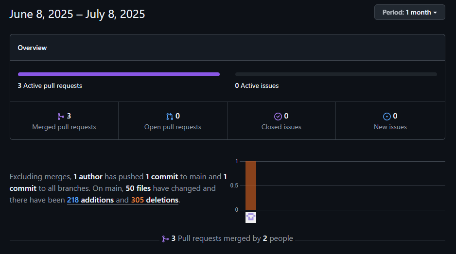

***Analíticos de commits de GitHub***

Muestra el historial y frecuencia de commits realizados en GitHub, ayudando a evaluar el ritmo de desarrollo, la contribución individual y detectar posibles cuellos de botella en el flujo de trabajo.

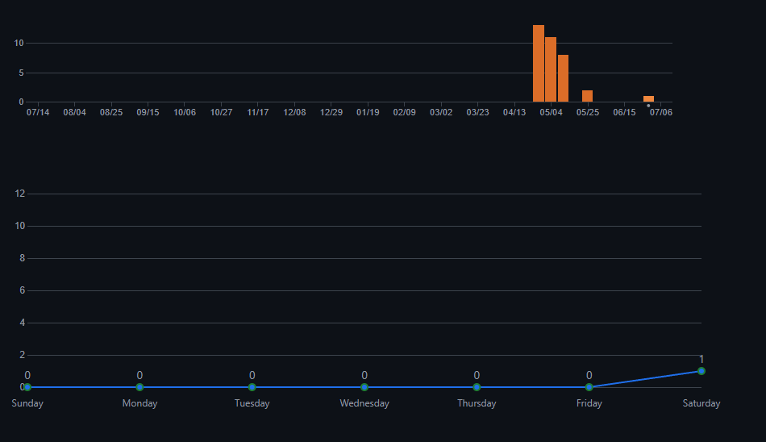

**Frontend**

***Analíticos de colaboración***

Permite monitorear de manera detallada la interacción y el aporte de cada miembro en las actividades conjuntas, facilitando la identificación de patrones de trabajo y fomentando una gestión más eficiente del equipo.

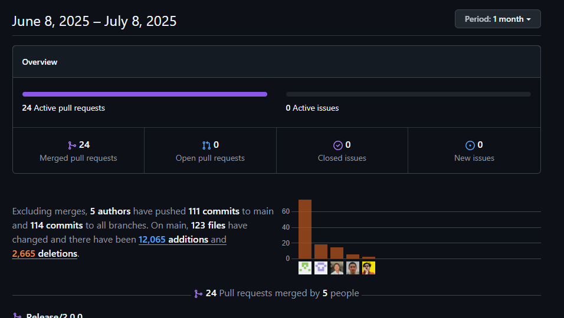

***Analíticos de commits de GitHub***

Presenta un análisis claro del flujo de commits en GitHub, mostrando la frecuencia y volumen de contribuciones para evaluar el progreso del proyecto y detectar áreas que requieren mayor atención o soporte.

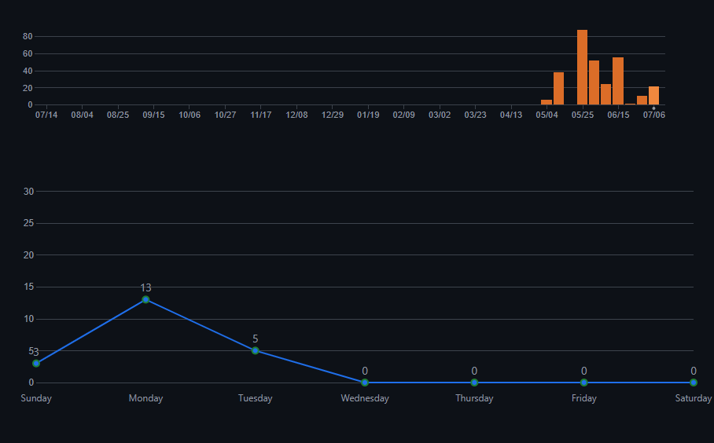

**Backend**

***Analíticos de colaboración***

Ofrece una vista detallada sobre la participación de cada integrante en las actividades grupales, permitiendo identificar su nivel de implicación y colaboración para mejorar la organización y el rendimiento general del equipo.

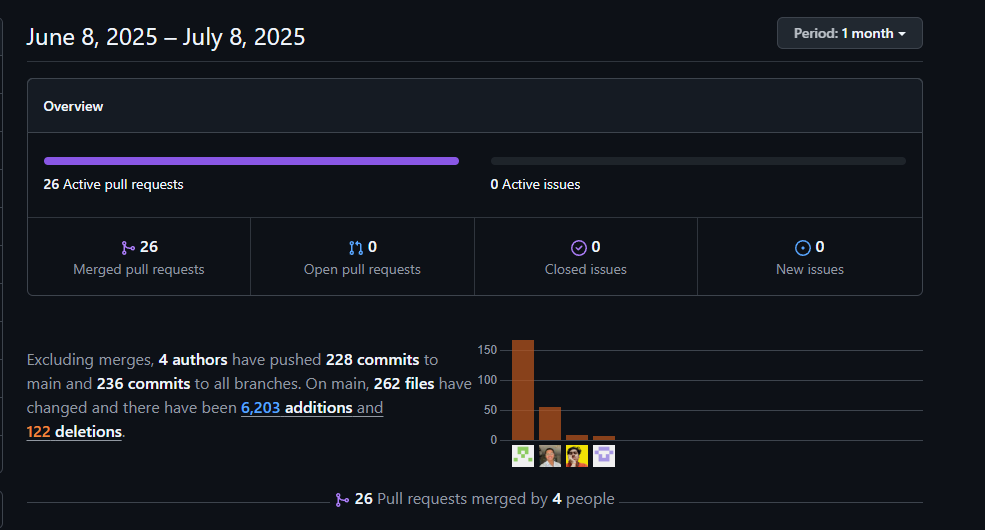

***Analíticos de commits de GitHub***

Refleja el registro y la periodicidad de los commits realizados en el repositorio, facilitando el seguimiento del avance del desarrollo, la distribución de las contribuciones y la detección de posibles bloqueos o retrasos.

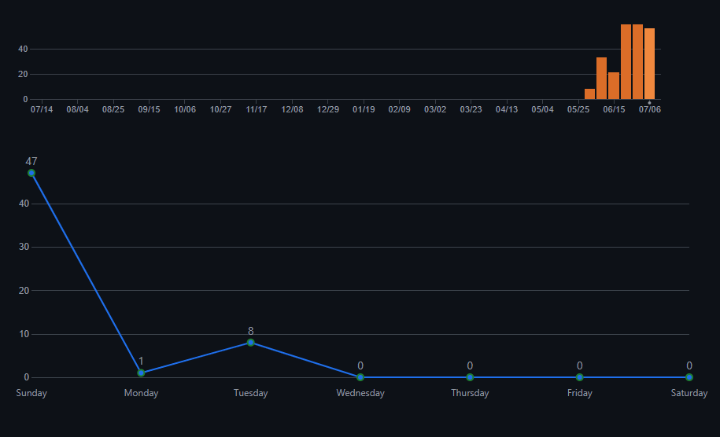

### Recursos del Sprint

| Recurso      | Acción implementada                             | Método HTTP | URL / Endpoint                                           | Link de repositorio         |
| ------------ | ------------------------------------------------ | ------------ | -------------------------------------------------------- | --------------------------- |
| Landing Page | Visualización completa y funcional del landing  | GET          | https://restock-4368.github.io/landing-page/             | https://short-link.me/16WRW |
| Frontend     | Visualización completa y funcional del frontend | GET          | https://restock-4368.github.io/UI-Topic-frontend/sign-in | https://short-link.me/16WS3 |
| Backend      | Implementación completa del backend             | GET          | https://short-link.me/12JfP                              | https://short-link.me/16WSe |

## 5.3. Validation Interviews

### 5.3.1. Diseño de Entrevistas

Para garantizar que la aplicación cumpla con las necesidades reales de los usuarios finales, se diseñó un proceso de entrevistas de validación centrado en dos segmentos objetivos clave: **administradores de restaurantes** y **proveedores de insumos**. Cada sesión de validación incluirá interacción con el **Landing Page** y la **aplicación web** (desktop y mobile), siguiendo flujos de usuario específicos que cubren funcionalidades críticas del sistema.

## Objetivo General

Validar la usabilidad, comprensión y utilidad de las funcionalidades del sistema a través de sesiones controladas de interacción, aplicando principios de evaluación heurística y recogiendo observaciones cualitativas.

## Segmento 1: Administradores de Restaurantes

### Elementos a validar

- Claridad del valor ofrecido en el landing page.
- Flujo de suscripción y pago.
- Registro y gestión de insumos.
- Gestión de lotes e inventario.
- Gestión de ventas y recetas.
- Visualización y selección de proveedores.
- Realización y seguimiento de pedidos.
- Panel de alertas y resúmenes.

### Flujos de Usuario a evaluar

- **Desktop & Mobile User Flow 1:** Suscripción y pago con Stripe.
- **Desktop & Mobile User Flow 3:** Registro y gestión de insumos.
- **Desktop & Mobile User Flow 4:** Resumen e indicadores.
- **Desktop & Mobile User Flow 5:** Visualización de proveedores y productos.
- **Desktop & Mobile User Flow 6:** Seguimiento de pedidos.
- **Desktop & Mobile User Flow 7:** Comentarios a proveedores.
- **Desktop & Mobile User Flow 8:** Registro y visualización de ventas.
- **Desktop & Mobile User Flow 9:** Creación y gestión de recetas.

### Actividades durante la sesión

1. Navegar el Landing Page y explicar lo que entienden del producto.
2. Simular una suscripción desde un plan.
3. Usar el módulo de inventario: registrar, editar y filtrar insumos.
4. Acceder al panel de resumen y describir lo que entienden.
5. Navegar por proveedores, seleccionar uno y simular una orden.
6. Realizar comentarios sobre proveedores.
7. Registrar una venta.
8. Crear una receta.

## Segmento 2: Proveedores de Restaurantes

### Elementos a validar

- Claridad del valor en el Landing Page.
- Gestión de catálogo de productos.
- Eliminación de insumos no disponibles.
- Revisión de pedidos realizados por restaurantes.
- Interacción con comentarios recibidos.

### Flujos de Usuario a evaluar

- **Desktop & Mobile User Flow 1:** Suscripción y pago.
- **Desktop & Mobile User Flow 10:** Registro y gestión de productos en el catálogo.
- **Desktop & Mobile User Flow 11:** Eliminación de insumos.
- **Desktop & Mobile User Flow 12:** Gestión de órdenes recibidas.
- **Desktop & Mobile User Flow 13:** Panel principal del proveedor.

### Actividades durante la sesión

1. Explorar el Landing Page y describir su comprensión del producto.
2. Simular el proceso de registro y suscripción.
3. Ingresar al sistema y registrar productos en su catálogo.
4. Eliminar productos del catálogo.
5. Revisar pedidos recibidos de restaurantes.
6. Comentar sobre la utilidad de la interfaz de pedidos y feedback.

## Herramientas y Recursos para Validación

- **Formato de Evaluación Heurística:** Se aplicarán los 10 principios heurísticos de Nielsen en cada sesión.
- **Instrumento de observación:** Lista de verificación + sección de notas abiertas.
- **Grabación de pantalla y voz:** previa autorización, para análisis posterior.

### 5.3.2. Registro de Entrevistas

Segmento 1: Dueños o administradores de Restaurantes

**ENTREVISTA 1:**

**Nombre:** Alfredo Bernuy
**Edad:** 52 años
**Distrito:** Chorrillos
**Timing:** (00:00- 05:18 min)


Ver entrevista: https://lc.cx/YT7O8G

**Resumen:**
Alfredo Bernuy, administrador de restaurantes con 4 años de experiencia, tiene 52 años, es casado y vive en el distrito de Chorrillos, Lima. Es una persona comprometida y orientada a la mejora continua.

Alfredo Bernuy destaca que la plataforma le resulta muy intuitiva desde el primer acceso: los menús están organizados de forma clara, los botones de acción son fácilmente reconocibles y el flujo para crear o modificar pedidos se siente natural y ágil. Valora especialmente la sección de gestión de stock, que le permite visualizar en tiempo real los niveles de inventario, recibir alertas automáticas al alcanzar el mínimo definido y filtrar por categorías o fechas para detectar tendencias.

Por otro lado, subraya que el diseño es moderno y atractivo: la paleta de colores es sobria pero actual, la tipografía resulta legible y los iconos comunican su función de un vistazo. Considera que la herramienta le brinda un control total sobre pedidos y stock, le ahorra tiempo y le transmite la confianza necesaria para optimizar sus operaciones diarias.

**ENTREVISTA 2:**

**Nombre:** Mery Pilar
**Edad:** 49 años
**Distrito:** Chorrillos
**Timing:** (05:19 - 10:50 min)


Ver entrevista: https://lc.cx/YT7O8G

**Resumen:**

Mery Pilar, administradora de restaurantes con 6 años de experiencia, tiene 49 años, es casada y vive en el distrito de Chorrillos, Lima. Es una persona responsable y orientada a la mejora continua e innovación.

Mery Pilar resalta que la herramienta es sumamente sencilla de usar desde el primer contacto: los apartados están dispuestos de manera ordenada, los elementos interactivos resultan intuitivos y el proceso para generar o actualizar pedidos fluye de forma muy eficiente. Aprecia de forma especial el módulo de control de inventario, que le permite monitorear al instante las existencias, recibir notificaciones automáticas cuando un artículo llega al stock mínimo y aplicar filtros por categoría o periodo para identificar patrones de consumo.

Además, enfatiza que la apariencia es fresca y profesional: los tonos empleados son elegantes sin dejar de ser actuales, la tipografía se lee con total nitidez y los iconos transmiten claramente su función. En su opinión, esta solución le proporciona el dominio completo sobre pedidos e inventario, optimiza su tiempo y le infunde la seguridad necesaria para mejorar sus operaciones diarias.
------------------------------------------------------------------------------------------------------------------------------------------------------------------------------------------------------------------------------------------------------------------------------------------------------------------------------------------------------------------------------------------------------------

#### Segmento 2: Proveedores para Restaurantes

**ENTREVISTA 1:**

**Nombre:** Flor Medina
**Edad:** 28 años
**Distrito:** San Miguel
**Timing:** (10:51 - 21:05 min)

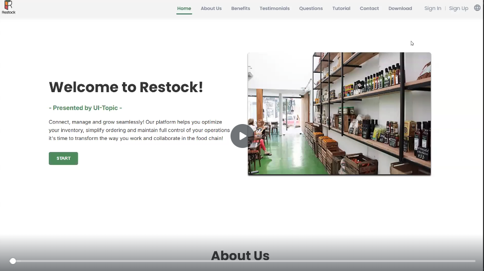

Ver entrevista: https://lc.cx/YT7O8G

**Resumen:**

Gerente de logistica y 7 años de experiencia

Flor Medina tiene 28 años, vive en el distrito de San Miguel y es gerente de logistica de pedidos. Es una persona perseverante, responsable y amable.

Comenta que la plataforma le facilita enormemente la gestión de sus pedidos entrantes: puede visualizar al instante las solicitudes de los restaurantes, confirmar o rechazar con un solo clic y programar fechas de envío en un calendario interactivo. Destaca el módulo de invetario, donde actualiza precios y descripciones de productos en tiempo real, y agradece las notificaciones automáticas que recibe cuando un cliente solicita pedidos.

Por su parte, valora que el panel de análisis le proporciona métricas claras que le ayuda a ajustar su producción y planificar rutas de reparto más eficientes. En conjunto, considera que esta herramienta le otorga un control total de sus procesos de venta y logística, reduce errores administrativos y le brinda la confianza de ofrecer un servicio más ágil y profesional.

### 5.3.3. Evaluaciones según heurísticas

**Carrera:** Ingeniería de Software

**Curso:** Aplicaciones Web
**Sección:** 4368
**Profesores:** Angel Velasquez
**Auditor:** Gabriela Nicole Shapiama Rivera y Yaku Mateo Guzman Cabrejos
**Cliente(s):** Mery Pilar, Alfredo Bernuy y Flor Medina

**Site o App a evaluar:** Restock

**ESCALA DE SEVERIDAD:**

Los errores serán puntuados tomando en cuenta la siguiente escala de severidad

<table>
    <tr>
        <td>Nivel</td>
        <td>Descripción</td>
    </tr>
    <tr>
        <td>1</td>
        <td>Problema superficial: puede ser fácilmente superador por el usuario ó ocurre con muy poco frecuencia. No necesita ser arreglado a no ser que exista disponibilidad de tiempo.</td>
    </tr>
    <tr>
        <td>2</td>
        <td>Problema menor: puede ocurrir un poco más frecuentemente o es un poco más difícil de superar para el usuario. Se le debería asignar una prioridad baja resolverlo de cara al siguiente reléase</td>
    </tr>
    <tr>
        <td>3</td>
        <td>Problema mayor: ocurre frecuentemente o los usuarios no son capaces de resolverlos. Es importante que sean corregidos y se les debe asignar una prioridad alta.</td>
    </tr>
    <tr>
        <td>4</td>
        <td>Problema muy grave: un error de gran impacto que impide al usuario continuar con el uso de la herramienta. Es imperativo que sea corregido antes del lanzamiento.</td>
    </tr>
</table>

**Tareas evaluadas:**

1. Visualización de planes de suscripción
2. Gestión de inventario de insumos
3. Recepción de notificaciones automáticas
4. Realización de pedidos
5. Creación de recetas
6. Registro de ventas

---

**TABLA RESUMEN**

| #  | Problema                                                          | Escala de severidad | Heurística / Principio violado                                                 |
| -- | ----------------------------------------------------------------- | ------------------- | ------------------------------------------------------------------------------- |
| 1  | Uso de colores sin etiquetas para estados de pedido               | 2                   | Usabilidad: Visibilidad del estado del sistema                                  |
| 2  | Falta de opciones rápidas para reutilizar recetas                | 1                   | Usabilidad: Reconocer mejor que recordar                                        |
| 3  | No existen accesos directos ni funciones para expertos            | 3                   | Usabilidad: Flexibilidad y eficiencia de uso                                    |
| 4  | Botones y acciones no están claramente etiquetados               | 2                   | Usabilidad: Correspondencia entre sistema y mundo real                          |
| 5  | No se contempla accesibilidad visual o de navegación             | 2                   | Inclusive Design: Accesibilidad y compatibilidad                                |
| 6  | Falta de opciones para editar o cancelar un pedido                | 2                   | Usabilidad: Libertad y control del usuario                                      |
| 7  | Flujo de tareas puede ser poco guiado                             | 1                   | Information Architecture: Is it usable?                                         |
| 8  | Modal de creación de insumos podría ser más informativo        | 1                   | Usabilidad: Ayuda y documentación                                              |
| 9  | Notificaciones no especifican acción sugerida                    | 2                   | Usabilidad: Ayuda al usuario a reconocer, diagnosticar y recuperarse de errores |
| 10 | Registro de ventas puede generar confusión por pasos implícitos | 2                   | Arquitectura de información: Claridad del flujo                                |
| 11 | Panel de análisis no permite filtrar por tipo de cliente         | 2                   | Information Architecture: Is it findable?                                       |
| 12 | Calendario de envíos carece de vista resumen o semanal           | 2                   | Usabilidad: Flexibilidad y eficiencia de uso                                    |

---

**DESCRIPCIÓN DE PROBLEMAS**

**PROBLEMA #1: Uso de colores sin etiquetas para estados de pedido**
**Severidad:** 2
**Heurística violada:** Usabilidad - Visibilidad del estado del sistema
**Problema:** Actualmente, el sistema usa colores para indicar el estado de los pedidos, pero no existe una leyenda textual que acompañe estos colores. Esto puede causar confusión a usuarios que no recuerdan o entienden el significado de cada color.
**Evidencia:** La usuaria indicó: "Le sale de diferente color...". No mencionó saber qué significa cada color.
**Recomendación:** Incorporar etiquetas de texto junto a los colores para que el estado sea inequívocamente identificado ("Aprobado", "Pendiente", etc.).

---

**PROBLEMA #2: Falta de opciones rápidas para reutilizar recetas**
**Severidad:** 1
**Heurística violada:** Usabilidad - Reconocer mejor que recordar
**Problema:** El sistema permite crear recetas, pero no ofrece un mecanismo claro para reutilizarlas o seleccionarlas de forma directa. Esto puede hacer que el usuario deba rehacer pasos innecesarios.
**Evidencia:** La usuaria comentó: "Y puedo crear acá nuevos productos también", lo cual implica que debe crear nuevamente la receta en vez de seleccionar una ya existente.
**Recomendación:** Añadir un buscador o selector de recetas guardadas para ser reutilizadas.

---

**PROBLEMA #3: No existen accesos directos ni funciones para expertos**
**Severidad:** 3
**Heurística violada:** Usabilidad - Flexibilidad y eficiencia de uso
**Problema:** El sistema está centrado en tareas básicas, pero no contempla accesos rápidos, atajos o funcionalidades para usuarios frecuentes que desean operar con mayor agilidad.
**Evidencia:** "...tener más tiempo... incluso para poder abrir otra tienda", sugiere que la eficiencia es una necesidad importante para la usuaria.
**Recomendación:** Incluir favoritos, accesos directos desde el dashboard, filtros inteligentes o teclas rápidas.

---

**PROBLEMA #4: Botones y acciones no están claramente etiquetados**
**Severidad:** 2
**Heurística violada:** Usabilidad - Correspondencia entre sistema y mundo real
**Problema:** Algunos botones como "Place Order" no son intuitivos para un usuario hispanohablante, y su comprensión depende del color o la posición.
**Evidencia:** "Place Order (el morado)" indica que se recuerda el color más que la acción.
**Recomendación:** Usar etiquetas localizadas ("Realizar pedido") y añadir íconos descriptivos.

---

**PROBLEMA #5: No se contempla accesibilidad visual o de navegación**
**Severidad:** 2
**Heurística violada:** Inclusive Design - Accesibilidad y compatibilidad
**Problema:** El sistema no ofrece opción de alto contraste, navegación por teclado o soporte para lectores de pantalla.
**Evidencia:** No mencionado directamente, pero se infiere por ausencia de referencia.
**Recomendación:** Añadir opciones de accesibilidad visual y teclas de navegación.

---

**PROBLEMA #6: Falta de opciones para editar o cancelar un pedido**
**Severidad:** 2
**Heurística violada:** Usabilidad - Libertad y control del usuario
**Problema:** El sistema no deja claro si se pueden modificar o anular pedidos una vez registrados, lo cual limita el control del usuario sobre el flujo.
**Evidencia:** No se menciona esta posibilidad en la entrevista, y la acción parece definitiva.
**Recomendación:** Añadir botones de "Editar" y "Cancelar" en pedidos recientes.

---

**PROBLEMA #7: Flujo de tareas puede ser poco guiado**
**Severidad:** 1
**Heurística violada:** Arquitectura de información - Is it usable?
**Problema:** El proceso de registrar ventas o pedidos implica múltiples pasos que pueden resultar poco intuitivos sin guías.
**Evidencia:** "...registrar... seleccionar... luego se descuenta el stock" sugiere un flujo de acciones implícito.
**Recomendación:** Incorporar guías visuales paso a paso (como barra de progreso o onboarding contextual).

---

**PROBLEMA #8: Modal de creación de insumos podría ser más informativo**
**Severidad:** 1
**Heurística violada:** Usabilidad - Ayuda y documentación
**Problema:** El modal para añadir insumos es funcional, pero no proporciona ejemplos ni guías sobre qué información debe colocarse.
**Evidencia:** "...tiene ahí la opción de poner cualquiera de sus ítems" indica libertad sin orientación.
**Recomendación:** Incluir sugerencias o placeholders dentro del modal (por ejemplo: "Ej: Lechuga romana").

---

**PROBLEMA #9: Notificaciones no especifican acción sugerida**
**Severidad:** 2
**Heurística violada:** Usabilidad - Ayuda al usuario a reconocer, diagnosticar y recuperarse de errores
**Problema:** Las notificaciones informan del stock mínimo o de pedidos, pero no indican directamente qué hacer a continuación.
**Evidencia:** "...con esto ya tendríamos las notificaciones que nos alertarían" indica utilidad, pero no orientación.
**Recomendación:** Añadir botones de acción directa en las notificaciones ("Realizar pedido", "Editar insumo").

---

**PROBLEMA #10: Registro de ventas puede generar confusión por pasos implícitos**
**Severidad:** 2
**Heurística violada:** Arquitectura de información - Claridad del flujo
**Problema:** El proceso de registrar una venta y luego registrarla nuevamente para descontar del inventario puede resultar confuso para usuarios nuevos.
**Evidencia:** "...ventas registradas que no se han descontado del inventario..." sugiere un doble paso no evidente.
**Recomendación:** Fusionar ambos pasos o hacer explícito el estado intermedio con instrucciones claras ("Venta pendiente de confirmación").

---

**PROBLEMA #11: Panel de análisis no permite filtrar por tipo de cliente**
**Severidad:** 2
**Heurística violada:** Arquitectura de información - Is it findable?
**Problema:** El panel de métricas proporciona datos útiles, pero no permite segmentarlos por tipo de cliente, zona geográfica u otros criterios relevantes para la logística.
**Evidencia:** Flor menciona que "el panel de análisis le proporciona métricas claras", pero sugiere que la información está centralizada sin filtros.
**Recomendación:** Incluir filtros en el panel (por fecha, zona, tipo de restaurante, etc.) para mayor utilidad.

---

**PROBLEMA #12: Calendario de envíos carece de vista resumen o semanal**
**Severidad:** 2
**Heurística violada:** Usabilidad - Flexibilidad y eficiencia de uso
**Problema:** Aunque se puede programar fechas de envío, no se ofrece una vista que permita ver de forma semanal o mensual todas las programaciones a la vez.
**Evidencia:** Flor menciona que programa fechas de envío en un calendario interactivo, pero no indica capacidad de ver planificación agregada.
**Recomendación:** Añadir vistas tipo "semana" o "mes" al calendario para facilitar la gestión logística de varios pedidos.

## 5.4. Video About-the-Product

A continuación, se presenta el video "About the Product" del sistema Restock, una solución tecnológica desarrollada para digitalizar y automatizar la gestión de inventarios y pedidos en restaurantes. Este video está dirigido principalmente a los visitantes del Landing Page, quienes desean conocer el modelo de negocio y las principales funcionalidades de la plataforma, así como a los usuarios potenciales de las aplicaciones, interesados en realizar tareas relacionadas con los procesos soportados por la solución.

El video comunica de forma clara y dinámica el propósito del producto, mostrando cómo Restock ayuda a reducir el desperdicio, mejorar la eficiencia operativa y fortalecer la relación entre administradores de restaurantes y proveedores. Se utiliza un tono consistente con la propuesta visual y comunicacional del producto, combinando narración, demostraciones de uso y escenarios reales.

Como parte de la validación del producto, se incluye también el testimonio de un administrador de restaurante entrevistado en la etapa de descubrimiento.

A continuación, se incluye un screenshot del video, junto con los enlaces de la versión publicada en Microsoft Stream y YouTube, y el detalle del timing.

[https://shorturl.at/4827U](https://shorturl.at/4827U)
