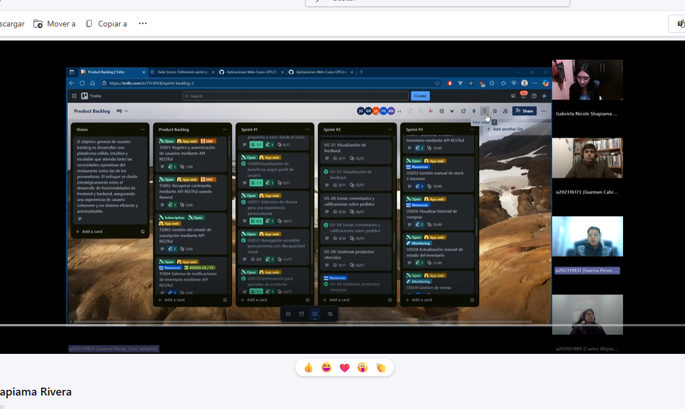

## Conclusiones

**Conclusiones**

El desarrollo de Restock ha permitido validar, a través de implementaciones concretas y funcionales, que existe una necesidad real y no resuelta en la gestión operativa de insumos en restaurantes. Durante el Sprint 4 se completó la arquitectura base para la gestión de cuentas, suscripciones, ventas, notificaciones críticas y retroalimentación, consolidando así los flujos fundamentales de valor para ambos segmentos: administradores y proveedores. Las validaciones realizadas demuestran que los usuarios perciben claramente el beneficio de contar con inventario en tiempo real, alertas automáticas y control digital de pedidos y pagos. Si bien el riesgo de adopción por baja familiaridad digital se hizo evidente, las funcionalidades clave fueron comprendidas y valoradas, especialmente cuando se implementaron con una interfaz simple, navegación modular y respuestas claras del sistema. Con todo, los assumptions iniciales —tanto de negocio como de usuario— han sido confirmados en su mayoría, y el producto demuestra estar alineado con una necesidad urgente del sector HORECA, aportando eficiencia, trazabilidad y ahorro operativo.

**Recomendaciones**

Con una base técnica sólida y un MVP funcional validado, se recomienda avanzar hacia pilotos reales en restaurantes medianos para recoger métricas de uso, adopción y resultados operativos. Será clave optimizar la experiencia mobile, fortalecer el onboarding mediante flujos guiados y soporte activo, e integrar canales más directos como notificaciones móviles o correo para cerrar el ciclo operativo entre restaurante y proveedor. A nivel funcional, se debe priorizar el refinamiento de reportes KPI, la visualización de feedback, la gestión de suscripciones y la experiencia de usuario en cada módulo. Estas mejoras, sumadas a una estrategia comercial progresiva y basada en casos de éxito reales, permitirán escalar Restock como una plataforma SaaS ligera, accesible y centrada en resolver las fricciones más críticas de la gestión alimentaria profesional.

 **Video About the team**

A continuación, se presenta el video acerca del equipo de UI-Topic. Se especifica las tareas realizadas por cada integrante y el logro final del proyecto.

Link del video en Youtube: https://youtu.be/1tkIrM1A4B4

Link del video en Stream: https://rb.gy/w3fpku
