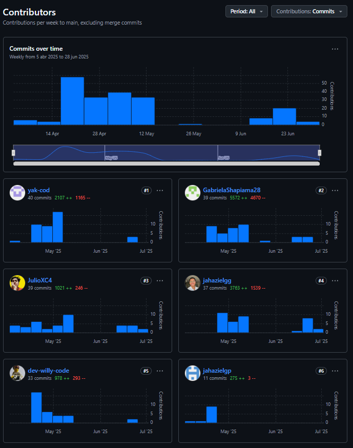
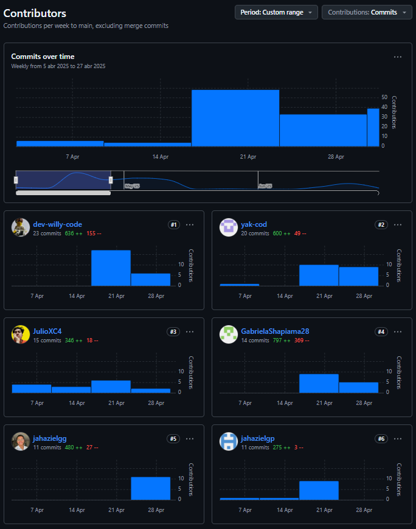
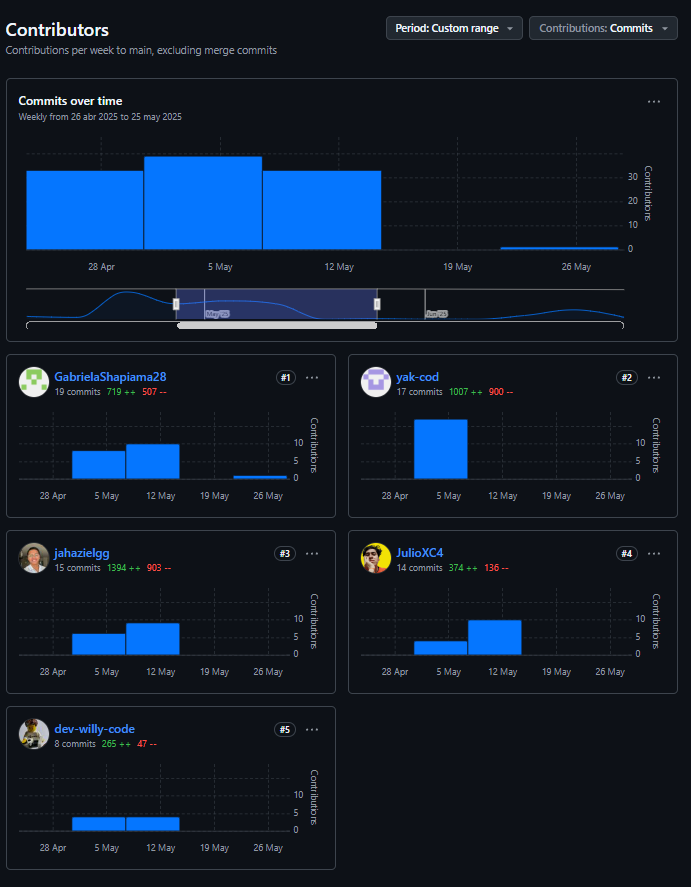
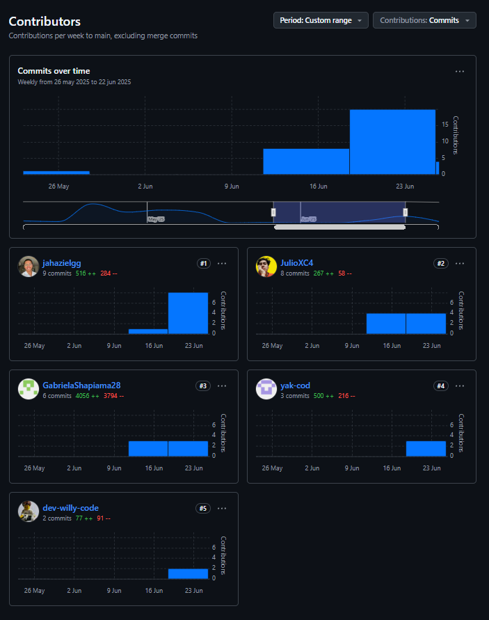

_Universidad Peruana de Ciencias Aplicadas_

_Ingeniería de Software_

_2025-10_

**Código:** _1ASI0730_

**Nombre:** _Aplicaciones Web_

_Sección 4368

_Prof. Velásquez Núñez, Ángel Augusto_

## Nombre del Startup

**Nombre:** _UI-Topic_

## Nombre del Producto

**Producto:** _Restock_

## Relación de Integrantes

|  Código  |         Apellidos y Nombres         |
| :--------: | :----------------------------------: |
| u202315325 | Avendaño Balarezo, Williams Eduardo |
| u202021885 |         Castro Alejos, Julio         |
| u202319831 |     Guerra Perez, José Jahaziel     |
| u20231b173 |     Guzmán Cabrejos, Yaku Mateo     |
| u202319448 |   Shapiama Rivera, Gabriela Nicole   |

---

**Mes y Año**
_Abril 2025_

## **Registro de Versiones**

| *Versión* | *Fecha* | *Autor*          | *Descripción de modificación*                                                                                                                                                                                                                                  |
| :----------: | :-------: | :----------------- | :----------------------------------------------------------------------------------------------------------------------------------------------------------------------------------------------------------------------------------------------------------------- |
|     1.1     | 04/04/25 | Yaku Guzmán       | Se redactó Lean UX Problem Statements y Assumptions.                                                                                                                                                                                                              |
|     1.2     | 04/04/25 | Gabriela Shapiama  | Se elaboró el Lean UX Canvas y se redactaron los competidores.                                                                                                                                                                                                    |
|     1.3     | 05/04/25 | Williams Avendaño | Se redactó segmentos objetivos y diseño de entrevistas.                                                                                                                                                                                                          |
|     1.4     | 05/04/25 | Jahaziel Guerra    | Se redactó antecedentes y problemática, y análisis competitivo.                                                                                                                                                                                                 |
|     1.5     | 05/04/25 | Julio Castro       | Se redactó perfil de la startup y estrategias frente a competidores.                                                                                                                                                                                              |
|     2.1     | 09/04/25 | Williams Avendaño | Se registró 1 entrevista y se elaboró el Journey Mapping.                                                                                                                                                                                                        |
|     2.2     | 10/04/25 | Yaku Guzmán       | Se realizaron 3 entrevistas y se redactó el análisis de entrevistas. Se elaboró el User Task Matrix y tanto el As-Is como el To-Be Scenario Mapping.                                                                                                       |
|     2.3     | 11/04/25 | Julio Castro       | Se realizó User Personas, Empathy Mapping y User Stories.                                                                                                                                                                                                         |
|     2.4     | 13/04/25 | Gabriela Shapiama  | Se registraron 2 entrevistas. Se elaboró el Impact Mapping  y general Style Guidelines.                                                                                                                                                                     |
|     3.1     | 13/04/25 | Jahaziel Guerra    | Se realizó el Ubiquitous Language, Product Backlog y Web Style Guidelines.                                                                                                                                                                                   |
|     3.2     | 16/04/25 | Yaku Guzmán       | Se redactó Labeling Systems y se realizaron Web Applications, tanto Wireframes como Mock-ups.                                                                                                                                                                     |
|     3.5     | 16/04/25 | Jahaziel Guerra    | Se redactó Organization y Navigation Systems. Se realizaron Software Architecture Container Diagrams y Web Applications,   tanto Wireframes como Mock-ups.                                                                                                   |
|     3.6     | 16/04/25 | Williams Avendaño | Se realizaron SEO and Meta Tags, Searching Systems y Database Diagram. También se realizaron Web Applications, tanto Wireframes como Mock-ups.                                                                                                          |
|     3.7     | 16/04/25 | Julio Castro       | Se realizó Software Architecture Context Diagram y Web Applications, tanto Wireframes como Mock-ups.                                                                                                                                                         |
|     4.1     | 16/04/25 | Gabriela Shapiama  | Se elaboraron Class Diagrams, Class Dictionary y Landing Page, tanto Wireframe como Mock-up.                                                                                                                                                                  |
|     4.2     | 18/04/25 | Jahaziel Guerra    | Se realizaron Web Applications Wireflow Diagrams.                                                                                                                                                                                                                  |
|     5.1     | 20/04/25 | Gabriela Shapiama  | Se realizaron Web Applications User Flow Diagrams, Software Deployment Configuration y Sprint Planning 1.                                                                                                                                                     |
|     5.2     | 21/04/25 | Williams Avendaño | Se realizó Software Development Environment Configuration, Source Code Style Guide & Conventions y Sprint Backlog.                                                                                                                                           |
|     5.3     | 23/04/25 | Julio Castro       | Se realizó Source Code Management, Aspect Leaders and Collaborators y Execution Evidence for Sprint Review.                                                                                                                                                  |
|     5.4     | 24/04/25 | Jahaziel Guerra    | Se realizó Software Architecture Component Diagram, Web Applications Prototyping y Software Deployment Evidence for Sprint Review.                                                                                                                           |
|     5.5     | 25/04/25 | Yaku Guzmán       | Se realizaron Software Architecture Component Diagram, Development Evidence y Services Documentation Evidence for Sprint Review. Se elaboró Team Collaboration Insights during Sprint y Conclusiones.                                                        |
|     6.1     |  6/05/25  | Yaku Guzmán       | Se corrigió Task Matrix, redacción de Lean UX Assumptions, formato de todo el documento y Services Documentation Evidence for Sprint Review 1.                                                                                                             |
|     6.2     |  6/05/25  | Gabriela Shapiama  | Se agregó sección de equipo en el mockup y wireframe del Landing Page, se tradujeron wireframes y mockups del Landing  Page, se actualizaron user flows Desktop, se corrigió Impact Mapping y  se corrigió formato de perfiles de integrantes. |
|     6.3     |  6/05/25  | Williams Avendaño | Se tradujo mockups y wireframes del Web Application Mobile, se corrigieron títulos del Sprint Bakclog 1, se corrigió diagrama  de base de datos y Source Code Management.                                                                              |
|     6.4     |  7/05/25  | Jahaziel Guerra    | Se tradujo mockups y wireframes del Web Application Desktop, se actualizaron Wireflows y User Flows Mobile, se actualizó video  de Web Application Prototyping Mobile y se corrigieron títulos de los Tasks Flow                                       |
|     6.5     |  7/05/25  | Julio Castro       | Se corrigió redacción de User Stories, se corrigieron aspectos de  User Personas, se actualizaron wireframes y mockups del Landing   Page Mobile y se actualizó Execution Evidence for Sprint Review 1.                                             |
|     7.1     |  8/05/25  | Gabriela Shapiama  | Se actualizó Student Outcome y se realizó Event Storming                                                                                                                                                                                                         |
|     7.2     |  8/05/25  | Yaku Guzmán       | Se realizó Sprint Planning 2.                                                                                                                                                                                                                                     |
|     7.3     |  8/05/25  | Julio Castro       | Se realizó Sprint Backlog 2.                                                                                                                                                                                                                                      |
|     8.1     | 14/05/25 | Jahaziel Guerra    | Se realizó Development Evidence for Sprint 2 Review y Services  Documentation Evidence for Sprint 2 Review.                                                                                                                                                 |
|     8.2     | 14/05/25 | Williams Avendaño | Se realizó Execution Evidence for Sprint 2 Review (landing page) y Software Deployment Evidence for Sprint 2 Review.                                                                                                                                         |
|     8.3     | 14/05/25 | Julio Castro       | Se realizó Execution Evidence for Sprint 2 Review (frontend).                                                                                                                                                                                                    |
|     8.4     | 14/05/25 | Gabriela Shapiama  | Se realizó Team Collaboration Insights during Sprint 2.                                                                                                                                                                                                          |
|     8.5     | 14/05/25 | Yaku Guzmán       | Se realizó avance de conclusiones.                                                                                                                                                                                                                                |
|     9.1     | 30/05/25 | Julio Castro       | Se actualizaron las user stories y se elaboró diseño de  entrevistas.                                                                                                                                                                                       |
|     9.2     | 31/05/25 | Jahaziel Guerra    | Se actualizó el Product Backlog y se elaboró el Sprint Planning 3.                                                                                                                                                                                          |
|     9.3     |  1/06/25  | Gabriela Shapiama  | Se elaboró Aspect Leaders and Collaborators.                                                                                                                                                                                                                      |
|     9.4     |  2/06/25  | Yaku Guzmán       | Se agregó el Sprint Backlog 3.                                                                                                                                                                                                                                    |
|     9.5     | 16/06/25 | Yaku Guzmán       | Se elaboró Development Evidence for Sprint Review 3.                                                                                                                                                                                                              |
|     9.6     | 16/06/25 | Julio Castro       | Se realizó Execution Evidence for Sprint Review y Team Collaboration Insights during Sprint 3.                                                                                                                                                              |
|     9.7     | 19/06/25 | Williams Avendaño | Se elaboró Services Documentation Evidence for Sprint Review y Software Deployment Evidence for Sprint Review 3.                                                                                                                                             |
|     9.8     | 20/06/25 | Williams Avendaño | Se registraron entrevistas.                                                                                                                                                                                                                                        |
|     9.9     | 20/06/25 | Gabriela Shapiama  | Se registraron entrevistas.                                                                                                                                                                                                                                        |
|     9.10     | 20/06/25 | Yaku Guzmán       | Se registraron entrevistas.                                                                                                                                                                                                                                        |
|     9.11     | 20/06/25 | Jahaziel Guerra    | Se elaboraron las Evaluaciones según heurísticas.                                                                                                                                                                                                                |
|     9.12     | 20/06/25 | Julio Castro       | Se realizó Video About-the-Product.                                                                                                                                                                                                                               |
|     9.13     | 20/06/25 | Williams Avendaño | Se actualizaron las conclusiones                                                                                                                                                                                                                                   |
|     9.14     | 20/06/25 | Gabriela Shapiama  | Se actualizaron los anexos.                                                                                                                                                                                                                                        |
|     10.1     |  1/07/25  | Jahaziel Guerra    | Se actualizó el Product Backlog y se elaboró el Sprint Planning 4.                                                                                                                                                                                         |
|     10.2     |  1/07/25  | Gabriela Shapiama  | Se elaboró Aspect Leaders and Collaborators 4.                                                                                                                                                                                                                    |
|     10.3     |  2/07/25  | Jahaziel Guerra    | Se agregó el Sprint Backlog 4.                                                                                                                                                                                                                                    |
|     10.4     |  2/06/25  | Julio Castro       | Se actualizó Project Report Collaboration Insights, User Stories y diagrama de clases.                                                                                                                                                                        |
|     10.5     |  2/06/25  | Yaku Guzman        | Corregir Development Evidence for Sprint Review del Sprint 3.                                                                                                                                                                                                      |
|     10.6     |  2/06/25  | Gabriela Shapiama  | Corrección Formato de links en el reporte.                                                                                                                                                                                                                        |
|     10.7     |  3/06/25  | Yaku Guzman        | Corregir Development Evidence for Sprint Review del Sprint 3 y titles en Sprint Backlog 2.                                                                                                                                                                        |
|     10.8     |  4/06/25  | Julio Castro       | Software Deployment  Evidence for Sprint Review 4 y Execution Evidence for Sprint Review 4.                                                                                                                                                                        |
|     10.9     |  4/06/25  | Jahaziel Guerra    | Se elaboró Services Documentation Evidence for Sprint Review 4.                                                                                                                                                                                              |
|    10.10    |  4/06/25  | Gabriela Shapiama  | Se realizó Team Collaboration Insights during Sprint 3, anexos, conclusiones y bibliografía.                                                                                                                                                                   |
|    10.11    |  5/06/25  | Julio Castro       | Video about-the-product.                                                                                                                                                                                                                                           |
|    10.12    |  5/06/25  | Yaku Guzman        | Development Evidence for Sprint Review 4.                                                                                                                                                                                                                          |
|    10.13    |  5/06/25  | Jahaziel Guerra    | Actualizar video About-The-Team en conclusiones.                                                                                                                                                                                                                   |

# Project Report Collaboration Insights

Para el desarrollo del **Project Report**, se utilizó un repositorio dentro de la organización del equipo en GitHub. A continuación, se presenta la evidencia de colaboración correspondiente, en coherencia con el Registro de Versiones del Informe.

**Repositorio del informe del proyecto:**  
[https://shorturl.at/LteHd](https://shorturl.at/LteHd)

- **Total de commits:** 392  
- **Autores contribuyentes:**  
  - Williams Avendaño (`dev-willy-code`)  
  - Yaku Guzmán (`yak-cod`)  
  - Julio Castro (`JulioXC4`)  
  - Gabriela Shapiama (`GabrielaShapiama28`)  
  - Jahaziel Guerra (`jahazielgg`)  
- Actividad distribuida por ramas correspondientes a cada sección del informe.  
- Todos los miembros participaron activamente en la redacción y revisión del contenido.

## TB1 - Informe inicial y Landing Page (5 de abril - 27 de abril de 2025)

Durante esta fase, el equipo elaboró el informe base del proyecto, abarcando la definición del problema, justificación, objetivos y marco teórico. Simultáneamente, se desarrolló la **Landing Page** utilizando HTML5, CSS3 y JavaScript puro.

El trabajo fue organizado mediante ramas temáticas, permitiendo que cada integrante aportara contenido específico y realizara revisiones cruzadas mediante *pull requests*. Las decisiones sobre estructura, estilo y contenido se discutieron de forma colaborativa en los comentarios de los PRs.

- **Williams Avendaño (`dev-willy-code`)**: 23 commits, 636 adiciones, 155 eliminaciones  
- **Yaku Guzmán (`yak-cod`)**: 20 commits, 600 adiciones, 49 eliminaciones  
- **Julio Castro (`JulioXC4`)**: 15 commits, 346 adiciones, 18 eliminaciones  
- **Gabriela Shapiama (`GabrielaShapiama28`)**: 14 commits, 797 adiciones, 369 eliminaciones  
- **Jahaziel Guerra (`jahazielgg`)**: 22 commits, 480 adiciones, 27 eliminaciones  
- **Total de commits en TB1:** 94  

La colaboración fue activa y equitativa, con contribuciones sustanciales de todos los integrantes.

## TP1 - Desarrollo del Frontend y mejoras en la Landing Page (28 de abril - 25 de mayo de 2025)

Durante este sprint, el equipo se enfocó en construir la interfaz de usuario de la aplicación web. Se utilizó **Vue 3 con Vite**, **PrimeVue**, **axios** e **i18n** para implementar los componentes principales, siguiendo principios de **domain-driven design** y organización por *bounded contexts*. También se realizaron correcciones y mejoras en la Landing Page, mejorando la accesibilidad, adaptabilidad móvil y tiempos de carga.

En el informe se documentó el diseño de la arquitectura del frontend, la estructura de carpetas y las decisiones tecnológicas adoptadas, incluyendo capturas del prototipo funcional. La colaboración se mantuvo mediante commits individuales y revisiones cruzadas de los PRs.

- **Williams Avendaño (`dev-willy-code`)**: 8 commits, 265 adiciones, 47 eliminaciones  
- **Yaku Guzmán (`yak-cod`)**: 17 commits, 1007 adiciones, 900 eliminaciones  
- **Julio Castro (`JulioXC4`)**: 14 commits, 374 adiciones, 136 eliminaciones  
- **Gabriela Shapiama (`GabrielaShapiama28`)**: 19 commits, 719 adiciones, 507 eliminaciones  
- **Jahaziel Guerra (`jahazielgg`)**: 15 commits, 1394 adiciones, 903 eliminaciones  
- **Total de commits en TP1:** 73  

Este nivel de actividad refleja un esfuerzo colaborativo significativo y una distribución equilibrada del trabajo.

## TB2 - Desarrollo del Backend, mejoras en el frontend y Landing Page (26 de mayo - 21 de junio de 2025)

Durante el sprint final, se desarrolló el backend utilizando **ASP.NET Core Framework** bajo una arquitectura DDD. Se diseñaron los agregados principales (`Recipes`), así como servicios de comandos, consultas y controladores REST. También se integró **Swagger** para la documentación automática de las APIs.

Paralelamente, se realizaron mejoras finales tanto en el frontend como en la Landing Page, corrigiendo errores visuales, optimizando flujos y asegurando la integración entre frontend y backend.

El informe fue ampliado con una sección dedicada al backend, incluyendo diagramas de contexto y contenedores generados con Structurizr, además de descripciones detalladas sobre el diseño basado en dominios. Todos los miembros contribuyeron con documentación técnica, pruebas e integraciones.

- **Williams Avendaño (`dev-willy-code`)**: 2 commits, 77 adiciones, 91 eliminaciones  
- **Yaku Guzmán (`yak-cod`)**: 3 commits, 500 adiciones, 216 eliminaciones  
- **Julio Castro (`JulioXC4`)**: 8 commits, 267 adiciones, 58 eliminaciones  
- **Gabriela Shapiama (`GabrielaShapiama28`)**: 6 commits, 4056 adiciones, 3794 eliminaciones  
- **Jahaziel Guerra (`jahazielgg`)**: 9 commits, 516 adiciones, 284 eliminaciones  
- **Total de commits en TB2:** 28  

La colaboración fue continua y estratégica, con aportes clave en aspectos críticos del backend y del informe final.

# Tabla de contenidos

## [Capítulo I: Introducción](02-cap1-introduction.md#capítulo-i-introducción)

* [1.1 Startup Profile](02-cap1-introduction.md#11-startup-profile)

  * [1.1.1 Descripción de la Startup](02-cap1-introduction.md#111-descripción-de-la-startup)
  * [1.1.2 Perfiles de integrantes del equipo](02-cap1-introduction.md#112-perfiles-de-integrantes-del-equipo)
* [1.2 Solution Profile](02-cap1-introduction.md#12-solution-profile)

  * [1.2.1 Antecedentes y problemática](02-cap1-introduction.md#121-antecedentes-y-problemática)
  * [1.2.2 Lean UX](02-cap1-introduction.md#122-lean-ux)

    * [1.2.2.1 Problem Statement](02-cap1-introduction.md#1221-problem-statement)
    * [1.2.2.2 Assumptions](02-cap1-introduction.md#1222-assumptions)
    * [1.2.2.3 Hypothesis](02-cap1-introduction.md#1223-hypothesis)
    * [1.2.2.4 Lean UX Canvas](02-cap1-introduction.md#1224-lean-ux-canvas)
* [1.3 Segmentos Objetivos](02-cap1-introduction.md#13-segmentos-objetivos)

## [Capítulo II: Requirements Elicitation & Analysis](03-cap2-requirements-elicitation-and-analysis.md#capítulo-ii-requirements-elicitation--analysis)

* [2.1 Competidores](03-cap2-requirements-elicitation-and-analysis.md#21-competidores)

  * [2.1.1 Análisis competitivo](03-cap2-requirements-elicitation-and-analysis.md#211-análisis-competitivo)
  * [2.1.2 Estrategias y tácticas frente a competidores](03-cap2-requirements-elicitation-and-analysis.md#212-estrategias-y-tácticas-frente-a-competidores)
* [2.2 Entrevistas](03-cap2-requirements-elicitation-and-analysis.md#22-entrevistas)

  * [2.2.1 Diseño de entrevistas](03-cap2-requirements-elicitation-and-analysis.md#221-diseño-de-entrevistas)
  * [2.2.2 Registro de entrevistas](03-cap2-requirements-elicitation-and-analysis.md#222-registro-de-entrevistas)
  * [2.2.3 Análisis de entrevistas](03-cap2-requirements-elicitation-and-analysis.md#223-análisis-de-entrevistas)
* [2.3 Needfinding](03-cap2-requirements-elicitation-and-analysis.md#23-needfinding)

  * [2.3.1 User Personas](03-cap2-requirements-elicitation-and-analysis.md#231-user-personas)
  * [2.3.2 User Task Matrix](03-cap2-requirements-elicitation-and-analysis.md#232-user-task-matrix)
  * [2.3.3 User Journey Mapping](03-cap2-requirements-elicitation-and-analysis.md#233-user-journey-mapping)
  * [2.3.4 Empathy Mapping](03-cap2-requirements-elicitation-and-analysis.md#234-empathy-mapping)
  * [2.3.5 As-is Scenario Mapping](03-cap2-requirements-elicitation-and-analysis.md#235-as-is-scenario-mapping)
* [2.4 Ubiquitous Language](03-cap2-requirements-elicitation-and-analysis.md#24-ubiquitous-language)

## [Capítulo III: Requirements Specification](04-cap3-requirements-specification.md#capítulo-iii-requirements-specification)

* [3.1 To-Be Scenario Mapping](04-cap3-requirements-specification.md#31-to-be-scenario-mapping)
* [3.2 User Stories](04-cap3-requirements-specification.md#32-user-stories)
* [3.3 Impact Mapping](04-cap3-requirements-specification.md#33-impact-mapping)
* [3.4 Product Backlog](04-cap3-requirements-specification.md#34-product-backlog)

## [Capítulo IV: Product Design](05-cap4-product-design.md#capítulo-iv-product-design)

* [4.1 Style Guidelines](05-cap4-product-design.md#41-style-guidelines)

  * [4.1.1 General Style Guidelines](05-cap4-product-design.md#411-general-style-guidelines)
  * [4.1.2 Web Style Guidelines](05-cap4-product-design.md#412-web-style-guidelines)
* [4.2 Information Architecture](05-cap4-product-design.md#42-information-architecture)

  * [4.2.1 Organization Systems](05-cap4-product-design.md#421-organization-systems)
  * [4.2.2 Labeling Systems](05-cap4-product-design.md#422-labeling-systems)
  * [4.2.3 SEO Tags and Meta Tags](05-cap4-product-design.md#423-seo-tags-and-meta-tags)
  * [4.2.4 Searching Systems](05-cap4-product-design.md#424-searching-systems)
  * [4.2.5 Navigation Systems](05-cap4-product-design.md#425-navigation-systems)
* [4.3 Landing Page UI Design](05-cap4-product-design.md#43-landing-page-ui-design)

  * [4.3.1 Landing Page Wireframe](05-cap4-product-design.md#431-landing-page-wireframe)
  * [4.3.2 Landing Page Mock-up](05-cap4-product-design.md#432-landing-page-mock-up)
* [4.4 Web Applications UX/UI Design](05-cap4-product-design.md#44-web-applications-uxui-design)

  * [4.4.1 Web Applications Wireframes](05-cap4-product-design.md#441-web-applications-wireframes)
  * [4.4.2 Web Applications Wireflow Diagrams](05-cap4-product-design.md#442-web-applications-wireflow-diagrams)
  * [4.4.3 Web Applications Mock-ups](05-cap4-product-design.md#443-web-applications-mock-ups)
  * [4.4.4 Web Applications User Flow Diagrams](05-cap4-product-design.md#444-web-applications-user-flow-diagrams)
* [4.5 Web Applications Prototyping](05-cap4-product-design.md#45-web-applications-prototyping)
* [4.6 Domain-Driven Software Architecture](05-cap4-product-design.md#46-domain-driven-software-architecture)

  * [4.6.1 Software Architecture Context Diagram](05-cap4-product-design.md#461-software-architecture-context-diagram)
  * [4.6.2 Software Architecture Container Diagrams](05-cap4-product-design.md#462-software-architecture-container-diagrams)
  * [4.6.3 Software Architecture Components Diagrams](05-cap4-product-design.md#463-software-architecture-components-diagrams)
* [4.7 Software Object-Oriented Design](05-cap4-product-design.md#47-software-object-oriented-design)

  * [4.7.1 Class Diagrams](05-cap4-product-design.md#471-class-diagrams)
  * [4.7.2 Class Dictionary](05-cap4-product-design.md#472-class-dictionary)
* [4.8 Database Design](05-cap4-product-design.md#48-database-design)

  * [4.8.1 Database Diagram](05-cap4-product-design.md#481-database-diagram)
* [4.9 DDD Estratégico](05-cap4-product-design.md#49-ddd-estratégico)

## [Capítulo V: Product Implementation, Validation & Deployment](06-cap5-prod-implementation-validation-deployment.md#capítulo-v-product-implementation-validation--deployment)

* [5.1 Software Configuration Management](06-cap5-prod-implementation-validation-deployment.md#51-software-configuration-management)

  * [5.1.1 Software Development Environment Configuration](06-cap5-prod-implementation-validation-deployment.md#511-software-development-environment-configuration)
  * [5.1.2 Source Code Management](06-cap5-prod-implementation-validation-deployment.md#512-source-code-management)
  * [5.1.3 Source Code Style Guide & Conventions](06-cap5-prod-implementation-validation-deployment.md#513-source-code-style-guide--conventions)
  * [5.1.4 Software Deployment Configuration](06-cap5-prod-implementation-validation-deployment.md#514-software-deployment-configuration)

* [5.2 Landing Page, Services & Applications Implementation](06-cap5-prod-implementation-validation-deployment.md#52-landing-page-services--applications-implementation)

  * [5.2.1 Sprint 1](06-cap5-prod-implementation-validation-deployment.md#521-sprint-1)
    * [5.2.1.1 Sprint Planning 1](06-cap5-prod-implementation-validation-deployment.md#5211-sprint-planning-1)
    * [5.2.1.2 Aspect Leaders and Collaborators](06-cap5-prod-implementation-validation-deployment.md#5212-aspect-leaders-and-collaborators)
    * [5.2.1.3 Sprint Backlog 1](06-cap5-prod-implementation-validation-deployment.md#5213-sprint-backlog-1)
    * [5.2.1.4 Development Evidence for Sprint Review](06-cap5-prod-implementation-validation-deployment.md#5214-development-evidence-for-sprint-review)
    * [5.2.1.5 Execution Evidence for Sprint Review](06-cap5-prod-implementation-validation-deployment.md#5215-execution-evidence-for-sprint-review)
    * [5.2.1.6 Services Documentation Evidence for Sprint Review](06-cap5-prod-implementation-validation-deployment.md#5216-services-documentation-evidence-for-sprint-review)
    * [5.2.1.7 Software Deployment Evidence for Sprint Review](06-cap5-prod-implementation-validation-deployment.md#5217-software-deployment-evidence-for-sprint-review)
    * [5.2.1.8 Team Collaboration Insights during Sprint](06-cap5-prod-implementation-validation-deployment.md#5218-team-collaboration-insights-during-sprint)

  * [5.2.2 Sprint 2](06-cap5-prod-implementation-validation-deployment.md#522-sprint-2)
    * [5.2.2.1 Sprint Planning 2](06-cap5-prod-implementation-validation-deployment.md#5221-sprint-planning-2)
    * [5.2.2.2 Aspect Leaders and Collaborators](06-cap5-prod-implementation-validation-deployment.md#5222-aspect-leaders-and-collaborators)
    * [5.2.2.3 Sprint Backlog 2](06-cap5-prod-implementation-validation-deployment.md#5223-sprint-backlog-2)
    * [5.2.2.4 Development Evidence for Sprint Review](06-cap5-prod-implementation-validation-deployment.md#5224-development-evidence-for-sprint-review)
    * [5.2.2.5 Execution Evidence for Sprint Review](06-cap5-prod-implementation-validation-deployment.md#5225-execution-evidence-for-sprint-review)
    * [5.2.2.6 Services Documentation Evidence for Sprint Review](06-cap5-prod-implementation-validation-deployment.md#5226-services-documentation-evidence-for-sprint-review)
    * [5.2.2.7 Software Deployment Evidence for Sprint Review](06-cap5-prod-implementation-validation-deployment.md#5227-software-deployment-evidence-for-sprint-review)
    * [5.2.2.8 Team Collaboration Insights during Sprint](06-cap5-prod-implementation-validation-deployment.md#5228-team-collaboration-insights-during-sprint)

  * [5.2.3 Sprint 3](06-cap5-prod-implementation-validation-deployment.md#523-sprint-3)
    * [5.2.3.1 Sprint Planning 3](06-cap5-prod-implementation-validation-deployment.md#5231-sprint-planning-3)
    * [5.2.3.2 Aspect Leaders and Collaborators](06-cap5-prod-implementation-validation-deployment.md#5232-aspect-leaders-and-collaborators)
    * [5.2.3.3 Sprint Backlog 3](06-cap5-prod-implementation-validation-deployment.md#5233-sprint-backlog-3)
    * [5.2.3.4 Development Evidence for Sprint Review](06-cap5-prod-implementation-validation-deployment.md#5234-development-evidence-for-sprint-review)
    * [5.2.3.5 Execution Evidence for Sprint Review](06-cap5-prod-implementation-validation-deployment.md#5235-execution-evidence-for-sprint-review)
    * [5.2.3.6 Services Documentation Evidence for Sprint Review](06-cap5-prod-implementation-validation-deployment.md#5236-services-documentation-evidence-for-sprint-review)
    * [5.2.3.7 Software Deployment Evidence for Sprint Review](06-cap5-prod-implementation-validation-deployment.md#5237-software-deployment-evidence-for-sprint-review)
    * [5.2.3.8 Team Collaboration Insights during Sprint](06-cap5-prod-implementation-validation-deployment.md#5238-team-collaboration-insights-during-sprint)

  * [5.2.4 Sprint 4](06-cap5-prod-implementation-validation-deployment.md#524-sprint-4)
    * [5.2.4.1 Sprint Planning 4](06-cap5-prod-implementation-validation-deployment.md#5241-sprint-planning-4)
    * [5.2.4.2 Aspect Leaders and Collaborators](06-cap5-prod-implementation-validation-deployment.md#5242-aspect-leaders-and-collaborators)
    * [5.2.4.3 Sprint Backlog 4](06-cap5-prod-implementation-validation-deployment.md#5243-sprint-backlog-4)
    * [5.2.4.4 Development Evidence for Sprint Review](06-cap5-prod-implementation-validation-deployment.md#5244-development-evidence-for-sprint-review)
    * [5.2.4.5 Execution Evidence for Sprint Review](06-cap5-prod-implementation-validation-deployment.md#5245-execution-evidence-for-sprint-review)
    * [5.2.4.6 Services Documentation Evidence for Sprint Review](06-cap5-prod-implementation-validation-deployment.md#5246-services-documentation-evidence-for-sprint-review)
    * [5.2.4.7 Software Deployment Evidence for Sprint Review](06-cap5-prod-implementation-validation-deployment.md#5247-software-deployment-evidence-for-sprint-review)
    * [5.2.4.8 Team Collaboration Insights during Sprint](06-cap5-prod-implementation-validation-deployment.md#5248-team-collaboration-insights-during-sprint)

* [5.3 Validation Interviews](06-cap5-prod-implementation-validation-deployment.md#53-validation-interviews)

  * [5.3.1 Diseño de Entrevistas](06-cap5-prod-implementation-validation-deployment.md#531-diseño-de-entrevistas)
  * [5.3.2 Registro de Entrevistas](06-cap5-prod-implementation-validation-deployment.md#532-registro-de-entrevistas)
  * [5.3.3 Evaluaciones según heurísticas](06-cap5-prod-implementation-validation-deployment.md#533-evaluaciones-según-heurísticas)

* [5.4 Video About-the-Product](06-cap5-prod-implementation-validation-deployment.md#54-video-about-the-product)

## [Conclusiones](07-conclusions.md#conclusiones)

## [Bibliografía](08-bibliography.md#bibliografía-del-proyecto-de-desarrollo-de-aplicaciones-open-source)

## [Anexos](09-anexos.md#anexos)

# ABET – EAC - Student Outcome 5

**Criterio:** Capacidad de funcionar efectivamente en un equipo cuyos miembros juntos proporcionan liderazgo, crean un entorno de colaboración e inclusivo, establecen objetivos, planifican tareas y cumplen objetivos.

En el siguiente cuadro se describen las acciones realizadas y enunciados de conclusiones por parte del grupo, que permiten sustentar el logro del ABET – EAC - Student Outcome 5.

| **Criterio específico**                                                                                                          | **Acciones realizadas**                                                                                                                                                                                                                                                                                                                                                                                                                                                                                                                                                                                                                                                                                                                                                                                                                                                                                                                                                                                                                                                                                                                                                                                                                                                                                                                                                                                                                                                                                                                                                                                                                                                                                                                                                                          | **Conclusiones**                                                                                                                                                                                                                                                                                                                                                                                                                                                                                                                                                                                                                                                                                                                                                                                                                                                                            |
| --------------------------------------------------------------------------------------------------------------------------------------- | ------------------------------------------------------------------------------------------------------------------------------------------------------------------------------------------------------------------------------------------------------------------------------------------------------------------------------------------------------------------------------------------------------------------------------------------------------------------------------------------------------------------------------------------------------------------------------------------------------------------------------------------------------------------------------------------------------------------------------------------------------------------------------------------------------------------------------------------------------------------------------------------------------------------------------------------------------------------------------------------------------------------------------------------------------------------------------------------------------------------------------------------------------------------------------------------------------------------------------------------------------------------------------------------------------------------------------------------------------------------------------------------------------------------------------------------------------------------------------------------------------------------------------------------------------------------------------------------------------------------------------------------------------------------------------------------------------------------------------------------------------------------------------------------------------ | ------------------------------------------------------------------------------------------------------------------------------------------------------------------------------------------------------------------------------------------------------------------------------------------------------------------------------------------------------------------------------------------------------------------------------------------------------------------------------------------------------------------------------------------------------------------------------------------------------------------------------------------------------------------------------------------------------------------------------------------------------------------------------------------------------------------------------------------------------------------------------------------------- |
| **Trabaja en  equipo para  proporcionar liderazgo en forma  conjunta**                                             | **Yaku Guzmán** TB1: Lideró la definición de Problem Statements y Assumptions, coordinando entrevistas de usuario y análisis conjunto. TP: Corrigió y guió el formato de todo el documento. Aportó codificando el resumen de datos para cada segmento en el frontend. TB2: Coordinó la integración de los módulos desarrollados y lideró la redacción final del informe entregable.  **Gabriela Shapiama** TB1: Facilitó la creación del Lean UX Canvas y la definición de objetivos comunes basados en entrevistas. TP: Definió el Team Collaboration Insights durante el Sprint 2. TB2: Lideró la sistematización de hallazgos de entrevistas y propuso ajustes de planificación para el Sprint final.  **Williams Avendaño** TB1: Condujo el diseño de entrevistas y colaboró en la planificación de Sprint Backlogs. TP: Corrigió el Sprint Backlog 1 y el source code management. TB2: Coordinó los despliegues técnicos y mantuvo sincronizados los ambientes de desarrollo.  **Jahaziel Guerra** TB1: Dirigió la estructuración del Product Backlog y la arquitectura de software en colaboración con el equipo. TP: Condujo el apartado de Services Documentation Evidence for Sprint Review 2. TB2: Lideró la implementación del módulo de recetas y brindó soporte técnico a los otros equipos.  **Julio Castro** TB1: Lideró la creación de user personas y apoyó en la planificación estratégica de tareas técnicas. TP: Contribuyó corrigiendo la redacción de user stories y user flows. TB2: Coordinó la priorización de tareas del Sprint 3 y lideró la edición de entregables finales. | **TB1:** El equipo logró establecer un entorno de colaboración activa, propiciando un espacio inclusivo para la generación de ideas y toma de decisiones consensuadas. Los liderazgos emergentes facilitaron la definición de objetivos y el progreso hacia resultados compartidos.  **TP:** Todos los miembros del equipo colaboraron activamente propiciando el avance correcto del proyecto. Los aportes de cada integrante, tanto corrigiendo aspectos pendientes como agregando nuevos, permitieron un liderazgo en conjunto asertivo.  **TB2:** Durante TB2 se fortaleció el trabajo en equipo mediante una coordinación más fluida. Cada integrante asumió responsabilidades de liderazgo en distintos frentes, logrando un equilibrio entre ejecución, apoyo y toma de decisiones clave para la entrega final del producto. |
| **Crea un entorno  colaborativo  e inclusivo,  establece metas,  planifica tareas y  cumple objetivos.** | **Yaku Guzmán** TB1: Elaboración de la User Task Matrix y planificación de entregables para prototipos. TP: Elaboración de Sprint Planning 2 y avance de conclusiones. TB2: Definió los criterios de finalización de funcionalidades clave y ajustó el cronograma de tareas.  **Gabriela Shapiama** TB1: Desarrollo de Impact Mapping para definir prioridades de tareas. TP: Definición de Event Storming para guiar planificación de tareas. TB2: Coordinó el seguimiento de feedbacks y planificación del testing final del sistema.  **Williams Avendaño** TB1: Definición de estrategias SEO y planificación de optimización de sistemas de búsqueda. TP: Establecimiento de Software Deployment Evidence for Sprint Review. TB2: Redefinió el roadmap de despliegue del backend y mantuvo los scripts de sincronización.  **Jahaziel Guerra** TB1: Estructuración del backlog de tareas de arquitectura y despliegue. TP: Elaboración de Services Documentation y Development Evidence for Sprint Review. TB2: Ajustó tareas técnicas según prioridades emergentes y garantizó la estabilidad del sistema en producción.  **Julio Castro** TB1: Planificación de sprints y cronograma de entregables para el desarrollo de software. TP: Establecimiento de Execution Evidence for Sprint Review. TB2: Propuso mejoras en la organización del repositorio y gestionó la asignación de tareas según disponibilidad del equipo.                                                                                                                                                                                     | **TB1:** Cada miembro contribuyó activamente en la planificación y ejecución de tareas, estableciendo objetivos claros para cada fase del Sprint. La organización eficiente permitió cumplir con los plazos acordados, manteniendo la calidad de los productos entregables.  **TP:** Los aportes de cada miembro permitieron trabajar en un entorno proactivo, en el cual se establecieron fechas para desarrollar los requisitos del Sprint 2. De esta manera, se cumplieron adecuadamente las metas del entregable.  **TB2:** Durante TB2, el equipo demostró madurez en la organización de tareas y cumplimiento de objetivos. La planificación fue más precisa, y cada integrante contribuyó activamente a resolver impedimentos, fortalecer la colaboración y alcanzar las metas establecidas dentro del plazo previsto.     |
