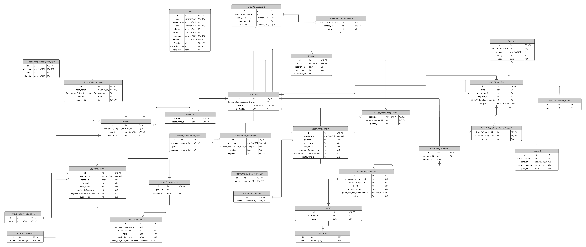

## 4.1 Style Guidelines

### 4.1.1 General Style Guidelines

### 4.1.2 Web Style Guidelines
El diseño web de Restock está optimizado para proporcionar una experiencia fluida en dispositivos de diferentes tamaños. Se emplean diseños de una sola columna para facilitar la lectura, mientras que el ancho de los contenedores y las imágenes se ajusta de manera dinámica para preservar la proporción y garantizar la accesibilidad. Asimismo, los bordes de los elementos interactivos se resaltan para mejorar la navegación y la interacción.

En cuanto a la interactividad, los botones y enlaces son claramente identificables, y se implementan estados visuales (hover, active, etc.) para ofrecer retroalimentación al usuario. Los formularios están diseñados para ser intuitivos y fáciles de completar, con validaciones claras y mensajes de error visibles para evitar confusiones.

_Nota_: Elaboración propia.

## 4.2 Information Architecture

### 4.2.1 Organization Systems

En el sistema Restock, se emplea la organización jerárquica para destacar información crítica como alertas de stock, ingredientes próximos a vencer y elementos prioritarios en los dashboards. Esta jerarquía visual permite que el usuario identifique de forma inmediata los datos más relevantes según el contexto.

También se aplica una organización secuencial en procesos que requieren una guía paso a paso, como el registro de compras de insumos, la creación de recetas o la actualización del estado de entrega. Estos flujos siguen una progresión lógica para evitar errores de ingreso y facilitar la experiencia del usuario.

En cuanto a los esquemas de categorización, no se utiliza una organización alfabética ni matricial. Sin embargo, sí se emplea una organización cronológica para visualizar datos históricos, como el historial de ventas, registros de compras y vencimientos de insumos. Además, se clasifica el contenido según el tipo de usuario: los administradores de restaurante y los proveedores acceden a interfaces y funcionalidades adaptadas a sus respectivas necesidades y flujos de trabajo.

### 4.2.2 Labeling Systems

### 4.2.3 SEO Tags and Meta Tags

## Landing Page

#### **Charset**
    <meta charset="utf-8">

#### **Viewport (responsive)**
    <meta name="viewport" content="width=device-width, initial-scale=1">

#### **Title (SEO)**
    <title>UI-Topic | Automatiza el inventario y pedidos de tu restaurante</title>

#### **Meta Description (SEO)**
    <meta name="description" content="Plataforma para restaurantes que reduce desperdicios y mejora las ganancias mediante la gestión inteligente de inventarios y pedidos.">

#### **Meta Keywords (SEO, aunque en desuso para Google)** 
    <meta name="keywords" content="restaurantes, gestión de inventario, pedidos, automatización, proveedores, tecnología gastronómica">

#### **Meta Author**
    <meta name="author" content="UI-Topic Team">

#### **Meta Robots**
    <meta name="robots" content="index, follow">

#### **Meta Language**
    <meta name="language" content="es">

#### **Meta Copyright**
    <meta name="copyright" content="UI-Topic 2025">

## Web Application

#### **Charset**
    <meta charset="utf-8">

#### **Viewport (responsive)**
    <meta name="viewport" content="width=device-width, initial-scale=1">

#### **Title (SEO)**
    <title>UI-Topic App | Panel de gestión</title>

#### **Meta Description (SEO)**
    <meta name="description" content="Panel interno de UI-Topic para gestionar inventario, pedidos y proveedores. Solo accesible para usuarios autorizados.">

#### **Meta Author**
    <meta name="author" content="UI-Topic Team">

#### **Meta Robots**
    <meta name="robots" content="noindex, nofollow">

#### **Meta Language**
    <meta name="language" content="es">

#### **Meta Copyright**
    <meta name="copyright" content="UI-Topic 2025">

### 4.2.4 Searching Systems

## Vista del Administrador de Restaurante

### 1. Medios de ayuda para la búsqueda de datos

- Barra de búsqueda principal en cada módulo (Inventario, Pedidos, Proveedores).
- Autocompletado inteligente: se muestran sugerencias conforme el usuario escribe.
- Historial de búsquedas recientes.
- Mensajes contextuales si no se encuentran resultados (“¿Desea agregar un nuevo insumo?”).

### 2. Filtros y opciones

- Por nombre de producto.
- Por categoría de insumo (carnes, bebidas, verduras, etc.).
- Por proveedor asociado.
- Por estado de stock (stock bajo, suficiente, excedente).
- Por fecha de vencimiento próxima.
- Por pedidos con retraso o por llegar.

### 3. Visualización de resultados

- Filas con:
  - Nombre del insumo.
  - Cantidad actual.
  - Alerta de stock bajo (ícono y color).
  - Botones de acción rápida: **Editar**, **Eliminar**, **Reordenar**.
- Íconos y colores visuales:
  - Stock crítico.
  - Stock bajo.
  - Stock saludable.

## Vista del Proveedor

### 1. Medios de ayuda para la búsqueda de datos

- Buscador centralizado para gestionar productos ofrecidos y pedidos recibidos.
- Autocompletado para clientes, productos o pedidos.
- Filtros combinables para analizar entregas, productos y clientes activos.

### 2. Filtros y opciones

- Por restaurante cliente.
- Por producto ofrecido.
- Por estado del pedido (pendiente, entregado, vencido).
- Por fecha de entrega programada.
- Por frecuencia de pedidos (clientes frecuentes o nuevos).

### 3. Visualización de resultados

- Listas de pedidos con:
  - Nombre del cliente (restaurante).
  - Productos solicitados.
  - Fecha de entrega.
  - Estado (pendiente, entregado, retrasado).
- Colores de estado:
  - Pedido entregado.
  - Pedido pendiente.
  - Pedido retrasado.

### 4.2.5 Navigation Systems

La navegación en el sistema está diseñada para ser intuitiva y guiada mediante componentes de UI que permiten a los usuarios alcanzar sus objetivos de forma fluida. La navegación principal se presenta como una barra lateral fija con acceso rápido a secciones clave: Resumen, Suscripción, Inventario, Proveedores, Alertas, Pedidos y Recetas.

El contenido dentro de cada vista se organiza mediante tabs, filtros y botones de acción, lo que permite al usuario navegar por distintas categorías o ejecutar tareas específicas sin perder el contexto. En la landing page, se utiliza el desplazamiento vertical para explorar los beneficios y llamados a la acción (CTAs), permitiendo un flujo narrativo hasta llegar al punto de registro o descarga de la aplicación.

La navegación también se adapta según el tipo de usuario. Por ejemplo, los proveedores acceden a sus funciones desde una sección separada en el panel, asegurando que su recorrido dentro del sistema sea coherente con sus tareas específicas, como la gestión de productos ofrecidos o visualización de órdenes recibidas.

## 4.3 Landing Page UI Design

### 4.3.1 Landing Page Wireframe

### 4.3.2 Landing Page Mock-up

## 4.4 Web Applications UX/UI Design

### 4.4.1 Web Applications Wireframes

### 4.4.2 Web Applications Wireflow Diagrams

### 4.4.3 Web Applications Mock-ups

### 4.4.4 Web Applications User Flow Diagrams

## 4.5 Web Applications Prototyping

## 4.6 Domain-Driven Software Architecture

### 4.6.1 Software Architecture Context Diagram

**Context Diagram**

### 4.6.2 Software Architecture Container Diagrams

**Container Diagrams**

### 4.6.3 Software Architecture Components Diagrams

## 4.7 Software Object-Oriented Design

### 4.7.1 Class Diagrams

### 4.7.2 Class Dictionary

| Entidad	| Descripción |
|----------|--------------|
|Subscription | Suscripción activa o pasada que un usuario ha contratado. |
|User	| Cualquier persona que interactúa con el sistema. |
|Subscriber | Tipo de usuario que tiene una suscripción activa para utilizar servicios adicionales/premium del sistema.|
| Supplier	| Representa a un suscriptor de tipo proveedor que gestiona sus pedidos e inventario. |
| RestaurantAdmin	| Representa a un suscriptor de tipo administrador de restaurante encargado de gestionar internamente el restaurante, sus operaciones, inventario y pedidos. |
| Comment	| Comentario hecho por un administrador de restaurante a un pedido de proveedor. |
| OrderToSupplier	| Pedido de productos o insumos realizado por el restaurante hacia un proveedor. |
| PaymentInfo	| Contiene los detalles de métodos y transacciones de pago. |
| Alert	| Representa una notificación automática que informa al suscriptor sobre eventos importantes. |
| Inventory	| Representa el registro de todos los insumos, productos y materiales disponibles del suscriptor. |
| ProductCatalog	| Catálogo o listado de platos ofrecidos por el restaurante a sus clientes. |
| RestaurantCustomerOrder	| Pedido que un cliente realiza al restaurante. |
| Report	| Resumen generado sobre eventos o métricas del sistema. |
| Supply	| Insumo o materia prima almacenada en el inventario. |
| RecipeIngredient	| Ingrediente específico que forma parte de una receta. |
| Recipe	| Representa la receta de un plato del restaurante.

## 4.8 Database Design

### 4.8.1 Database Diagram

