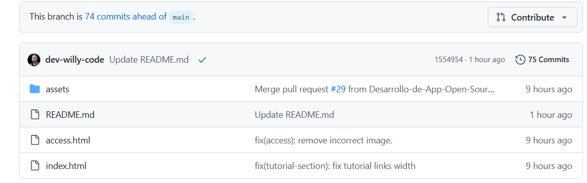
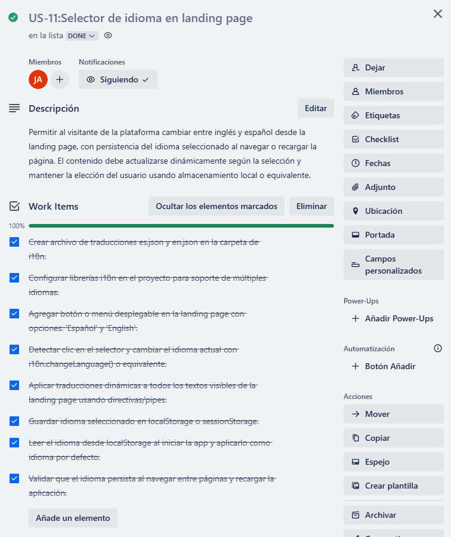

# Capítulo V: Product Implementation, Validation & Deployment

## 5.1 Software Configuration Management

### 5.1.1. Software Development Environment Configuration

A continuación, se listan las herramientas y estándares adoptados por el equipo para el desarrollo colaborativo del sistema:

| Actividad               | Herramienta / Guía                                                                                                                                                               | Propósito                                                                    | Tipo de acceso / Ruta                                                                                                                                                                                               |
| ----------------------- | --------------------------------------------------------------------------------------------------------------------------------------------------------------------------------- | ----------------------------------------------------------------------------- | ------------------------------------------------------------------------------------------------------------------------------------------------------------------------------------------------------------------- |
| Project Management      | Jira Software                                                                                                                                                                     | Seguimiento de backlog, tareas y sprints.                                     | SaaS –[https://www.atlassian.com/software/jira](https://www.atlassian.com/software/jira)                                                                                                                              |
| Requirements Management | Gherkin Conventions                                                                                                                                                               | Escritura legible de requisitos con formato Given/When/Then.                  | [https://cucumber.io/docs/gherkin/](https://cucumber.io/docs/gherkin/)                                                                                                                                                 |
| Product UX/UI Design    | Figma                                                                                                                                                                             | Prototipos y diseño responsive.                                              | SaaS –[https://figma.com](https://figma.com)                                                                                                                                                                          |
| Frontend Dev            | HTML, CSS, JavaScript, Vue                                                                                                                                                        | Construcción de la interfaz web.                                             | [https://vuejs.org/guide/introduction.html](https://vuejs.org/guide/introduction.html)                                                                                                                                 |
| Backend Dev             | C# + ASP.NET Core                                                                                                                                                                 | Implementación de servicios y lógica del backend.                           | [https://learn.microsoft.com/en-us/aspnet/core](https://learn.microsoft.com/en-us/aspnet/core)                                                                                                                         |
| IDE                     | Rider + WebStorm                                                                                                                                                                  | Desarrollo, testing y depuración.                                            | [https://www.jetbrains.com/rider](https://www.jetbrains.com/rider) / [https://www.jetbrains.com/webstorm](https://www.jetbrains.com/webstorm)                                                                             |
| Code Standards          | Google HTML/CSS Style Guide, Vue Style Guide, MDN Guidelines, W3C JavaScript Style Guide, Google JavaScript Style Guide, C# Coding Conventions, Microsoft ASP.NET Core Guidelines | Aplicación de buenas prácticas de desarrollo en frontend y backend.         | [https://developer.mozilla.org/](https://developer.mozilla.org/) / [https://learn.microsoft.com/en-us/dotnet/csharp/fundamentals/coding-style](https://learn.microsoft.com/en-us/dotnet/csharp/fundamentals/coding-style) |
| Version Control         | Git + GitHub                                                                                                                                                                      | Control de versiones y trabajo colaborativo.                                  | SaaS –[https://github.com](https://github.com)                                                                                                                                                                        |
| Software Deployment     | Github pages                                                                                                                                                                      | Despliegue continuo de la aplicación para ambientes de prueba y validación. | SaaS –[https://railway.app](https://railway.app) / [https://render.com](https://render.com)                                                                                                                              |
| Software Documentation  | Notion + Postman                                                                                                                                                                  | Documentación técnica del sistema y pruebas de API.                         | SaaS –[https://www.notion.so](https://www.notion.so) / [https://www.postman.com](https://www.postman.com)                                                                                                                |

### 5.1.2 Source Code Management

En esta sección el equipo establece los medios y esquema de organización que aplicará para el seguimiento de modificaciones. Para ello se utilizará **GitHub** como plataforma y sistema de control de versiones.

A continuación se indican los URLs de los repositorios de GitHub para cada producto:

- **Landing Page**: [URL del repositorio aquí]
- **Web Services**: [URL del repositorio aquí]_(Incluye el proyecto y los archivos de pruebas unitarias e integración/aceptación)_
- **Frontend Web Application**: [URL del repositorio aquí]

### GitFlow Workflow

Se implementará el modelo de ramificación propuesto por Vincent Driessen en su artículo *“A successful Git branching model”*, conocido como **GitFlow**. Este modelo organiza el trabajo en las siguientes ramas:

- `main`: Rama principal, contiene siempre el código en producción.
- `develop`: Rama de desarrollo principal, donde se integran las funcionalidades antes de pasar a producción.
- `feature/*`: Ramas creadas a partir de `develop` para desarrollar nuevas funcionalidades.**Convención de nombres:** `feature/<nombre-corto-descriptivo>`_Ejemplo: `feature/login-auth`_
- `release/*`: Ramas creadas desde `develop` cuando se prepara una nueva versión para producción.**Convención de nombres:** `release/<versión>`_Ejemplo: `release/1.2.0`_
- `hotfix/*`: Ramas creadas desde `main` para corregir errores críticos en producción.
  **Convención de nombres:** `hotfix/<descripción-corta>`
  _Ejemplo: `hotfix/fix-payment-bug`_

### Versionado Semántico

Se aplicará el esquema de **Semantic Versioning 2.0.0**, con el siguiente formato:

- **MAJOR**: Incompatibilidades en la API.
- **MINOR**: Nuevas funcionalidades sin romper compatibilidad.
- **PATCH**: Correcciones de errores menores y ajustes sin afectar funcionalidades.

_Ejemplo de versión:_ `v1.3.2`

### Convenciones de Commits

Se utilizará el estándar de **Conventional Commits** para los mensajes de commits. Esto facilitará la automatización en los procesos de integración continua y generación de changelogs.

**Ejemplos:**

- `feat: add login functionality`
- `fix: correct null pointer exception on user service`
- `chore: update dependencies`

### 5.1.3. Source Code Style Guide & Conventions

#### Frontend (Landing Page - HTML, CSS, JavaScript)

##### Convenciones generales:

- **Idioma**: Todo el código, incluyendo nombres de variables, funciones y clases, está escrito en **inglés**.
- **Indentación**: 2 espacios.
- **Formato de archivos**: `.html`, `.css`, `.js`
- **Estilo de código adoptado**:
  - [W3Schools HTML Style Guide](https://www.w3schools.com/html/html5_syntax.asp)
  - [Google HTML/CSS Style Guide](https://google.github.io/styleguide/htmlcssguide.html)

##### Nomenclatura:

- **Clases CSS**: `kebab-case` (ej. `main-container`)
- **IDs HTML**: `camelCase` (ej. `mainContent`)
- **Variables JS**: `camelCase` (ej. `userName`)
- **Funciones JS**: `camelCase` (ej. `handleClick()`)

---

#### Frontend Web App (Vue.js + JavaScript)

##### Convenciones generales:

- **Idioma**: Código completamente en **inglés**.
- **Estructura de carpetas**: Segregación por módulos y componentes.
- **Indentación**: 2 espacios.
- **Formato de archivos**: `.vue`, `.js`, `.css`

##### Estilo de código adoptado:

- [Vue.js Style Guide (Oficial)](https://vuejs.org/guide/reusability/style-guide.html)
- [Airbnb JavaScript Style Guide](https://github.com/airbnb/javascript)

##### Nomenclatura:

- **Componentes Vue**: `PascalCase` (ej. `UserProfile.vue`)
- **Variables y funciones JS**: `camelCase` (ej. `userName`, `handleSubmit()`)
- **Archivos**: `kebab-case` (ej. `user-profile.vue`)
- **Props**: `camelCase` en JavaScript, `kebab-case` en templates HTML (ej. prop: `userProfile`, uso: `user-profile`)
- **Eventos personalizados**: `kebab-case` (ej. `user-logged-in`)
- **Clases CSS**: `kebab-case`

---

#### Backend (ASP.NET + C#)

##### Convenciones generales:

- **Idioma**: Código y documentación interna en **inglés**.
- **Indentación**: 4 espacios.
- **Formato de archivos**: `.cs`

##### Estilo de código adoptado:

- [Microsoft C# Coding Conventions](https://learn.microsoft.com/en-us/dotnet/csharp/fundamentals/coding-style/coding-conventions)
- [ASP.NET Core Best Practices](https://learn.microsoft.com/en-us/aspnet/core/fundamentals/index)

##### Nomenclatura:

- **Clases**: `PascalCase` (ej. `UserService`)
- **Métodos**: `PascalCase` (ej. `GetUserById()`)
- **Variables locales**: `camelCase` (ej. `userRepository`)
- **Constantes**: `PascalCase` o `UPPER_SNAKE_CASE` (según si es `const` o `readonly static`) (ej. `MaxUsers`)
- **Interfaces**: `IPascalCase` (ej. `IUserRepository`)
- **Endpoints (URLs)**: `kebab-case` (ej. `/api/user-profile`)
- **Namespaces**: `PascalCase` y estructurados jerárquicamente (ej. `ProjectName.ModuleName.FeatureName`)

### 5.1.4 Software Deployment Configuration

Para la Landing Page desarrollada en HTML, CSS y JavaScript, la configuración del despliegue en GitHub Pages se define de la siguiente manera:

**Repositorio de Código Fuente**

Se debe crear un repositorio en GitHub y subir todos los archivos del proyecto (HTML, CSS, JS).
Es obligatorio que el archivo `index.html` esté ubicado en la raíz del repositorio para poder realizar el despliegue correctamente.

 

## 5.2 Landing Page, Services & Applications Implementation

### 5.2.1 Sprint 1

#### 5.2.1.1. Sprint Planning 1

A continuación, se presenta la planificación correspondiente a nuestro Sprint 1, el cual tiene como enfoque principal el desarrollo de la landing page de Restock. En esta etapa inicial, el equipo definió el objetivo del sprint, seleccionó las historias de usuario más relevantes y estableció los entregables clave que permitirán construir una primera versión funcional y visualmente atractiva de la página. Esta planificación busca asegurar un entendimiento compartido entre todos los miembros del equipo y sentar las bases para comunicar eficazmente el valor de la plataforma a los usuarios potenciales.

| Sprint #                             | Sprint 1                                                                                                                                                                                                                                                                                                                                                                                                                                                                                                                              |
| ------------------------------------ | ------------------------------------------------------------------------------------------------------------------------------------------------------------------------------------------------------------------------------------------------------------------------------------------------------------------------------------------------------------------------------------------------------------------------------------------------------------------------------------------------------------------------------------- |
| **Sprint Planning Background** |                                                                                                                                                                                                                                                                                                                                                                                                                                                                                                                                       |
| Date                                 | 2025-04-23                                                                                                                                                                                                                                                                                                                                                                                                                                                                                                                            |
| Time                                 | 19:00 pm (GMT-5)                                                                                                                                                                                                                                                                                                                                                                                                                                                                                                                      |
| Location                             | Modalidad remota mediante la plataforma Discord                                                                                                                                                                                                                                                                                                                                                                                                                                                                                       |
| Prepared By                          | Shapiama Rivera, Gabriela Nicole                                                                                                                                                                                                                                                                                                                                                                                                                                                                                                      |
| Attendees (to planning meeting)      | Avendaño Balarezo, Williams Eduardo / Castro Alejos / Julio, Guerra Perez, José Jahaziel / Guzmán Cabrejos, Yaku Mateo / Shapiama Rivera, Gabriela Nicole                                                                                                                                                                                                                                                                                                                                                                          |
| Sprint 0 Review Summary              | Dado que este es el sprint inicial, no se presenta un resumen del sprint anterior.                                                                                                                                                                                                                                                                                                                                                                                                                                                    |
| Sprint 0 Retrospective Summary       | Dado que este es el sprint inicial, no se presenta una retroalimentación del sprint anterior.                                                                                                                                                                                                                                                                                                                                                                                                                                        |
| **Sprint Goal & User Stories** |                                                                                                                                                                                                                                                                                                                                                                                                                                                                                                                                       |
| Sprint 1 Goal                        | Nos enfocamos en implementar la estructura principal y las funcionalidades clave de la landing page pública de Restock. Creemos que esto aportará una percepción más sólida del producto y despertará mayor interés entre los usuarios potenciales, al comunicar de forma clara el valor y los beneficios de la plataforma. Esto se confirmará cuando los visitantes puedan navegar de manera fluida por la página, comprendan fácilmente qué ofrece Restock y muestren intención de interactuar o registrarse. |
| Sprint 1 Velocity                    | 27 puntos                                                                                                                                                                                                                                                                                                                                                                                                                                                                                                                             |
| Sum of Story Points                  | 27 puntos                                                                                                                                                                                                                                                                                                                                                                                                                                                                                                                             |

#### 5.2.1.2 Aspect Leaders and Collaborators

#### 5.2.1.3 Sprint Backlog 1

El objetivo principal de este Sprint es diseñar, implementar y validar las secciones del landing page, asegurando una navegación fluida, una experiencia responsiva en todos los dispositivos y funcionalidades críticas como registro, inicio de sesión y recuperación de contraseña. Se busca garantizar que el usuario final pueda interactuar de manera sencilla y eficiente con la plataforma, mejorando su satisfacción y promoviendo el cumplimiento de los objetivos de negocio.

**screenshot del Board**

https://trello.com/b/75YJ9YcB/sprint-backlog-2

 

| User Story ID | User Story Title                                                | Task ID | Task Title                | Task Description                                                                                          | Estimated Hours |
| ------------- | --------------------------------------------------------------- | ------- | ------------------------- | --------------------------------------------------------------------------------------------------------- | --------------- |
| US-08         | Mostrar Mensaje de Valor en la Sección Principal               | T001    | Diseñar sección         | Crear diseño visual para 'mostrar mensaje de valor en la sección principal'.                            | 1/2 h           |
|               |                                                                 | T002    | Implementar funcionalidad | Codificar el componente necesario para 'mostrar mensaje de valor en la sección principal'.               | 1h              |
|               |                                                                 | T003    | Realizar pruebas          | Verificar que 'mostrar mensaje de valor en la sección principal' funcione correctamente.                 | 1/2h            |
| US-09         | Mostrar Beneficios Segmentados por Tipo de Usuario              | T004    | Diseñar sección         | Crear diseño visual para 'mostrar beneficios segmentados por tipo de usuario'.                           | 1/2h            |
|               |                                                                 | T005    | Implementar funcionalidad | Codificar el componente necesario para 'mostrar beneficios segmentados por tipo de usuario'.              | 1h              |
|               |                                                                 | T006    | Realizar pruebas          | Verificar que 'mostrar beneficios segmentados por tipo de usuario' funcione correctamente.                | 1/2h            |
| US-10         | Incluir Llamados a la Acción (CTA) con Redirección y Descarga | T007    | Diseñar sección         | Crear diseño visual para 'incluir llamados a la acción (cta) con redirección y descarga'.              | 1/2h            |
|               |                                                                 | T008    | Implementar funcionalidad | Codificar el componente necesario para 'incluir llamados a la acción (cta) con redirección y descarga'. | 1h              |
|               |                                                                 | T009    | Realizar pruebas          | Verificar que 'incluir llamados a la acción (cta) con redirección y descarga' funcione correctamente.   | 1/2h            |
| US-05         | Visualización de la barra de navegación                       | T010    | Diseñar sección         | Crear diseño visual para 'visualización de la barra de navegación'.                                    | 1/2h            |
|               |                                                                 | T011    | Implementar funcionalidad | Codificar el componente necesario para 'visualización de la barra de navegación'.                       | 1h              |
|               |                                                                 | T012    | Realizar pruebas          | Verificar que 'visualización de la barra de navegación' funcione correctamente.                         | 1/2h            |
| US-06         | Visualización de pasos del funcionamiento                      | T013    | Diseñar sección         | Crear diseño visual para 'visualización de pasos del funcionamiento'.                                   | 1/2h            |
|               |                                                                 | T014    | Implementar funcionalidad | Codificar el componente necesario para 'visualización de pasos del funcionamiento'.                      | 1h              |
|               |                                                                 | T015    | Realizar pruebas          | Verificar que 'visualización de pasos del funcionamiento' funcione correctamente.                        | 1/2h            |
| US-07         | Alternativa con video explicativo                               | T016    | Diseñar sección         | Crear diseño visual para 'alternativa con video explicativo'.                                            | 1/2h            |
|               |                                                                 | T017    | Implementar funcionalidad | Codificar el componente necesario para 'alternativa con video explicativo'.                               | 1h              |
|               |                                                                 | T018    | Realizar pruebas          | Verificar que 'alternativa con video explicativo' funcione correctamente.                                 | 1/2h            |
| US-04         | Visualización de footer en landing page                        | T019    | Diseñar sección         | Crear diseño visual para 'visualización de footer en landing page'.                                     | 1/2h            |
|               |                                                                 | T020    | Implementar funcionalidad | Codificar el componente necesario para 'visualización de footer en landing page'.                        | 2h              |
|               |                                                                 | T021    | Realizar pruebas          | Verificar que 'visualización de footer en landing page' funcione correctamente.                          | 1/2h            |
| US-01         | Ver testimonios de clientes                                     | T022    | Diseñar sección         | Crear diseño visual para 'ver testimonios de clientes'.                                                  | 2h              |
|               |                                                                 | T023    | Implementar funcionalidad | Codificar el componente necesario para 'ver testimonios de clientes'.                                     | 1/2h            |
|               |                                                                 | T024    | Realizar pruebas          | Verificar que 'ver testimonios de clientes' funcione correctamente.                                       | 1h              |
| US-02         | Consultar Preguntas Frecuentes                                  | T025    | Diseñar sección         | Crear diseño visual para 'consultar preguntas frecuentes'.                                               | 1/2h            |
|               |                                                                 | T026    | Implementar funcionalidad | Codificar el componente necesario para 'consultar preguntas frecuentes'.                                  | 1h              |
|               |                                                                 | T027    | Realizar pruebas          | Verificar que 'consultar preguntas frecuentes' funcione correctamente.                                    | 1/2h            |
| US-03         | Enviar Formulario de Contacto                                   | T028    | Diseñar sección         | Crear diseño visual para 'enviar formulario de contacto'.                                                | 1h              |
|               |                                                                 | T029    | Implementar funcionalidad | Codificar el componente necesario para 'enviar formulario de contacto'.                                   | 1/2h            |
|               |                                                                 | T030    | Realizar pruebas          | Verificar que 'enviar formulario de contacto' funcione correctamente.                                     | 1h              |
| US-16         | Navegación fluida entre secciones                              | T031    | Diseñar sección         | Crear diseño visual para 'navegación fluida entre secciones'.                                           | 1/2h            |
|               |                                                                 | T032    | Implementar funcionalidad | Codificar el componente necesario para 'navegación fluida entre secciones'.                              | 1h              |
|               |                                                                 | T033    | Realizar pruebas          | Verificar que 'navegación fluida entre secciones' funcione correctamente.                                | 1/2h            |
| US-13         | Visualización responsive en desktop                            | T034    | Diseñar sección         | Crear diseño visual para 'visualización responsive en desktop'.                                         | 1/2h            |
|               |                                                                 | T035    | Implementar funcionalidad | Codificar el componente necesario para 'visualización responsive en desktop'.                            | 1h              |
|               |                                                                 | T036    | Realizar pruebas          | Verificar que 'visualización responsive en desktop' funcione correctamente.                              | 1/2h            |
| US-15         | Visualización responsive en dispositivos móviles              | T037    | Diseñar sección         | Crear diseño visual para 'visualización responsive en dispositivos móviles'.                           | 1h              |
|               |                                                                 | T038    | Implementar funcionalidad | Codificar el componente necesario para 'visualización responsive en dispositivos móviles'.              | 1/2h            |
|               |                                                                 | T039    | Realizar pruebas          | Verificar que 'visualización responsive en dispositivos móviles' funcione correctamente.                | 1/2h            |
| US-14         | Visualización responsive en tablet                             | T040    | Diseñar sección         | Crear diseño visual para 'visualización responsive en tablet'.                                          | 1/2h            |
|               |                                                                 | T041    | Implementar funcionalidad | Codificar el componente necesario para 'visualización responsive en tablet'.                             | 1h              |
|               |                                                                 | T042    | Realizar pruebas          | Verificar que 'visualización responsive en tablet' funcione correctamente.                               | 1/2h            |
| US-17         | Registro                                                        | T043    | Diseñar sección         | Crear diseño visual para 'registro'.                                                                     | 2h              |
|               |                                                                 | T044    | Implementar funcionalidad | Codificar el componente necesario para 'registro'.                                                        | 2h              |
|               |                                                                 | T045    | Realizar pruebas          | Verificar que 'registro' funcione correctamente.                                                          | 1h              |
| US-18         | Inicio de sesión                                               | T046    | Diseñar sección         | Crear diseño visual para 'inicio de sesión'.                                                            | 2h              |
|               |                                                                 | T047    | Implementar funcionalidad | Codificar el componente necesario para 'inicio de sesión'.                                               | 1h              |
|               |                                                                 | T048    | Realizar pruebas          | Verificar que 'inicio de sesión' funcione correctamente.                                                 | 1h              |
| US-19         | Recuperación de contraseña                                    | T049    | Diseñar sección         | Crear diseño visual para 'recuperación de contraseña'.                                                 | 2h              |
|               |                                                                 | T050    | Implementar funcionalidad | Codificar el componente necesario para 'recuperación de contraseña'.                                    | 1/2h            |
|               |                                                                 | T051    | Realizar pruebas          | Verificar que 'recuperación de contraseña' funcione correctamente.                                      | 1h              |

#### 5.2.1.4 Development Evidence for Sprint Review

En esta sección se presentan los avances de implementación realizados durante el Sprint 1, el cual tuvo como objetivo principal construir la Landing Page de la plataforma Restock.
Se desarrollaron múltiples secciones, aplicando principios de diseño responsivo, buenas prácticas de codificación y asegurando consistencia con el estilo visual definido para el proyecto. Los entregables principales de este sprint incluyen la creación de secciones como About Us, Benefits, Testimonials, FAQ, Tutorial, Contact, Footer, además de la implementación de mejoras de SEO, formularios de acceso, y enlaces de descarga.

| Repository                        | Branch                   | Commit Id | Commit Message                                                        | Commit Message Body                                                                      | Commited on (Date) |
| --------------------------------- | ------------------------ | --------- | --------------------------------------------------------------------- | ---------------------------------------------------------------------------------------- | ------------------ |
| GabrielaShapiama/UI-Topic-landing | feature/access           | 936d1db   | feat(access): add access forms.                                       | Implemented the login and registration forms with appropriate field validations.         | 27-04-2025         |
| Yaku Guzman/UI-Topic-landing      | feature/footer-section   | fc81879   | feat(footer-section): add footer section, footer css and icons        | Designed and styled the footer component, added navigation links and social media icons. | 27-04-2025         |
| Yaku Guzman/UI-Topic-landing      | feature/contacto-section | c4988c0   | feat(contacto-section): add contact section, contact css              | Developed the contact form section, added input fields and styling for responsiveness.   | 27-04-2025         |
| Yaku Guzman/UI-Topic-landing      | feature/tutorial-section | 1bda3eb   | feat(tutorial-section): add tutorial section, tutorial css and images | Created the tutorial guide section with step-by-step images and responsive layout.       | 27-04-2025         |
| Williams/UI-Topic-landing         | feature/descargar        | 219e86a   | feat(descargar): adding download section(html,css)                    | Built the download section including download buttons and responsive design.             | 27-04-2025         |
| Williams/UI-Topic-landing         | feature/preguntas        | bf2f8f9   | fix(preguntas): updating frecuent questions(html,css,js)              | Updated the FAQ section to improve its structure, styling, and dynamic functionality.    | 27-04-2025         |
| Williams/UI-Topic-landing         | feature/preguntas        | c2882d0   | feat(preguntas): adding frecuent questions(html,css)                  | Added the frequently asked questions section with collapsible answers.                   | 27-04-2025         |
| Williams/UI-Topic-landing         | feature/testimonios      | 4be7138   | feat(testimonios): adding testimonios(html,css)                       | Developed the testimonials section with client feedback and applied custom styles.       | 27-04-2025         |
| jahazielgg/UI-Topic-landing       | feature/benefits         | 34e3804   | feat(benefits): add benefits section.                                 | Created the benefits section highlighting key features and advantages.                   | 27-04-2025         |
| jahazielgg/UI-Topic-landing       | feature/about-us-section | ac7366b   | feat(about-us): add about us section.                                 | Implemented the about us section including company mission and vision statements.        | 27-04-2025         |
| jahazielgg/UI-Topic-landing       | feature/hero-section     | f9716bd   | feat(hero-section): add hero section.                                 | Built the hero section with main headline, supporting text, and CTA button.              | 27-04-2025         |
| jahazielgg/UI-Topic-landing       | feature/develop          | e10bc23   | chore: initial commit.                                                | Set up the initial project structure and configurations for the landing page.            | 27-04-2025         |
| jahazielgg/UI-Topic-landing       | main                     | 31a94bc   | Initial commit                                                        | Initialized the repository with basic project files.                                     | 27-04-2025         |

##### Productos según alcance del Sprint

###### Landing Page

Durante el Sprint 1 se implementó la Landing Page de Restock. Los principales avances fueron:

- Diseño responsivo adaptado a diferentes tamaños de pantalla.
- Creación de secciones: Hero, Sobre Nosotros, Beneficios, Testimonios, Preguntas Frecuentes, Tutorial, Contacto y Footer.
- Aplicación de buenas prácticas de accesibilidad (uso de etiquetado semántico, contraste adecuado).
- Optimización inicial para motores de búsqueda (SEO básico) con metaetiquetas y atributos relevantes.
- Implementación de navegación fluida entre secciones mediante anclas y smooth scrolling.
- Validación de compatibilidad en navegadores modernos y dispositivos móviles.

#### 5.2.1.5 Execution Evidence for Sprint Review

A continuación, se presenta el video de la landing page. Este muestra la interacción principal de los usuarios con la plataforma, destacando los flujos de navegación, diseño responsivo y la estructura general de la aplicación.

**Video de landing page:**

[Enlace al video](https://upcedupe-my.sharepoint.com/:v:/g/personal/u202021885_upc_edu_pe/EcvZvXFf2R5Grwqi4pZmu4sBxzaCWMUm9-atcPPKarcjgw?e=EpmVfH&nav=eyJyZWZlcnJhbEluZm8iOnsicmVmZXJyYWxBcHAiOiJTdHJlYW1XZWJBcHAiLCJyZWZlcnJhbFZpZXciOiJTaGFyZURpYWxvZy1MaW5rIiwicmVmZXJyYWxBcHBQbGF0Zm9ybSI6IldlYiIsInJlZmVycmFsTW9kZSI6InZpZXcifX0%3D)

#### 5.2.1.6 Services Documentation Evidence for Sprint Review

Durante este sprint se completó el diseño e implementación del Landing Page del sistema, el cual forma parte del acceso inicial al sistema y constituye un punto de entrada fundamental para los usuarios. Aunque no se implementaron endpoints tradicionales de tipo REST en este sprint, se documenta a continuación la URL del recurso publicado, junto con evidencia de despliegue, interacción y commits relacionados.

**Descripción del Logro:**

-Implementación del Landing Page estático.

-Deployment del landing page.

##### Recursos del Sprint

| Recurso      | Acción implementada   | Método HTTP | URL / Endpoint                                                 | Link de repositorio                                                |
| ------------ | ---------------------- | ------------ | -------------------------------------------------------------- | ------------------------------------------------------------------ |
| Landing Page | Visualización inicial | GET          | https://aplicaciones-web-curso-upc.github.io/UI-Topic-landing/ | https://github.com/Aplicaciones-Web-Curso-UPC/UI-Topic-landing.git |

**Documentacion**
Commit 4d6b92f: Initial commit

#### 5.2.1.7. Software Deployment Evidence for Sprint Review.

Durante este Sprint, se realizaron actividades de despliegue de la Landing Page utilizando GitHub Pages como plataforma de hosting. A continuación, se detallan los pasos ejecutados:

1- Se accedió a la sección Settings del repositorio.
Dentro de Pages, se seleccionó la rama (develop) y la carpeta (root) desde la cual GitHub Pages debía publicar el sitio.
Se guardaron los cambios para activar la publicación automática.

2- por default ya esta activado el https

3- En la seccion "All workflows" se puede ver que la app se esta deployando.

4- El landing page fue exitosamente deployado

5- Se obtuvo y verificó la URL pública proporcionada por GitHub Pages.

### 5.2.2 Sprint 2

#### 5.2.2.1. Sprint Planning 2

| Sprint #                             | Sprint 2                                                                                                                                                                                                                                                                                                                                                                                                                                                                                                                                                                                                                                                     |
| ------------------------------------ | ------------------------------------------------------------------------------------------------------------------------------------------------------------------------------------------------------------------------------------------------------------------------------------------------------------------------------------------------------------------------------------------------------------------------------------------------------------------------------------------------------------------------------------------------------------------------------------------------------------------------------------------------------------ |
| **Sprint Planning Background** |                                                                                                                                                                                                                                                                                                                                                                                                                                                                                                                                                                                                                                                              |
| Date                                 | 2025-05-05                                                                                                                                                                                                                                                                                                                                                                                                                                                                                                                                                                                                                                                   |
| Time                                 | 08:00 pm (GMT-5)                                                                                                                                                                                                                                                                                                                                                                                                                                                                                                                                                                                                                                             |
| Location                             | Modalidad remota mediante la plataforma Discord                                                                                                                                                                                                                                                                                                                                                                                                                                                                                                                                                                                                              |
| Prepared By                          | Guzmán Cabrejos, Yaku Mateo                                                                                                                                                                                                                                                                                                                                                                                                                                                                                                                                                                                                                                 |
| Attendees (to planning meeting)      | Avendaño Balarezo, Williams Eduardo / Castro Alejos, Julio / Guerra Perez, José Jahaziel / Guzmán Cabrejos, Yaku Mateo / Shapiama Rivera, Gabriela Nicole                                                                                                                                                                                                                                                                                                                                                                                                                                                                                                 |
| Sprint 1 Review Summary              | Durante el Sprint 1 se logró implementar casi en su totalidad la Landing Page del sistema Restock, desarrollando secciones clave como el header, footer, sección de beneficios y preguntas frecuentes, así como la integración inicial de estilos globales y tipografía. Quedó faltante la funcionalidad de cambio de idioma, la cual será prioridad para el siguiente sprint. El equipo cumplió con los entregables establecidos, respetando el diseño de mockups y la guía de estilos. Se identificaron oportunidades de mejora en la velocidad de desarrollo y gestión de tiempos.                                                             |
| Sprint 1 Retrospective Summary       | Durante el Sprint 1, el equipo logró avanzar de forma coordinada y efectiva en el desarrollo de la landing page, sin enfrentar mayores dificultades. Cada integrante cumplió puntualmente con las secciones asignadas, lo que permitió avanzar según lo planificado. La adopción de convenciones comunes en el código y el diseño contribuyó a mantener la coherencia del producto y facilitó la integración entre partes. Como mejora para el siguiente sprint, se acordó implementar revisiones diarias (daily reviews) que permitan alinear mejor los avances, detectar bloqueos tempranos y mejorar la comunicación continua entre miembros. |
| **Sprint Goal & User Stories** |                                                                                                                                                                                                                                                                                                                                                                                                                                                                                                                                                                                                                                                              |
| Sprint 2 Goal                        | Nuestro enfoque está en implementar los módulos centrales de la aplicación web interna de Restock, incluyendo la gestión de productos, pedidos, inventario y compras. Creemos que esto brindará eficiencia operativa y una mejor trazabilidad del inventario a los administradores de restaurantes y su personal. Esto se confirmará cuando los usuarios puedan autenticarse, navegar por el panel principal y acceder al menos a tres módulos clave con interfaces funcionales.                                                                                                                                                            |
| Sprint 2 Velocity                    |                                                                                                                                                                                                                                                                                                                                                                                                                                                                                                                                                                                                                                                              |
| Sum of Story Points                  |                                                                                                                                                                                                                                                                                                                                                                                                                                                                                                                                                                                                                                                              |

#### 5.2.2.2 Aspect Leaders and Collaborators

##### Aspect Leaders and Collaborators

Durante el Sprint 2,  se ha definido el desarrollo e integración de los módulos principales del frontend de la aplicación web interna  Restock , abarcando funcionalidades clave como la gestión de productos, pedidos, inventario y compras. Estas implementaciones buscan optimizar los procesos internos y mejorar la trazabilidad del inventario, brindando mayor eficiencia a los administradores de restaurantes y su personal.

Con el fin de mantener una coordinación efectiva y una comunicación fluida entre los integrantes del equipo, se estructuró la matriz de liderazgo y colaboración (LACX), donde se asignó un líder (L) encargado de cada funcionalidad y colaboradores (C) que brindan apoyo en su implementación.

| Team Member (Last Name, First Name) | GitHub Username    | Configuración de perfil | Panel de suscripción y planes | Alertas para proveedores | Calificaciones de proveedores | Barra de navegación | Alertas para restaurantes | Registro de recetas | Registro de ventas de restaurantes | Registro de proveedores desde restaurantes | Inventario de insumos | Pedidos a proveedores | Ordenes de proveedores | Resumen de datos |
| :---------------------------------- | :----------------- | :----------------------- | :----------------------------- | :----------------------- | :---------------------------- | :------------------- | :------------------------ | :------------------ | :--------------------------------- | :----------------------------------------- | :-------------------- | :--------------------- | :--------------------- | :--------------- |
| Vendaño Balarezo, Williams Eduardo | dev-willy-code     | C                        | L                              | L                        | L                             | C                    | C                         | C                   | L                                  | C                                          | C                     | C                      | C                      | C                |
| Castro Alejos, Julio                | JulioXC4           | C                        | C                              | C                        | C                             | C                    | C                         | C                   | C                                  | C                                          | L                     | C                      | C                      | C                |
| Guerra Perez, José Jahaziel        | jahazielgg         | L                        | C                              | C                        | C                             | L                    | L                         | L                   | C                                  | C                                          | C                     | C                      | C                      | C                |
| Guzmán Cabrejos, Yaku Mateo        | yak-cod            | C                        | C                              | C                        | C                             | C                    | C                         | C                   | C                                  | L                                          | C                     | C                      | C                      | L                |
| Shapiama Rivera, Gabriela Nicole    | GabrielaShapiama28 | C                        | C                              | C                        | C                             | C                    | C                         | C                   | C                                  | C                                          | C                     | L                      | L                      | C                |

#### 5.2.2.3 Sprint Backlog 2

El objetivo principal de este Sprint es desarrollar la interfaz frontend de los dashboards para **administradores de restaurantes y proveedores**, enfocándose en una estructura clara, navegación eficiente y visualización adecuada de datos críticos.

Además, se realizaron mejoras en el *landing page*, incluyendo la implementación de un **toggle de idioma** (inglés/español) y la incorporación de **atributos de accesibilidad** como `aria-label` y `lang`, asegurando mayor inclusión y cumplimiento de estándares web.

[[Enlace al Trello Sprint 2](https://trello.com/invite/b/681ab5854ac93bbc3c456c4e/ATTI2ddc2248f5308bf6ee343af5c381ec7f2CE97AD8/sprint-backlog-2)]
